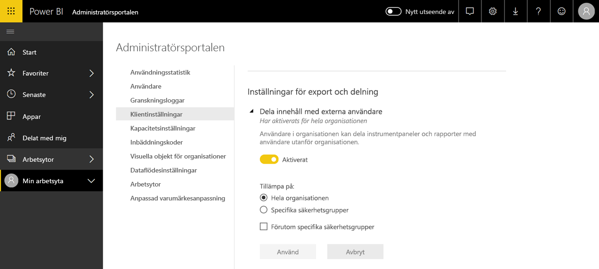

# Vad är Power BI-administration?

Power BI-administration är hanteringen av en Power BI-klient, inklusive konfiguration av styrningsprinciper, användningsövervakning och licensetablering, kapacitet och organisationsresurser. Den här artikeln innehåller en översikt över administrationsroller, uppgifter och verktyg samt länkar till artiklar som går in på ämnet mer i detalj.

Power BI är utformat för självbetjänande Business Intelligence och administratören är den som skyddar data, processer och principer i Power BI-klienten. Power BI-administratören är en nyckelmedlem i teamet som består av BI-utvecklare, analytiker och andra roller. Administratören kan hjälpa organisationen med att säkerställa att viktiga mål uppfylls:

- Förstå KPI:er och mått som användare _faktiskt_ behöver
- Minska tiden till leverans för IT-ledd företagsrapportering
- Öka införandet av en Power BI-distribution och dessa avkastning på investeringen

Jobbet består av att göra företagsanvändarna produktiva, säkerställa att säkerheten är hög och att lagar och förordningar följs. Ansvarsområdet kan omfatta hjälp och support och i många fall att hjälpa användarna i verksamheten att göra rätt.

## Administratörsroller relaterade till Power BI

Det finns flera roller som är relaterade till Power BI-administration, vilka beskrivs i följande tabell.

| **Typ av administratör** | **Administrativ omfattning** | **Power BI-omfattning** |
| --- | --- | --- |
| Global administratör | Microsoft 365 | Kan hantera alla aspekter av en Power BI-klient och andra tjänster. |
| Faktureringsadministratör | Microsoft 365 | Kan hämta Power BI-licenser via Office 365-prenumerationer. |
| Power BI-tjänstadministratör | Power BI-klient | Har fullständig kontroll över en Power BI-klient och dess administrativa funktioner (förutom licensiering). |
| Kapacitetsadministratör för Power BI Premium | En enda Premium-kapacitet | Har fullständig kontroll över en Premium-kapacitet och dess administrativa funktioner. |
| Kapacitetsadministratör för Power BI Embedded | En enda Embedded-kapacitet | Har fullständig kontroll över en inbäddad kapacitet och dess administrativa funktioner. |

Globala administratörer i Microsoft 365 eller Azure Active Directory har administratörsbehörighet för Power BI. Globala administratörer kan tilldela andra användare rollen som Power BI-tjänstadministratör, som endast ger administrativa rättigheter över Power BI-funktioner.

Power BI-tjänstadministratörer har åtkomst till Power BI-administrationsportalen som innehåller olika inställningar på klientnivå för funktionalitet, säkerhet och övervakning. Tjänstadministratörer har fullständig åtkomst till alla resurser i en Power BI-klient. I de flesta fall identifierar tjänstadministratörerna problem som de sedan följer upp med resursägarna för att vidta korrigerande åtgärder.

Rollen som Power BI-tjänstadministratör ger inte möjlighet att tilldela licenser till användare eller visa granskningsloggar i Microsoft 365. Därför kan uppgiften att administrera Power BI för närvarande inte utföras av användare som endast är Power BI-tjänstadministratör.

## Administrativa uppgifter

Administratörer utför många uppgifter till stöd för Power BI för organisationen, vilka beskrivs i följande tabell.

| **Uppgiftsområde** | **Vanliga uppgifter** |
| --- | --- |
| Hantera Power BI-klienten |<ul><li>Aktivera och inaktivera viktiga Power BI-funktioner <li>Rapportera om användning och prestanda <li>Granska och hantera granskning av händelser</ul>|
| Anskaffa och tilldela Power BI-licenser |<ul><li>Hantera användarregistrering <li>Köpa och tilldela Pro-licenser <li>Blockera användare från att få åtkomst till Power BI</ul>|
| Hantera Premium-kapacitet |<ul><li>Anskaffa och arbeta med Premium-kapacitet <li>Säkra servicekvaliteten|
| Hantera Embedded-kapacitet |<ul><li>Anskaffa Embedded-kapacitet för att förenkla hur ISV:er och utvecklare använder Power BI-funktioner</ul>|
| Säkra kompatibilitet med interna policyer, lagar och förordningar | <ul><li>Hantera klassificering av affärsdata <li>Bidra till att genomdriva innehållspublicering och delningsprinciper</ul>|
| Hantera Power BI-resurser |<ul><li>Hantera arbetsytor <li>Publicera visuella Power BI-objekt <li>Kontrollera koder som används för att bädda in Power BI i andra program|
| Ge hjälp och support till klientanvändare |<ul><li>Felsöka dataåtkomst och andra problem</ul>|
| Andra uppgifter |<ul><li>Distribuera Power BI Desktop, till exempel med hjälp av Microsoft Endpoint Configuration Manager <li>Hantera distribution av Power BI-mobilappen med Intune <li>Hantera datasekretess och säkerhet, till exempel källdatasäkerhet</ul>|

## Administrativa verktyg

Det finns flera verktyg för Power BI-administration, vilka beskrivs i följande tabell. Administratörer tillbringar vanligtvis större delen av tiden i Power BI-administrationsportalen och använder andra verktyg vid behov.

| **Verktyg** | **Vanliga uppgifter** |
| --- | --- |
| Power BI-administratörsportalen |<ul><li>Anskaffa och arbeta med Premium-kapacitet</li><li>Säkra servicekvaliteten</li><li>Hantera klassificering av affärsdata</li><li>Bidra till att genomdriva innehållspublicering och delningsprinciper</li><li>Hantera arbetsytor <li>Publicera visuella Power BI-objekt</li><li>Kontrollera koder som används för att bädda in Power BI i andra program</li><li>Felsöka dataåtkomst och andra problem</li></ul>|
| Administrationscenter för Microsoft 365 |<ul><li>Hantera användarregistrering</li><li>Köpa och tilldela Pro-licenser</li><li>Blockera användare från att få åtkomst till Power BI</li></ul>|
| Säkerhets- och efterlevnadscenter för Office 365 |<ul><li>Granska och hantera granskning av händelser</li></ul>|
| Azure Active Directory i Azure-portalen |<ul><li>Konfigurera villkorlig åtkomst till Power BI-resurser via AAD</li><li>Tillhandahålla Power BI Embedded-kapacitet</li></ul>|
| PowerShell-cmdletar |<ul><li>Hantera arbetsytor och andra aspekter av Power BI via skript</li></ul>|
| Administrativa API:er och SDK |<ul><li>Skapa anpassade administrativa verktyg för att underlätta arbetet för en Power BI-administratör. Power BI Desktop kan som exempel använda dessa API:er för att skapa rapporter som bygger på data relaterade till administration</li></ul>|

## Nästa steg

Vi hoppas att den här artikeln gav några snabba insikter i Power BI-administratörens arbete och de specifika roller, aktiviteter och verktyg som ingår. Vi rekommenderar att du läser följande artiklar om du vill lära dig mer.

- [Använda Power BI-administratörsportalen](service-admin-portal.md)
- [Guide till administratörsinställningar för klientorganisationer](../guidance/admin-tenant-settings.md)
- [Använda PowerShell-cmdletar](/powershell/power-bi/overview)
- [Vanliga frågor om Power BI-administration](service-admin-faq.md)
- Har du några frågor? [Fråga Power BI Community](https://community.powerbi.com/)
- Har du förslag? [Bidra till att förbättra Power BI](https://ideas.powerbi.com/)
