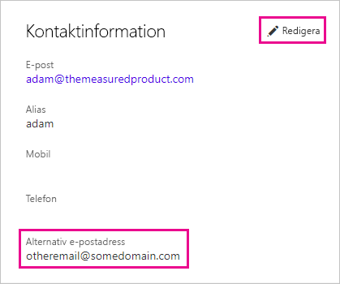

# <a name="use-an-alternate-email-address"></a>Använda en alternativ e-postadress

När du registrerar dig för Power BI kan du ange en e-postadress. Som standard använder Power BI den här adressen för att skicka uppdateringar om aktivitet i tjänsten. Om någon skickar en inbjudan skickas den till den här adressen.

I vissa fall vill du kanske att dessa e-postmeddelanden ska skickas till en alternativ e-postadress istället för den du registrerade dig med. Den här artikeln förklarar hur du anger en alternativ e-postadress i Microsoft 365 och i PowerShell. Den här artikeln beskriver även Azure Active Directory (Azure AD) matchar en e-postadress.

> [!NOTE]
> Om du anger en alternativ adress påverkas inte vilken e-postadress som använder Power BI för uppdateringar av tjänsten, nyhetsbrev och andra erbjudanden. Dessa meddelanden skickas alltid till den e-postadress som du använde när du registrerade dig för Power BI.

## <a name="use-microsoft-365"></a>Använda Microsoft 365

Följ dessa steg om du vill ange en alternativ e-postadress i Microsoft 365.

1. Öppna sidan [Personlig information](https://portal.office.com/account/#personalinfo) för ditt konto. Om du uppmanas av appen loggar du in med den e-postadress och det lösenord som du använder för Power BI.

1. På menyn till vänster väljer du **Personlig information**.

1. Klicka på **Redigera** på området **kontaktinformation**.

    Om du inte kan redigera din information innebär det att din administratör hanterar din e-postadress. Kontakta administratören om du vill uppdatera din e-postadress.

    

1. I fältet **Alternativ e-postadress** anger du den e-postadress som du vill att Microsoft 365 ska använda för Power BI-uppdateringar.

## <a name="use-powershell"></a>Använd PowerShell

Om du vill ange en alternativ e-postadress i PowerShell använder du kommandot [Set-AzureADUser](/powershell/module/azuread/set-azureaduser/).

```powershell
Set-AzureADUser -ObjectId john@contoso.com -OtherMails "otheremail@somedomain.com"
```

## <a name="email-address-resolution-in-azure-ad"></a>E-postadressmatchning i Azure AD

För att samla in en Azure AD-inbäddningstoken för Power BI kan du använda en av tre typer av e-postadress:

* Den huvudsakliga e-postadress som är associerad med en användares Azure AD-konto

* UPN-e-postadressen (UserPrincipalName)

* Matrisattributet för *den andra e-postadressen*

Power BI väljer vilken e-postadress som ska användas baserat på följande sekvens:

1. Om e-postattributet i Azure AD-klientens användarobjekt finns använder Power BI det e-postattributet för e-postadressen.

1. Om UPN-e-postadressen *inte* finns inom domänen **\*.onmicrosoft.com** (informationen efter \@-symbolen) använder Power BI det e-postattributet för e-postadressen.

1. Om matrisattributet för *annan e-postadress* i Azure AD-användarobjektet finns använder Power BI den första e-postadressen i den listan (eftersom det kan finnas en lista över e-postadresser i det här attributet).

1. Om inget av ovanstående villkor uppfylls använder Power BI UPN-adressen.

Har du fler frågor? [Prova Power BI Community](https://community.powerbi.com/)