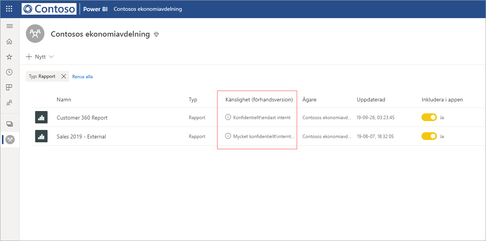
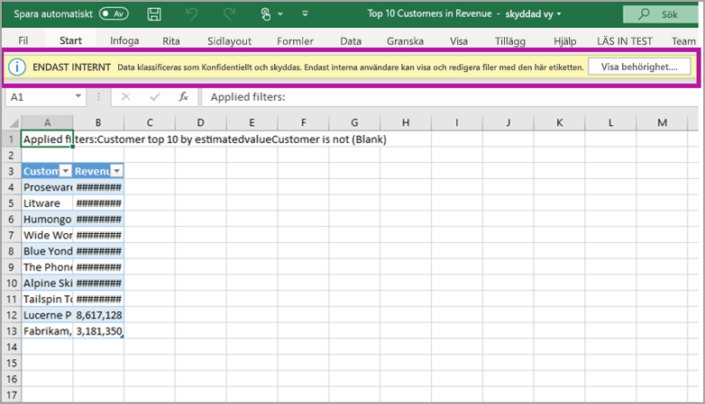

# Dataskydd i Power BI (förhandsversion)

Moderna företag har strikta affärsregler och krav på hur känsliga data ska hanterar och skyddas. Power BI kan integreras med Microsoft Information Protection och Microsoft Cloud App Security så att du får bättre kontroll och insyn över känsliga data i Power BI. 

Med Dataskydd i Power BI kan du göra följande:

* Använd Microsofts känslighetsetiketter för att klassificera och märka upp innehåll i Power BI-tjänsten (instrumentpaneler, rapporter, datamängder och dataflöden) med samma taxonomi som används till att klassificera och skydda filer i Office 365. 

* Tillämpa skyddsinställningar som kryptering eller vattenstämplar när du exporterar data från Power BI-tjänsten genom att innehållets känslighetsetikett och skydd ärvs (Excel, PowerPoint och PDF). 

  Användarna kan till exempel märka upp en rapport i Power BI som konfidentiell. När data sedan exporteras till en Excel-fil använder Power BI den konfidentiella etiketten för filen. Etiketten kan kryptera innehållet och tillfoga en konfidentiell vattenstämpel.

* Använd Microsoft Cloud App Security till att övervaka aktiviteter i Power BI, undersöka säkerhetsproblem och skydda innehåll i Power BI med appkontrollen för villkorsstyrd åtkomst i Microsoft Cloud App Security. 

## Känslighetsetiketter i Power BI

Känslighetsetiketter skapas och hanteras antingen i [säkerhetscentret för Microsoft 365](https://security.microsoft.com/) eller i [efterlevnadscentret för Microsoft 365](https://compliance.microsoft.com/).

Om du vill hantera känslighetsetiketter på någon av de här platserna går du till **Klassificering > Känslighetsetiketter**. De här känslighetsetiketterna kan användas i flera Microsoft-tjänster som Azure Information Protection, Office-appar och Office 365-tjänster.

> [!IMPORTANT]
> Azure Information Protection-användare måste migrera etiketterna till någon av de tidigare angivna tjänsterna om de ska kunna användas i Power BI. Dessutom kan känslighetsetiketter bara användas i offentliga moln och inte för klientorganisationer i exempelvis självständiga moln.
>
> Läs mer om att [migrera känslighetsetiketter till Microsoft Information Protection](https://docs.microsoft.com/azure/information-protection/configure-policy-migrate-labels).

## Så här fungerar känslighetsetiketter

När du tillämpar en känslighetsetikett på en instrumentpanel, rapport, datamängd eller ett dataflöde Power BI fungerar det som att du lägger till en *tagg* för resursen med följande fördelar:
* **Anpassningsbar** – du kan skapa kategorier för olika nivåer av känsligt innehåll i organisationen, till exempel Personligt, Offentligt, Allmänt, Konfidentiellt och Mycket konfidentiellt.
* **Klartext** – eftersom etiketten är i klartext är det enkelt för användarna att förstå hur de ska hantera innehållet enligt riktlinjerna för känslighetsetiketter.
* **Beständiga** – när du har tillämpat en känslighetsetikett på innehåll följer den med när innehållet exporteras till följande filtyper som stöds: Excel, PowerPoint och PDF. 

  Det här innebär att känslighetsetiketten följer med innehållet, inklusive dess skyddsinställningar, och används i samband med olika policyer. 

## Exempel på känslighetsetikett 

Här är ett snabbt exempel på hur en känslighetsetikett i Power BI kan fungera.

1. Känslighetsetiketten **Highly Confidential - Internal Only** fästs vid en rapport i Power BI-tjänsten.

   

2. När data exporteras till en Excel-fil från den här rapporten ärvs känslighetsetiketten och skyddet av den exporterade Excel-filen.

   

I Microsoft Office-program ser du känslighetsetiketten som en tagg i e-postmeddelandet eller dokumentet, ungefär som i bilden ovan.

Du kan också tilldela en klassificering till innehållet (som en etikett) som finns kvar och följer med innehållet när det används och delas. Du kan använda den här klassificeringen till att generera användningsrapporter och se aktivitetsdata för ditt känsliga innehåll. Med hjälp av den här informationen kan du avgöra om det behövs skyddsinställningar senare.

## Använda känslighetsetiketter i Power BI

Innan du kan aktivera känslighetsetiketter i Power BI måste följande förutsättningar vara uppfyllda: 

* Känslighetsetiketterna måste vara definierade antingen i [säkerhetscentret för Microsoft 365](https://security.microsoft.com/) eller i [efterlevnadscentret för Microsoft 365](https://compliance.microsoft.com/). 
* [Aktivera känslighetsetiketter](service-security-enable-data-sensitivity-labels.md) (förhandsversion) i Power BI.
* Se till att användarna har rätt licens:
  * För att tillämpa och visa känslighetsetiketter i Power BI måste användarna ha en Premium P1- eller Premium P2-licens för Azure Information Protection. Du kan antingen köpa Microsoft Azure Information Protection separat eller via något av Microsofts licenspaket. Läs mer i [Prissättning för Azure Information Protection](https://azure.microsoft.com/pricing/details/information-protection/).
  * För att tillämpa etiketter på Power BI-resurser måste användarna dessutom ha en Power BI Pro-licens utöver en av Azure Information Protection-licenserna som anges ovan. 

## Skydda innehåll med Microsoft Cloud App Security

Du kan skydda innehåll i Power BI mot oönskade läckor eller intrång med hjälp av Microsoft Cloud App Security. När Microsoft Cloud App Security är installerat och konfigurerat kan administratörer övervaka användarnas åtkomst och aktiviteter, utföra riskanalyser i realtid och ställa in etikettspecifika kontroller.

Organisationer kan till exempel använda Microsoft Cloud App Security till att konfigurera en princip som förhindrar att användare laddar ned känsliga data från Power BI till ohanterade enheter. Med en sådan konfiguration kan användarna fortsätta att vara produktiva och ansluta till Power BI var de än befinner sig, samtidigt som Microsoft Cloud App Security hindrar skadliga användaråtgärder i realtid. 

### Krav

Innan Microsoft Cloud App Security kan användas för känslighetsetiketterna måste följande förutsättningar vara uppfyllda: 

* Cloud App Security och Azure Information Protection [måste vara aktiverade för klientorganisationen](https://docs.microsoft.com/cloud-app-security/azip-integration).
* Appen [måste vara ansluten till Microsoft Cloud App Security](https://docs.microsoft.com/cloud-app-security/enable-instant-visibility-protection-and-governance-actions-for-your-apps).

## Överväganden och begränsningar

I den här listan anges några begränsningar för känslighetsetiketter i Power BI:

* För att använda och visa känslighetsetiketter från Microsoft Information Protection i Power BI behöver du en Premium P1- eller Premium P2-licens för Azure Information Protection. Du kan antingen köpa Microsoft Azure Information Protection separat eller via något av Microsofts licenspaket. Läs mer i [Prissättning för Azure Information Protection](https://azure.microsoft.com/pricing/details/information-protection/).
* Du kan bara tillämpa känslighetsetiketter på instrumentpaneler, rapporter, datamängder och dataflöden.
* Arv av etiketter och skydd för exporterade filer stöds bara för Excel, PowerPoint och PDF-filer. Etiketter och skydd tillämpas inte när data exporteras till .CSV-filer, i e-postprenumerationer, för inbäddade visuella objekt eller vid utskrift.
* Användare som exporterar en fil från Power BI har behörighet att komma åt och redigera filen enligt inställningarna för känslighetsetiketten. Användaren som exporterar data får inte ägarbehörighet till filen. 
* Känslighetsetiketter är för närvarande inte tillgängliga för [sidnumrerade rapporter]( https://docs.microsoft.com/power-bi/paginated-reports-report-builder-power-bi) eller för arbetsböcker.
* Känslighetsetiketter för Power BI-tillgångar visas bara i arbetsytelistan och i ursprungsvyn. Etiketter visas för närvarande inte i vyn Favoriter, Delas med mig, Nyheter eller Appar. Men även om du inte ser en etikett som tillämpats på en Power BI-tillgång så gäller den även efter export till Excel-, PowerPoint- eller PDF-format.
* Känslighetsetiketten *inställning för filkryptering*, som konfigureras antingen i [säkerhetscentret för Microsoft 365](https://security.microsoft.com/) eller i [efterlevnadscentret för Microsoft 365](https://compliance.microsoft.com/) gäller endast för filer som *exporteras från* Power BI, inte *inom* Power BI.
* [HYOK-skydd](https://docs.microsoft.com/azure/information-protection/configure-adrms-restrictions) stöds inte för de etiketter du använder i Power BI.
* Det finns [licenskrav](https://docs.microsoft.com/microsoft-365/compliance/get-started-with-sensitivity-labels#subscription-and-licensing-requirements-for-sensitivity-labels) för att visa och använda etiketter i Office-appar.
* Känslighetsetiketter stöds bara för klientorganisationer i det globala (offentliga) molnet. Känslighetsetiketter stöds inte för klientorganisationer i andra moln.
* Datakänslighetsetiketter stöds inte för mallappar. Känslighetsetiketter som anges av mallappens skapare tas bort när appen extraheras och installeras, och känslighetsetiketter som lagts till i artefakter i en installerad mallapp av appkonsumenten går förlorade (återställs till ingenting) när appen uppdateras.
* Power BI har inte stöd för känslighetsetiketter i skyddstyperna **Vidarebefordra inte** och **Ad hoc**.

## Nästa steg

I den här artikeln ges en översikt över dataskyddet i Power BI. De här artiklarna innehåller mer information om dataskydd i Power BI. 

* [Aktivera känslighetsetiketter för data i Power BI](service-security-enable-data-sensitivity-labels.md)
* [Använda känslighetsetiketter för data i Power BI](../designer/service-security-apply-data-sensitivity-labels.md)
* [Använda Microsoft Cloud App Security-kontroller i Power BI](service-security-using-microsoft-cloud-app-security-controls.md)
* [Dataskyddsmåttrapport](service-security-data-protection-metrics-report.md)