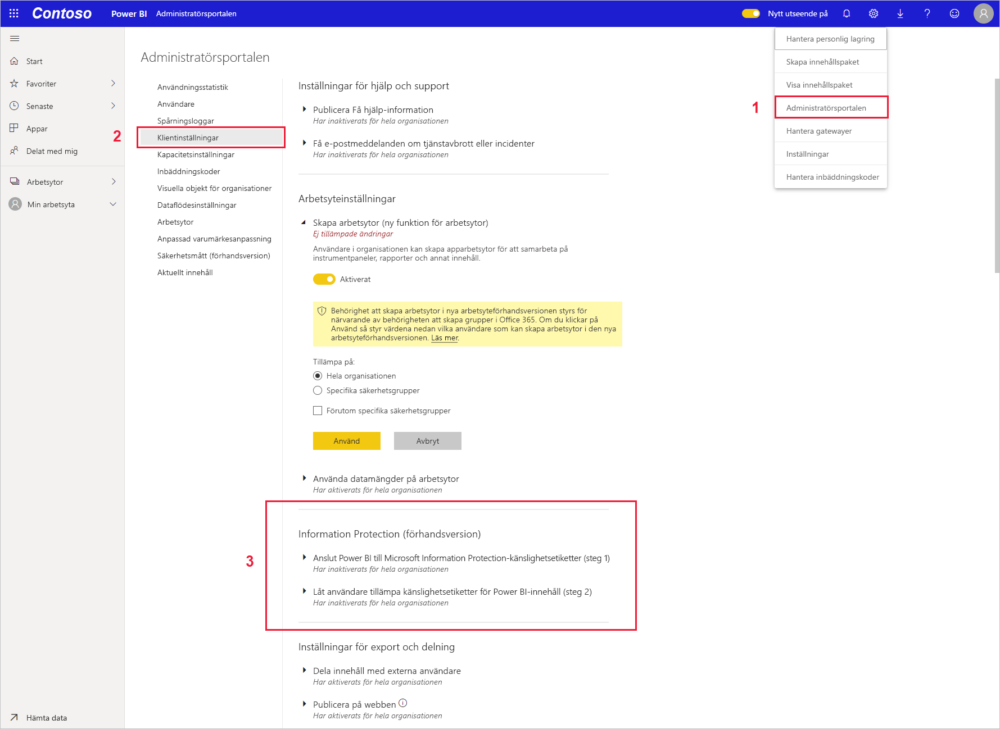
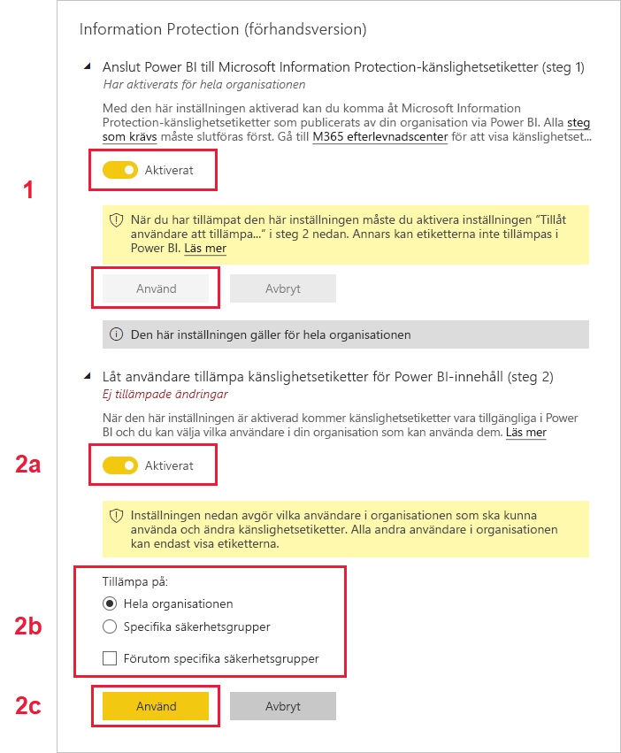

# Aktivera känslighetsetiketter för data i Power BI (förhandsversion)

När du aktiverar [känslighetsetiketter för data från Microsoft Information Protection](https://docs.microsoft.com/microsoft-365/compliance/sensitivity-labels) i Power BI gäller följande:

* Vissa användare och säkerhetsgrupper i en organisation kan klassificera och [tillämpa känslighetsetiketter](../designer/service-security-apply-data-sensitivity-labels.md) för sina instrumentpaneler, rapporter, datamängder och dataflöden i Power BI (kallas nedan för *tillgångar*).
* Alla medlemmar i organisationen kan se de här etiketterna.

Känslighetsetiketter ökar dataskyddet genom att författare och användare i Power BI görs medvetna om hur känsliga data är. Dessutom får de information om vad klassificeringen innebär och hur data med den aktuella klassificeringen ska hanteras.

När Power BI-data med en känslighetsetikett exporteras till en Excel-, PowerPoint- eller PDF-fil så ärvs samma känslighetsetikett för data i filen. Det innebär att en användare som inte har behörighet för känslighetsmärkningen inte kan öppna filerna *utanför* Power BI (i appar för Excel, PowerPoint eller PDF).

När du ska aktivera känslighetsetiketter för data behöver du en licens för Azure Information Protection. Mer information finns i [Licensiering](#licensing).

## Aktivera känslighetsetiketter för data

Om du vill använda känslighetsetiketter från Microsoft Information Protection i Power BI går du till administrationsportalen för Power BI, öppnar panelen med inställningar för klientorganisationen och letar reda på avsnittet Information Protection.

Utför följande steg i avsnittet **Information Protection**:
1.  Aktivera reglaget **Aktivera känslighetsetiketter för Microsoft Information Protection** och tryck på **Tillämpa**. Det här steget gör *bara* att hela organisationen kan se känslighetsetiketter, du tillämpar inte några etiketter. Om du vill definiera vem som kan tillämpa etiketterna i Power BI måste du utföra steg 2.
2.  Definiera vem som kan tillämpa och ändra känslighetsetiketter för Power BI-tillgångar. I det här steget ingår tre åtgärder:
    1.  Aktivera reglaget **Ange känslighetsetiketter för Power BI-innehåll och -data**.
    2.  Välj lämpliga säkerhetsgrupper. Som standard kan alla i organisationen tillämpa känslighetsetiketter. Du kan dock välja att endast låta vissa användare eller säkerhetsgrupper ställa in känslighetsetiketter. Om du väljer antingen hela organisationen eller specifika säkerhets grupper kan du undanta vissa delmängder av användare eller säkerhetsgrupper.
    * När känslighetsetiketter är aktiverade för hela organisationen är undantagen normalt säkerhetsgrupper.
    * När känslighetsetiketter bara är aktiverade för vissa användare eller säkerhetsgrupper så är undantagen normalt specifika användare.  
    Det här gör att du kan förhindra att vissa användare tillämpar känslighetsetiketter i Power BI, även om de tillhör en grupp som har behörighet att göra det.
    
    3. Tryck på **Tillämpa**.

> [!IMPORTANT]
> Det är bara Power BI Pro-användare med behörigheterna *skapa* och *redigera* för tillgången, och som ingår i säkerhetsgruppen du angav i avsnittet, som kan ställa in och redigera känslighetsetiketter. Användare som inte ingår i den här gruppen kan inte ställa in eller redigera etiketter. 

## Överväganden och begränsningar

Power BI använder känslighetsetiketter från Microsoft Information Protection. Om du får ett felmeddelande när du försöker aktivera känslighetsetiketter kan det bero på något av följande:

* Du har ingen [licens](#licensing) för Azure Information Protection.
* Känslighetsetiketter har inte migrerats till den version av Microsoft Information Protection som stöds i Power BI. Läs mer om att [migrera känslighetsetiketter](https://docs.microsoft.com/azure/information-protection/configure-policy-migrate-labels).
* Inga känslighetsetiketter från Microsoft Information Protection har definierats i organisationen. Om en etikett ska kunna användas måste den även ingår i en publicerad policy. [Läs mer om känslighetsetiketter](https://docs.microsoft.com/Office365/SecurityCompliance/sensitivity-labels) eller besök [Microsofts säkerhets- och efterlevnadscenter](https://sip.protection.office.com/sensitivity?flight=EnableMIPLabels) för att läsa om hur du definierar etiketter och publicerar policyer för din organisation.

## Licensiering

* Om användarna ska kunna visa eller använda känslighetsetiketter från Microsoft Information Protection i Power BI måste de ha en Premium P1- eller Premium P2-licens för Azure Information Protection. Du kan antingen köpa Microsoft Azure Information Protection separat eller via något av Microsofts licenspaket. Läs mer i [Prissättning för Azure Information Protection](https://azure.microsoft.com/pricing/details/information-protection/).
* Användare som ska ställa in etiketter för Power BI-tillgångar måste ha en Power BI Pro-licens.

## Nästa steg

I den här artikeln beskrivs hur du aktiverar känslighetsetiketter för data i Power BI. De här artiklarna innehåller mer information om dataskydd i Power BI. 

* [Översikt över dataskydd i Power BI](service-security-data-protection-overview.md)
* [Använda känslighetsetiketter för data i Power BI](../designer/service-security-apply-data-sensitivity-labels.md)
* [Använda Microsoft Cloud App Security-kontroller i Power BI](service-security-using-microsoft-cloud-app-security-controls.md)