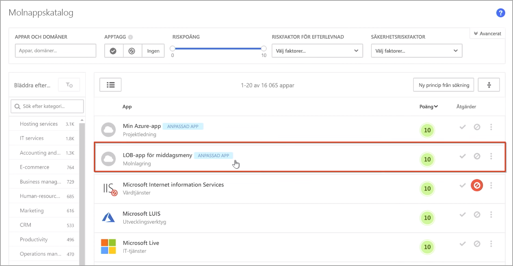
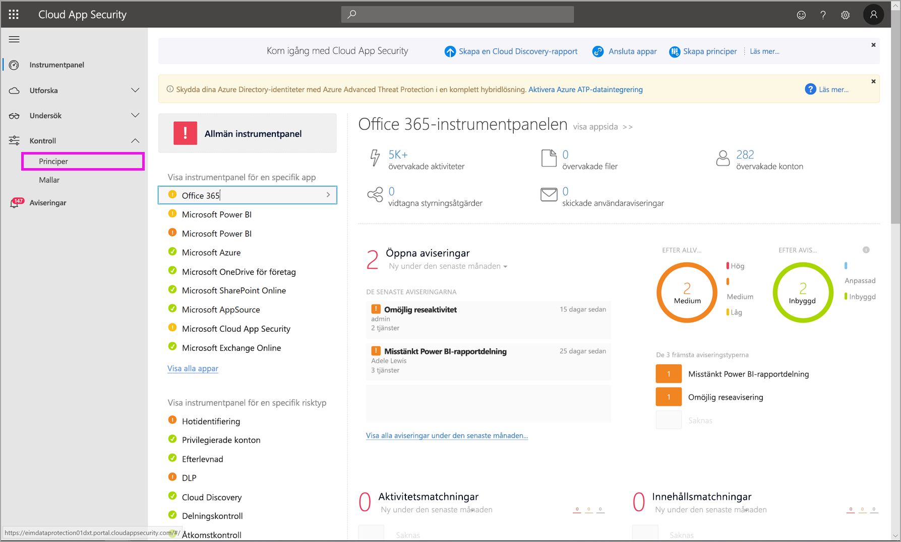
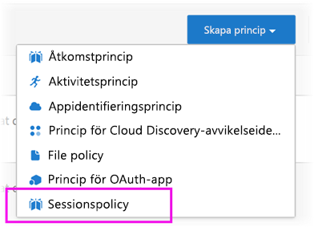
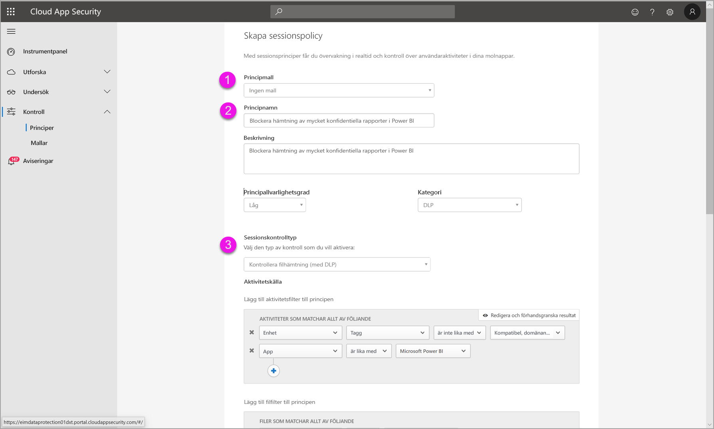
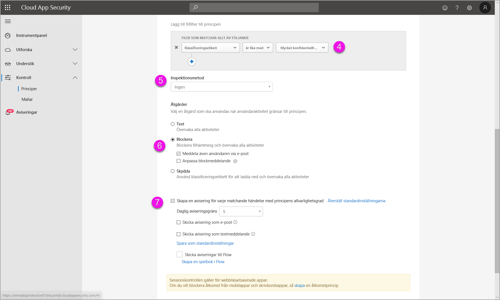
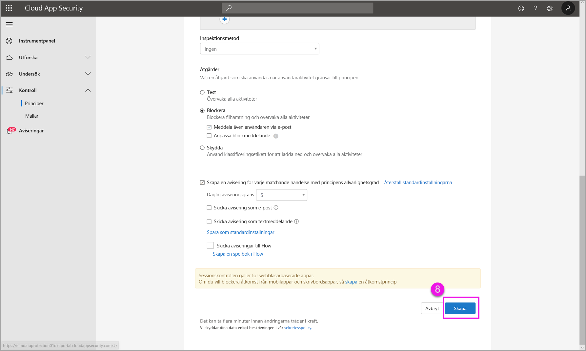

# Använda Microsoft Cloud App Security-kontroller i Power BI (förhandsversion)

När du använder Microsoft Cloud App Security med Power BI kan du skydda dina Power BI-rapporter, data och tjänster från oönskade läckor och intrång. Med Cloud App Security kan du skapa principer för villkorlig åtkomst till organisationens data. Du använder realtidsbaserade sessionskontroller i Azure Active Directory (Azure AD) som hjälper dig att skydda dina Power BI-analyser. När de här policyerna har ställts in så kan administratörer övervaka användarnas åtkomst och aktiviteter, utföra riskanalyser i realtid och ställa in etikettspecifika kontroller. 

Du kan konfigurera Microsoft Cloud App Security för alla typer av appar och tjänster, inte bara för Power BI. Cloud App Security är en Microsoft-tjänst som skyddar appar och enheter, och som hanteras via den egna instrumentpanelen. Du måste konfigurera Cloud App Security för Power BI innan du kan använda Cloud App Security-skyddet för dina Power BI-data och analyser. I [dokumentationen till Microsoft Cloud App Security](https://docs.microsoft.com/cloud-app-security/) ges en översikt av hur tjänsten fungerar, instrumentpanelen och appars riskpoäng.

## Använda Microsoft Cloud App Security med Power BI

Om du vill använda Microsoft Cloud App Security med Power BI måste du använda och konfigurera de relevanta Microsoft-säkerhetstjänsterna, och vissa av dem konfigureras utanför Power BI.

### Licenser för Microsoft Cloud App Security

Du måste ha någon av följande licenser för att kunna använda Microsoft Cloud App Security i din klientorganisation:
* MCAS: Ger OCAS-funktioner för alla appar som stöds, ingår i paketen EMS E5 och M365 E5.
* CAS-D: Ger endast MCAS-identifiering.
* OCAS: Ger endast MCAS-funktioner för Office 365, ingår i paketet Office E5.
* Valfritt: AAD P1 och AIP P1 om du vill använda de viktigaste funktionerna i Microsoft Cloud App Security.

I avsnitten nedan beskrivs hur du använder Microsoft Cloud App Security i Power BI.

### Ställ in sessionspolicyer i Azure Active Directory (obligatoriskt)
Du utför stegen som krävs för att ställa in sessionskontroller i portalerna för Azure AD och Microsoft Cloud App Security. I Azure AD-portalen skapar du en policy för villkorlig åtkomst för Power BI och dirigerar sedan sessionerna som används i Power BI via Microsoft Cloud App Security-tjänsten. 

Microsoft Cloud App Security fungerar enligt en arkitektur med omvänd proxy och är integrerat med den villkorsstyrda åtkomsten i Azure AD så att Power BI-användarnas aktivitet kan övervakas i realtid. Vi visar de här stegen för att du ska förstå processen. Detaljerade, stegvisa instruktioner finns i innehållet som länkas i respektive steg. Du kan också läsa den här [artikeln om Cloud App Security](https://docs.microsoft.com/cloud-app-security/proxy-deployment-aad) som beskriver processen i sin helhet.

1.  [Skapa en testpolicy för villkorsstyrd åtkomst i Azure AD](https://docs.microsoft.com/cloud-app-security/proxy-deployment-aad#add-azure-ad)
2.  [Logga in i varje app med en användare som omfattas av policyn](https://docs.microsoft.com/cloud-app-security/proxy-deployment-aad#sign-in-scoped)
3.  [Kontrollera att apparna är konfigurerade att använda åtkomst- och sessionskontroller](https://docs.microsoft.com/cloud-app-security/proxy-deployment-aad#portal)
4.  [Testa distributionen](https://docs.microsoft.com/cloud-app-security/proxy-deployment-aad#step-4-test-the-deployment)

Processen att ställa in sessionspolicyer beskrivs i detalj i artikeln [Sessionspolicyer](https://docs.microsoft.com/cloud-app-security/session-policy-aad). 

### Ställ in principer för identifiering av avvikelser i övervakningen av PBI-aktiviteter (rekommenderas)
Du kan definiera policyer för identifiering av avvikelser i Power BI och ange definitionsområdena individuellt, så att de endast gäller de användare och grupper du vill inkludera och exkludera i policyn. [Läs mer](https://docs.microsoft.com/cloud-app-security/anomaly-detection-policy#scope-anomaly-detection-policies).

Cloud App Security har även två särskilda, inbyggda identifieringar för Power BI. [Läs mer i avsnittet senare i det här dokumentet](#built-in-microsoft-cloud-app-security-detections-for-power-bi).

### Använd känslighetsetiketter från Microsoft Information Protection (rekommenderas)

Med känslighetsetiketter kan du klassificera och skydda känsligt innehåll så att personer i organisationen kan samarbeta med partners utanför organisationen, samtidigt som de skyddar och är försiktiga med känsliga uppgifter och data. 

I artikeln om [känslighetsetiketter i Power BI](../designer/service-security-apply-data-sensitivity-labels.md) beskrivs hur du använder känslighetsetiketter i Power BI. Här kan du se ett [exempel på en Power BI-policy baserad på känslighetsetiketter](#example).

## Inbyggda identifieringar för Power BI i Microsoft Cloud App Security

Med Microsoft Cloud App Security-identifieringar kan administratörer övervaka specifika aktiviteter i en app som övervakas. För Power BI finns det för närvarande två särskilda, inbyggda Cloud App Security-identifieringar: 

* **Misstänkt delning** – identifierar när en användare delar en känslig rapport med en okänd e-postadress (utanför organisationen). En känslig rapport är en rapport med en känslighetsetikett på nivån **INTERNAL-ONLY** eller högre. 

* **Massdelning av rapporter** – identifierar när en användare delar många olika rapporter under en enda session.

Du kan konfigurera inställningar för de här identifieringarna i Cloud App Security-portalen. [Läs mer](https://docs.microsoft.com/cloud-app-security/anomaly-detection-policy#unusual-activities-by-user). 

## Rollen Power BI-administratör i Microsoft Cloud App Security

Det skapas en ny roll för Power BI-administratörer när du använder Microsoft Cloud App Security med Power BI. När du loggar in som Power BI-administratör i [Cloud App Security-portalen](https://portal.cloudappsecurity.com/) har du begränsad åtkomst till data, varningar, riskanvändare, aktivitetsloggar och annan information som är relevant för Power BI.

## Överväganden och begränsningar 
Syftet med att använda Cloud App Security med Power BI är att du ska kunna skydda organisationens innehåll och data, med hjälp av identifieringar som övervakar användarnas sessioner och aktiviteter. När du använder Cloud App Security med Power BI finns det några begränsningar du bör ha i åtanke:

* Microsoft Cloud App Security fungerar bara för Excel-, PowerPoint- och PDF-filer.
* Om du vill använda känslighetsetiketter i dina sessionspolicyer för Power BI måste du ha en Premium P1- eller Premium P2-licens för Azure Information Protection. Du kan antingen köpa Microsoft Azure Information Protection separat eller via något av Microsofts licenspaket. Läs mer i [Prissättning för Azure Information Protection](https://azure.microsoft.com/pricing/details/information-protection/). Dessutom måste känslighetsetiketter ha tillämpats på dina Power BI-tillgångar.

> [!CAUTION]
> * Policyn för *innehållsgranskning* i Microsoft Cloud App Security är för närvarande inte tillgänglig i Power BI när du tillämpar en policy för Excel-filer, så ställ inte in den här policyn för Power BI.
> * I avsnittet ”Åtgärd” i sessionspolicyn så fungerar bara funktionen ”skydda” om objektet inte har någon etikett. Om objektet redan har en etikett fungerar inte åtgärden ”skydda”. Du kan inte åsidosätta en befintlig etikett som redan tillämpats på ett objekt i Power BI.

## Exempel

I det här exemplet ser du hur du skapar en ny sessionspolicy med hjälp av Microsoft Cloud App Security i Power BI.

Skapa först en ny sessionspolicy. Välj **Principer** på den vänstra menyn i **Cloud App Security**-portalen.

Välj listrutan **Skapa princip** i fönstret som öppnas.

Välj **Sessionspolicy** i listan med alternativ i listrutan.

Skapa sessionspolicyn i fönstret som öppnas. De numrerade stegen beskriver inställningarna i följande bild.

  1. I listrutan **Principmall** väljer du *Ingen mall*.
  2. I rutan **Principnamn** anger du ett relevant namn för sessionspolicyn.
  3. I **Sessionskontrolltyp** väljer du *Kontrollera filhämtningen (med DLP)* .

      I avsnittet **Aktivitetskälla** väljer du relevanta policyer för blockering. Vi rekommenderar att du blockerar ohanterade och inkompatibla enheter. Välj att blockera nedladdningar när sessionen hålls i Power BI.

        

        När du bläddrar nedåt ser du fler alternativ. I den här bilden ser du de alternativen och ytterligare exempel. 

  4. Sätt *Sekretessetikett* till *mycket konfidentiell* eller vad som passar bäst för din organisation.
  5. Ändra **Inspektionsmetod** till *ingen*.
  6. Välj det alternativ för **Blockera** som passar dina behov.
  7. Se till att du skapar en avisering för sådana åtgärder.

        

        

  8. Slutligen väljer du knappen **Skapa** för att skapa sessionspolicyn.

        

> [!CAUTION]
> Se till att du inte skapar någon policy av typen **innehållsgranskning** för Excel-filer i Power BI. Det här är en känd begränsning i *förhandsversionen*.

## Nästa steg
I den här artikeln har vi gått igenom hur Microsoft Cloud App Security kan skydda dina data och ditt innehåll i Power BI. Du kanske också är intresserad av följande artiklar, som beskriver olika dataskydd i Power BI och relaterat innehåll för de Azure-tjänster som tillhandahåller skydden.

* [Översikt över dataskydd i Power BI](service-security-data-protection-overview.md)
* [Aktivera känslighetsetiketter för data i Power BI](service-security-enable-data-sensitivity-labels.md)
* [Använda känslighetsetiketter för data i Power BI](../designer/service-security-apply-data-sensitivity-labels.md)

Du kanske också är intresserad av följande artiklar om säkerhet i Azure:

* [Skydda appar med appkontrollen för villkorsstyrd åtkomst i Microsoft Cloud App Security](https://docs.microsoft.com/cloud-app-security/proxy-intro-aad)
* [Distribuera appkontrollen för villkorsstyrd åtkomst för utvalda appar](https://docs.microsoft.com/cloud-app-security/proxy-deployment-aad)
* [Sessionspolicyer](https://docs.microsoft.com/cloud-app-security/session-policy-aad)
* [Översikt över känslighetsetiketter](https://docs.microsoft.com/microsoft-365/compliance/sensitivity-labels)