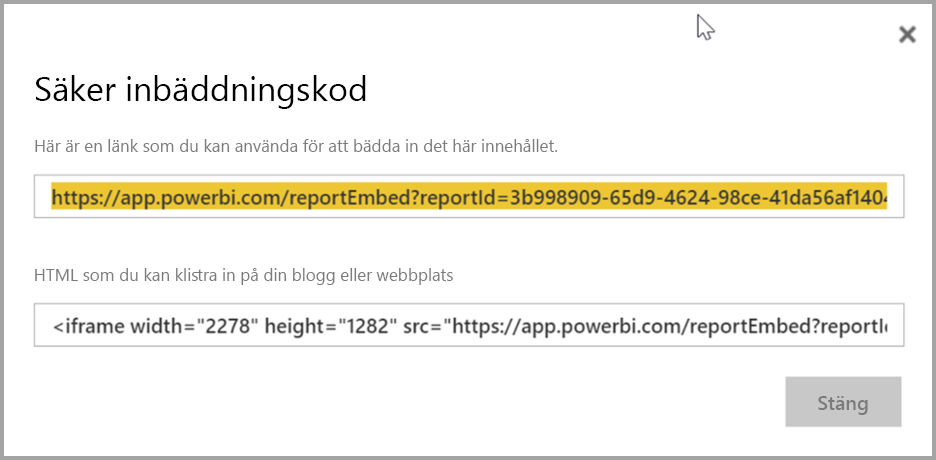
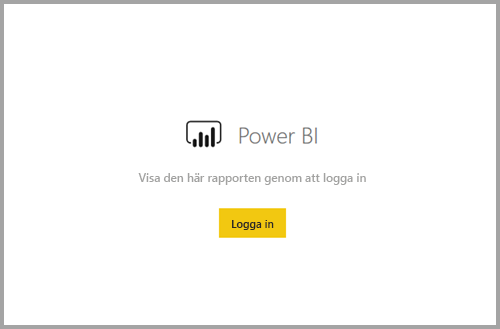
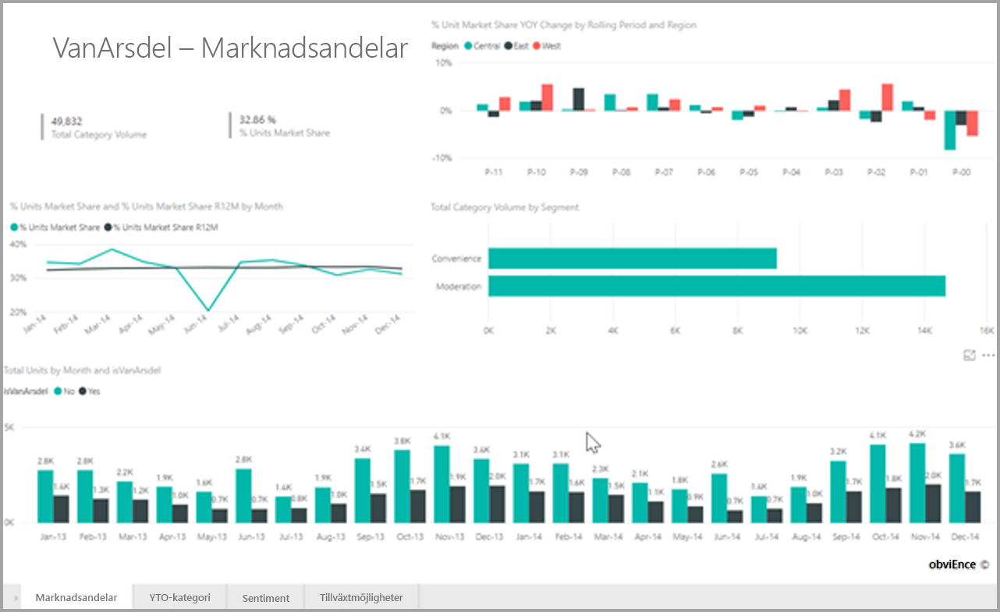

# <a name="embed-a-report-in-a-secure-portal-or-website"></a>Bädda in en rapport i en säker portal eller webbplats

Med det nya alternativet **Bädda in** för Power BI-rapporter kan du enkelt och säkert bädda in rapporter i interna webbportaler. Dessa portaler kan vara **molnbaserad** eller **lokalt värdbaserade**, till exempel SharePoint 2019. Inbäddade rapporter följer all objektbehörighet och datasäkerhet genom [säkerhet på radnivå (RLS)](../admin/service-admin-rls.md). Funktionen erbjuder inbäddning utan kod i valfri portal som accepterar en URL eller iFrame. 

Alternativet **Bädda in** stöder [URL-filter](service-url-filters.md) och URL-inställningar. Med det kan du integrera med portaler med en mindre mängd kod som enbart kräver grundläggande kunskaper om HTML och JavaScript.

## <a name="how-to-embed-power-bi-reports-into-portals"></a>Bädda in Power BI-rapporter i portaler

1. Öppna rapporten i Power BI-tjänsten.

2. På menyn **Fler alternativ (...)** väljer du **Bädda in** >  **Webbplats eller portal**.

    

2. Välj alternativet **Bädda in** om du vill öppna en dialogruta som tillhandahåller en länk och en iFrame som du kan använda för att bädda in rapporten på ett säkert sätt.

    

3. Om en användare öppnar en rapport-URL direkt eller en inbäddad på en webbportal, krävs det autentisering för åtkomst till rapporten. Följande skärm visas om en användare inte har loggat in på Power BI i webbläsarsessionen. När de klickar på **Logga in** kan det hända att ett nytt webbläsarfönster eller en ny flik öppnas. Be dem kontrollera popup-blockerare om ingen uppmaning om att logga in visas.

    

4. När användaren har loggat in öppnas rapporten. Den visar data och medger sidnavigering och filterinställning. Endast användare som har visningsbehörighet kan se rapporten i Power BI. Alla regler för [säkerhet på radnivå (RLS)](../admin/service-admin-rls.md) tillämpas också. Slutligen måste användaren även vara korrekt licensierad – antingen genom att ha en Power BI Pro-licens, eller så måste rapporten finnas på en arbetsyta som finns i en Power BI Premium-kapacitet. Användaren måste logga in varje gång hen öppnar ett nytt webbläsarfönster. När man väl har loggat in läses andra rapporter in automatiskt.

    

5. När du använder en iFrame kan du behöva redigera **höjden** och **bredden** så att den ryms på portalens webbsida.

    

## <a name="granting-report-access"></a>Bevilja åtkomst till rapport

Alternativet **Bädda in** tillåter inte automatiskt användare att visa rapporten. Visningsbehörigheter anges i Power BI-tjänsten.

I Power BI-tjänsten kan du dela inbäddade rapporter med användare som behöver åtkomst. Om du använder en Microsoft 365-grupp kan du lista användaren som medlem i arbetsytan. Mer information finns i artikeln om att [hantera din arbetsyta i Power BI och Microsoft 365](service-manage-app-workspace-in-power-bi-and-office-365.md).

## <a name="licensing"></a>Licensiering

För att visa den inbäddade rapporten måste användare antingen ha en Power BI Pro-licens eller så måste innehållet finnas på en arbetsyta som är i en [Power BI Premium-kapacitet (EM eller P SKU)](../admin/service-admin-premium-purchase.md).

## <a name="customize-your-embed-experience-using-url-settings"></a>Anpassa den inbäddade upplevelsen med hjälp av URL-inställningar

Du kan anpassa användarupplevelsen med hjälp av indatainställningarna för inbäddnings-URL. I den iFrame du fått kan du uppdatera URL:ens **src**-inställningar.

| Egenskap  | Beskrivning  |  |  |  |
|--------------|-----------------------------------------------------------------------------------------------------------------------------------------------------------------------------------------------------------------------|---|---|---|
| pageName  | Du kan använda frågesträngsparametern **pageName** om du vill ange vilken sida i rapporten som ska öppnas. Du hittar det här värdet i slutet av rapport-URL:en när du visar en rapport i Power BI-tjänsten så som visas nedan. |  |  |  |
| URL-filter  | Du kan använda [URL-filter](service-url-filters.md) i den inbäddnings-URL som du fått från Power BI-användargränssnittet för att filtrera inbäddningsinnehållet. På så sätt kan du skapa integreringar som bara använder lite kod integreringar med enbart grundläggande HTML och JavaScript.  |  |  |  |

## <a name="set-which-page-opens-for-an-embedded-report"></a>Ange vilken sida som ska öppnas för en inbäddad rapport 

Du hittar värdet **pageName** i slutet av rapport-URL:en när du visar en rapport i Power BI-tjänsten.

1. Öppna rapporten från Power BI-tjänsten i webbläsaren och kopiera sedan URL:en från adressfältet.

    

2. Lägg till inställningen **pageName** i URL:en.

    

## <a name="filter-report-content-using-url-filters"></a>Filtrera rapportinnehåll med hjälp av URL-filter 

Du kan använda [URL-filter](service-url-filters.md) för att visa olika rapportvyer. URL:en nedan filtrerar t.ex. rapporten för att visa data för energibranschen.

Att använda kombination av **pageName** och [URL-filter](service-url-filters.md) kan vara effektivt. Du kan skapa upplevelser med grundläggande HTML och JavaScript.

Här är till exempel en knapp som du kan lägga till på en HTML-sida:

```html
<button class="textLarge" onclick='show("ReportSection", "Energy");' style="display: inline-block;">Show Energy</button>
```

När du väljer knappen anropas på en funktion för att uppdatera iFrame med en uppdaterad URL, vilken innehåller filtret för energibranschen.

```javascript
function show(pageName, filterValue)

{

var newUrl = baseUrl + "&pageName=" + pageName;

if(null != filterValue && "" != filterValue)

{

newUrl += "&$filter=Industries/Industry eq '" + filterValue + "'";

}

//Assumes there's an iFrame on the page with id="iFrame"

var report = document.getElementById("iFrame")

report.src = newUrl;

}
```


Du kan lägga till så många knappar du vill för att skapa en anpassad upplevelse med lite kod. 

## <a name="considerations-and-limitations"></a>Överväganden och begränsningar

* Sidnumrerade rapporter med säker inbäddning och sidnumrerade rapporter med URL-parametrar stöds. Läs mer om att [skicka rapportparametrar i en URL för en sidnumrerad rapport](../paginated-reports/report-builder-url-pass-parameters.md).

* Stöder inte externa gästanvändare med Azure företag till företag (B2B).

* Säker inbäddning fungerar för rapporter som publicerats i Power BI-tjänsten.

* Användaren måste logga in för att kunna visa rapporten varje gång hen öppnar ett nytt webbläsarfönster.

* Vissa webbläsare kräver att du uppdaterar sidan efter inloggning, i synnerhet om du använder InPrivate- eller Incognito-läget.

* Du kan stöta på problem om du använder webbläsarversioner som inte stöds. Power BI har stöd för [följande webbläsare](../fundamentals/power-bi-browsers.md).

* Den klassiska SharePoint-servern stöds inte eftersom den kräver tidigare versioner av Internet Explorer än 11 eller aktivering av läget Kompatibilitetsvy.

* Om du vill uppnå en enkel inloggningsupplevelse använder du alternativet [Bädda in i SharePoint Online](service-embed-report-spo.md) eller skapar en anpassad integrering med hjälp av inbäddningsmetoden [användaren äger data](../developer/embedded/embed-sample-for-your-organization.md). 

* Den automatiska autentiseringsfunktionen som tillhandahålls av alternativet **Bädda in** fungerar inte med Power BI JavaScript-API:et. När det gäller Power BI JavaScript-API:et använder du metoden [användaren äger data](../developer/embedded/embed-sample-for-your-organization.md) för inbäddning. 

* Livstiden för autentiseringstoken styrs utifrån dina AAD-inställningar. När autentiseringstoken upphör att gälla måste användaren uppdatera sin webbläsare för att få en uppdaterad autentiseringstoken. Livslängden är som standard en timme, men den kan vara kortare eller längre i din organisation.

## <a name="next-steps"></a>Nästa steg

* [Olika sätt att dela ditt arbete i Power BI](service-how-to-collaborate-distribute-dashboards-reports.md)

* [Filtrera en rapport med frågesträngparametrar i URL:en](service-url-filters.md)

* [Bädda in med rapportwebbdel i SharePoint Online](service-embed-report-spo.md)

* [Publicera på webben från Power BI](service-publish-to-web.md)
