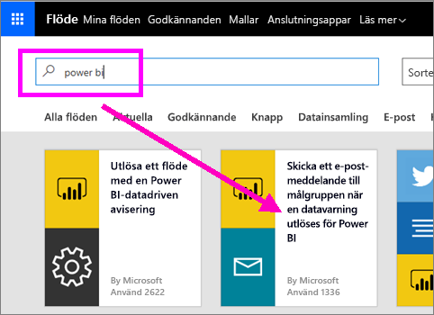
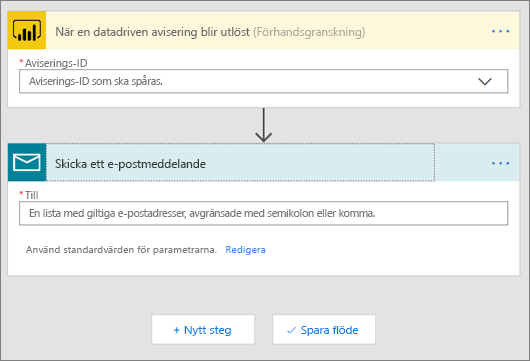
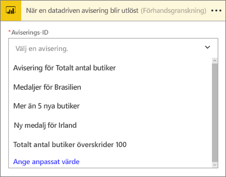
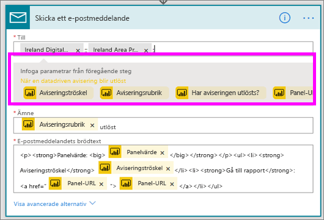
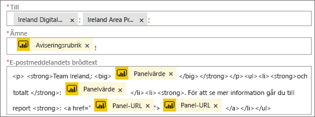
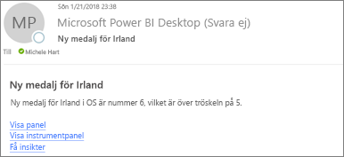
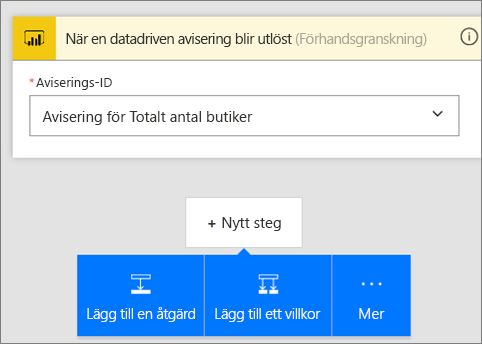
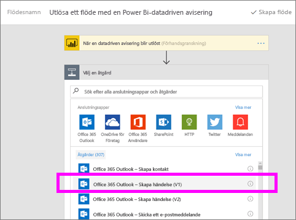
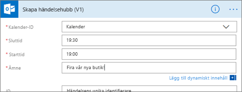
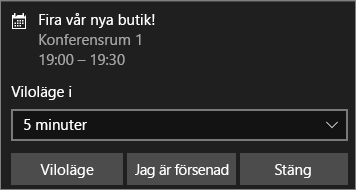

# Power Automate och Power BI

[Power Automate](https://docs.microsoft.com/power-automate/getting-started) är ett SaaS-erbjudande för automatisering av arbetsflöden i det växande antalet program och SaaS-tjänster som användare i verksamheten förlitar sig på. Du kan använda Power Automate för att automatisera uppgifter genom att integrera dina favorit-appar och -tjänster (inklusive Power BI) om du vill få meddelanden, synkronisera filer, samla in data med mera. Återkommande uppgifter blir enkelt med automatisering av arbetsflödet.

[Kom igång med att använda Power Automate nu.](https://docs.microsoft.com/power-automate/getting-started)

Titta på när Sirui skapar ett Power Automate-flöde som skickar ett detaljerat e-postmeddelande till kollegor när en Power BI-avisering utlöses. Prova sedan själv genom att följa de stegvisa anvisningarna under videon.

<iframe width="560" height="315" src="https://www.youtube.com/embed/YhmNstC39Mw" frameborder="0" allowfullscreen></iframe>

## Skapa ett flöde som utlöses av en avisering för Power BI-data

### Förutsättningar
Den här kursen visar hur du skapar två olika flöden; ett från en mall och ett från grunden. Kom igång och [skapa en dataavisering i Power BI](../create-reports/service-set-data-alerts.md), skapa ett kostnadsfritt Slack-konto och [registrera dig för Power Automate](https://flow.microsoft.com/#home-signup) (det är gratis)!

## Skapa ett flöde som använder Power BI – från en mall
I den här uppgiften använder vi en mall för att skapa ett enkelt flöde som utlöses av en Power BI-datavarning (meddelande).

1. Logga in till Power Automate (flow.microsoft.com).
2. Välj **Mina flöden**.
   
   
3. Välj **Skapa från mall**.
   
    
4. Använd sökrutan för att hitta Power BI-mallar och välj **skicka ett e-postmeddelande till målgruppen när en datavarning utlöses för Power BI > Fortsätt**.
   
    

### Skapa flödet
Den här mallen har en utlösare (Power BI-datavarning för nya OS-medaljer för Irland) och en åtgärd (skicka ett e-postmeddelande). När du markerar ett fält visar Power Automate dynamiskt innehåll som ska inkluderas.  I det här exemplet har vi inkluderat panelvärdet och panelens URL i meddelandetexten.

1. Välj Power BI-datavarning från listrutan med utlösare. Välj **Ny medalj för Irland**. Information om hur du skapar en avisering finns i [Datavarningar i Power BI](../create-reports/service-set-data-alerts.md).
   
   
2. Ange en eller flera giltiga e-postadresser och markera sedan **Redigera** (se nedan) eller **Lägg till dynamiskt innehåll**. 
   
   

3. Power Automate skapar en rubrik och ett meddelande som du kan behålla eller ändra. Alla värden som du angav när du skapade varningen i Power BI är tillgängliga för dig – bara placera markören och välj det gråmarkerade området. 

   

1.  Om du till exempel har skapat en varningsrubrik i Power BI för **Vi vann en till medalj**, kan du välja **Varningsrubrik** för att lägga till texten i din e-posts ämnesrad.

    

    Och du kan acceptera standardtexten för e-postmeddelandet eller skapa din egen text. Exemplet ovan innehåller några ändringar i meddelandet.

1. När du är klar väljer du **Skapa flödet** eller **Spara flöde**.  Flödet skapas och utvärderas.  Power Automate meddelar om några fel påträffas.
2. Om fel hittas, välj **Redigera flödet** åtgärda dem, välj annars **Klar** för att köra det nya flödet.
   
   
5. När datavarningen utlöses skickas ett e-postmeddelande till de adresser som du angett.  
   
   

## Skapa en Power Automate som använder Power BI – från början (tomt)
I den här uppgiften skapar vi ett enkelt flöde från början som utlöses av en Power BI-datavarning (meddelande).

1. Logga in till Power Automate.
2. Välj **Mina flöden** > **Skapa från början**.
   
   
3. Använd sökrutan för att hitta en Power BI-utlösare och välj **Power BI – när en datadriven varning utlöses**.

### Skapa ditt flöde
1. Välj namnet på aviseringen i listrutan.  Information om hur du skapar en avisering finns i [Datavarningar i Power BI](../create-reports/service-set-data-alerts.md).
   
    
2. Välj **Nytt steg** > **Lägg till en åtgärd**.
   
   
3. Sök efter **Outlook** och välj **Skapa en händelse**.
   
   
4. Fyll i händelsefälten. När du markerar ett fält visar Power Automate dynamiskt innehåll som ska inkluderas.
   
   
5. Välj **Skapa flöde** när du är klar.  Power Automate sparar och utvärderar flödet. Om det inte finns några fel, välj **Klar** för att köra detta flöde.  Det nya flödet har lagts till på din sida **Mina flöden**.
   
   
6. När flödet utlöses av Power BI-datavarningen, får du ett Outlook-händelsemeddelande som liknar det här.
   
    

## Nästa steg
* [Kom igång med Power Automate](https://docs.microsoft.com/power-automate/getting-started/)
* [Ange datavarningar i Power BI-tjänsten](../create-reports/service-set-data-alerts.md)
* [Ange datavarningar på din iPhone](../consumer/mobile/mobile-set-data-alerts-in-the-mobile-apps.md)
* [Ställ in dataaviseringar i Power BI-mobilappen för Windows 10](../consumer/mobile/mobile-set-data-alerts-in-the-mobile-apps.md)
* Fler frågor? [Prova Power BI Community](https://community.powerbi.com/)
