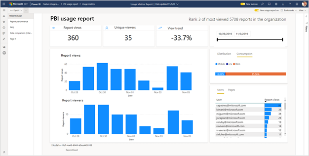
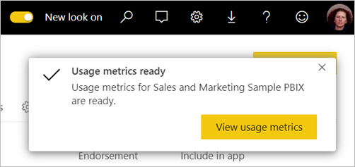
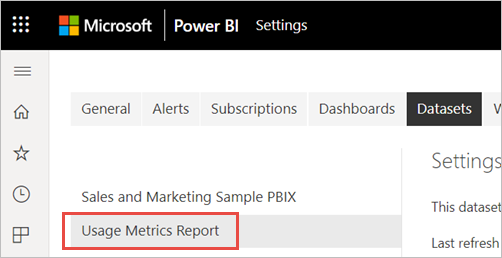
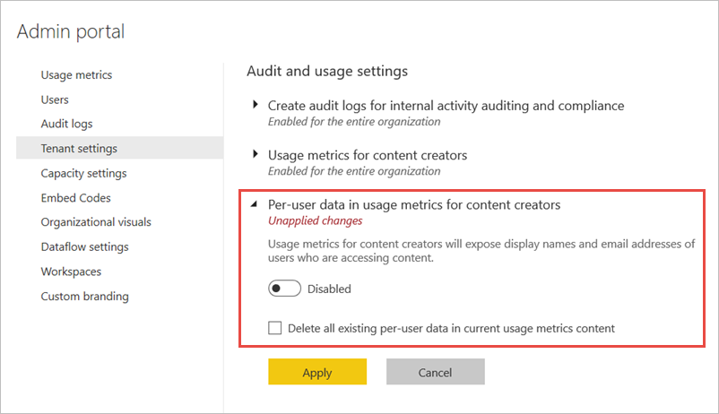
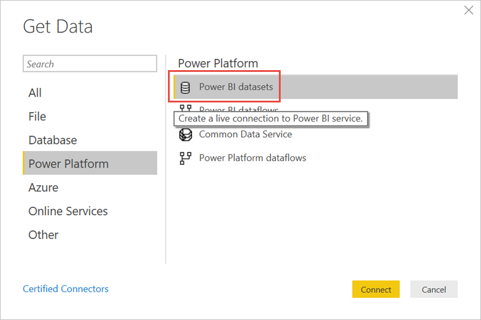
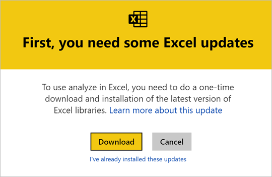
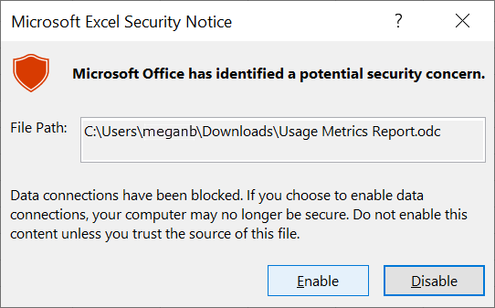

# Övervaka användningsstatistik i den nya arbetsytan

Genom att känna till hur ditt innehåll används ser du vilken inverkan det har och du kan prioritera dina åtgärder. Användningsstatistik kan t.ex. visa att en av dina rapporter används dagligen av en stor del av organisationen eller att en instrumentpanel som du har skapat inte används alls. Den här typen av feedback är ovärderlig vid planeringen av ditt arbete.

Om du skapar rapporter i moderna arbetsytor har du tillgång till förbättrade användningsstatistikrapporter som gör att du kan identifiera hur dessa rapporter används i hela organisationen och vem som använder dem. Du kan också identifiera prestandaproblem på hög nivå. De förbättrade användningsrapporterna i den moderna arbetsytan ersätter befintliga användningsstatistikrapporter som dokumenteras i [Övervaka användningsstatistik för Power BI-instrumentpaneler och -rapporter](service-usage-metrics.md).

> [!NOTE]
> Du kan bara köra användningsstatistikrapporter i Power BI-tjänsten. Men om du sparar användningsstatistikrapporten eller fäster den på en instrumentpanel kan du öppna och interagera med rapporten på mobila enheter.

## Förutsättningar

- Det krävs en Power BI Pro-licens för att kunna köra och få åtkomst till användningsstatistikdata. Användningsstatistikfunktionen samlar dock in användningsinformation från alla användare, oavsett vilken licens de har tilldelats.
- För att få åtkomst till bättre användningsstatistik för en rapport måste rapporten finnas i en modern arbetsyta och du måste ha redigeringsåtkomst till rapporten.
- Power BI-administratören måste ha aktiverat användningsstatistik för skapare av innehåll. Power BI-administratören kan också ha aktiverat insamling av data per användare i användningsstatistik. Läs mer om att [aktivera dessa alternativ i administratörsportalen](../admin/service-admin-portal.md#control-usage-metrics).

## Skapa och visa en förbättrad användningsstatistikrapport

Endast användare med behörigheterna administratör, medlem eller deltagare kan se den förbättrade användningsstatistikrapporten. Visningsbehörigheterna är inte tillräckliga. Om du är som minst en deltagare i en modern arbetsyta där rapporten finns kan du använda följande procedur för att visa den förbättrade användningsstatistiken:

1. Öppna arbetsytan som innehåller rapporten som du vill analysera användningsstatistik för.
2. Från arbetsytans innehållslista öppnar du snabbmenyn för rapporten och väljer **Visa användningsstatistikrapport**. Du kan också öppna rapporten, öppna snabbmenyn i kommandofältet och sedan välja **Användningsstatistik**.

    

1. Första gången du gör detta skapar Power BI användningsstatistikrapporten och talar om för dig när den är klar.

    

1. Om du vill se resultaten väljer du **Visa användningsstatistik**.
2. Om det är första gången du gör detta kan Power BI öppna den gamla användningsstatistikrapporten. Om du vill visa den förbättrade användningsstatistikrapporten går du till det övre högra hörnet och ändrar den nya användningsrapporten till **På**.

    

    > [!NOTE]
    > Du kan bara se växlingen till den nya användningsrapporten om rapporten finns i en modern arbetsyta. Äldre arbetsytor erbjuder inte förbättrade användningsstatistikrapporter.

## Om den förbättrade användningsstatistikrapporten

När du visar den förbättrade användningsstatistikrapporten enligt följande procedur, skapar Power BI en färdig rapport med användningsstatistik för innehållet under de senaste 30 dagarna. Rapporten liknar de Power BI-rapporter som du redan är bekant med. Du kommer att kunna segmentera innehållet baserat på hur dina slutanvändare har åtkomst till det, t.ex. via webben eller en mobilapp. Allteftersom dina rapporter utvecklas, kommer även användningsstatistikrapporten göra det, med dagliga uppdateringar av nya data.

> [!NOTE]
> Användningsstatistikrapporterna visas inte i Senaste, Arbetsytor, Favoriter eller andra innehållslistor. De kan inte läggas till i en app. Om du fäster en panel från en användningsstatistikrapport på en instrumentpanel går det inte att lägga till instrumentpanelen i en app.

### Datauppsättning för användningsstatistikrapport

Den förbättrade användningsstatistikrapporten förlitar sig på en datauppsättning för användningsstatistikrapport som Power BI skapar automatiskt när du startar den förbättrade användningsstatistikrapporten första gången. Power BI uppdaterar datauppsättningen dagligen. Du kan inte ändra uppdateringsschemat, men du kan uppdatera de autentiseringsuppgifter som Power BI använder för att uppdatera användningsstatistikdata. Det kan vara nödvändigt att återuppta schemalagd uppdatering om autentiseringsuppgifterna upphör att gälla om du tog bort den användare som först startade användningsstatistikrapporten från arbetsytan där datauppsättningen finns.

### Sidor i användningsstatistikrapporten

Den förbättrade användningsstatistikrapporten innehåller följande rapportsidor:

- **Rapportanvändning** ger information om rapportvyer och rapportvisningsprogram, till exempel hur många användare som visade rapporten enligt datum.
- **Rapportprestanda** visar de vanligaste öppningstiderna för rapporten uppdelade efter förbrukningsmetod och webbläsartyper.
- **Vanliga frågor** ger svar på vanliga frågor, t.ex. Vad är en ”användare” och vad är en ”vy”?

### Vilka mått rapporteras?

| **Sida** | **Mått** | **Beskrivning** |
| --- | --- | --- |
| Rapportanvändning | Rapportvyer | En rapportvy registreras varje gång någon öppnar en rapport. Observera att definitionen av en vy skiljer sig från tidigare användningsstatistikrapporter. Att ändra rapportsidor anses inte längre vara en extra vy. |
| Rapportanvändning | Unika användare | En användare är någon som öppnade rapporten minst en gång under tidsperioden (baserat på AAD-användarkontot). |
| Rapportanvändning | Visningstrend | Visningstrenden visar antalet ändringar över tid. Den jämför den första halvan av den valda tidsperioden med den andra halvan. |
| Rapportanvändning | Datumutsnitt | Du kan ändra tidsperioden på rapportanvändningssidan, till exempel för att beräkna trender vecka för vecka eller varannan vecka. I det nedre vänstra hörnet på rapportanvändningssidan kan du fastställa det tidigaste och senaste datumet då användningsdata är tillgängliga för den valda rapporten. |
| Rapportanvändning | Rangordning | Baserat på antal visningar visar rankningen en rapports popularitet i jämförelse med alla andra rapporter i organisationen.   |
| Rapportanvändning | Rapportvisningar per dag | Totalt antal visningar per dag. |
| Rapportanvändning | Rapportanvändare per dag | Det totala antalet olika användare som visat rapporten (baserat på AAD-användarkontot). |
| Rapportanvändning | Distributionsmetod | Hur användarna får åtkomst till rapporten, t. ex. när de är medlemmar i en arbetsyta, genom att rapporten delas med dem eller genom att installera en app. |
| Rapportanvändning | Plattformsutsnitt | Om rapporten öppnades via Power BI-tjänsten (powerbi.com), Power BI Embedded eller en mobil enhet. |
| Rapportanvändning | Användare med rapportvyer | Visar en lista över användare som har öppnat rapporten sorterat efter antal visningar. |
| Rapportanvändning | Sidor | Om rapporten innehåller mer än en sida kan du dela upp rapporten i den sida eller de sidor som visades. Om du ser listalternativet ”Tom” betyder det att en rapportsida nyligen lagts till (inom 24 timmar kommer det riktiga namnet på den nya sidan visas i listan med utsnitt) och/eller att rapportsidor har tagits bort. I ”Tom” finns dessa typer av situationer. |
| Rapportprestanda | Normal öppningstid | Den normala rapportöppningstiden motsvarar den 50:e percentilen av den tid det tar att öppna rapporten. Med andra ord är det den tid under vilken 50 % av de öppna rapportåtgärderna har slutförts. Rapportens prestandasida visar de vanligaste öppningstiderna för rapporten efter förbrukningsmetod och webbläsartyper.   |
| Rapportprestanda | Trend för öppningstid | Den inledande tidstrenden visar prestandaändringar över tid för öppen rapport. Den jämför öppningstiderna för rapporten med den första halvan av den valda tidsperioden med öppningstiderna för den andra halvan. |
| Rapportprestanda | Datumutsnitt | Du kan ändra tidsperioden på rapportens prestandasida, till exempel för att beräkna trender vecka för vecka eller varannan vecka. I det nedre vänstra hörnet på rapportens prestandasida kan du fastställa det tidigaste och senaste datumet då användningsdata är tillgängliga för den valda rapporten. |
| Rapportprestanda | Daglig prestanda | Prestanda för 10 %, 50 % och 90 % av de öppna rapportåtgärder som beräknats för varje enskild dag. |
| Rapportprestanda | 7-dagars prestanda | Prestanda för 10 %, 50 % och 90 % av de öppna rapportåtgärder som beräknats för de senaste 7 dagarna för varje datum. |
| Rapportprestanda | Förbrukningsmetod | Hur användare öppnade rapporten, t.ex. via Power BI-tjänsten (powerbi.com), Power BI Embedded eller en mobil enhet. |
| Rapportprestanda | Webbläsare | Vilken webbläsare användarna använde för att öppna rapporten, till exempel Firefox, Microsoft Edge och Chrome. |

## Uppdatera autentiseringsuppgifter för användningsstatistik

Använd följande procedur för att ta över en datauppsättning för användningsstatistikrapport och uppdatera autentiseringsuppgifterna.

1. Öppna arbetsytan som innehåller rapporten för vilken du vill uppdatera datauppsättningen för användningsstatistikrapport.
2. I det svarta rubrikfältet överst väljer du ikonen **Inställningar** och väljer sedan **Inställningar**.

    

3. Växla till fliken **Datauppsättning**.

1. Välj datauppsättning för användningsstatistikrapport. 

    
    
    Om du inte är den aktuella datauppsättningens ägare måste du ta över ägarskapet innan du kan uppdatera autentiseringsuppgifterna för datakällan. 
    
5. Välj knappen **Ta över** och i dialogrutan **Inställningar för att ta över datauppsättning** väljer du **Ta över** igen.

1. Under **Autentiseringsuppgifter för datakälla** väljer du **Redigera autentiseringsuppgifter**.

    

2. I dialogrutan **Konfigurera användningsstatistik** väljer du **Logga in**.

    

1. Slutför inloggningssekvensen och notera meddelandet om att datakällan har uppdaterats korrekt.

    > [!NOTE]
    > Datauppsättningens användningsstatistikrapport innehåller användningsdata för de senaste 30 dagarna. Det kan ta upp till 24 timmar innan nya användningsdata importeras. Du kan inte utlösa en manuell uppdatering med hjälp av Power BI-användargränssnitt.

## Inaktivera användningsstatistikrapporter

Användningsstatistikrapporter är en funktion som Power BI- eller Office 365-administratören kan aktivera eller inaktivera. Administratörerna har detaljerad kontroll över vilka användare som har åtkomst till användningsstatistiken. De är aktiverade som standard för alla användare i organisationen. Se [Kontrollera användningsstatistik](../admin/service-admin-portal.md#control-usage-metrics) i administratörsportalartikeln för information om de här inställningarna.

> [!NOTE]
> Endast administratörer för Power BI-klienten kan se administratörsportalen och redigera inställningarna.

## Utelämna användarinformation från användningsstatistikrapporten

Som standard är data per användare aktiverat för användningsstatistik och kontoinformation om konsumenter av innehåll ingår i statistikrapporten. Om administratörer inte vill visa den här informationen för vissa eller alla användare kan de utesluta användarinformation från din användningsrapport genom att inaktivera data per användare i användningsstatistik för skapare av innehåll i Power BI-administratörsportalens klientinställningar för angivna säkerhetsgrupper eller för hela organisationen.

1. På fliken **Klientinställningar** i administrationsportalen, under **Gransknings- och användningsinställningar**, expanderar du **Data per användare i statistik för skapare av innehåll** och väljer **Inaktiverad**.

2. Bestäm om du vill **Ta bort alla befintliga data per användare i nuvarande användarstatistikinnehåll** och välj **Tillämpa**.

    

Om användarinformation utelämnas refererar användningsrapporten till användare som namnlösa.

När du inaktiverar användningsstatistik för hela organisationen kan administratörerna använda alternativet Ta bort allt befintligt innehåll för användningsstatistik för att ta bort alla befintliga rapporter och instrumentpaneler som har skapats med användningsstatistikrapporter. Det här alternativet tar bort all åtkomst till användningsstatistiken för alla användare i organisationen som kanske redan använder den. Det inte går att ångra när du har tagit bort befintligt användningsstatistikinnehåll.

> [!NOTE]
> Endast administratörer för Power BI-klientorganisationen kan se administratörsportalen och konfigurera användardata i användningsstatistik för inställningen för skapare av innehåll.

## Anpassa användningsstatistikrapporten

För att analysera rapportdata för att bygga dina egna rapporter mot den underliggande datauppsättningen har du flera alternativ:

- **[Skapa en kopia av en rapport](#create-a-copy-of-the-usage-report) i Power BI-tjänsten.**   Använd **Spara en kopia** för att skapa en separat instans av användningsstatistikrapporten, som du kan anpassa efter dina egna behov.
- **[Anslut till datauppsättningen](#create-a-new-usage-report-in-power-bi-desktop) med en ny rapport.**   För varje arbetsyta har datauppsättningen namnet ”användningsstatistikrapport”, som förklarats tidigare i avsnittet [Datauppsättning för användningsstatistikrapport](#usage-metrics-report-dataset). Du kan använda Power BI Desktop för att skapa anpassade användningsstatistikrapporter baserat på den underliggande datauppsättningen.
- **[Använda Analysera i Excel](#analyze-usage-data-in-excel).**   Du kan också dra nytta av pivottabeller, diagram och utsnittsfunktioner i Microsoft Excel 2010 SP1 eller senare för att analysera Power BI-användningsdata. Läs mer om funktionen [Analysera i Excel](service-analyze-in-excel.md).

### Skapa en kopia av användningsrapporten

När du skapar en kopia av den skrivskyddade färdiga användningsrapporten skapar Power BI en redigerbar instans av rapporten. Vid första anblicken ser den likadan ut. Men nu kan du öppna rapporten i vyn Redigering, lägga till nya visualiseringar, filter och sidor, ändra eller ta bort befintliga visualiseringar och mycket mer. Power BI sparar den nya rapporten i den aktuella arbetsytan.

1. I den nya användningsstatistikrapporten väljer du menyn **Fler alternativ** (...) och väljer sedan **Spara en kopia**.

    

2. I dialogrutan **Spara rapporten** anger du ett namn och väljer sedan **Spara**.

    Power BI skapar en redigerbar Power BI-rapport som sparas i den aktuella arbetsytan och öppnar rapportkopian. 

3. Välj meny **Fler alternativ** (...) och välj sedan **Redigera** för att växla till redigeringsvyn. 

    Du kan till exempel ändra filter, lägga till nya sidor och skapa nya visualiseringar, formatera teckensnitt och färger etc.

1. Den nya rapporten sparas i på fliken Rapporter den aktuella arbetsytan och läggs också till i innehållslistan Senaste.

    

### Skapa en ny användningsrapport i Power BI Desktop

Du kan skapa en ny användningsrapport i Power BI Desktop baserat på datauppsättningen för användningsstatistikrapporten. Om du vill upprätta en anslutning till datauppsättningen för användningsstatistikrapporten och skapa en egen rapport måste du vara inloggad på Power BI-tjänsten i Power BI Desktop. 

1. Öppna Power BI Desktop.

2. Om du inte är inloggad på Power BI-tjänsten väljer du **Logga in** i menyn **Fil**.

1. Om du vill ansluta till datauppsättningen för användningsstatistikrapporten väljer du **Hämta data** i menyfliksområdet **Start**.

4. I det vänstra fönstret väljer du **Power Platform** och väljer sedan **Power BI-datauppsättningar** > **Anslut**.

    

1. Bläddra till önskad datauppsättning eller skriv *Användningsstatistikrapport* i sökrutan. 

6. Kontrollera i kolumnen Arbetsyta att du väljer rätt datauppsättning och välj sedan **Skapa**. 

    

7. Kontrollera listan Fält i Power BI Desktop, vilken ger dig åtkomst till tabeller, kolumner och mått i den valda datauppsättningen.

    

1. Nu kan du skapa och dela anpassade användningsrapporter, allt från samma datauppsättning för användningsstatistikrapport.

### Analysera användningsdata i Excel

När du ansluter till användningsdata i Excel kan du skapa pivottabeller som använder de fördefinierade måtten. Notera att pivottabeller i Excel inte har stöd för dra och släpp-aggregering av numeriska fält vid anslutning till en Power BI-datauppsättning.

1. Om du inte redan har gjort det, [skapa först en kopia av användningsstatistikrapporten](#create-a-copy-of-the-usage-report). 

2. Öppna den nya användningsstatistikrapporten väljer du menyn **Fler alternativ** (...) och väljer **Analysera i Excel**.

    

1. Om du ser dialogrutan **Först behöver du en del Excel-uppdateringar** väljer du **Hämta** och installerar de senaste uppdateringarna för Power BI-anslutning eller väljer **Jag redan har installerat uppdateringarna**.

    

    > [!NOTE]
    > Vissa organisationer kan ha grupprincipregler som förhindrar installation av nödvändiga Analysera i Excel-uppdateringar i Excel. Kontrollera med administratören om det inte går att installera uppdateringarna.

1. I webbläsarens dialogruta där du får en fråga om vad du vill göra med användningsstatistikrapportens odc-fil väljer du **Öppna**.

    

1. Power BI startar Excel. Kontrollera filnamnet och sökvägen för odc-filen och välj **Aktivera**.

    

1. Nu när Excel har öppnats och du har en tom pivottabell kan du dra fält till rutorna med rader, kolumner, filter och värden och skapa anpassade vyer i dina användningsdata.

    

## Använda statistik i nationella moln

Power BI finns tillgängligt i enskilda nationella moln. Molnen ger samma nivåer av säkerhet, sekretess, efterlevnad och transparens som den globala versionen av Power BI, kombinerat med en unik modell för lokala föreskrifter om tillhandahållande av tjänster, datahemvist, åtkomst och kontroll. Tack vare denna unika modell för lokala föreskrifter är inte användningsstatistik tillgänglig i nationella moln. Mer information finns i artikeln om [nationella moln](https://powerbi.microsoft.com/clouds/).

## Överväganden och begränsningar

Det är viktigt att förstå att skillnader kan uppstå när du jämför den förbättrade användningsstatistikrapporten med dess föregångare. I synnerhet rapportanvändningsstatistik baseras nu på aktivitetsdata som samlas in från Power BI-tjänsten. Tidigare versioner av användningsstatistikrapporten förlitade sig på klientautentisering som inte alltid matchade användningsstatistiken som samlats in från tjänsten. Dessutom använder den förbättrade användningsstatistikrapporten en annan definition för en ”vy”. En vy är en öppen rapporthändelse, såsom registrerats i tjänsten varje gången någon öppnar en rapport. Att ändra rapportsidor anses inte längre vara en extra vy.

> [!NOTE]
> Eftersom den förbättrade användningsstatistikrapporten förlitar sig på aktivitetsdata som samlas in från Power BI-tjänsten, matchar användningsstatistiken nu antalet aktiviteter i granskningsloggarna och aktivitetsloggarna. Under- och överräkning av aktiviteter på grund av inkonsekventa nätverksanslutningar, Ad-Blocker eller andra problem på klientsidan snedställer inte längre visningsprogrammet och antalet visningar.

Förutom ovanstående skillnader mellan tidigare och förbättrade användningsstatistikrapporter bör du tänka på följande begränsningar för förhandsversionen:

- Användningsstatistik för instrumentpanelen är fortfarande beroende av den tidigare versionen av användningsstatistikrapporterna.
- Förbättrade användningsstatistikrapporter är endast tillgängliga för rapporter i moderna arbetsytor. Rapporter i äldre arbetsytor har endast stöd för den tidigare versionen av användningsstatistikrapporterna.
- Rapportens prestandamått baseras på klientens telemetri. Vissa typer av vyer ingår inte i prestandamätningarna. När en användare t.ex. väljer en länk till en rapport i ett e-postmeddelande, redovisas vyn i rapporten, men det finns ingen händelse i prestandamåtten.
- Rapportens prestandamått är inte tillgängliga för sidnumrerade rapporter. Fliken Sidor på rapportanvändningssidan och diagrammen på rapportens prestandasida visar inte data för de här typerna av rapporter.
- Användarmaskering fungerar inte som förväntat när kapslade grupper används. Om din organisation har inaktiverat data per användare i användningsstatistik för skapare av innehåll i klientorganisationsinställningarna för Power BI-administratörsportalen, maskeras bara medlemmarna på den översta nivån. Medlemmar i undergrupper visas fortfarande.
- Det kan ta några minuter att initiera datauppsättningen för användningsstatistikrapporten, vilket leder till att en tom användningsstatistikrapport visas, eftersom Power BI-användargränssnittet inte väntar på att uppdateringen ska slutföras. Kontrollera uppdateringshistoriken för datauppsättningsinställningarna i användningsstatistiken för att kontrollera att uppdateringen har slutförts.
- Det kanske inte gå att initiera datauppsättningen för användningsstatistikrapporten på grund av en tidsgräns som påträffades under uppdateringen. Se felsökningsavsnittet nedan för att lösa problemet.

## Vanliga frågor och svar

Förutom ovanstående överväganden och begränsningar kan följande frågor och svar om användningsstatistik vara användbara för användare och administratörer:

**F:** Jag kan inte köra användningsstatistik i en rapport.

**S:** Du kan endast se användningsstatistik för rapporter som du äger eller har behörighet att redigera.

**F:** Varför kan jag inte se den nya användningsrapporten vid växling i det övre högra hörnet av min befintliga användningsstatistikrapport?

**S:** Förbättrade användningsstatistikrapporter är endast tillgängliga för rapporter i moderna arbetsytor.

**F:** Vilken tidsperiod omfattar rapporten?

**S:** Användningsrapporten baseras på aktivitetsdata under de senaste 30 dagarna, exklusive aktiviteter för den aktuella dagen. Du kan begränsa tidsperioden med hjälp av datumutsnittet på rapportanvändningssidan, till exempel om du bara vill analysera den senaste veckans data.

**F:** När ser jag senaste aktivitetsdata?

**S:** Användningsrapporten innehåller aktivitetsdata fram till den senaste fullständiga dagen baserat på UTC-tidszonen. De data som visas i rapporten är också beroende av uppdateringstiden för datauppsättningen. Power BI uppdaterar datauppsättningen en gång per dag.

**F:** Mina data verkar inte vara uppdaterade.

**S:** Observera att det kan ta upp till 24 timmar innan nya aktivitetsdata visas i användningsrapporten.

**F:** Vilken är datakällan för användningsdata?

**S:** Datauppsättningen för användningsstatistikrapporten importerar data från ett Power BI-internt användningsstatistiklager med hjälp av en anpassad dataanslutning för användningsstatistik. Du kan uppdatera autentiseringsuppgifterna för dataanslutningstjänsten för användningsstatistik på inställningssidan för datauppsättning för användningsstatistik.

**F:** Hur kan jag ansluta till data? Eller ändra standardrapporten?

**S:** Du kan skapa en kopia av den skrivskyddade, fördefinierade användningsrapporten. Rapportkopian ansluter till samma datauppsättning för användningsstatistikrapport vilket gör att du kan redigera rapportinformationen.

**F:** Vad är en ”användare” och vad är en ”vy”?

**S:** En användare är någon som öppnade rapporten minst en gång under tidsperioden. En vy är en öppen rapporthändelse. En rapportvy registreras varje gång någon öppnar en rapport.

Observera att definitionen av en vy skiljer sig från tidigare användningsstatistikrapporter. Att ändra rapportsidor anses inte längre vara en extra vy.

**F:** Hur beräknas ”Visningstrend”?

**S:** Visningstrenden visar antalet ändringar över tid. Den jämför den första halvan av den valda tidsperioden med den andra halvan. Du kan ändra tidsperioden med datautsnittet på rapportanvändningssidan, till exempel för att beräkna trender vecka för vecka eller varannan vecka.

**F:** Vad betyder ”distribution” och ”plattform”?

**S:** Distribution visar hur läsarna har fått åtkomst till en rapport: delad direkt, via åtkomst till arbetsyta eller via en app.

Plattformen visar tekniken som ett visningsprogram använt för att öppna en rapport: via PowerBI.com, Mobile eller Embedded.

**F:** Hur fungerar rapportrangordning?

**S:** Baserat på antal visningar visar rankningen en rapports popularitet i jämförelse med alla andra rapporter i organisationen.

**F:** Vad är ”namnlösa användare”?

**S:** Din organisation kan välja att undanta användarinformation från användningsrapporten. Om den utelämnas refererar användningsrapporten till användare som namnlösa.

**F:** Vad är den vanliga rapportöppningstiden?

**S:** Den normala rapportöppningstiden motsvarar den 50:e percentilen av den tid det tar att öppna rapporten. Med andra ord är det den tid under vilken 50 % av de öppna rapportåtgärderna har slutförts. Rapportens prestandasida visar de vanligaste öppningstiderna för rapporten efter förbrukningsmetod och webbläsartyper.

**F:** Hur beräknas ”tidstrender för öppning”?

**S:** Den inledande tidstrenden visar prestandaändringar över tid för öppen rapport. Den jämför öppningstiderna för rapporten med den första halvan av den valda tidsperioden med öppningstiderna för den andra halvan. Du kan ändra tidsperioden med datautsnittet på rapportens prestandasidan, till exempel för att beräkna trender vecka för vecka eller varannan vecka.

**F:**  Det finns fyra rapporter i den tidigare versionen av användningsstatistikrapporten, men den förbättrade versionen visar bara tre.

**S:**  Den förbättrade användningsstatistikrapporten innehåller bara rapporter som har öppnats under de senaste 30 dagarna, medan den tidigare versionen omfattar de senaste 90 dagarna. Om en rapport inte ingår i den förbättrade användningsstatistikrapporten, har den förmodligen inte använts på mer än 30 dagar.

## Felsökning: Ta bort datauppsättningen

Om du misstänker datakonsekvens eller uppdateringsproblem kan det vara bra att ta bort datauppsättningen för befintliga användningsstatistikrapporter. Sedan kan du köra Visa användningsstatistik igen för att generera en ny datauppsättning med tillhörande förbättrade användningsstatistikrapporter. Gör så här:

### Ta bort datauppsättningen

1. Öppna arbetsytan som innehåller rapporten för vilken du vill återställa datauppsättningen för användningsstatistikrapport.

2. I det svarta rubrikfältet överst väljer du ikonen **Inställningar** och väljer sedan **Inställningar**.

    

3. Växla till fliken **Datauppsättningar** och välj datauppsättningen för användningsstatistikrapporten. 

    

5. Kopiera arbetsytan och datauppsättnings-ID från den URL som visas i webbläsarens adressfält.

    

1. I webbläsaren går du till [https://docs.microsoft.com/rest/api/power-bi/datasets/deletedatasetingroup](https://docs.microsoft.com/rest/api/power-bi/datasets/deletedatasetingroup)och väljer knappen **Försök själv**.

    

1. Logga in på Power BI, klistra in arbetsyte-ID i textrutan **groupId** och datauppsättnings-ID i textrutan **datasetId** och välj **Kör**. 

    

1. Under knappen **Kör** kontrollerar du att tjänsten returnerar svarskoden **200**. Denna kod anger att datauppsättningen och dess associerade användningsstatistikrapporter har tagits bort.

    

### Skapa en ny användningsstatistikrapport

1. Tillbaka i Power BI-tjänsten kan du se att datauppsättningen är borta.

    

2. Uppdatera webbläsaren om du fortfarande ser användningsstatistikrapporten i listan över rapporter.

3. [Skapa en ny användningsstatistikrapport](#create--view-an-improved-usage-metrics-report).

## Nästa steg

[Administrera Power BI i Admin-portalen](../admin/service-admin-portal.md)

Har du fler frågor? [Prova Power BI Community](https://community.powerbi.com/)
