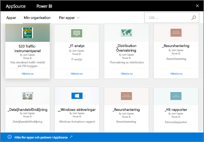

# Introduktion till organisationsinnehållspaket i Power BI
> [!NOTE]
> Du kan inte skapa innehållspaket för organisationen eller installera dem i den nya arbetsyteupplevelsen. Nu är ett bra tillfälle att uppgradera dina innehållspaket till appar, om du inte har börjat ännu. Lär dig [mer om den nya arbetsytan](service-create-the-new-workspaces.md).
> 

Distribuerar du regelbundet rapporter via e-post till ditt team? Prova i stället: Packa upp dina instrumentpaneler, rapporter, Excel-arbetsböcker och datauppsättningar och publicera dem i din grupp som ett *organisationsinnehållpaket*. Det är lätt för ditt team att hitta innehållspaketen du skapar &#151; de finns på AppSource. Eftersom de är en del av Power BI använder de alla funktioner i Power BI, inklusive interaktiv datagranskning, nya visuella objekt, frågor och svar, integrering med andra datakällor och datauppdatering.

Att skapa innehållspaket är inte samma sak som att dela instrumentpaneler eller samarbeta på dem i en arbetsyta. Läs [Hur ska jag samarbeta med och dela instrumentpaneler och rapporter?](service-how-to-collaborate-distribute-dashboards-reports.md) för att välja det bästa alternativet för din situation. 

I AppSource, kan du bläddra eller söka efter innehållspaket som publiceras till hela organisationen, distributioner eller säkerhetsgrupper och till de [Office 365-grupper som du tillhör](https://support.office.com/article/Create-a-group-in-Office-365-7124dc4c-1de9-40d4-b096-e8add19209e9). Om du inte är medlem i en specifik grupp visas inte innehållspaket som delas med den gruppen. Alla medlemmar i gruppen har samma skrivskyddad åtkomst till innehållspaketets data, rapporter, arbetsböcker och instrumentpaneler (om det inte är en datakälla för SQL Server Analysis Services (SSAS), varmed dina behörigheter överförs med datakällan).

Instrumentpaneler, rapporter och Excel-arbetsböcker är skrivskyddade, men du kan kopiera och använda instrumentpaneler och rapporter som utgångspunkt för att skapa din egen anpassade version av innehållspaketet.

> [!NOTE]
> Organisationsinnehållspaket är endast tillgängliga när du och dina kollegor använder [Power BI Pro-licenser](../fundamentals/service-features-license-type.md).
> 
> 

## Vad är *AppSource*?
När du publicerar ett organisationsinnehållspaket läggs detta till på AppSource.  Med den här centraliserade databasen är det enkelt för medlemmar att bläddra till och identifiera instrumentpaneler, rapporter och datauppsättningar som har publicerats för dem.  

* Om du vill visa AppSource väljer du **Hämta data** > **Min organisation** > **Hämta**.

## En organisations innehållspakets livscykel
Alla Power BI Pro användare kan skapa, publicera och komma åt organisationsinnehållspaket. Det är endast skaparen av organisationsinnehållspaketet som kan redigera arbetsboken och datauppsättningen, schemalägga en uppdatering och ta bort den.

Livscykeln ser ut ungefär så här:

1. Nate skapar ett innehållspaket i Power BI Pro och publicerar den i distributionsgruppen Marknadsföring. Uppdateringsinställningarna följer med datauppsättningen och kan bara ändras av Nate.
   
   > [!NOTE]
   > Om Nate skapar innehållspaketet från en [Power BI-arbetsyta](service-create-distribute-apps.md) som han tillhör kan andra personer i Power BI-arbetsytan ta över ägarskapet även om Nate lämnar arbetsytan.
   > 
   > 
2. Nate skickar e-post till distributionsgruppen och informerar dem om det nya innehållspaketet.
3. Jane är medlem i distributionsgruppen Marketing i Power BI Pro och söker efter och ansluter till ett innehållspaket i AppSource. Jane har nu en skrivskyddad kopia. Jane vet att den är skrivskyddad eftersom det i navigeringsfönstret finns en delningsikon till vänster om instrumentpanelens namn och rapportnamnet. Och när Jane väljer instrumentpanelen informeras hon av en låsikon att hon tittar på instrumentpanelen för ett innehållspaket. 
4. Låt oss säga att Jane bestämmer sig för att anpassa den. Jane har nu sin egen kopia av instrumentpanelen och rapporterna. Janes arbete påverkar inte källan, det ursprungliga innehållspaketet eller andra medlemmar i distributionsgruppen. Hon arbetar nu på sin egen kopia av instrumentpanelen och rapporten.
5. Nate gör uppdateringar på instrumentpanelen, och när det är klart publicerar han en ny version av innehållspaketet.
   
   * Julio, en annan medlem i distributionsgruppen har inte anpassat det ursprungliga innehållspaketet. De nya ändringarna tillämpas automatiskt på Julios version av innehållspaketet.  
   * Jane anpassade innehållspaketet. Jane får sedan ett meddelande om att det finns en ny version.  Jane kan gå till AppSource och få det uppdaterade innehållspaketet utan att förlora sin anpassade version. Jane har nu två versioner: den anpassade versionen och det uppdaterade innehållspaketet.
6. Låt oss säga att Nate ändrar säkerhetsinställningarna. Julio och Jane har inte längre åtkomst till innehållet. Eller låt oss säga att de har tagits bort från distributionsgruppen Marknadsföring.
   
   * Julio anpassade inte det ursprungliga innehållspaketet, så innehållet tas bort automatiskt. 
   * Jane anpassade innehållspaketet. Nästa gång Jane öppnar instrumentpanelen har alla paneler från det ursprungliga innehållspaketet försvunnit, men paneler som har fästs från andra rapporter (som Jane fortfarande har behörighet att använda) visas fortfarande. Associerade rapporter och datamängder är inte längre tillgängliga (och visas inte i navigeringsfönstret).
7. Eller också tar Nate bort innehållspaketet.
   
   * Julio anpassade inte det ursprungliga innehållspaketet, så innehållet tas bort automatiskt. 
   * Jane anpassade innehållspaketet. Nästa gång Jane öppnar instrumentpanelen har alla paneler från det ursprungliga innehållspaketet försvunnit, men paneler som har fästs från andra rapporter visas fortfarande. Associerade rapporter och datamängder är inte längre tillgängliga (och visas inte i navigeringsfönstret).

## Datasäkerhet
Alla medlemmar i distributionsgruppen har samma behörighet för data som skaparen av innehållspaketet. Det enda undantaget är SQL Server Analysis Services (SSAS) lokala tabelldatauppsättningar. Eftersom rapporter och instrumentpaneler ansluter till den lokala SSAS-modellen i realtid används autentiseringsuppgifterna för varje enskild medlem i distributionsgruppen för att fastställa vilka data som kan kommas åt.

## Nästa steg
* [Skapa och publicera ett organisationsinnehållspaket](service-organizational-content-pack-create-and-publish.md)
* [Skapa och distribuera en app i Power BI](service-create-distribute-apps.md) 
* [Grundläggande begrepp för designers i Power BI-tjänsten](../fundamentals/service-basic-concepts.md)
* Fler frågor? [Prova Power BI Community](https://community.powerbi.com/)
