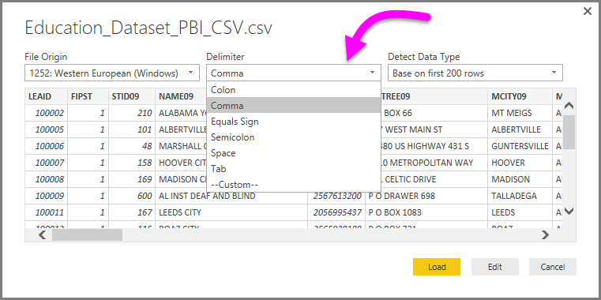

# Ansluta till CSV-filer i Power BI Desktop
Att ansluta till en CSV-fil (*CSV*) från Power BI Desktop liknar ansluta till en Excel-arbetsbok. Båda processer är enkla och den här artikeln visar hur du ansluter till valfri CSV-fil som du har åtkomst till.

Börja med att välja **Hämta data > CSV** från menyfliksområdet **Start** i Power BI Desktop.

Välj din CSV-fil från dialogrutan **Öppna** dialogrutan som visas.

När du väljer **Öppna** hämtar Power BI Desktop filen och anger vissa attribut, till exempel filens ursprung, avgränsartyp och hur många rader som ska användas för att identifiera datatyper i filen.

Dessa filattribut och alternativ visas i listrutan val överst i dialogrutan **CSV-import** dialogruta som visas nedan. Du kan ändra dessa inställningar manuellt genom att välja ett annat alternativ från någon av listrutorna.

När du är nöjd med dina val kan du välja **Hämta** för att importera filen till Power BI Desktop eller **Redigera** för att öppna **frågeredigeraren** och forma eller redigera dina data ytterligare innan du importerar dem.

När du läser in data i Power BI Desktop kan du se tabellen och kolumnerna (som visas som fält i Power BI Desktop) i fönstret **Fält** fönstret längs till höger i rapportvyn i Power BI Desktop.

Det är allt du behöver göra – data från CSV-filen är nu i Power BI Desktop.

Du kan använda data i Power BI Desktop för att skapa visuell information och rapporter eller interagera med andra data som du kanske vill ansluta till och importera, som Excel-arbetsböcker, databaser eller en annan datakälla.

> [!IMPORTANT]
> När du importerar en CSV-file genererar Power BI Desktop en *kolumner=x* (där *x* är antalet kolumner i CSV-filen under den inledande importen) som ett steg i Power Query-redigeraren. Om du senare lägger till fler kolumner och datakällan har konfigurerats för att uppdatera, uppdateras inte det ursprungliga antalet kolumner *x*. 

## Nästa steg
Det finns alla möjliga sorters data du kan ansluta till med Power BI Desktop. Kolla in följande resurser för mer information om datakällor:

* [Vad är Power BI Desktop?](../fundamentals/desktop-what-is-desktop.md)
* [Datakällor i Power BI Desktop](desktop-data-sources.md)
* [Forma och kombinera data i Power BI Desktop](desktop-shape-and-combine-data.md)
* [Anslut till Excel-arbetsböcker i Power BI Desktop](desktop-connect-excel.md)   
* [Ange data direkt i Power BI Desktop](desktop-enter-data-directly-into-desktop.md)   
