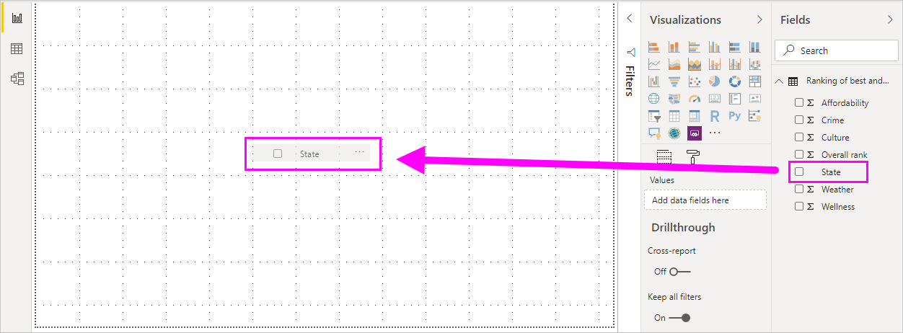

# Ansluta till datakällor i Power BI Desktop

Med Power BI Desktop kan du enkelt ansluta till den ständigt växande världen av data. Om du inte har Power BI Desktop, kan du [hämta](https://go.microsoft.com/fwlink/?LinkID=521662) och installera det.

I Power BI Desktop finns det *många olika typer* av datakällor. Följande bild visar hur du ansluter till data, genom att välja **Hämta data** > **Övrigt** > **Webb**.

## Exempel på anslutning till data

I det här exemplet vi ansluter till en **Webb**datakälla.

Föreställ dig att du går i pension. Du vill bo där solen skiner, skatterna är låga och sjukvården är bra. Eller... Du kanske är dataanalytiker och behöver information för att hjälpa kunderna, till exempel hjälpa din kund som tillverkar regnjackor att hitta områden där det regnar *mycket*.

I båda fallen hittar du en webbresurs som har intressant information om dessa ämnen med mera:

[https://www.bankrate.com/finance/retirement/best-places-retire-how-state-ranks.aspx](https://www.bankrate.com/finance/retirement/best-places-retire-how-state-ranks.aspx)

Välj **Hämta data** > **Övrigt** > **Webb**. Ange adressen i **Från webben**.

När du väljer **OK**, används *Fråge*funktionen i Power BI Desktop. Power BI Desktop kontaktar webbresursen och fönstret **Navigator** returnerar resultatet från den sidan. I det här fallet hittade den en tabell och ett övergripande dokument. Vi vill använda tabellen, så vi väljer den från listan. **Navigerings**fönstret visar en förhandsgranskning.

Du kan nu redigera frågan innan du läser in tabellen genom att välja **Transformera data** längst ned i fönstret eller så kan du läsa in tabellen.

Välj **Transformera data** för att läsa in tabellen och starta Power Query-redigeraren. Fönstret **Frågeinställningar** visas. Om det inte visas väljer du **Visa** i menyfliksområdet och sedan **Frågeinställningar** för att visa fönstret **Frågeinställningar**. Det ser ut så här.

Dessa resultat är text i stället för siffror och vi behöver siffror. Inga problem. Det är bara att högerklicka på kolumnrubriken och välja **Ändra typ**  > **Heltal** för att ändra dem. Om du vill välja fler än en kolumn ska du först markera en kolumn och sedan hålla ned Skift. Välj fler intilliggande kolumner och högerklicka på en kolumnrubrik för att ändra alla valda kolumner. Använd Ctrl för välja kolumner som inte ligger intill varandra.

I **Frågeinställningarna** återspeglar **TILLÄMPADE STEG** de ändringar som har gjorts. När du ändrar ytterligare data, antecknar Power Query-redigeraren ändringarna i området **TILLÄMPADE STEG** som du kan justera, besöka, ändra eller ta bort efter behov.

Ytterligare ändringar i kan fortfarande göras i tabellen efter att den har lästs in, men detta räcker för tillfället. När det är klart väljer du **Stäng & tillämpa** från den **Start**-menyfliksområdet och Power BI Desktop tillämpar våra ändringar och stänger Power Query-redigeraren.

Med datamodellen har lästs in i **Rapportvyn** i Power BI Desktop kan vi börja skapa visualiseringar genom att dra fält till arbetsytan.

Detta är förstås en enkel modell med en enkel dataanslutning. De flesta rapporterna i Power BI Desktop är kopplade till olika datakällor som har anpassats efter dina behov med relationer som skapar en omfattande datamodell.

## Nästa steg
Det finns olika typer av saker som du kan göra med Power BI Desktop. Läs följande resurser för mer information om dess möjligheter:

* [Vad är Power BI Desktop?](../fundamentals/desktop-what-is-desktop.md)
* [Om att använda Frågeredigeraren i Power BI Desktop](../transform-model/desktop-query-overview.md)
* [Datakällor i Power BI Desktop](desktop-data-sources.md)
* [Forma och kombinera data i Power BI Desktop](desktop-shape-and-combine-data.md)
* [Utföra vanliga frågeuppgifter i Power BI Desktop](../transform-model/desktop-common-query-tasks.md)   

Vill du ge oss feedback? Toppen! Använd menyalternativet **Skicka in en idé** i Power BI Desktop eller besök [Feedback från communityn](https://community.powerbi.com/t5/Community-Feedback/bd-p/community-feedback). Vi hoppas att få höra från dig!

