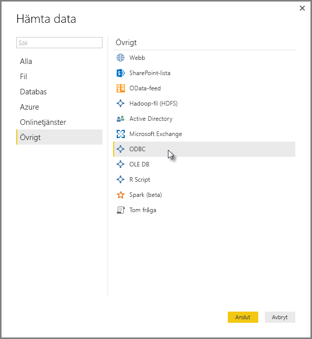
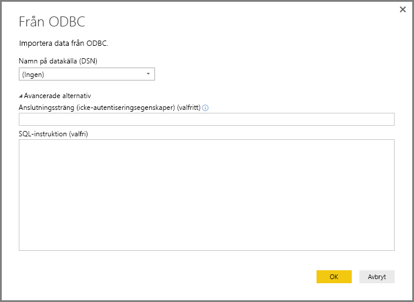
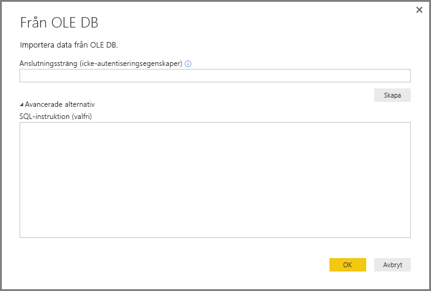
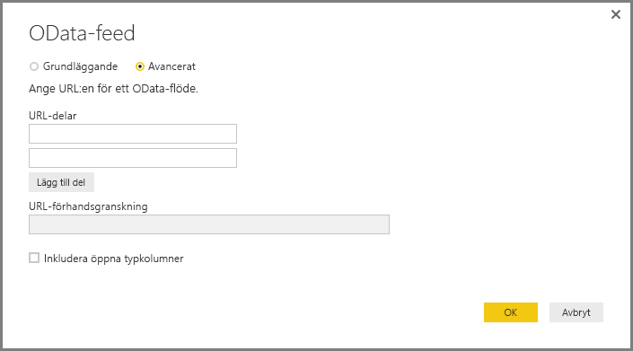
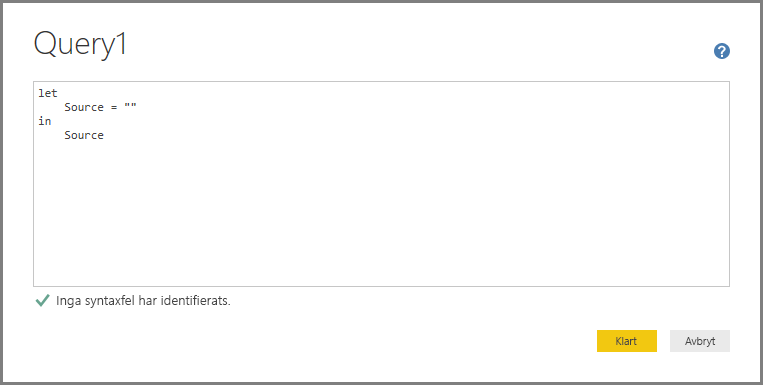
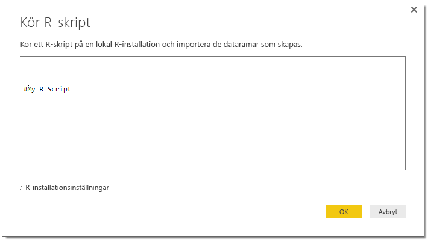

# Ansluta till data med hjälp av generiska gränssnitt i Power BI Desktop 

Du kan ansluta till en mängd olika datakällor i **Power BI Desktop** med hjälp av inbyggda dataanslutningar, från **Access-databaser** till **Zendesk**-resurser, vilket visas i fönstret **Hämta data**. Du kan också ansluta till alla möjliga typer av *andra* datakällor för att ytterligare utöka dina anslutningsmöjligheter, med hjälp av generiska gränssnitt (exempelvis **ODBC** eller **REST API:er**) som är inbyggda i **Power BI Desktop**.

## Power BI Desktop-gränssnitt
**Power BI Desktop** innehåller en ständigt växande samling dataanslutningar som har skapats för att ansluta till en specifik datakälla. Till exempel innehåller dataanslutningen **SharePoint-lista** specifika fält och kompletterande information under anslutningssekvensen som är utformade för **SharePoint-listor**, vilket är fallet med andra datakällor finns i fönstret som visas när du väljer **hämta Data > Fler...**  (visas i föregående bild).

Dessutom kan du ansluta till datakällor som inte har angetts i **Hämta data** med **Power BI Desktop** genom att använda något av följande generiska datagränssnitt:

* **ODBC**
* **OLE DB**
* **OData**
* **REST API:er**
* **R-skript**

Genom att ange lämpliga parametrar i anslutningsfönstren som tillhandahålls av dessa generiska gränssnitt växer antalet datakällor som du har åtkomst till i **Power BI Desktop** avsevärt.

I följande avsnitt hittar du en lista över datakällor som kan användas av dessa allmänna gränssnitt.

Kan du inte hitta datakällan som du vill använda med **Power BI Desktop**? Skicka in din idé till Power BI-teamets [lista över idéer och förfrågningar](https://ideas.powerbi.com/).

## Datakällor som är tillgängliga via ODBC
Med anslutningsappen **ODBC** i **Power BI Desktop** kan du importera data från en ODBC-drivrutin genom att ange en **Namn på datakällan (DSN)** eller en *anslutningssträng*. Som ett alternativ kan du också ange ett SQL-uttryck som ska köras mot ODBC-drivrutinen.

I följande lista beskrivs några exempel på datakällorna som **Power BI Desktop** kan ansluta till med hjälp av ett allmänt **ODBC**-gränssnitt.

| Allmän anslutningsapp för Power BI Desktop | Extern datakälla | Länk till mer information |
| --- | --- | --- |
| ODBC |Cassandra |[Cassandra ODBC-drivrutin](https://www.simba.com/drivers/cassandra-odbc-jdbc/) |
| ODBC |Couchbase DB |[Couchbase och Power BI](https://powerbi.microsoft.com/blog/visualizing-data-from-couchbase-server-v4-using-power-bi/) |
| ODBC |DynamoDB |[DynamoDB ODBC-drivrutin](https://www.simba.com/drivers/dynamodb-odbc-jdbc/) |
| ODBC |Google BigQuery |[BigQuery ODBC-drivrutinen](https://www.simba.com/drivers/bigquery-odbc-jdbc/) |
| ODBC |HBase |[HBase ODBC-drivrutin](https://www.simba.com/drivers/hbase-odbc-jdbc/) |
| ODBC |Hive |[Hbase ODBC-drivrutin](https://www.simba.com/drivers/hive-odbc-jdbc/) |
| ODBC |IBM Netezza |[IBM Netezza-information](https://www.ibm.com/support/knowledgecenter/SSULQD_7.2.1/com.ibm.nz.datacon.doc/c_datacon_plg_overview.html) |
| ODBC |Presto |[Presto ODBC-drivrutin](https://www.simba.com/drivers/presto-odbc-jdbc/) |
| ODBC |Project Online |[Project Online, artikel](desktop-project-online-connect-to-data.md) |
| ODBC |Progress OpenEdge |[Blogginlägg om Progress OpenEdge ODBC-drivrutinen](https://www.progress.com/blogs/connect-microsoft-power-bi-to-openedge-via-odbc-driver) |

## Datakällor som är tillgängliga via OLE DB
Med anslutningsappen **OLE DB** i **Power BI Desktop** kan du importera data från en OLE DB-drivrutin genom att ange en *anslutningssträng*. Som ett alternativ kan du också ange ett SQL-uttryck som ska köras mot OLE DB-drivrutinen.

I följande lista beskrivs några exempel på datakällorna som **Power BI Desktop** kan ansluta till med hjälp av ett allmänt **OLE DB**-gränssnitt.

| Allmän anslutningsapp för Power BI Desktop | Extern datakälla | Länk till mer information |
| --- | --- | --- |
| OLE DB |SAS OLE DB |[SAS Provider för OLE DB](https://support.sas.com/downloads/package.htm?pid=648) |
| OLE DB |Sybase OLE DB |[Sybase Provider för OLE DB](http://infocenter.sybase.com/help/index.jsp?topic=/com.sybase.infocenter.dc35888.1550/doc/html/jon1256941734395.html) |

## Datakällor som är tillgängliga via OData
Med anslutningsappen **OData** i **Power BI Desktop** kan du importera data från **OData** URL genom att skriva eller klistra in webbadressen för **OData**. Du kan lägga till flera webbadressdelar genom att skriva eller klistra in dessa länkar i textrutorna i fönstret **OData Feed**.

I följande lista beskrivs några exempel på datakällorna som **Power BI Desktop** kan ansluta till med hjälp av ett allmänt **OData**-gränssnitt.

| Allmän anslutningsapp för Power BI Desktop | Extern datakälla | Länk till mer information |
| --- | --- | --- |
| OData |Kommer snart |Datakällor med OData kommer snart |

## Datakällor som är tillgängliga via REST API:er
Du kan ansluta till datakällor med hjälp av **REST API:er** och därmed använda data från alla typer av datakällor som stöder **REST**.

I följande lista beskrivs några exempel på datakällorna som **Power BI Desktop** kan ansluta till med hjälp av ett allmänt **REST API**-gränssnitt.

| Allmän anslutningsapp för Power BI Desktop | Extern datakälla | Länk till mer information |
| --- | --- | --- |
| REST API:er |Couchbase DB |[Couchbase REST API-information](https://powerbi.microsoft.com/blog/visualizing-data-from-couchbase-server-v4-using-power-bi/) |

## Datakällor som är tillgängliga via R-skript
Du kan använda **R-skript** för att få åtkomst till datakällor och använda dessa data i **Power BI Desktop**.

I följande lista beskrivs några exempel på datakällorna som **Power BI Desktop** kan ansluta till med hjälp av ett allmänt **R-skript**-gränssnitt.

| Allmän anslutningsapp för Power BI Desktop | Extern datakälla | Länk till mer information |
| --- | --- | --- |
| R-skript |SAS-filer |[Vägledning för R-skript från CRAN](https://cran.r-project.org/doc/manuals/R-data.html) |
| R-skript |SPSS-filer |[Vägledning för R-skript från CRAN](https://cran.r-project.org/doc/manuals/R-data.html) |
| R-skript |R Statistical-filer |[Vägledning för R-skript från CRAN](https://cran.r-project.org/doc/manuals/R-data.html) |

## Nästa steg
Det finns alla möjliga sorters datakällor du kan ansluta till med **Power BI Desktop**. Kolla in följande resurser för mer information om datakällor:

* [Vad är Power BI Desktop?](../fundamentals/desktop-what-is-desktop.md)
* [Datakällor i Power BI Desktop](desktop-data-sources.md)
* [Forma och kombinera data i Power BI Desktop](desktop-shape-and-combine-data.md)
* [Anslut till Excel-arbetsböcker i Power BI Desktop](desktop-connect-excel.md)   
* [Ange data direkt i Power BI Desktop](desktop-enter-data-directly-into-desktop.md)   
