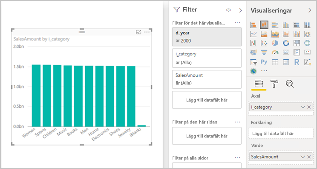

# <a name="troubleshoot-developing-directquery-models-in-power-bi-desktop"></a>Felsöka utveckling av DirectQuery-modeller i Power BI Desktop

Den här artikeln är avsedd för datamodellerare som utvecklar DirectQuery-modeller i Power BI, antingen i Power BI Desktop eller i Power BI-tjänsten. I det här avsnittet beskrivs hur du diagnostiserar prestandaproblem och hur du hämtar mer detaljerad information så att du kan optimera rapporter.

## <a name="performance-analyzer"></a>Prestandaanalyserare

Vi rekommenderar starkt att du låter all diagnostisering av prestandaproblem utgå från Power BI Desktop snarare än Power BI (tjänsten eller en Power BI-rapportserver). Prestandaproblem beror ofta på den underliggande datakällans prestanda, och denna kan enkelt identifieras och diagnostiseras i den mycket mer isolerade miljön i Power BI Desktop, där vissa komponenter (som Power BI-gatewayen) kan elimineras från början. Det är först om du inte hittar några prestandaproblem i Power BI Desktop som du bör gå vidare och undersöka den specifika rapporten i Power BI. [Prestandaanalyseraren](../create-reports/desktop-performance-analyzer.md) är ett användbart verktyg för att identifiera problem under den här processen.

På motsvarande sätt rekommenderar vi att du först försöker isolera problemen till ett enskilt visuellt objekt, istället för till flera visuella objekt på samma sida.

Låt oss säga att du har vidtagit dessa åtgärder (som beskrivs i ovanstående stycken i det här ämnet) – då har vi nu ett enda visuellt objekt på en sida i Power BI Desktop som är fortfarande långsamt. Du kan ta reda på vilka frågor som skickas till den underliggande källan av Power BI Desktop med hjälp av Prestandaanalyseraren. Det är även möjligt att visa spårnings-/diagnostikinformation som kan genereras av den underliggande datakällan. Sådana spår kan också innehålla användbar information om hur frågan har körts, och hur den kan förbättras.

Även i frånvaron av sådana spår från källan kan du visa de frågor som skickats av Power BI, tillsammans med deras körningstider, så som beskrivs nedan.

## <a name="review-trace-files"></a>Granska spårningsfiler

Power BI Desktop loggar som standard händelser under en viss session i en spårningsfil med namnet **FlightRecorderCurrent.trc**.

För vissa DirectQuery-källor innehåller den här loggfilen alla frågor som skickats till den underliggande datakällan (det kan komma stöd för återstående DirectQuery-källor längre fram). Här är källorna som skriver frågor till loggen:

- SQL Server
- Azure SQL Database
- Azure SQL Data Warehouse
- Oracle
- Teradata
- SAP HANA

Du hittar spårningsfilen i **AppData**-mappen för den aktuella användaren: _\\\<Användare>\AppData\Local\Microsoft\Power BI Desktop\AnalysisServicesWorkspaces_

Här är ett enkelt sätt att komma till den här mappen: I Power BI Desktop väljer du _Arkiv > Alternativ och inställningar > Alternativ_ och sedan sidan **Diagnostik**. Följande dialogruta visas:


När du väljer länken **Öppna kraschdump-/spårmappen** under Kraschdump-samling öppnas följande mapp: _\\\<Användare>\AppData\Local\Microsoft\Power BI Desktop\Traces_

Om du går till mappens överordnade mapp ser du mappen som innehåller _AnalysisServicesWorkspaces_, som innehåller en arbetsytemapp för varje öppen instans av Power BI Desktop. Dessa undermappar namnges med ett heltalssuffix, t.ex. _AnalysisServicesWorkspace2058279583_.

I den mappen finns en _\Data_-undermapp som innehåller den aktuella Power BI-sessionens spårningsfil FlightRecorderCurrent.trc. Motsvarande arbetsytemapp tas bort när den associerade Power BI Desktop-sessionen avslutas.

Du kan öppna spårningsfilerna med verktyget SQL Server Profiler, som du kan hämta kostnadsfritt tillsammans med SQL Server Management Studio. Du kan hämta det från [den här platsen](/sql/ssms/download-sql-server-management-studio-ssms?view=sql-server-2017).

När du har laddat ned och installerat SQL Server Management Studio så kör du SQL Server Profiler.


Öppna spårningsfilen så här:

1. Välj _Arkiv > Öppna > Spårningsfil_ i SQL Server Profiler
2. Ange sökvägen till den för tillfället öppna Power BI-sessionens spårningsfil, t.ex.: _\\\<Användare>\AppData\Local\Microsoft\Power BI Desktop\AnalysisServicesWorkspaces\AnalysisServicesWorkspace2058279583\Data_
3. Öppna _FlightRecorderCurrent.trc_

Alla händelser från den aktuella sessionen visas. Ett kommenterat exempel visas nedan, där olika grupper av händelser har markerats. Varje grupp har följande:

- En _Frågan börjar_- och en _Frågan slutar_-händelse, som representerar en DAX-frågas början och slut, och som genererats av gränssnittet (exempelvis från ett visuellt objekt eller efter det att lista med värden i filtergränssnittet har fyllts i)
- Ett eller flera par av _DirectQuery Begin_- och _DirectQuery End_-händelser, som representerar att en fråga skickas till den underliggande datakällan, inom ramen för utvärderingen av DAX-frågan

Observera att flera DAX-frågor kan köras parallellt, så händelser från olika grupper kan interfolieras. ActivityID-värdet kan användas för att avgöra vilka händelser som hör till samma grupp.


Andra kolumner av intresse är följande:

- **TextData:** Textinformation om händelsen. För händelser av typen _Query Begin/End_ är det här DAX-frågan. För händelser av typen _DirectQuery Begin/End_ är det här SQL-frågan som skickas till den underliggande källan. _TextData_-värdet för den valda händelsen visas också i området längst ned.
- **EndTime:** När händelsen slutfördes.
- **Duration:** Varaktigheten i millisekunder som krävs för att köra DAX- eller SQL-frågan.
- **Error:** Anger om ett fel har inträffat, och då visas även händelsen i rött.

Några av de mindre intressanta kolumnerna har gjorts smalare i bilden ovan, så att de intressanta kolumnerna ska synas tydligare.

Den rekommenderade metoden för att samla in en spårning för att diagnosticera potentiella prestandaproblem är följande:

- Öppna en enda Power BI Desktop-session (så att du undviker eventuell förvirring genom att ha flera arbetsytemappar)
- Utför de aktuella åtgärderna i Power BI Desktop. Inkludera några ytterligare åtgärder utöver dessa, så att du kan vara säker på att de intressanta händelserna hamnar i spårningsfilen.
- Öppna SQL Server Profiler och granska spårningen på det sätt som beskrivs ovan. Kom ihåg att spårningsfilen tas bort när du stänger Power BI Desktop. Ytterligare åtgärder i Power BI Desktop visas heller inte omedelbart. Du måste stänga och öppna spårningsfilen igen för att se de nya händelserna.
- Om du håller de enskilda sessionerna rimligt små (tio sekunders åtgärder, snarare än hundratals) gör det lättare att tolka spårningsfilen (och eftersom det finns en gräns för spårningsfilens storlek, så finns det en risk att långa sessioner ökar risken för att tidiga händelser tas bort).

## <a name="understand-queries-sent-to-the-source"></a>Förstå frågor som skickats till källan

I formatet för de frågor som genereras och skickas av Power BI Desktop används underfrågor för var och en av de tabeller i modellen som refereras, där underfrågan definieras av Power Query-frågan. Anta till exempel att du har följande TPC DS-tabeller i relationsdatabas i SQL Server:


Överväg följande visuella objekt och dess konfiguration, och tänk på att måttet **SalesAmount** definieras med följande uttryck:

```dax

SalesAmount = SUMX(Web_Sales, [ws_sales_price] * [ws_quantity])

```



När du uppdaterar det visuella objektet resulterar det i den T-SQL-fråga som visas i nästa stycke. Som du ser finns det tre underfrågor för modelltabellerna **Web_Sales**, **Item** och **Date_dim**. Var och en av tabellerna returnerar samtliga kolumner i modelltabellen, även om det faktiskt bara finns referenser till fyra av kolumnerna i det visuella objektet. De här underfrågorna (nedtonade) är precis Power Query-frågornas definition. När underfrågor används så här påverkas inte prestanda för de datakällor som hittills stöds för DirectQuery. Datakällor som SQL Server optimerar bort referenserna till kolumner som inte används.

En orsak till att det här mönstret används i Power BI är att du kan definiera en Power Query-fråga med ett visst frågeuttryck. Det används alltså i ”befintligt skick” utan någon omskrivning. Observera att de här mönstren innebär att du inte kan använda instruktioner med CTE (vanliga tabelluttryck) eller lagrade procedurer. Du kan inte använda sådana instruktioner i underfrågor.


## <a name="gateway-performance"></a>Gatewayprestanda

Information om att felsöka gatewayprestanda finns i artikeln [Felsöka gatewayer – Power BI](service-gateway-onprem-tshoot.md).

## <a name="next-steps"></a>Nästa steg

Mer information om DirectQuery finns i följande resurser:

- [Använda DirectQuery i Power BI Desktop](desktop-use-directquery.md)
- [DirectQuery-modeller i Power BI Desktop](desktop-directquery-about.md)
- [Vägledning för DirectQuery-modeller i Power BI Desktop](../guidance/directquery-model-guidance.md)
- Har du några frågor? [Fråga Power BI Community](https://community.powerbi.com/)
