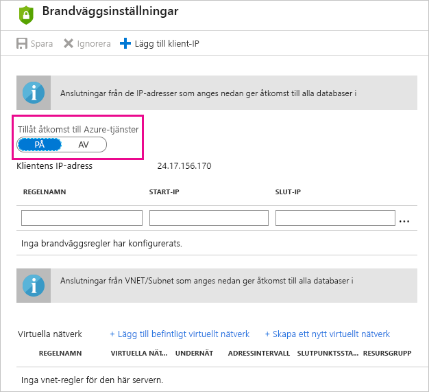

# Felsöka schemalagd uppdatering för Azure SQL-databaser i Power BI

Detaljerad information om uppdatering finns i [Uppdatera data i Power BI](refresh-data.md) och [Konfigurera schemalagd uppdatering](refresh-scheduled-refresh.md).

Om det uppstår ett fel med felkod 400 när du redigerar autentiseringsuppgifter vid konfiguration av schemalagd uppdatering för Azure SQL-databas kan du prova följande för att ange rätt brandväggsregel:

1. Logga in på [Azure Portal](https://portal.azure.com).

1. Gå till den Azure SQL-databas som du konfigurerar uppdateringen för.

1. Längst upp i bladet **Översikt** väljer du **Konfigurera serverns brandvägg**.

1. På bladet **Brandväggsinställningar** ser du till att **Tillåt åtkomst till Azure-tjänster** är angett till **PÅ**.

      

Fler frågor? [Prova Power BI Community](https://community.powerbi.com/)
