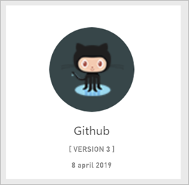
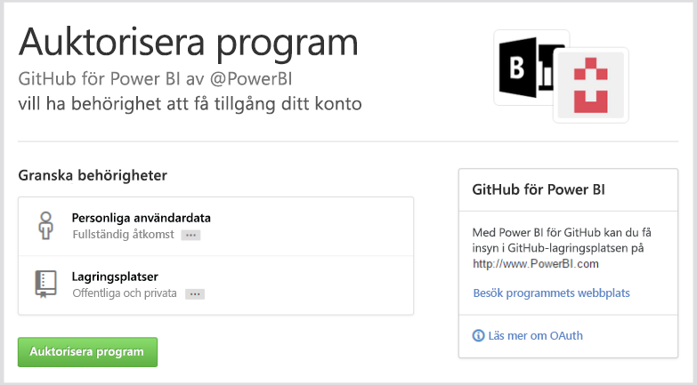
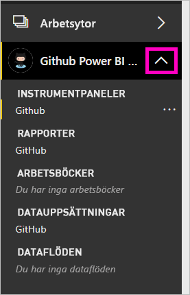
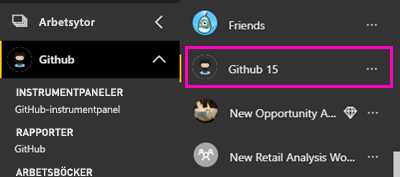
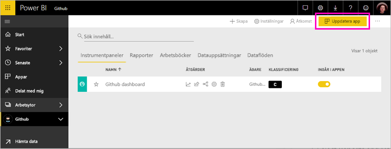

# Ansluta till GitHub med Power BI
Den här artikeln vägleder dig genom att hämta data från ditt GitHub-konto med en Power BI-mallapp. Mallappen genererar en arbetsyta med en instrumentpanel, en uppsättning rapporter samt en datamängd som gör att du kan utforska dina GitHub-data. GitHub-appen för Power BI visar insikter om din GitHub-lagringsplats, som även kallas repo, med data för bidrag, problem, pull-begäranden och aktiva användare.

När du har installerat mallappen kan du ändra instrumentpanelen och rapporten. Sedan kan du distribuera den som en app till kollegor i din organisation.

Anslut till [GitHub-mallappen](https://app.powerbi.com/groups/me/getapps/services/pbi-contentpacks.pbiapps-github) eller läs mer om [GitHub-integrering](https://powerbi.microsoft.com/integrations/github) med Power BI.

Du kan även prova [GitHub-självstudien](service-tutorial-connect-to-github.md). Den installerar verkliga GitHub-data om den offentliga lagringsplatsen för Power BI-dokumentationen.

>[!NOTE]
>Den här mallappen kräver att GitHub-kontot har åtkomst till lagringsplatsen. Mer information om kraven finns nedan.
>
>Den här mallappen stöder inte GitHub Enterprise. 

## Så här ansluter du
[!INCLUDE [powerbi-service-apps-get-more-apps](../includes/powerbi-service-apps-get-more-apps.md)]
   
3. Välj **GitHub** \> **Hämta nu**.
4. I **Installera den här Power BI-appen?** väljer du **Installera**.
4. I fönstret **Appar** väljer du panelen **GitHub**.

    

6. I **Kom igång med din nya app** väljer du **Anslut**.

    

5. Ange lagringsplatsens namn och ägare. Se information om att [hitta parametrarna](#FindingParams) nedan.
   
    

5. Ange dina autentiseringsuppgifter för GitHub (det här steget kan hoppas över om du redan har loggat in med webbläsaren). 
6. Välj **oAuth2** \> **Logga in** som **Autentiseringsmetod**. 
7. Följ autentiseringsskärmarna i GitHub. Ge GitHub för Power BI-mallappen behörighet till GitHub-data.
   
   
   
    Power BI ansluter till GitHub och dina data.  Data uppdateras en gång om dagen. När Power BI har importerat data ser du innehållet på din nya GitHub-arbetsyta.

## Ändra och distribuera appen

Du har installerat GitHub-mallappen. Det innebär att du även har skapat GitHub-arbetsytan. På arbetsytan kan du ändra rapporten och instrumentpanelen och sedan distribuera den som en *app* till kollegor i din organisation. 

1. Välj pilen intill arbetsytans namn i navigeringsfältet. Arbetsytan innehåller en instrumentpanel och en rapport.

    

8. Välj den nya [GitHub-instrumentpanelen](https://powerbi.microsoft.com/integrations/github).    
    

3. Om du vill visa allt innehåll på din nya GitHub-arbetsyta, så välj **Arbetsytor** > **GitHub** i navigeringsfältet.
 
   

    Den här vyn är innehållslistan för arbetsytan. I det övre högra hörnet ser du **Uppdatera app**. När du är redo att distribuera din app till dina kollegor är det där du börjar. 

    

2. Välj **Rapporter** och **Datamängder** för att se de andra elementen på arbetsytan.

    Läs om hur du [distribuerar appar](../collaborate-share/service-create-distribute-apps.md) till dina kollegor.

## Vad som ingår i appen
Följande data finns tillgängliga från GitHub i Power BI:     

| Tabellnamn | Beskrivning |
| --- | --- |
| Bidrag |I bidragstabellen finns totalt antal tillägg, borttagningar och incheckningar som har godkänts av deltagaren, aggregerade per vecka. De 100 främsta deltagarna ingår. |
| Problem |En lista med alla problem för den valda lagringsplatsen med beräkningar som summa och genomsnittlig tid för att stänga ett problem, totalt antal öppna problem och totalt antal stängda problem. Den här tabellen är tom om det inte finns några problem med lagringsplatsen. |
| Pull-begäranden |Den här tabellen innehåller alla pull-begäranden för lagringsplatsen samt vem som hämtade begäran. Den innehåller även beräkningar för hur många öppna, stängda och totala pull-begäranden som finns, hur lång tid det tog för att hämta begärandena och hur lång tid det tog för en genomsnittlig pull-begäran. Den här tabellen är tom om det inte finns några problem med lagringsplatsen. |
| Användare |Tabellen innehåller en lista med GitHub-användare eller deltagare som har bidragit, arkiverat problem eller löst pull-begäranden för den valda lagringsplatsen. |
| Milstolpar |Den innehåller alla milstolpar för valda lagringsplatsen. |
| DateTable |Den här tabellen innehåller datum från i dag och för tidigare år för att du ska kunna analysera dina GitHub-data per datum. |
| ContributionPunchCard |Den här tabellen kan användas som ett stanskort för bidrag på den valda lagringsplatsen. Den visar incheckningar per veckodag och timme. Tabellen är inte ansluten till andra tabeller i modellen. |
| RepoDetails |Den här tabellen innehåller information om den valda lagringsplatsen. |

## Systemkrav
* GitHub-kontot som har åtkomst till lagringsplatsen.  
* Behörighet som beviljats till Power BI för GitHub-appen vid första inloggningen. Se nedan för information om att återkalla åtkomst.  
* Hur många tillräckliga API-anrop som finns tillgängliga för att hämta och uppdatera data.
>[!NOTE]
>Den här mallappen stöder inte GitHub Enterprise.

### Ta bort auktoriseringen för Power BI
Om du vill ta bort auktoriseringen för Power BI från att vara ansluten till GitHub-lagringsplatsen kan du återkalla åtkomsten i GitHub. Mer information finns i avsnittet [GitHub-hjälp](https://help.github.com/articles/keeping-your-ssh-keys-and-application-access-tokens-safe/#reviewing-your-authorized-applications-oauth).

## Hitta parametrar
Du kan se ägare och lagringsplats genom att titta på lagringsplatsen i själva GitHub:

Den första delen ”Azure” är ägare och den andra delen ”azure-sdk-for-php” är själva lagringsplatsen.  Du ser samma två objekt i URL-adressen för lagringsplatsen:

    <https://github.com/Azure/azure-sdk-for-php> .

## Felsökning
Om det behövs kan du verifiera dina autentiseringsuppgifter för GitHub.  

1. Gå till GitHub-webbplatsen i ett nytt webbläsarfönster och logga in på GitHub. Du ser att du är inloggad i det övre högra hörnet på GitHub-webbplatsen.    
2. I GitHub går du till webbadressen för den lagringsplats som du vill ha åtkomst till i Power BI. Exempel: https://github.com/dotnet/corefx.  
3. Tillbaka i Power BI försöker du ansluta till GitHub. I dialogrutan Konfigurera GitHub använder du namnen på lagringsplatsen och lagringsplatsens ägare för samma lagringsplats.  

## Nästa steg

* [Självstudie: Ansluta till en GitHub-lagringsplats med Power BI](service-tutorial-connect-to-github.md)
* [Skapa de nya arbetsytorna i Power BI](../collaborate-share/service-create-the-new-workspaces.md)
* [Installera och använda appar i Power BI](../consumer/end-user-apps.md)
* [Ansluta till Power BI-appar för externa tjänster](service-connect-to-services.md)
* Har du några frågor? [Fråga Power BI Community](https://community.powerbi.com/)
