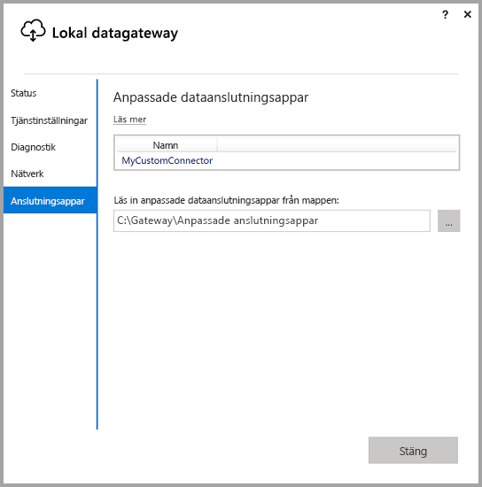
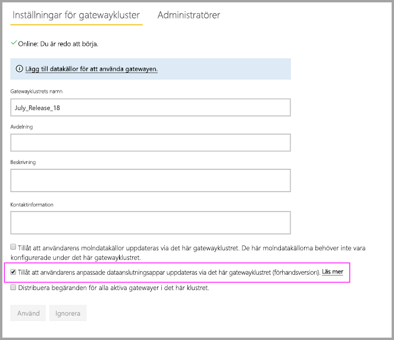

# Använda anpassade dataanslutningar med den lokala datagatewayen

[!INCLUDE [gateway-rewrite](../includes/gateway-rewrite.md)]

Med dataanslutningar för Power BI kan du ansluta till och komma åt data från ett program, en tjänst eller en datakälla. Du kan utveckla anpassade dataanslutningar och använda dem i Power BI Desktop.

Mer information om hur du skapar anpassade dataanslutningar för Power BI finns på [GitHub-sidan för Data Connector SDK](https://aka.ms/dataconnectors). Den här webbplatsen innehåller information och exempel för att komma igång med Power BI och Power Query.

När du skapar rapporter i Power BI Desktop som använder anpassade dataanslutningar kan du använda den lokala datagatewayen för att uppdatera dessa rapporter från Power BI-tjänsten.

## Aktivera och använda den här funktionen

När du installerar versionen av lokal datagateway från juli 2018 eller senare kan du se fliken **Anslutningar** i appen för lokal datagateway. I rutan **Läs in anpassade datakopplingar från mappen** väljer du en mapp som kan nås av användaren som kör gatewaytjänsten. Standardanvändaren är *NT SERVICE\PBIEgwService*. Gatewayen läser automatiskt in de anpassade kopplingsfilerna som finns i den mappen. De visas i listan över dataanslutningar.

Om du använder lokal datagateway (personligt läge) kan du ladda upp Power BI-rapporten till Power BI-tjänsten och använda gatewayen för att uppdatera den.

För den lokala datagatewayen behöver du skapa en datakälla för din anpassade anslutning. När du väljer gatewayklustret på sidan för gatewayinställningar i Power BI-tjänsten bör du se ett alternativ som du kan använda för att tillåta användningen av anpassade anslutningar med klustret. För att det här alternativet ska vara tillgängligt måste uppdateringen för juli 2018 eller en senare uppdatering vara installerad på alla gatewayer i klustret. Välj alternativet för att tillåta användning av anpassade anslutningar med det här klustret.

När det här alternativet är aktiverat visas dina anpassade anslutningar som tillgängliga datakällor som du kan skapa under gatewayklustret. När du har skapat en datakälla som använder den nya anpassade anslutningen kan du uppdatera Power BI-rapporter med hjälp av den anpassade anslutningen i Power BI-tjänsten.

## Överväganden och begränsningar

* Kontrollera att mappen som du skapar är tillgänglig för gatewaytjänsten som körs i bakgrunden. Normalt kan mappar under din användares Windows-mapp eller systemmappar inte nås. Appen för den lokala datagatewayen visar ett meddelande om mappen inte är tillgänglig. Den här instruktionen gäller inte för den lokala datagatewayen (personligt läge).
* För att anpassade anslutningar ska fungera med den lokala datagatewayen måste de implementera ett ”TestConnection”-avsnitt i den anpassade anslutningens kod. Det här avsnittet krävs inte när du använder anpassade anslutningar med Power BI Desktop. Därmed kan du ha en anslutning som fungerar med Power BI Desktop, men inte med gatewayen. Mer information om hur du implementerar ett TestConnection-avsnitt finns i [den här dokumentationen](https://github.com/Microsoft/DataConnectors/blob/master/docs/m-extensions.md#implementing-testconnection-for-gateway-support).
* OAuth för anpassade anslutningsappar via gatewayer stöds för närvarande endast för gateway-administratörer, men inte andra datakällsanvändare.

## Nästa steg

* [Hantera din datakälla – Analysis Services](service-gateway-enterprise-manage-ssas.md)  
* [Hantera din datakälla – SAP HANA](service-gateway-enterprise-manage-sap.md)  
* [Hantera din datakälla – SQL Server](service-gateway-enterprise-manage-sql.md)  
* [Hantera din datakälla – Oracle](service-gateway-onprem-manage-oracle.md)  
* [Hantera din datakälla – Import/schemalagd uppdatering](service-gateway-enterprise-manage-scheduled-refresh.md)
* [Konfigurera proxyinställningar för den lokala datagatewayen](/data-integration/gateway/service-gateway-proxy)
* [Använda Kerberos för enkel inloggning (SSO) från Power BI till lokala datakällor](service-gateway-sso-kerberos.md)  

Fler frågor? Fråga [Power BI Community](https://community.powerbi.com/).
