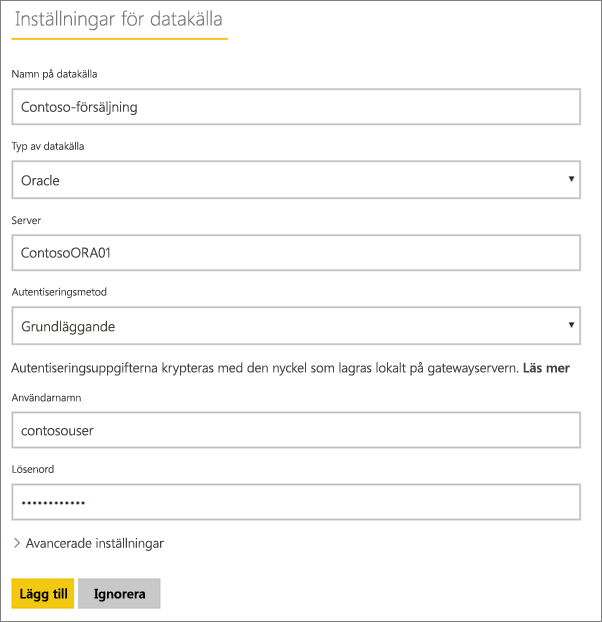
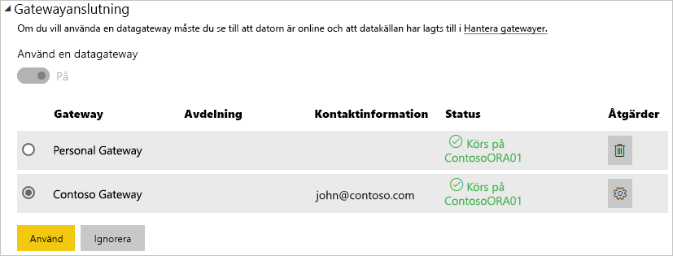

# Hantera din datakälla – Import/schemalagd uppdatering

[!INCLUDE [gateway-rewrite](../includes/gateway-rewrite.md)]

När du har [installerat den lokala datagatewayen](/data-integration/gateway/service-gateway-install) behöver du [lägga till datakällor](service-gateway-data-sources.md#add-a-data-source) som kan användas med gatewayen. Den här artikeln handlar om hur du kan arbeta med gatewayer och datakällor som används för schemalagd uppdatering i stället för DirectQuery- eller live-anslutningar.

## Lägga till en datakälla

Mer information om hur du lägger till en datakälla finns i [Lägga till en datakälla](service-gateway-data-sources.md#add-a-data-source). Välj en typ av datakälla.

Alla typer av datakällor som anges kan användas för schemalagd uppdatering med den lokala datagatewayen. Analysis Services, SQL Server och SAP HANA kan användas för schemalagd uppdatering eller DirectQuery-/live-anslutningar.

Sedan fyller du i informationen för datakällan, inklusive källinformationen och de autentiseringsuppgifter som används för att få åtkomst till datakällan.

> [!NOTE]
> Alla frågor till datakällan körs med dessa autentiseringsuppgifter. Mer information om hur autentiseringsuppgifter lagras finns i [Lagra krypterade autentiseringsuppgifter i molnet](service-gateway-data-sources.md#store-encrypted-credentials-in-the-cloud).

En lista över typer av datakällor som kan användas med schemalagd uppdatering finns i [Lista över tillgängliga typer av datakällor](service-gateway-data-sources.md#list-of-available-data-source-types).

När du har fyllt i allt väljer du **Lägg till**. Nu kan du använda den här datakällan för schemalagd uppdatering med dina lokala data. *Anslutningen lyckades* visas om anslutningen lyckades.

### Avancerade inställningar

Om du vill kan du konfigurera sekretessnivån för datakällan. Den här inställningen styr hur data kan kombineras. Den används endast vid schemalagd uppdatering. Mer information om sekretessnivåer för datakälla finns i [Sekretessnivåer (Power Query)](https://support.office.com/article/Privacy-levels-Power-Query-CC3EDE4D-359E-4B28-BC72-9BEE7900B540).

## Använda datakällan med schemalagd uppdatering

När du har skapat datakällan går den att använda med DirectQuery eller med schemalagd uppdatering.

> [!NOTE]
> Server- och databasnamnen måste överensstämma mellan Power BI Desktop och datakällan i den lokala datagatewayen.

Länken mellan din datauppsättning och datakällan i gatewayen är baserad på servernamnet och databasnamnet. Dessa namn måste matcha. Om du exempelvis anger en IP-adress för servernamnet i Power BI Desktop måste du använda den IP-adressen för datakällan i gatewaykonfigurationen. Om du använder *SERVER\INSTANS* i Power BI Desktop, måste du använda den i den datakälla som konfigureras för gatewayen.

Om du finns med på fliken **Användare** för den datakälla som konfigurerats i gatewayen, och om servernamnet och databasnamnet matchar, visas gatewayen som ett alternativ för användning med schemalagd uppdatering.

> [!WARNING]
> Om datamängden innehåller flera datakällor måste du lägga varje datakälla i gatewayen. Om en eller flera datakällor inte har lagts till i gatewayen visas inte gatewayen som tillgänglig för schemalagd uppdatering.

## Begränsningar

OAuth är inte ett schema för autentiseringsmetoder som stöds med en lokal datagateway. Du kan inte lägga till datakällor som kräver OAuth. Om datamängden har en datakälla som kräver OAuth kan du inte använda gatewayen för schemalagd uppdatering.

## Nästa steg

* [Felsökning av den lokala datagatewayen](/data-integration/gateway/service-gateway-tshoot)
* [Felsöka gatewayer – Power BI](service-gateway-onprem-tshoot.md)

Fler frågor? Testa [Power BI Community](https://community.powerbi.com/).
