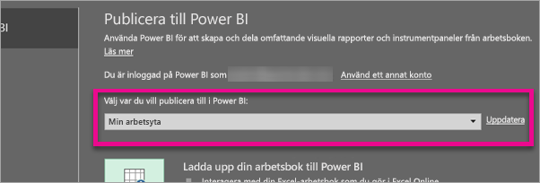
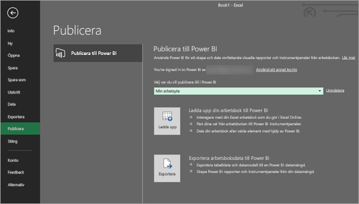
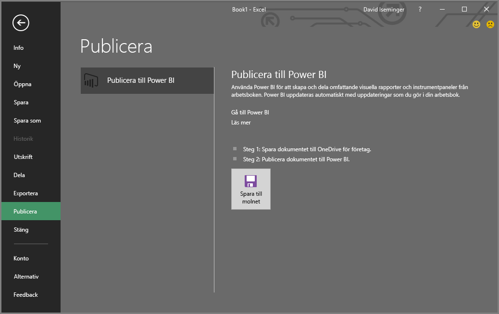

# Publicera till Power BI från Microsoft Excel
Med Microsoft Excel 2016 och nyare kan du publicera dina Excel-arbetsböcker direkt till din [Power BI](https://powerbi.microsoft.com)-arbetsyta, där du kan skapa interaktiva rapporter och instrumentpaneler baserat på data i arbetsboken. Du kan sedan dela dina insikter med andra i din organisation.

När du publicerar en arbetsbok på Power BI finns det några saker att tänka på:

* Du måste använda samma konto för att logga in på Office, OneDrive för företag (om du använder arbetsböcker som sparas där) och Power BI.
* Du kan inte publicera en tom arbetsbok eller en arbetsbok som saknar innehåll som stöds av Power BI.
* Du kan inte publicera krypterade eller lösenordsskyddade arbetsböcker eller arbetsböcker med Information Protection-hantering.
* Publicering till Power BI kräver att modern autentisering är aktiverad (standard). Alternativet Publicera är inte tillgängligt i menyn Arkiv om den är inaktiverad.

## Publicera din Excel-arbetsbok
Om du vill publicera din Excel-arbetsbok i Excel väljer du **Arkiv** > **Publicera** och sedan antingen **Ladda upp** eller **Exportera**.

Om du **Laddar upp** din arbetsbok till Power BI kan du interagera med arbetsboken på samma sätt som du interagerar med Excel Online. Du kan också fästa val från din arbetsbok på Power BI-instrumentpaneler och dela arbetsboken, eller valda delar, via Power BI.

Om du väljer **Exportera**kan du exportera tabelldata och dess datamodell till en Power BI datauppsättning som du sedan kan använda för att skapa Power BI-rapporter och instrumentpaneler.

### Lokal filpublicering
Excel stöder publicering av lokala Excel-filer. De behöver inte sparas till OneDrive för företag eller SharePoint Online.

> [!IMPORTANT]
> Du kan bara publicera lokala filer om du använder Excel 2016 (eller senare) med en prenumeration på Office 365. Fristående versioner av Excel 2016 kan publicera till Power BI, men endast när arbetsboken sparas i OneDrive för företag eller SharePoint Online.
> 

När du väljer **Publicera** kan du välja vilken arbetsyta du vill publicera till. Om din Excel-fil finns på OneDrive för företag kan du bara publicera till din *Min arbetsyta*. Om din Excel-fil finns på en lokal enhet kan du publicera till *Min arbetsyta* eller en delad arbetsyta som du har åtkomst till.

Två alternativ för hur du vill hämta din arbetsbok till Power BI.

När det har publicerats importeras arbetsbokens innehåll som du publicerar till Power BI separat från den lokala filen. Om du vill uppdatera filen i Power BI måste du publicera den uppdaterade versionen igen, eller så kan du uppdatera data genom att konfigurera en schemalagd uppdatering i arbetsboken eller på datauppsättningen i Power BI.

### Publicera från en fristående Excel-installation
När du publicerar från en fristående Excel-installation måste arbetsboken sparas till OneDrive för företag. Klicka på **Spara till molnet** och välj en plats i OneDrive för företag.

När din arbetsbok har sparats till OneDrive för företag kommer du att få två alternativ för hur du vill hämta din arbetsbok till Power BI när du väljer **Publicera** – **Överför** eller **Exportera**:

#### Ladda upp din arbetsbok till Power BI
När du väljer alternativet **Överför** visas arbetsboken i Power BI på samma sätt som den skulle ha gjort i Excel Online. Men till skillnad från i Excel Online har du några alternativ som hjälper dig fästa element från kalkylbladen till instrumentpanelerna.

Du kan inte redigera din arbetsbok i Power BI. Men om du behöver ändra dina data kan du välja **Redigera** och sedan välja att redigera din arbetsbok i Excel Online eller öppna den i Excel på datorn. Alla ändringar du gör sparas i arbetsboken på OneDrive för företag.

När du **överför** skapas inte någon datauppsättning i Power BI. Din arbetsbok visas i Rapporter, i navigeringsfönstret för arbetsytan. Arbetsböcker som har överförts till Power BI har en särskild Excel-ikon som visar att de är överförda Excel-arbetsböcker.

Välj alternativet **Överför** om du enbart har data i kalkylbladen eller om du har pivottabeller och diagram som du vill se i Power BI.

Att använda överföring från Publicera till Power BI i Excel är ganska likt att använda **Hämta data > Fil > OneDrive för företag > Anslut, hantera och visa Excel i Power BI** från Power BI i din webbläsare.

#### Exportera arbetsboksdata till Power BI
När du väljer alternativet **Exportera** exporteras alla data som stöds i tabeller och/eller en datamodell till en ny datauppsättning i Power BI. Om du har några Power View-blad kommer de att skapas igen i Power BI som rapporter.

Du kan fortsätta att redigera din arbetsbok. När ändringarna sparas kommer de att synkroniseras med datauppsättningen i Power BI, vanligtvis inom en timme. Om du behöver fler omedelbara uppdateringar kan du välja **Publicera** igen från Excel så exporteras dina ändringar omedelbart. Dina visualiseringar i rapporter och instrumentpaneler hålls uppdaterade.

Välj alternativet **Publicera** om du har använt Hämta och transformera data eller Power Pivot för att läsa in data i en datamodell, eller om arbetsboken har Power View-blad med visualiseringar som du vill se i Power BI.

Att använda **Exportera** är ganska likt att använda **Hämta data > Fil > OneDrive för företag > Exportera Excel-data till Power BI** från Power BI i din webbläsare.

## Publicera
När du väljer något av alternativen kommer Excel att logga in på Power BI med ditt aktuella konto och sedan publicera din arbetsbok till Power BI-webbplatsen. Du kan övervaka statusfältet i Excel för att se hur publiceringsprocessen fortskrider.

När du är klar kan du gå till Power BI direkt från Excel.

## Nästa steg
[Excel-data i Power BI](service-excel-workbook-files.md)  
Har du fler frågor? [Prova Power BI Community](https://community.powerbi.com/)

