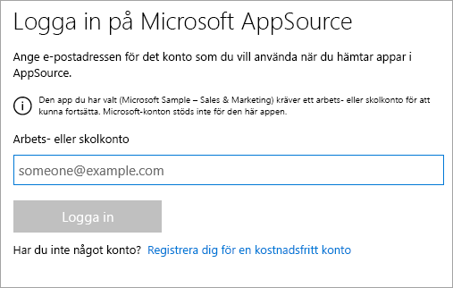
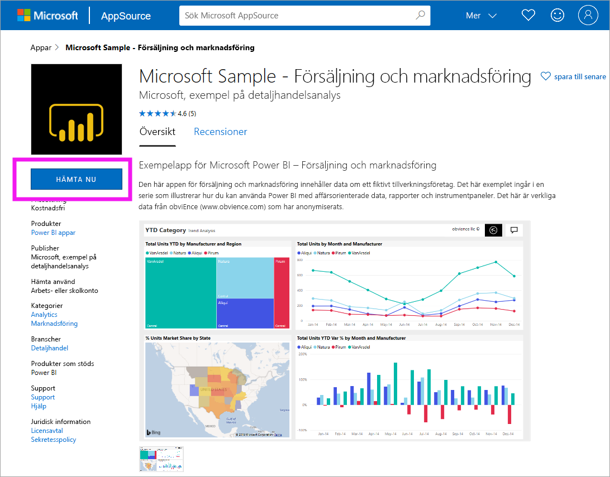
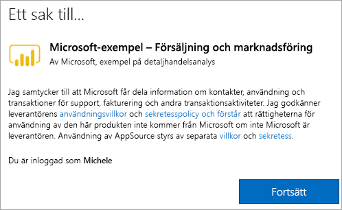
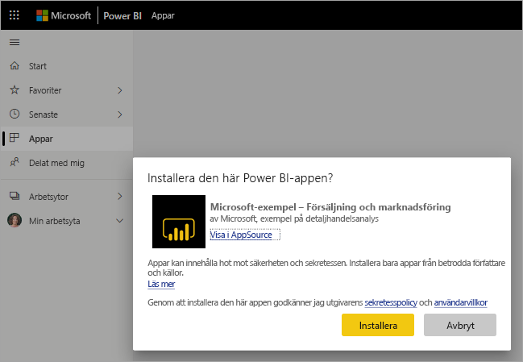

# Installera och använda exempelappen Sales & Marketing i Power BI-tjänsten

[!INCLUDE[consumer-appliesto-yyny](../includes/consumer-appliesto-yyny.md)]

Nu när du har en [grundläggande förståelse för hur du hämtar Power BI-innehåll](end-user-app-view.md) ska vi hämta appen Sales & Marketing från Microsoft AppSource (appsource.com). 

## Microsoft AppSource (appsource.com)
Här är en länk till appen: [Appen Sales & Marketing](https://appsource.microsoft.com/product/power-bi/microsoft-retail-analysis-sample.salesandmarketingsample?tab=Overview). Om du väljer den här länken öppnas hämtningssidan för den här appen på Microsoft AppSource. 

1. Du kan uppmanas att logga in innan du kan hämta appen. Logga in med samma e-postadress som du använder för Power BI. 

    

2. Välj **Hämta nu**. 

    

3. Om det är första gången du loggar in på AppSource måste du godkänna användningsvillkoren. 

    

4. Power BI-tjänsten öppnas. Bekräfta att du vill installera den här appen.

    

5. När appen har installerats visas ett meddelande om att det är klart i Power BI-tjänsten. Välj **Gå till app** för att öppna appen. Beroende på hur designern har skapat appen visas antingen appens instrumentpanel eller appens rapport.

    

    Du kan också öppna appen direkt från din innehållslista för appar genom att markera **Appar** och välja **Försäljning och marknadsföring**.

    

6. Välj om du vill utforska eller anpassa och dela din nya app. Eftersom vi har valt en Microsoft-exempelapp börjar vi med att utforska. 

    

7.  Din nya app öppnas med en instrumentpanel. Appens *designer* skulle ha kunnat konfigurera appen så att den öppnas i en rapport i stället.  

    

## Interagera med instrumentpaneler och rapporter i appen
Ägna en stund åt att utforska data på de instrumentpaneler och i de rapporter som ingår i appen. Du har åtkomst till alla Power BI-standardinteraktioner som filtrering, syntaxmarkering, sortering och detaljinformation.  Är du fortfarande lite osäker på skillnaden mellan instrumentpaneler och rapporter?  Läs [artikeln om instrumentpaneler](end-user-dashboards.md) och [artikeln om rapporter](end-user-reports.md).  

## Nästa steg
* [Gå tillbaka till översikten över appar](end-user-apps.md)
* [Visa en Power BI-rapport](end-user-report-open.md)
* [Andra sätt att dela innehåll med dig](end-user-shared-with-me.md)
