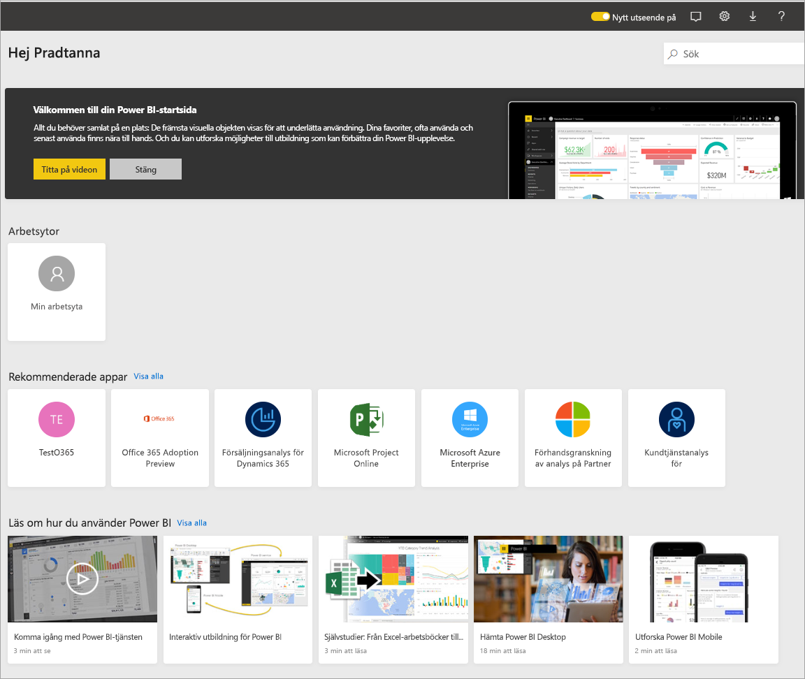
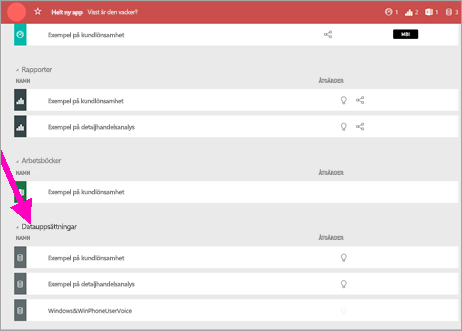
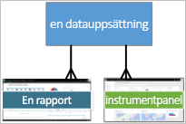
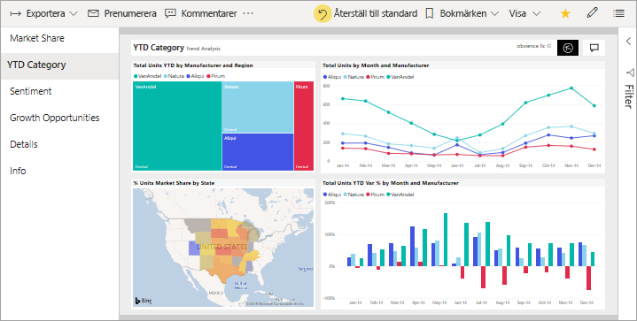
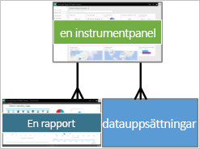
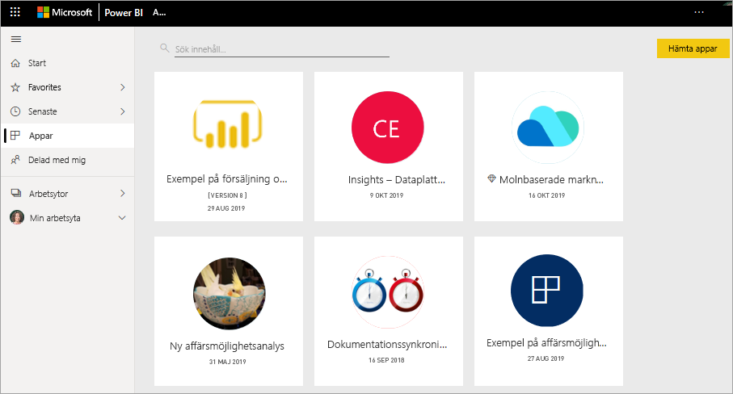
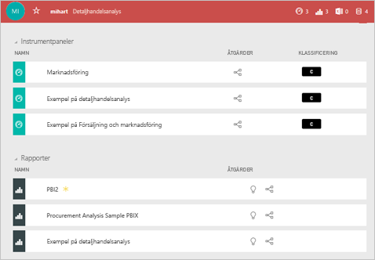

# Grundläggande begrepp för användare av Power BI-tjänsten

[!INCLUDE[consumer-appliesto-ynnm](../includes/consumer-appliesto-ynnm.md)]

[!INCLUDE [power-bi-service-new-look-include](../includes/power-bi-service-new-look-include.md)]

I den här artikeln förutsätts att du redan har läst [översikten över Power BI](../fundamentals/power-bi-overview.md) och har identifierat dig själv som [Power BI **-_användare_** ](end-user-consumer.md). Användare får Power BI-innehåll såsom instrumentpaneler och rapporter från kollegor. Användare använder Power BI-tjänsten, som är den webbplatsbaserade versionen av Power BI.

För att ta emot innehåll från andra behöver du en Power BI Pro-användarlicens eller en Power BI Premium-kapacitetslicens. [Leta reda på din licenstyp](end-user-license.md)

Du kommer utan tvekan att höra talas om ”Power BI Desktop” eller bara ”Desktop”. Det är det fristående verktyget som används av *designers* som skapar och delar instrumentpaneler och rapporter med dig. Det är viktigt att veta att det även finns andra Power BI-verktyg. Om du är användare kommer du bara att arbeta med Power BI-tjänsten. Den här artikeln gäller endast för Power BI-tjänsten.

## Termer och begrepp

Den här artikeln är inte en visuell genomgång av Power BI eller en praktisk självstudie. I stället är den en översiktsartikel som kommer att göra dig bekant med termer och begrepp i Power BI. Här kommer du att lära dig jargongen och hur det ser ut i allmänhet. Gå till [Snabbstart – Navigera i Power BI-tjänsten](end-user-experience.md) för en genomgång av Power BI-tjänsten och dess navigering.

## Öppna Power BI-tjänsten för första gången

De flesta Power BI-användare skaffar Power BI-tjänsten eftersom 1) deras företag köper licenser och 2) en administratör tilldelar licenserna till medarbetare som du.

För att komma igång öppnar du en webbläsare och anger **app.powerbi.com**. Första gången du öppnar Power BI-tjänsten ser det ut ungefär så här:

När du använder Power BI anpassar du det som visas när du öppnar webbplatsen varje gång. Till exempel föredrar vissa att Power BI öppnas på **startsidan**, medan andra har en favoritinstrumentpanel som de vill se först. Oroa dig inte, i den här artikeln får du lära dig hur du kan anpassa din upplevelse.

- [Introduktion till Power BI-start och global sökning](https://powerbi.microsoft.com/blog/introducing-power-bi-home-and-global-search)

- [Aktuella instrumentpaneler i Power BI-tjänsten](end-user-featured.md)

Men innan vi fortsätter ska vi gå tillbaka lite och prata om de byggstenar som utgör Power BI-tjänsten.

_______________________________________________________

## Power BI-innehåll

### Introduktion till byggstenar

För Power BI-användare är de fem byggstenarna: **_visualiseringar_** , **_instrumentpaneler_** , **_rapporter_** , **_appar_** och **_datamängder_** . Dessa kallas ibland *Power BI*- **_innehåll_** . *Innehåll* finns på **_arbetsytor_** . Ett vanligt arbetsflöde inbegriper alla dessa byggstenar: En *Power BI-designer* (gul i diagrammet nedan) samlar in data från *datamängder*, hämtar in dem till Power BI för analys, skapar *rapporter* med *visualiseringar* som visar intressanta fakta och insikter, fäster visualiseringar från rapporter på en instrumentpanel och delar rapporterna och instrumentpanelerna med *användare* som du (svarta i diagrammet nedan). *Designern* delar dem i form av *appar* eller andra typer av delat innehåll.

I dess mest grundläggande form:

-  en **_visualisering_** (eller ett *visuellt objekt*) är en typ av diagram som skapats av en Power BI-*designer*. De visuella objekten visar data från *rapporter* och *datamängder*. Normalt skapar *designers* visuella objekt i Power BI Desktop.

    Mer information finns i [Interagera med visuella objekt i rapporter, instrumentpaneler och appar](end-user-visualizations.md).

-  En *datamängd* är en container med data. Det kan till exempel vara en Excel-fil från Världshälsoorganisationen. Det kan också vara en företagsägd databas över kunder eller en Salesforce-fil.  

-  En *instrumentpanel* är en enskild skärm med interaktiva visuella objekt, texter och bilder. En instrumentpanel samlar in dina viktigaste mått på en skärm för att ge en bild över något eller besvara en fråga. Innehållet på instrumentpanelen kommer från en eller flera rapporter och en eller flera datamängder.

    Mer information finns i [Instrumentpaneler för Power BI-tjänstens användare](end-user-dashboards.md).

-  En *rapport* är en eller flera sidor med interaktiva visuella objekt, text och grafik som tillsammans utgör en enskild rapport. Power BI baserar en rapport på en enda datamängd. Ofta organiserar tjänsten rapportsidorna för att handla om ett viktigt intresseområde eller för att besvara en enskild fråga.

    Mer information finns i [Rapporter i Power BI](end-user-reports.md).

-  En *app* är en metod för *designers* att paketera och dela relaterade instrumentpaneler och rapporter tillsammans. *Användare* får vissa appar automatiskt men kan söka efter andra appar som skapats av kollegor eller av communityn. Till exempel erbjuder externa tjänster som du kanske redan använder, t.ex. Google Analytics och Microsoft Dynamics CRM, också Power BI-appar.

Bara för tydlighetens skull: om du är en ny användare och loggar in i Power BI för första gången, visas inte instrumentpaneler, appar eller rapporter ännu.

_______________________________________________________

## Datauppsättningar

En *datamängd* är en samling data som *designers* importerar eller ansluter till och sedan använder för att skapa rapporter och instrumentpaneler. Som användare kommer du inte att interagera direkt med datamängder, men det är fortfarande bra att förstå syftet med dem.  

Varje datamängd representerar en enskild datakälla. Källan kan exempelvis vara en Excel-arbetsbok på OneDrive, en lokal SQL Server Analysis Services-datamängd i tabellformat eller en Salesforce-datamängd. Power BI har stöd för många olika datakällor.

När en designer delar en app med dig, kan du se vilka datamängder som designern har inkluderat i appen.

En datamängd...

- Kan användas och om igen av en rapportdesigner för att skapa instrumentpaneler och rapporter

- Kan användas för att skapa många olika rapporter

- Visuella objekt från en datamängd kan visas på många olika instrumentpaneler

  

Nu går vi vidare till nästa byggsten – visualiseringar.

_______________________________________________________

## Visualiseringar

Visualiseringar (även kända som visuella objekt) visar insikter som Power BI har upptäckt i aktuella data. Visualiseringar gör det lättare att tolka insikter eftersom hjärnan förstår en bild snabbare än ett kalkylblad med siffror.

Några exempel på de visualiseringar som du stöter på i Power BI är: vattenfallsdiagram, trädkartor, cirkeldiagram, trattdiagram, kort, punktdiagram och mätare:

   

Se den [fullständiga listan över visualiseringar som ingår i Power BI](../power-bi-visualization-types-for-reports-and-q-and-a.md).

Visualiseringar, som även kallas *visuella Power BI-objekt*, finns också tillgängliga från communityn. Om du får en rapport med ett visuellt objekt som du inte känner igen är det sannolikt ett anpassat visuellt objekt. Om du behöver hjälp med att tolka det anpassade visuella objektet, letar du upp namnet på *designern* av rapporten eller instrumentpanelen och kontaktar denne.

En visualisering i en rapport ...

- Kan förekomma flera gånger i samma rapport

- Kan användas på många olika instrumentpaneler

_______________________________________________________

## Rapporter

En Power BI-rapport är en eller flera sidor med visualiseringar, grafik och text. Alla visualiseringar i en rapport kommer från en enda datauppsättning. *Designers* delar rapporter med *användare* som [interagerar med rapporterna i *läsvyn*](end-user-reading-view.md).

En rapport ...

- Kan associeras med flera instrumentpaneler (paneler som är fästade från rapporten kan visas på flera instrumentpaneler).

- Kan skapas med hjälp av data från endast en datamängd  

- Kan ingå i flera appar

  

_______________________________________________________

## Instrumentpaneler

En instrumentpanel representerar en anpassad vy av någon delmängd av de underliggande datamängderna. *Designers* skapar instrumentpaneler och delar dem med *användare*, antingen enskilt eller som en del av en app. En instrumentpanel är en enskild arbetsyta som innehåller *paneler*, grafik och text.

  

En panel är en återgivning av ett visuellt objekt som en *designer* *fäster* på en instrumentpanel, till exempel från en rapport. Varje fäst panel visar en [visualisering](end-user-visualizations.md) som en designer har skapat från en datamängd och som har fästs på instrumentpanelen. En panel kan även innehålla en hel rapportsida och kan innehålla liveuppspelningsdata eller en video. Det finns många sätt som *designers* kan använda för att lägga till paneler på instrumentpaneler. Det finns för många för att vi ska kunna ta upp dem i den här översikten. Läs mer i [Paneler på instrumentpanelen i Power BI](end-user-tiles.md).

Användare kan inte redigera instrumentpaneler. Du kan dock lägga till kommentarer, visa relaterade data, ange en instrumentpanel som favorit, prenumerera med mera.

Vad är syftet med instrumentpaneler?  Här följer några:

- få en överblick över all information som behövs för att fatta beslut

- övervaka den viktigaste informationen om verksamheten

- se till att alla kollegor är på samma sida och ser och använder samma information

- övervaka hälsotillståndet för ett företag, en produkt, en affärsenhet, en marknadsföringskampanj osv.

- för att skapa en anpassad vy av en större instrumentpanel – alla mått som är viktiga för dig

**EN** instrumentpanel ...

- kan visa visualiseringar från många olika datauppsättningar

- kan visa visualiseringar från många olika rapporter

- kan visa visualiseringar som fästs från andra verktyg (t.ex. Excel)

  

_______________________________________________________

## Appar

Dessa samlingar av instrumentpaneler och rapporter organiserar relaterat innehåll tillsammans i ett enda paket. Power BI-*designers* skapar och delar dem med enskilda användare, grupper, en hel organisation eller allmänheten. Som användare kan du vara säker på att du och dina kolleger arbetar med samma data, en enskild betrodd version av sanningen.

> [!NOTE]
> För att använda appar behöver du en Power BI Pro- eller Premium-licens. 

Apparna är enkla att hitta och installera i [Power BI-tjänsten](https://powerbi.com) och på din mobila enhet. När du installerar en app behöver du inte komma ihåg namnen på flera olika instrumentpaneler. De har samlats i en app, i webbläsaren eller på din mobila enhet.

Den här appen har tre relaterade instrumentpaneler och tre relaterade rapporter som utgör en enda app.

Och när appförfattare släpper uppdateringar, så ser du dem automatiskt. Författaren också styr schemat för hur ofta data uppdateras i Power BI. Du behöver inte oroa dig för att hålla den uppdaterad.

Du kan hämta appar på några olika sätt:

- Appdesignern kan installera appen automatiskt på ditt Power BI-konto.

- Appdesignern kan skicka dig en direktlänk till en app.

- Du kan söka efter den i [Microsoft AppSource](https://appsource.microsoft.com/marketplace/apps?product=power-bi), där du hittar alla appar som du kan använda.

I Power BI på din mobila enhet kan du bara installera appar från en direktlänk och inte från AppSource. Om appdesignern installerar appen automatiskt visas den i din lista över appar.

När du har installerat appen behöver du bara välja den i applistan och välja vilken instrumentpanel eller rapport som du vill öppna och utforska först.

Jag hoppas att den här artikeln gav nyttig information om de byggstenar som utgör Power BI-tjänsten för användare.

## Nästa steg

- Granska och bokmärk [ordlistan](end-user-glossary.md)

- Få en [genomgång av Power BI-tjänsten](end-user-experience.md)

- Läs [översikten över Power BI som skrivits särskilt för användare](end-user-consumer.md)

- Titta på en video där Will går igenom de grundläggande begreppen och håller en genomgång av Power BI-tjänsten.

    <iframe width="560" height="315" src="https://www.youtube.com/embed/B2vd4MQrz4M" frameborder="0" allowfullscreen></iframe>
