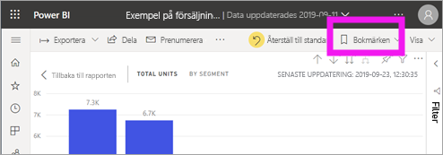
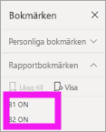
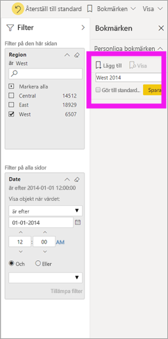
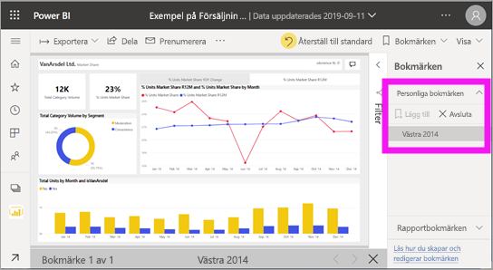
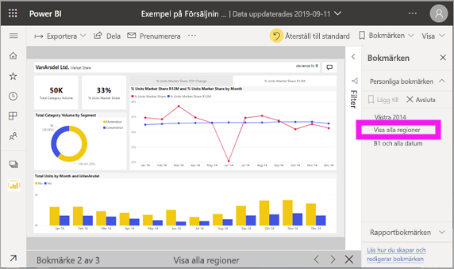

# Vad är bokmärken?

[!INCLUDE [power-bi-service-new-look-include](../includes/power-bi-service-new-look-include.md)]

Bokmärken registrerar den aktuella konfigurerade vyn för en rapportsida, inklusive filter, utsnitt och tillståndet för visuella objekt. När du väljer ett bokmärke går Power BI tillbaka till den vyn. Det finns två typer av bokmärken – sådana som du skapar själv och sådana som skapas av *rapportdesigners*.

## Använda bokmärken för att dela information och skapa artiklar i Power BI 
Bokmärken har många användningsområden. Anta att du upptäcker en intressant insikt och vill bevara den – skapa ett bokmärke så att du kan gå tillbaka senare. Om du behöver göra något annat och vill spara ditt nuvarande arbete kan du skapa ett bokmärke. Du kan dessutom göra ett bokmärke till din standardvy för rapporten så att den vyn av rapportsidan öppnas först varje gång du kommer tillbaka. 

Du kan även skapa en samling bokmärken, ordna dem i valfri ordning och sedan gå igenom varje bokmärke i en presentation och framhäva en serie med insikter som du vill förmedla.  

## Öppna bokmärken
Du kan öppna Bokmärkesfönstret genom att välja **Bokmärken** > **Visa flera bokmärken** på menyraden. Om du vill återgå till den ursprungligen publicerade vyn för rapporten väljer du **Återställ till standard**.

### Rapportbokmärken
Om *rapportdesignern* inkluderade rapportbokmärken finns de under rubriken **Rapportbokmärken**. Den här rapporten har två bokmärken, B1 och B2. 

Välj ett bokmärke för att ändra till den rapportvyn. 

### Personliga bokmärken

När du skapar ett bokmärke sparas följande element med bokmärket:

* Nuvarande sida
* Filter
* Utsnitt, inklusive utsnittstyp (till exempel listruta eller lista) och utsnittstillstånd
* Tillstånd för markering i visuellt objekt (till exempel filtrering för flera markeringar)
* Sorteringsordning
* Riktning för detaljnivån
* Synlighet (för ett objekt med hjälp av fönstret **Val**)
* Fokus- eller **Spotlight**-lägen för synliga objekt

Konfigurera en rapport som du vill att den ska visas i bokmärket. När du har utformat din rapportsida och visuella objekt väljer du **Lägg till** från fönstret **Bokmärken** om du vill lägga till ett bokmärke. I det här exemplet har vi lagt till vissa filter för region och datum. 

**Power BI** skapar ett personligt bokmärke och ger det ett allmänt namn eller ett namn som du anger. Du kan *byta namn på*, *ta bort* eller *uppdatera* ditt bokmärke genom att välja ellipsen intill bokmärkets namn och sedan välja en åtgärd på den meny som visas.

När du har ett bokmärke kan du visa det genom att välja bokmärket i fönstret **Bokmärken**. 

<!--
## Arranging bookmarks
As you create bookmarks, you might find that the order in which you create them isn't necessarily the same order you'd like to present them to your audience. No problem, you can easily rearrange the order of bookmarks.

In the **Bookmarks** pane, simply drag-and-drop bookmarks to change their order, as shown in the following image. The yellow bar between bookmarks designates where the dragged bookmark will be placed.

The order of your bookmarks can become important when you use the **View** feature of bookmarks, as described in the next section. 

-->

## Bokmärken som ett bildspel
Om du vill presentera eller visa bokmärken i ordning väljer du **Visa** i fönstret **Bokmärken** för att starta ett bildspel.

När du är i **visnings**läget finns det några funktioner att observera:

- Namnet på bokmärket visas i namnlisten för bokmärket, som visas längst ned i arbetsytan.
- Namnlistan för bokmärket har pilar som låter dig flytta till nästa eller föregående bokmärke.
- Du kan avsluta **Visnings**läget genom att välja **Avsluta** från rutan **Bokmärken** eller genom att välja **X** som finns i namnlisten för bokmärket.

När du är i **Visningsläget** kan du stänga fönstret **Bokmärken** (genom att klicka på X i det här fönstret) för att ge mer utrymme till presentationen. Medan du är i **Visningsläget** är alla visuella objekt interaktiva och är tillgängliga för korsmarkering, precis som de annars skulle vara när du interagerar med dem. 

<!--
## Visibility - using the Selection pane
With the release of bookmarks, the new **Selection** pane is also introduced. The **Selection** pane provides a list of all objects on the current page and allows you to select the object and specify whether a given object is visible. 

You can select an object using the **Selection** pane. Also, you can toggle whether the object is currently visible by clicking the eye icon to the right of the visual. 

When a bookmark is added, the visible status of each object is also saved based on its setting in the **Selection** pane. 

It's important to note that **slicers** continue to filter a report page, regardless of whether they are visible. As such, you can create many different bookmarks, with different slicer settings, and make a single report page appear very different (and highlight different insights) in various bookmarks.

## Bookmarks for shapes and images
You can also link shapes and images to bookmarks. With this feature, when you click on an object, it will show the bookmark associated with that object. This can be especially useful when working with buttons; you can learn more by reading the article about [using buttons in Power BI](desktop-buttons.md). 

To assign a bookmark to an object, select the object, then expand the **Action** section from the **Format Shape** pane, as shown in the following image.

Once you turn the **Action** slider to **On** you can select whether the object is a back button, a bookmark, or a Q&A command. If you select bookmark, you can then select which of your bookmarks the object is linked to.

There are all sorts of interesting things you can do with object-linked bookmarking. You can create a visual table of contents on your report page, or you can provide different views (such as visual types) of the same information, just by clicking on an object.

When you are in editing mode you can use ctrl+click to follow the link, and when not in edit mode, simply click the object to follow the link. 

## Bookmark groups

Beginning with the August 2018 release of **Power BI Desktop**, you can create and use bookmark groups. A bookmark group is a collection of bookmarks that you specify, which can be shown and organized as a group. 

To create a bookmark group, hold down the CTRL key and select the bookmarks you want to include in the group, then click the ellipses beside any of the selected bookmarks, and select **Group** from the menu that appears.

**Power BI Desktop** automatically names the group *Group 1*. Fortunately, you can just double-click on the name and rename it to whatever you want.

With any bookmark group, clicking on the bookmark group's name only expands or collapses the group of bookmarks, and does not represent a bookmark by itself. 

When using the **View** feature of bookmarks, the following applies:

* If the selected bookmark is in a group when you select **View** from bookmarks, only the bookmarks *in that group* are shown in the viewing session. 

* If the selected bookmark is not in a group, or is on the top level (such as the name of a bookmark group), then all bookmarks for the entire report are played, including bookmarks in any group. 

To ungroup bookmarks, just select any bookmark in a group, click the ellipses, and then select **Ungroup** from the menu that appears. 

Note that selecting **Ungroup** for any bookmark from a group takes all bookmarks out of the group (it deletes the group, but not the bookmarks themselves). So to remove a single bookmark from a group, you need to **Ungroup** any member from that group, which deletes the grouping, then select the members you want in the new group (using CTRL and clicking each bookmark), and select **Group** again. 
-->

## Begränsningar och överväganden
Det finns några begränsningar och saker du bör tänka på för den här versionen av **bokmärken**.

* De flesta anpassade visuella objekt bör fungera väl med bokmärkning. Om du stöter på problem med bokmärkning och ett anpassat visuell objekt, kontaktar du den person som skapat det anpassade visuella objektet och ber dem att lägga till stöd för bokmärken till sina visuella objekt. 
* Om du lägger till ett visuellt objekt på en rapportsida efter att du har skapat ett bokmärke kommer det visuella objektet att visas i sitt standardläge. Det innebär att om du lägger till ett utsnitt på en sida där du tidigare skapade bokmärken så fungerar utsnittet i standardtillståndet.
* Generellt påverkas inte dina bokmärken om *rapportdesignern* uppdaterar eller publicerar rapporten på nytt. Men om designern gör större ändringar i rapporten, till exempel att ta bort fält som används av ett bokmärke, visas ett felmeddelande nästa gång du försöker öppna det bokmärket. 

<!--
## Next steps
spotlight?
-->
