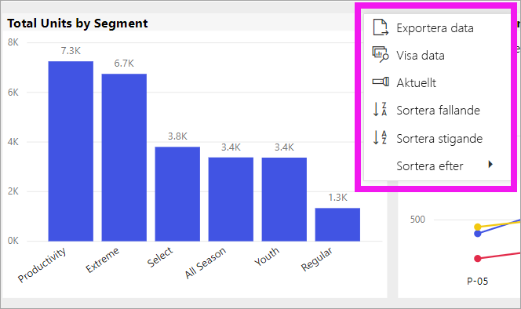

# Ändra hur ett diagram sorteras i en Power BI-rapport

[!INCLUDE [power-bi-service-new-look-include](../includes/power-bi-service-new-look-include.md)]

I Power BI-tjänsten kan du ändra utseendet för ett visuellt objekt genom att sortera det enligt olika datafält. Genom att ändra sorteringen för ett visuellt objekt kan du framhäva den information som du vill förmedla och se till att det visuella objektet speglar trenden på rätt sätt.

Om du använder numeriska data (till exempel försäljningssiffror) eller textdata (till exempel namn på delstater) kan du sortera dina visuella objekt och utforma dem som det passar dig. Power BI ger stor flexibilitet gällande sortering och du kan använda olika snabbmenyer. Välj **Fler åtgärder** (...) för valfritt visuellt objekt och sedan det fält du vill sortera efter.

Du kan inte sortera visuella objekt på en instrumentpanel, men i en Power BI-rapport kan du sortera de flesta visualiseringar alfabetiskt efter namnen på kategorierna i diagrammet eller efter de numeriska värdena i varje kategori. Det här diagrammet är till exempel sorterat efter kategorin **butiksnamn**.

Det är enkelt att ändra sorteringen från en kategori (lagernamn) till ett värde (försäljning per kvadratmeter) i stället.

1. Välj **Fler alternativ** (...) och **Sortera efter försäljning per kvadratfot**.
2. Om det behövs väljer du **Fler alternativ** (...) igen och sedan **Sortera fallande**. Fältet som används för sortering visas i fetstil och med ett gult fält.

   

> [!NOTE]
> Det går inte att sortera alla visuella objekt. Till exempel går det inte att sortera följande visuella objekt: trädkarta, karta, koropletkarta, punktdiagram, mätare, kort och vattenfall.

## Spara dina ändringar av sorteringsordningen
De filter, utsnitt, sorteringar och andra datavisningsändringar som du gör sparas i Power BI-rapporterna. Ändringarna finns alltså kvar om du lämnar rapporten och kommer tillbaka senare.  Om du vill återställa ändringarna till rapportdesignerns inställningar väljer du **Återställ till standard** i det övre menyfältet. 

Om knappen **Återställ till standard** är nedtonad betyder det att rapportdesignern har inaktiverat möjligheten att spara ändringarna.

## Sortera med andra kriterier
Ibland kan du vilja sortera ditt visuella objekt efter ett annat fält (som inte ingår i det visuella objektet) eller något annat villkor.  Du kan t.ex. sortera efter månad (i stället för alfabetisk ordning), eller med heltal i stället för siffra (exempelvis 0, 1, 9, 20 och inte 0, 1, 20, 9).  Rapportdesignern kan uppdatera datamängden för att möjliggöra den här typen av sortering. Du hittar kontaktuppgifter till designern genom att välja rapportnamnet i rubrikfältet.

## Nästa steg
Mer om [Visualiseringar i Power BI-rapporter](end-user-visualizations.md).

[Power BI – grundläggande begrepp](end-user-basic-concepts.md)
