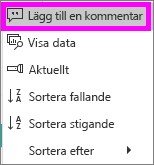

# Lägga till kommentarer i en instrumentpanel eller rapport
Lägg till en personlig kommentar eller starta en konversation rörande en instrumentpanel eller rapport med dina kollegor. **Kommentarsfunktionen** är bara ett exempel på hur en *användare* kan samarbeta med andra. 

## Hur du använder kommentarsfunktionen
Kommentarer kan läggas till en hel instrumentpanel, till enskilda visuella objekt på en instrumentpanel, till en rapportsida och för enskilda visuella objekt på en rapportsida. Lägga till en allmän kommentar eller en kommentar som är riktad mot specifika kollegor.  

När du lägger till en kommentar till en rapport, fångar de aktuella värdena för filter och utsnitt i Power BI. Det innebär att när du markerar eller svara på en kommentar rapportsidan eller visuellt rapportobjekt kan ändras för att visa filtret och utsnittsurval som var aktiva när kommentaren först har lagts till.  

Varför är detta viktigt? Anta att en kollega har använt ett filter som framkommer en intressant insikt som han vill dela med teamet. Kommentaren kan inte vara klokt utan att filtret som valts. 

### Lägg till en allmän kommentar till en instrumentpanel eller rapport
Processer för att lägga till kommentarer i en instrumentpanel eller rapport är liknande. I det här exemplet använder vi en instrumentpanel. 

1. Öppna en Power BI-instrumentpanel eller rapport och välj den **kommentarer** ikon. Då öppnas dialogrutan Kommentarer.

    

    Här ser vi att skaparen av instrumentpanelen redan har lagt till en allmän kommentar.  Alla med åtkomst till instrumentpanelen kan se den här kommentaren.

    

2. Svara genom att välja **Svara**, skriva svaret och välja **Publicera**.  

    

    Som standard dirigerar Power BI ditt svar till de kollegor som startade kommentarstråden, i det här fallet Aaron F. 

    

 3. Om du vill lägga till en kommentar som inte är en del av en befintlig tråd anger du din kommentar i det övre textfältet.

    

    Kommentarerna för den här instrumentpanelen ser nu ut så här.

    

### Lägg till en kommentar till en specifik instrumentpanel eller ett visuellt rapportobjekt
Förutom att lägga till kommentarer till en hel instrumentpanel eller till en hel rapportsida, kan du lägga till kommentarer till enskilda paneler och enskilda rapportvisualiseringar. Processerna som liknar varandra och i det här exemplet använder vi en rapport.

1. Hovra över det visuella objektet och välj ellipsen (...).    
2. Välj **Lägg till en kommentar** i listrutan.

      

3.  Den **kommentarer** dialogrutan öppnas och andra visuella objekt på sidan är nedtonade. Det visuella objektet har inga kommentarer än. 

      

4. Skriv kommentaren och välj sedan **Publicera**.

      

    - I en rapport visar sidan att välja en kommentar som har skapats på ett visuellt objekt, det visuella objektet (se ovan).

    - På en instrumentpanel, diagramikonen  Låt oss veta att en kommentar är knutna till ett specifikt visuellt objekt. Kommentarer som gäller för hela instrumentpanelen har inte en särskild ikon. Att välja diagramikonen visar det relaterade visuella objektet på instrumentpanelen.

        

5. Välj **Stäng** för att återgå till instrumentpanelen eller rapporten.

### Få kollegornas uppmärksamhet genom att använda @-tecknet
Om du skapar en instrumentpanel, rapport, panel eller visual kommentar dra uppmärksamhet för dina kollegor med hjälp av den ”\@” symbol.  När du skriver den ”\@” symbol Powerbi öppnar en listruta där du kan söka efter och välja enskilda användare från din organisation. Alla verifierade namn med \@-tecknet först visas i blått. 

Det här är en konversation jag har med *visualiseringsdesignern*. Han använder @-tecknet för att försäkra sig om att jag ser kommentaren. Jag vet att den här kommentaren är avsedd för mig. När jag öppnar den här appen i Power BI väljer jag **Kommentarer** i rubriken. Vår konversation visas i **kommentarsfönstret**.

  

## Nästa steg
Tillbaka till [visualiseringar för användare](end-user-visualizations.md)    
<!--[Select a visualization to open a report](end-user-open-report.md)-->
