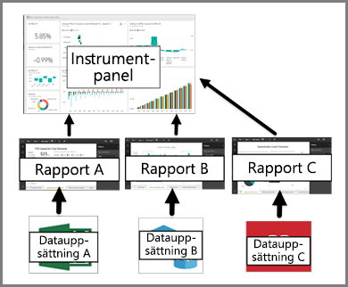

# Instrumentpaneler för de som använder Power BI-tjänsten

En ***instrumentpanel*** i Power BI är en enskild sida, ofta kallad en arbetsyta, som använder sig av visualiseringar för att förmedla ett budskap. Eftersom den är begränsad till en sida, innehåller en väl utformad instrumentpanel endast de viktigaste elementen i detta budskap.

De visualiseringar som visas på instrumentpanelen kallas *paneler* och *Fäst* på instrumentpanelen i rapporten *designers*. I de flesta fall kommer väljer en panel du till sidan där visualiseringen har skapats. Om du är nybörjare på Power BI kan du få en god grund genom att läsa [Grundläggande begrepp i Power BI](end-user-basic-concepts.md).

> [!NOTE]
> Instrumentpaneler kan [visas och delas på mobila enheter](mobile/mobile-apps-view-dashboard.md).
>
> Power BI Pro krävs för att visa en instrumentpanel som har delats med dig.
> 

Visualiseringarna på en instrumentpanel kommer från rapporter och varje rapport baseras på en datauppsättning. Man skulle kunna se på en instrumentpanel som en entré till de underliggande rapporterna och datauppsättningarna. Om du väljer en visualisering tas du till rapporten (och datauppsättningen) som användes för att skapa den.

## Fördelarna med instrumentpaneler
Instrumentpaneler är fantastiska för att övervaka affärsverksamheten, för att leta efter svar och för att få en snabb översikt över era viktigaste mått. Visualiseringarna på en instrumentpanel kan komma från en underliggande datauppsättning eller flera, eller från en underliggande rapport eller flera. En instrumentpanel kan kombinera lokala data och molndata, vilket ger en samlad vy oavsett var dessa data finns.

En instrumentpanel är inte bara en fin bild; Det är interaktiv och panelerna uppdateras när underliggande data ändras.

## Instrumentpaneler kontra rapporter för Power BI-***konsumenter***
Rapporter förväxlas ofta med instrumentpaneler, eftersom de också är arbetsytor fulla av visualiseringar. Men det finns några viktiga skillnader från Power BI-*konsumenters* synpunkt.

| **Kapacitet** | **Instrumentpaneler** | **Rapporter** |
| --- | --- | --- |
| Sidor |En sida |En eller flera sidor |
| Datakällor |En eller flera rapporter och en eller flera datauppsättningar per instrumentpanel |En enskild datauppsättning per rapport |
| Filtrering |Det går inte att filtrera eller dela upp |Det finns många olika sätt att filtrera, markera och dela upp |
| Ställa in avisering |Det går att skapa e-postaviseringar när vissa villkor uppfylls |Nej |
| Aktuella |Det går att ange en instrumentpanel som din ”aktuella” instrumentpanel |Det går inte att skapa en aktuell rapport |
| Det går att visa tabeller och fält från den underliggande datauppsättningen |Nej. Det går att exportera data men tabeller och fält visas inte i själva instrumentpanelen. |Ja. Det går att visa datauppsättningens tabeller, fält och värden. |

## Skapare av instrumentpaneler och konsumenter av instrumentpaneler
Som en Power BI-***konsument*** får du instrumentpaneler från *skapare*. Läs mer om instrumentpaneler i följande avsnitt:

* [Visa en instrumentpanel](end-user-dashboard-open.md)
* Lär dig mer om [panelerna](end-user-tiles.md) och vad som händer när du väljer en.
* Vill du spåra en enskild panel på instrumentpanelen och får ett e-postmeddelande när den når ett visst tröskelvärde? [Skapa aviseringar för paneler](end-user-alerts.md).
* Roa dig med att ställa frågor till instrumentpanelen. Lär dig hur du använder [Power BI:s frågor och svar](end-user-q-and-a.md) för att ställa en fråga om dina data och få ett svar i form av en visualisering.

> [!TIP]
> Om du inte hittade det du söker efter här, kan du använda innehållsförteckningen till vänster.
> 

## Nästa steg
[Visa en instrumentpanel](end-user-dashboard-open.md) 