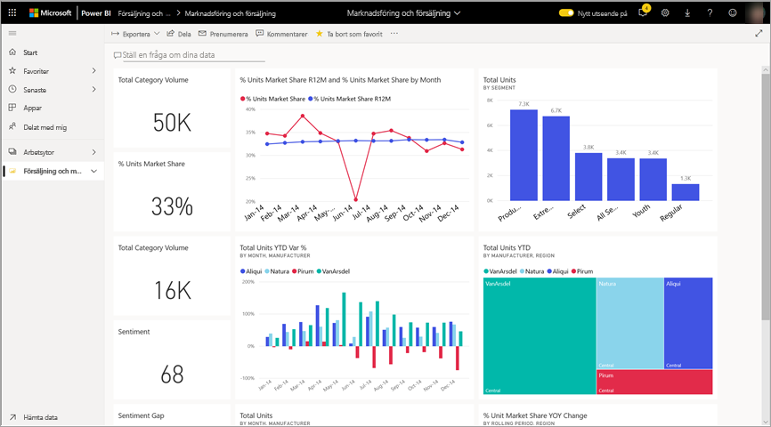
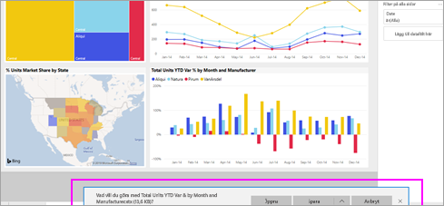

# Exportera data från ett visuellt objekt

[!INCLUDE[consumer-appliesto-yyny](../includes/consumer-appliesto-yyny.md)]

[!INCLUDE [power-bi-service-new-look-include](../includes/power-bi-service-new-look-include.md)]

Om du vill se de data som används i en visualisering [kan du visa dessa data i Power BI](end-user-show-data.md) eller exportera data till Excel. Alternativet att exportera data kräver en viss typ av licens- och redigeringsbehörigheter till innehållet. Kontakta din Power BI-administratör om du inte kan exportera. Export av data kräver en Power BI Pro-licens, en Pro-licens per användare eller en Pro-licens per användare inom en organisation som har en licens för Premium-kapacitetslicens. Den här typen av licens används vanligtvis av raport *designers*, inte *konsumenter*. Mer information finns i [Vilken licens har jag?](end-user-license.md)

## Från en visualisering på en Power BI-instrumentpanel

1. Starta på en Power BI-instrumentpanel. Här ska vi använda instrumentpanelen från exempelappen ***Marknadsföring och försäljning***. Du kan [hämta den här appen frånAppSource.com](https://appsource.microsoft.com/product/power-bi/microsoft-retail-analysis-sample.salesandmarketingsample-preview?flightCodes=e2b06c7a-a438-4d99-9eb6-4324ce87f282).

    

2. Hovra över ett visuellt objekt för att visa **Fler alternativ** (...) och klicka på det för att visa åtgärdsmenyn.

    

3. Välj **Exportera till .csv**.

4. Vad som händer härnäst beror på vilken webbläsare du använder. Du kan uppmanas att spara filen eller så kan en länk till den exporterade filen visas längst ned i webbläsaren. 

    

5. Öppna filen i Excel. 

    > [!NOTE]
    > Om du inte har behörighet till data kan du inte exportera eller öppna filen i Excel.  

    

## Från en visualisering i en rapport
Du kan exportera data från en visualisering i en rapport som .csv- eller .xlsx-format (Excel). 

1. Välj en panel på instrumentpanelen för att öppna den underliggande rapporten.  I det här exemplet väljer vi samma visualisering som ovan, *totalt antal enheter hittills i år var %.* 

    

    Eftersom den här panelen skapades från exempelrapporten *Försäljning och marknadsföring* öppnas den rapporten. Och den öppnas på sidan som innehåller den valda visualiseringen. 

2. Välj visualiseringen i rapporten. Expandera fönstret **Filter** till höger. Den här visualiseringen har tillämpade filter. Mer information om filter finns i [Använda filter i en rapport.](end-user-report-filter.md)

    

3. Välj **Fler alternativ (...)** uppe till höger i visualiseringen. Välj **Exportera data**.

    

4. Du ser alternativ för att exportera sammanfattade data eller underliggande data. Om du använder exempelappen *Försäljning och marknadsföring* inaktiveras **Underliggande data**. Men du kan stöta på rapporter där båda alternativen är aktiverade. Här förklaras skillnaden.

    **Sammanfattade data**: Välj det här alternativet om du vill exportera data för det som för närvarande visas i visualiseringen.  Den här typen av export visar bara de data som använts för att skapa det aktuella tillståndet för visualiseringen. Om visualiseringen har filter tillämpat kommer även de data du exporterar att filtreras. Till exempel, i den här visualiseringen kommer din export endast att innehålla data för 2014 och den centrala regionen, och endast data för fyra av tillverkarna: VanArsdel, Natura, Aliqui och Pirum. Om ditt visuella objekt har aggregeringar (summa, medelvärde osv.) aggregeras även exporten. 
  

    **Underliggande data**: Välj det här alternativet om du vill exportera data för det du ser i visualiseringen **plus** ytterligare data från den underliggande datauppsättningen.  Detta kan omfatta data som finns i datauppsättningen men som inte används i visualiseringen. Om visualiseringen har filter tillämpat kommer även de data du exporterar att filtreras.  Om ditt visuella objekt har aggregeringar (summa, medelvärde osv.) tas aggregeringen bort i exporten (data plattas ut). 

    

5. Vad som händer härnäst beror på vilken webbläsare du använder. Du kan uppmanas att spara filen eller så kan en länk till den exporterade filen visas längst ned i webbläsaren. 

    

    > [!NOTE]
    > Om du inte har behörighet till data kan du inte exportera eller öppna filen i Excel.  

6. Öppna filen i Excel. Jämför mängden data som exporteras med de data som vi exporterade från samma visualiseringen på instrumentpanelen. Skillnaden är att denna export inkluderar **underliggande data**. 

    

## Nästa steg

[Visa de data som används för att skapa ett visuellt objekt](end-user-show-data.md)