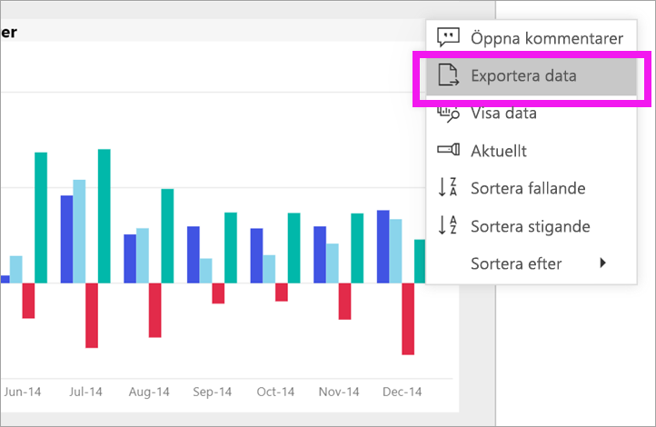

# Exportera data från visual
Om du vill se de data som används för att skapa ett visuellt objekt, [du kan visa dessa data i Power BI](end-user-show-data.md) eller exportera data till Excel. Alternativet att exportera data kräver en viss typ eller licens och redigeringsbehörigheter till innehållet. Om du inte exportera kontakt med Power BI-administratören. 

## Från ett visuellt objekt på en Power BI-instrumentpanel

1. Starta på en Power BI-instrumentpanel. Här använder vi på instrumentpanelen från den ***marknadsföring och försäljning exempel*** app. Du kan [ladda ned den här appen från AppSource.com](https://appsource.microsoft.com/en-us/product/power-bi/microsoft-retail-analysis-sample.salesandmarketingsample-preview?flightCodes=e2b06c7a-a438-4d99-9eb6-4324ce87f282).

    

2. Hovra över ett visuellt objekt att visa ellipserna (...) och klicka för att visa Åtgärd-menyn.

    

3. Välj **exportera till Excel**.

4. Vad som händer härnäst beror på vilken webbläsare du använder. Du kan uppmanas att spara filen eller kan visas en länk till den exporterade filen längst ned i webbläsaren. 

    

5. Öppna filen i Excel.  

    

## Från ett visuellt objekt i en rapport
Du kan exportera data från ett visuellt objekt i en rapport som CSV- eller .xlsx (Excel) format. 

1. Välj en panel för att öppna den underliggande rapporten på en instrumentpanel.  I det här exemplet väljer vi samma visualisering som ovan, *Totalt antal enheter hittills i år Var %* . 

    

    Eftersom den här panelen skapades från den *försäljning och Marknadsföringsexemplet* rapport som är den rapport som öppnas. Och öppnar den sida som innehåller det valda panel visuella objektet. 

2. Välj panelen i rapporten. Observera den **filter** fönstret till höger. Det här visuella objektet har filter som används. Läs mer om filter i [använda filter i en rapport](end-user-report-filter.md).

    

3. Välj ellipserna i det övre högra hörnet i visualiseringen. Välj **exportera data**.

    

4. Alternativ för att exportera Summarized data eller underliggande data visas. Om du använder den *försäljning och marknadsföringsexemplet* app, **underliggande data** kommer att inaktiveras. Men du kan stöta på rapporter där båda alternativen är aktiverade. Här är en förklaring av skillnaden.

    **Sammanfattade data**: Välj det här alternativet om du vill exportera data för det som visas i det visuella objektet.  Den här typen av export visar bara de data som används för att skapa det visuella objektet. Om det visuella objektet har filter som används, kommer de data som du exporterar också filtreras. Till exempel för det här visuella objektet innehåller exporten endast data för 2014 och central region, och endast data för fyra av tillverkarna: VanArsdel, Natura, Aliqui och Prirum.
  

    **Underliggande data**: Välj det här alternativet om du vill exportera data för det som visas i det visuella objektet **plus** ytterligare data från den underliggande datauppsättningen.  Detta kan omfatta data som ingår i datauppsättningen men som inte används i det visuella objektet. 

    

5. Vad som händer härnäst beror på vilken webbläsare du använder. Du kan uppmanas att spara filen eller kan visas en länk till den exporterade filen längst ned i webbläsaren. 

    

7. Öppna filen i Excel. Jämför mängden data som exporteras till de data som vi har exporterat från samma visuella objekt på instrumentpanelen. Skillnaden är att den här exporten innehåller **underliggande data**. 

    

