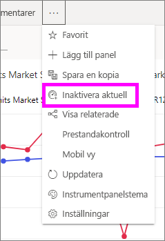

# Aktuella instrumentpaneler i Power BI-tjänsten
## Skapa en aktuell instrumentpanel
Många har en instrumentpanel som de besöker oftare än andra.  Det kan vara instrumentpanelen som du använder för din verksamhet, eller en instrumentpanel som är en sammanslagning av paneler från många olika instrumentpaneler och rapporter.

När du väljer en instrumentpanel som *aktuell* visas den varje gång du öppnar Power BI-tjänsten.  

Du kan även välja ut några instrumentpaneler och ställa in dem som *favorites*. Se [favoritinstrumentpaneler](end-user-favorite.md).

Om du inte har angett en aktuell instrumentpanel ännu öppnas Power BI till den senaste instrumentpanelen som du använde eller till Power BI-start.  

### Ange en instrumentpanel som **aktuell**
Titta på när Amanda skapar en aktuell instrumentpanel och följ sedan anvisningarna under videon för att försöka själv.

<iframe width="560" height="315" src="https://www.youtube.com/embed/G26dr2PsEpk" frameborder="0" allowfullscreen></iframe>

1. Öppna den instrumentpanel som du vill ange som *aktuell*. 
2. I det översta menyfältet väljer du ellipsen (…) och sedan **Ställ in som aktuell**.  
   
    
3. Bekräfta valet.
   
    

## Ändra den aktuella instrumentpanelen
Du kan naturligtvis ange en ny instrumentpanel som den aktuella instrumentpanelen senare.

1. Följ steg 1 och 2 ovan.
   
    
2. Välj **Ställ in som aktuell**. Om du tar bort statusen Aktuell från en instrumentpanel tas den inte bort från din arbetsyta.  
   
    

## Ta bort den aktuella instrumentpanelen
Om du bestämmer dig för att du inte vill att en aktuell instrumentpanel kan du ta bort funktionen så här.

1. Öppna den aktuella instrumentpanelen.
2. I det översta menyfältet väljer du ellipsen (…) och sedan **Inaktivera aktuell**.

    
   
## Nästa steg
[Favoritmarkera en instrumentpanel](end-user-favorite.md)

Har du fler frågor? [Prova Power BI Community](http://community.powerbi.com/)

