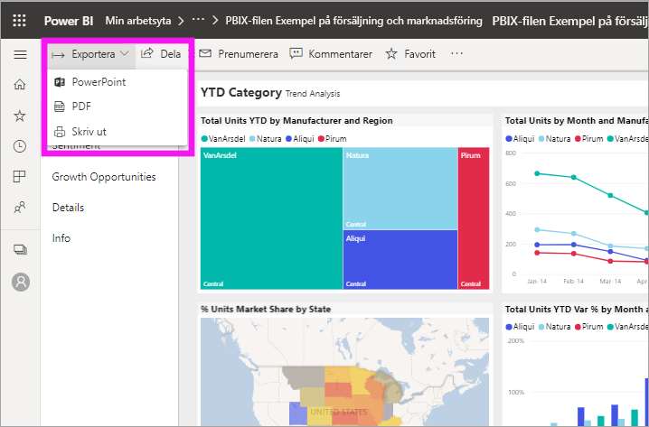

# Exportera rapporter från Power BI till PDF

[!INCLUDE[consumer-appliesto-yyny](../includes/consumer-appliesto-yyny.md)]

[!INCLUDE [power-bi-service-new-look-include](../includes/power-bi-service-new-look-include.md)]

Med Power BI kan du publicera din rapport till PDF-format och enkelt att skapa ett dokument baserat på din Power BI-rapport. När du exporterar till PDF blir varje sida i Power BI-rapporten en separat sida i PDF-dokumentet.

## Exporter din Power BI-rapport till PDF
Välj en rapport i Power BI-tjänsten för att visa den på arbetsytan. Du kan även välja en rapport från **Start**-sidan, **appar** eller någon annan container i navigeringsfönstret.

1. Välj **Exportera** > **PDF** på menyraden.

    

    Ett popup-fönster visas där du kan välja **Aktuella värden** eller **Standardvärden**. Med **Aktuella värden** exporteras rapporten i det aktuella tillståndet, vilket innefattar alla aktiva ändringar som du gjort i utsnitts- och filtervärden. De flesta användare väljer det här alternativet. Alternativt kan du välja **Standardvärden**, vilket exporterar rapporten i dess ursprungliga tillstånd som den hade när *designern* delade den. Inga ändringar som du har gjort av originaltillståndet tas med.
    
    Det finns också en kryssruta för att välja om dolda flikar i en rapport ska exporteras eller inte. Markera den här kryssrutan om du bara vill exportera rapportflikar som är synliga för dig i webbläsaren. Om du föredrar att få med alla dolda flikar i exporten lämnar du kryssrutan avmarkerad. Om kryssrutan är nedtonad finns inga dolda flikar i rapporten. Välj **Exportera** för att fortsätta när du har gjort dina val.
    
    En förloppsindikator visar i det övre högra hörnet. Det kan ta några minuter att exportera. Du kan fortsätta att arbeta i Power BI medan rapporten exporteras.

    

    När det är klart, ändras meddelandebanderollen så att du vet att Power BI-tjänsten har slutfört exportåtgärden.

2. Filen är sedan tillgänglig där din webbläsare visar hämtade filer. I följande bild, visas den som en nedladdningsbanderoll längst ned i webbläsarfönstret.

    

Det är allt. Du kan ladda ned filen och öppna den med ett PDF-visningsprogram, som den som finns i Microsoft Edge.

## Begränsningar och överväganden
Det finns några överväganden och begränsningar som du bör tänka på när du arbetar med funktionen **exportera till PDF**.

* Visuella R-och Python-objekt stöds inte för tillfället. I PDF-filen är dessa visuella objekt tomma och visar ett felmeddelande. 
* Anpassade visuella objekt som har certifierats stöds. Mer information om certifierade anpassade visuella objekt, inklusive hur anpassade visuella objekt certifieras, finns i [certifiera anpassade visuella objekt](../developer/power-bi-custom-visuals-certified.md). Anpassade visuella objekt som inte har certifierats stöds inte. I PDF-filen visas ett felmeddelande för dem.
* Det här visuella ESRI-objektet stöds inte
* Rapporter med mer än 30 rapportsidor kan för närvarande inte exporteras.
* Att exportera rapporten till PDF kan ta några minuter att slutföra, så ha tålamod. Faktorer som kan påverka den tid som krävs är rapportens struktur och den aktuella belastningen på Power BI-tjänsten.
* Om menyobjektet **exportera till PDF** inte finns i Power BI-tjänsten, beror det förmodligen på att din klientadministratör har inaktiverat funktionen. Kontakta din klientadministratör för mer information.
* Bakgrundsbilder beskärs med diagrammets markeringsområdet. Vi rekommenderar att du tar bort bakgrundsbilder innan du exporterar till PDF.
* Rapporter som ägs av en användare utanför din Power BI-klientdomänen som en rapport som ägs av någon utanför organisationen och delas med dig kan inte publiceras till PDF.
* Om du delar en instrumentpanel med någon utanför organisationen och därmed, en användare som inte är i din Power BI-klient, kommer den användaren inte att kunna exportera delade instrumentpanelers associerade rapporter till PDF. Så om du är aaron@contoso.com kan du dela med cassie@cohowinery.com. Men cassie@cohowinery.com kan inte exportera de associerade rapporterna till PDF.
* När du exporterar till PDF med rapporter som innehåller en bakgrundsbild kan du se en förvrängd bild i exporten om du använder alternativen **Normal** eller **Fyll** för **sidbakgrund**. För bästa resultat använder du alternativet **Anpassa** för att undvika problem med ditt exporterade dokument.
* Power BI-tjänsten använder det språk du har i din Power BI-språkinställning som språk för PDF-exporten. Om du vill se eller ange din språkinställning, klicka på kugghjulsikonen  > **Inställningar** > **Allmänt** > **Språk**.
* URL-filter respekteras för närvarande inte när du väljer **Aktuella värden** för exporten.
* Rapporter med ovanliga anpassade sidstorlekar kan ge problem i exportscenarier. För bästa resultat bör du överväga att byta till en standardstorlek för rapporten.
* När du exporterar till PDF så används standardteckensnitt för rapporter med anpassade teckensnitt.
* Vi försöker ge en konsekvent upplevelse, men vi kan inte garantera att den exporterade PDF-filen från Power BI-tjänsten alltid matchar den exporterade PDF-filen från en lokal Power BI Desktop-fil.

## Nästa steg
[Skriva ut en rapport](end-user-print.md)
