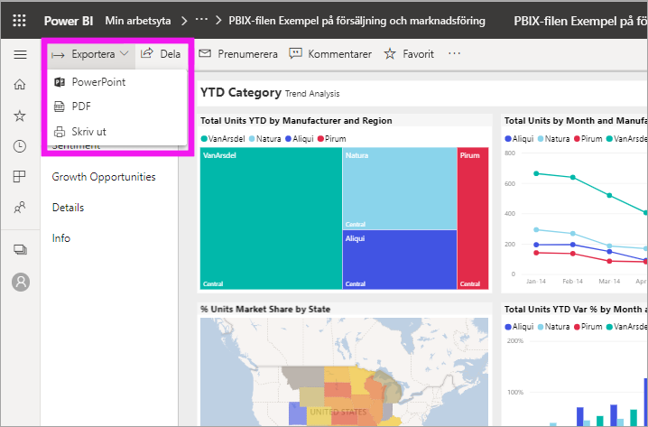
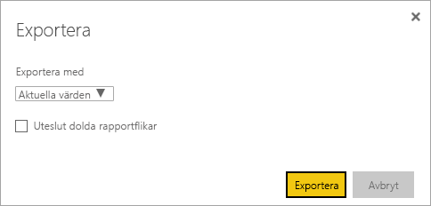

# Exportera rapporter från Power BI till PowerPoint

[!INCLUDE[consumer-appliesto-yyny](../includes/consumer-appliesto-yyny.md)]

[!INCLUDE [power-bi-service-new-look-include](../includes/power-bi-service-new-look-include.md)]

Med Power BI kan du publicera din rapport till Microsoft PowerPoint och enkelt att skapa ett bildspel baserat på din Power BI-rapport. När du exporterar till PowerPoint, inträffar följande:

* Varje sida i Power BI-rapporten blir en enskild bild i PowerPoint.
* Varje sida i Power BI-rapporten exporteras som en högupplöst bild i PowerPoint.
* Du kan bevara filtren och utsnitten du har lagt till i rapporten.
* En länk skapas i PowerPoint som länkar till Power BI-rapporten.

Att få din **Power BI-rapport** exporterad till **PowerPoint** går snabbt. Följ stegen som beskrivs i nästa avsnitt.

## Exportera en Power BI-rapport till PowerPoint
Välj en rapport i **Power BI-tjänsten** för att visa den på arbetsytan. Du kan även välja en rapport från **Start**, **Appar** eller någon annan container i navigeringsfönstret.

När den rapport som du vill exportera till PowerPoint visas på arbetsytan väljer du **Exportera** > **PowerPoint** på menyraden.

Ett popup-fönster visas där du kan välja **Aktuella värden** eller **Standardvärden**. Med **Aktuella värden** exporteras rapporten i det aktuella tillståndet, vilket innefattar alla aktiva ändringar som du gjort i utsnitts- och filtervärden. De flesta användare väljer det här alternativet. Du kan också välja **Standardvärden**, vilket exporterar rapporten i dess ursprungliga tillstånd, som den hade när *designern* delade den. Inga ändringar som du har gjort av originaltillståndet tas med.

> [!NOTE]
> I **Aktuella värden** ingår inte rullningsstatusen för visuella objekt.

 
Det finns också en kryssruta för att välja om dolda flikar i en rapport ska exporteras eller inte. Markera den här kryssrutan om du bara vill exportera rapportflikar som är synliga för dig i webbläsaren. Om du föredrar att få med alla dolda flikar i exporten lämnar du kryssrutan avmarkerad. Om kryssrutan är nedtonad finns inga dolda flikar i rapporten. Ett exempel på en dold flik är en knappbeskrivningsflik. [Anpassade knappbeskrivningar](../desktop-tooltips.md) skapas av *rapportdesigners* och visas inte som rapportflikar för *konsumenter* i Power BI-tjänsten. 

Välj **Exportera** för att fortsätta när du har gjort dina val. Du ser en meddelandebanderoll i det övre högra hörnet i Power BI-tjänstens webbläsarfönster att rapporten exporteras till PowerPoint. Det kan ta några minuter att exportera. Du kan fortsätta att arbeta i Power BI medan rapporten exporteras.

När det är klart, ändras meddelandebanderollen så att du vet att Power BI-tjänsten har slutfört exportåtgärden. Filen är sedan tillgänglig där din webbläsare visar hämtade filer. I följande bild, visas den som en nedladdningsbanderoll längst ned i webbläsarfönstret.

Det är allt. Du kan ladda ned filen, öppna den med PowerPoint och ändra eller förbättra den på samma sätt som andra PowerPoint-presentationer.

## Checka ut din exporterade PowerPoint-fil
När du öppnar PowerPoint-filen som Power BI exporterade, hittar du en del häftiga och användbara element. Ta en titt på följande bild och kolla sedan de numrerade elementen som beskriver några av de smarta funktionerna.

1. Den första sidan i presentationen innehåller namnet på rapporten och en länk så att du kan **visa i Power BI** den rapport som presentationen bygger på.
2. Du får också lite användbar information om rapporten. **Senaste datauppdatering** visar datum och tid som den senaste rapporten baseras på. **Laddades ned** visar datum och tid då Power BI-rapporten exporterades till en PowerPoint-fil.
3. Varje rapportsida är en separat bild som visas i navigeringsfönstret. 
4. Din publicerade rapport återges på det språk som dina Power BI-inställningar anger, eller i annat fall på det språk som anges i webbläsarens språkinställningar. Om du vill se eller ange din språkinställning, klicka på kugghjulsikonen  > **Inställningar** > **Allmänt** > **Språk**. Mer information finns i [Språk och länder eller regioner som stöds för Power BI](../supported-languages-countries-regions.md).

När du går in på en specifik bild, ser du att varje rapportsida är en oberoende bild.

Det är nu upp till dig vad du vill göra med PowerPoint-presentationen eller någon av de högupplösta bilderna.

## Överväganden och felsökning
Det finns några överväganden och begränsningar som du bör tänka på när du arbetar med funktionen **exportera till PowerPoint**.

* Visuella R-och Python-objekt stöds inte för tillfället. Alla sådana visualiseringar exporteras som en tom bild till PowerPoint med ett felmeddelande som säger att visualiseringen inte stöds.
* Visuella Power BI-objekt som har certifierats stöds. Mer information om certifierade anpassade visuella objekt, inklusive hur anpassade visuella objekt certifieras, finns i [certifiera anpassade visuella objekt](../developer/power-bi-custom-visuals-certified.md). Anpassade visuella objekt som inte har certifierats stöds inte. De exporteras som en tom bild till PowerPoint med ett felmeddelande som säger att visualiseringen inte stöds.
* Det här visuella ESRI-objektet stöds inte
* Rapporter med mer än 30 rapportsidor kan för närvarande inte exporteras.
* Visuella objekt med rullningslister exporteras i sitt standardtillstånd. Du ser bara de översta dataraderna i det visuella objektet i PowerPoint. Du kan inte rulla i PowerPoint eftersom objekten är bilder. 
* Att exportera rapporten till PowerPoint kan ta några minuter att slutföra, så ha tålamod. Faktorer som kan påverka den tid som krävs är rapportens struktur och den aktuella belastningen på Power BI-tjänsten.
* Om menyobjektet **exportera till PowerPoint** inte finns i Power BI-tjänsten, beror det förmodligen på att din klientadministratör har inaktiverat funktionen. Kontakta din klientadministratör för mer information.
* Bakgrundsbilder beskärs med diagrammets markeringsområdet. Vi rekommenderar att du tar bort bakgrundsbilder innan du exporterar till PowerPoint.
* Sidor i PowerPoint skapas alltid i 9:16 standardstorlek, oavsett ursprungliga sidstorlekar eller dimensioner i Power BI-rapporten.
* Rapporter som ägs av en användare utanför din Power BI-klientdomänen, som en rapport som ägs av någon utanför organisationen och delas med dig kan inte publiceras till PowerPoint.
* Om du delar en instrumentpanel med någon utanför organisationen och därmed, en användare som inte är i din Power BI-klient, kommer den användaren inte att kunna exportera delade instrumentpanelers associerade rapporter till PowerPoint. Så om du är aaron@contoso.com kan du dela med david@cohowinery.com. Men david@cohowinery.com kan inte exportera de associerade rapporterna till PowerPoint.
* Det är inte säkert att exporten fungerar med äldre PowerPoint-versioner.
* Som tidigare nämnts, exporteras varje rapportsida som en enskild bild i PowerPoint-filen.
* Power BI-tjänsten använder det språk du har i din Power BI-språkinställning som språk för PowerPoint-exporten. Om du vill se eller ange din språkinställning, klicka på kugghjulsikonen  > **Inställningar** > **Allmänt** > **Språk**.
* Klockslaget **Hämtad vid** på omslagsbilden för den exporterade PowerPoint-filen har angetts till datorns tidszon vid tidpunkten för exporten.
* När du exporterar till PPTX så används standardteckensnitt för rapporter med anpassade teckensnitt.
* URL-filter respekteras för närvarande inte när du väljer **Aktuella värden** för exporten.

## Nästa steg
[Skriva ut en rapport](end-user-print.md)
