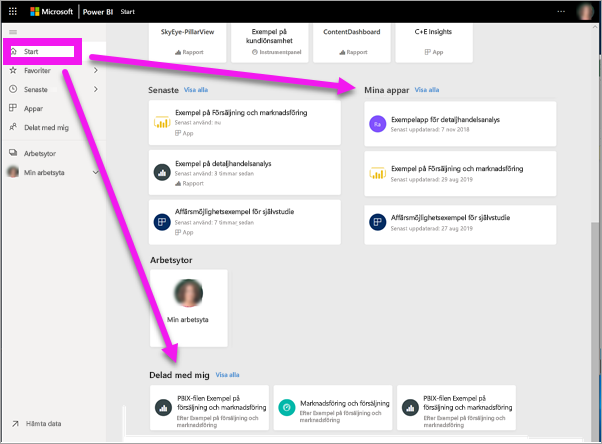
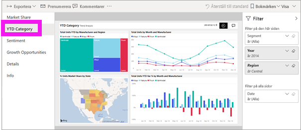
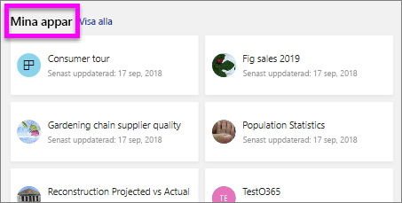
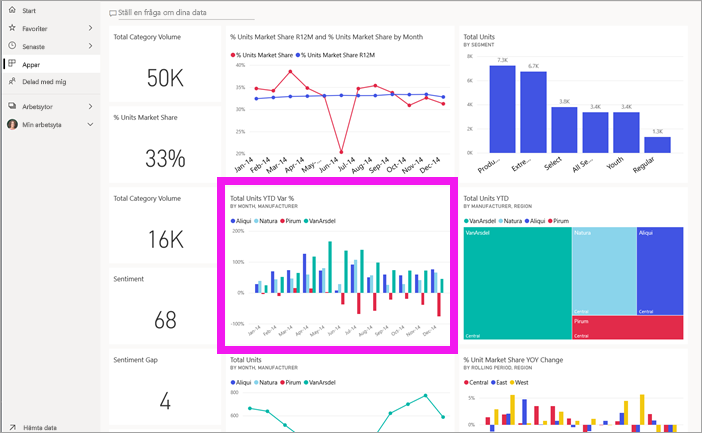

# Visa en rapport i Power BI-tjänsten för *användare*
En rapport är en eller flera sidor med visuella objekt. Rapporter skapas av Power BI-*designer* och [delas med *användare* direkt](end-user-shared-with-me.md) eller som en del av en [app](end-user-apps.md). 

Det finns många olika sätt att öppna en rapport och vi kommer att visa dig två av dem: Öppna från startsidan och öppna från en instrumentpanel. 

<!-- add art-->

## Öppna en rapport från Power BI-start
Nu ska vi öppna en rapport som har delats med dig direkt och sedan öppnar en rapport som har delats som en del av en app.

   

### Öppna en rapport som har delats med dig
Power BI-*designers* kan dela en rapport direkt med dig. Innehåll som delas på detta sätt visas i behållaren **delat med mig** på navigeringsfältet och i avsnittet **delat med mig** på Hem-arbetsytan.

1. Öppna Power BI-tjänsten (app.powerbi.com).

2. I navigeringsfältet väljer du **Hem** för att visa Hem-arbetsytan.  

   
   
3. Rulla nedåt tills du ser **delat med mig**. Leta efter rapportikonen . På den här skärmbilden har vi en instrumentpanel och en *rapport med namnet* försäljnings- och marknadsföringsexempel. 
   
   

4. Öppna rapporten genom att välja *rapportkortet*.

   

5. Observera flikarna längs vänster sida.  Varje flik representerar en *sida* i rapporten. Just nu är sidan för *Tillväxtmöjligheter* öppen. Välj fliken *YTD-kategori* för att öppna rapportsidan i stället. 

   

6. Just nu ser vi hela rapportsidan. Om du vill ändra visningen (zoom) på sidan väljer du listrutan Vy från det övre högra hörnet ( **>** ) och väljer **Faktisk storlek**.

   

   

### Öppna en rapport som är en del av en app
Om du har fått appar från kollegor eller från AppSource, är dessa appar tillgängliga från startsidan och från behållaren **Appar** i navigeringsfältet. En [app](end-user-apps.md) är ett paket med instrumentpaneler och rapporter.

1. Gå tillbaka till startsidan genom att välja **Start** i navigeringsfältet.

7. Rulla nedåt tills du ser **delat med mig**.

   

8. Välj en av apparna för att öppna den. Beroende på vilka alternativ som angetts av appens *designer*, kommer appen att öppnas i en instrumentpanel, en rapport eller en appinnehållslista. Om du väljer appen:
    - öppnas rapporten, allt är klart.
    - öppnas en instrumentpanel, se ***öppna en rapport från en instrumentpanel*** nedan.

## Öppna en rapport från en instrumentpanel
Rapporter kan öppnas från en instrumentpanel. De flesta [paneler](end-user-tiles.md) på instrumentpanelen är *fästa* från rapporter. Om du väljer en panel öppnas rapporten som användes för att skapa panelen. 

1. Välj en panel från en instrumentpanel. I det här exemplet har vi valt kolumndiagramspanelen Totalt antal enheter hittills i år...

    

2.  Den associerade rapporten öppnas. Du märker att vi är på sidan kategori hittills i år. Det är den rapportsidan som innehåller kolumndiagrammet som vi valt från instrumentpanelen.

    

> [!NOTE]
> Inte alla paneler leder till en rapport. Om du väljer en panel som [skapades med Frågor och svar](end-user-q-and-a.md), visas Frågor och svar-skärmen. Om du väljer en panel som [skapades med instrumentpanelens **Lägg till panel**-widget](../service-dashboard-add-widget.md), kan flera saker hända: en video kanske spelas upp, en webbplats öppnas eller annat.  

##  Ännu fler sätt att öppna en rapport
När du börjar bli mer bekväm med att använda Power BI-tjänsten, kommer du att lista ut vilka arbetsflöden som fungerar bäst för dig. Några andra sätt att komma åt rapporter:
- Från navigeringsfönstret med **Favoriter** och **Senaste**    
- Med [Visa relaterade](end-user-related.md)    
- I ett e-postmeddelande när någon [delar med dig](../service-share-reports.md) eller [ställer in en avisering](end-user-alerts.md)    
- Från ditt [Meddelandecenter](end-user-notification-center.md)    
- och mycket mer

## Nästa steg
Det finns [många sätt att interagera med en rapport](end-user-reading-view.md).  Börja att utforska genom att välja varje flik på sidan av rapportarbetsytan.

