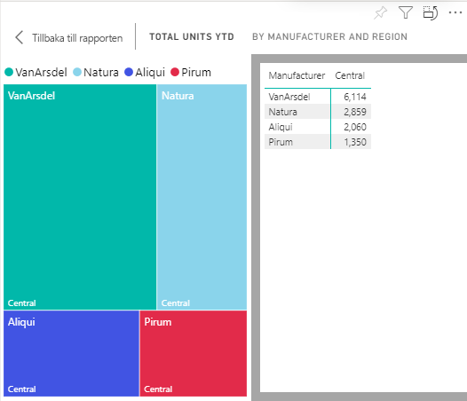

# Visa de data som användes för att skapa det visuella objektet

Ett visuellt Power BI-objekt konstrueras med hjälp av data från underliggande datamängder. Om du är intresserad av att se vad som pågår i bakgrunden, Power BI kan *visa* de data som används för att skapa visualiseringen. När du väljer **Visa data** visar Power BI dessa data under (eller intill) det visuella objektet.

1. I Power BI-tjänsten [öppnar du en rapport](end-user-report-open.md) och väljer ett visuellt objekt.  
2. Om du vill visa bakomliggande data för det visuella objektet väljer du ellipsen (...) och **Visa data**.
   
   
3. Som standard visas data under visualiseringen.
   
   

4. För att välja orientering väljer du lodrät layout  uppe i det högra hörnet på visualiseringen.
   
   

## Nästa steg
[Visuella objekt i Power BI-rapporter](../visuals/power-bi-report-visualizations.md)    
[Power BI-rapporter](end-user-reports.md)    
