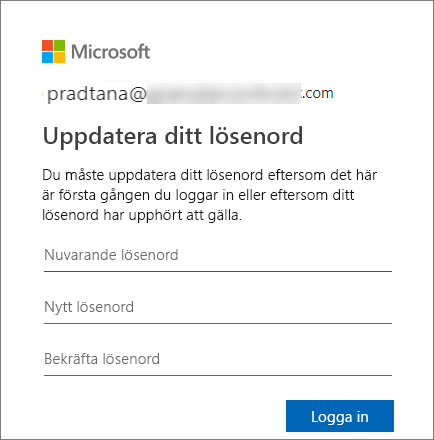
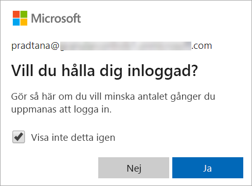
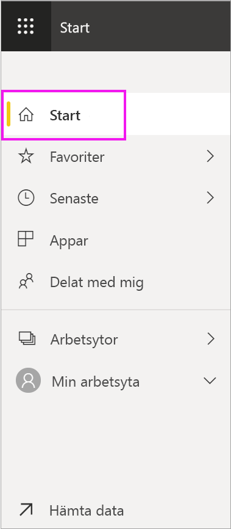

# Logga in på Power BI-tjänsten

## Power BI-konton
Innan du kan logga in på Power BI måste du ha ett konto. Det finns två sätt att skaffa ett Power BI-konto. Den första är när ditt företag köper Power BI-licenser till sina anställda. Och den andra är när användare registrerar sig för kostnadsfria utvärderingsversioner eller personliga licenser. Den här artikeln beskriver det första scenariot.

## Logga in första gången

### Steg 1: Öppna en webbläsare
Power BI-tjänsten körs i en webbläsare.  Så steg ett är att öppna din favoritwebbläsare och skriva **app.powerbi.com**.

### Steg 2: Skriv din e-postadress
Första gången du loggar in måste du ange din e-postadress.  Det ska vara e-postadressen till arbets- eller skol-kontot som du använde när du registrerade dig för Power BI.  

Titta i din inkorg efter ett e-postmeddelande från Power BI-administratören. De flesta administratörer skickar dig ett välkomstmeddelande via e-post med ett tillfälligt lösenord. Använd det här e-postkontot vid inloggningen. 

 
### Steg 3: Skapa ett nytt lösenord
Om Power BI-administratören har skickat dig ett tillfälligt lösenord anger du det i fältet **Aktuellt lösenord**. Om du inte har fått något lösenord i e-posten kontaktar du Power BI-administratören.

Välj **Ja** om du vill att Power BI ska komma ihåg dina autentiseringsuppgifter. 

### Steg 4: Granska din landningssida
Vid ditt första besök öppnas Power BI på din **startsida**. Om **startsidan** inte öppnas kan du välja den i navigeringsfönstret. 

På startsidan visas allt innehåll som du har behörighet att använda. Först kanske det inte finns så mycket innehåll, men oroa dig inte. Det ändras när du börjar använda Power BI tillsammans med dina kollegor. 

Om du inte vill att Power BI ska öppnas på startsidan kan du [ange att en **Aktuell** instrumentpanel eller rapport](end-user-featured.md) ska öppnas i stället. 

## Interagera på ett säkert sätt med innehåll
Som ***konsument*** delar andra innehåll med dig och du interagerar med det innehållet för att utforska data och fatta affärsbeslut.  När du filtrerar, gör utsnitt, exporterar och ändra storlek behöver du inte oroa dig – ditt arbete påverkar inte den underliggande datauppsättningen eller det ursprungliga delade innehållet (instrumentpaneler och rapporter). Power BI är ett säkert utrymme där du kan utforska och experimentera. Det betyder inte att du inte kan spara dina ändringar – det kan du. Men de ändringarna påverkar bara **din** vy över innehållet. Och att återgå till den ursprungliga standardvyn är lika enkelt som att klicka på en knapp.

## Logga ut från Power BI-tjänsten
När du stänger eller logga ut från Power BI sparas dina ändringar så att du kan fortsätta direkt där du slutade.

Om du vill stänga Power BI stänger du den webbläsarflik där du arbetar. 

 

Om du delar en dator rekommenderar vi att du loggar ut varje gång du stänger Power BI.  Logga ut genom att gå till det övre högra hörnet markera profilbilden och välja **Logga ut**. Annars stänger du bara webbläsarfliken när du är klar.

 

## Felsökning och överväganden
- Om du har registrerat dig för Power BI som användare loggar du inte med den e-postadress du använde vid registreringen.

- Vissa personer använder Power BI med mer än ett konto. I så fall uppmanas du att välja ett konto från en lista när du loggar in. 

## Nästa steg
[Visa en Power BI-app](end-user-app-view.md)
