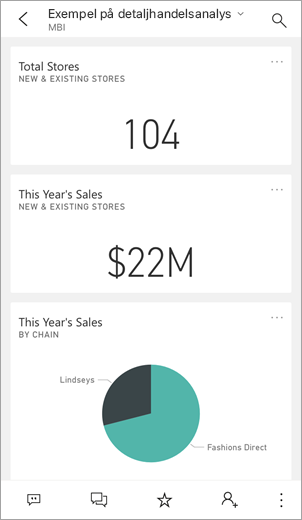
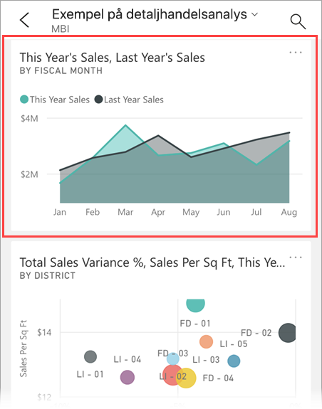
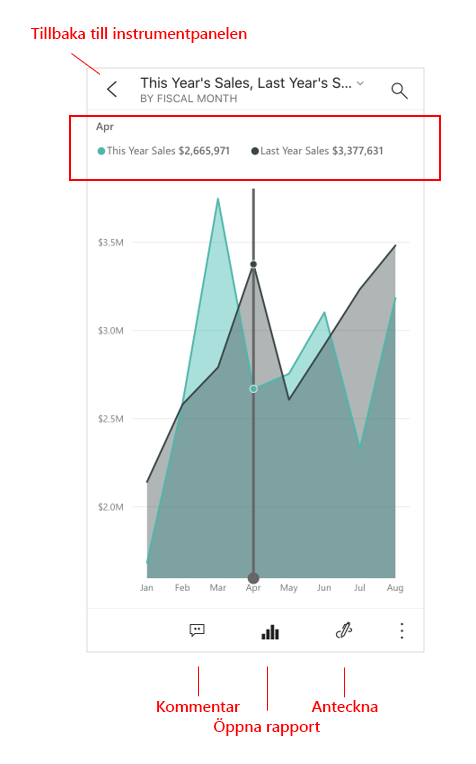
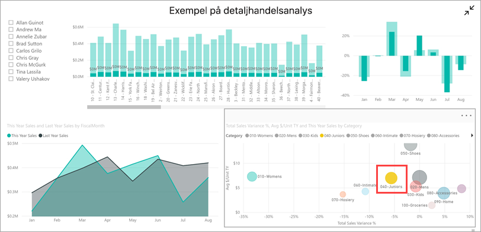
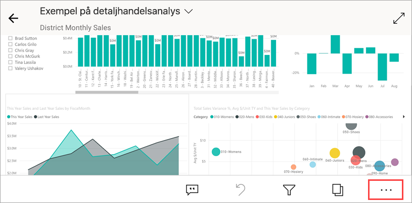
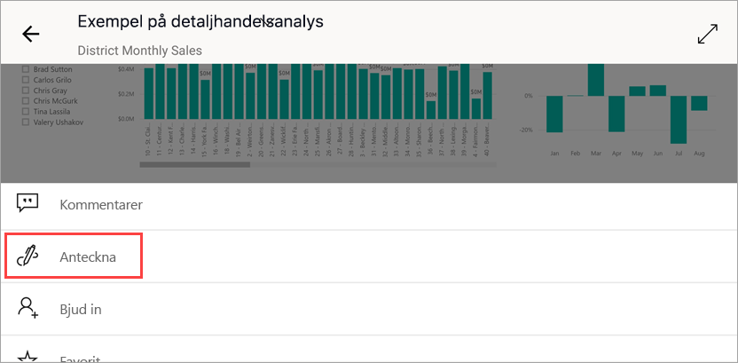
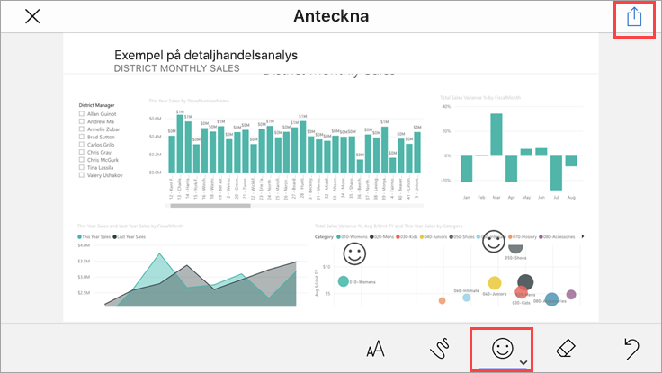
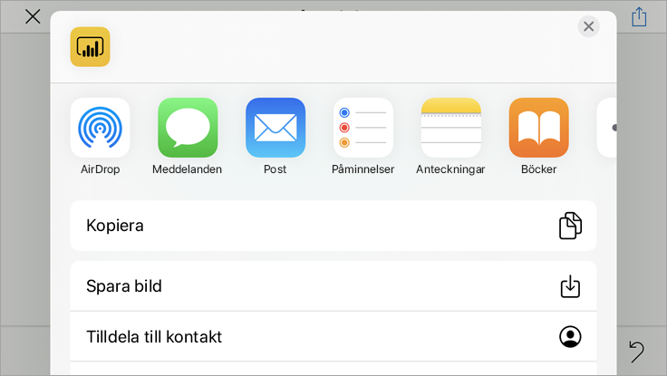
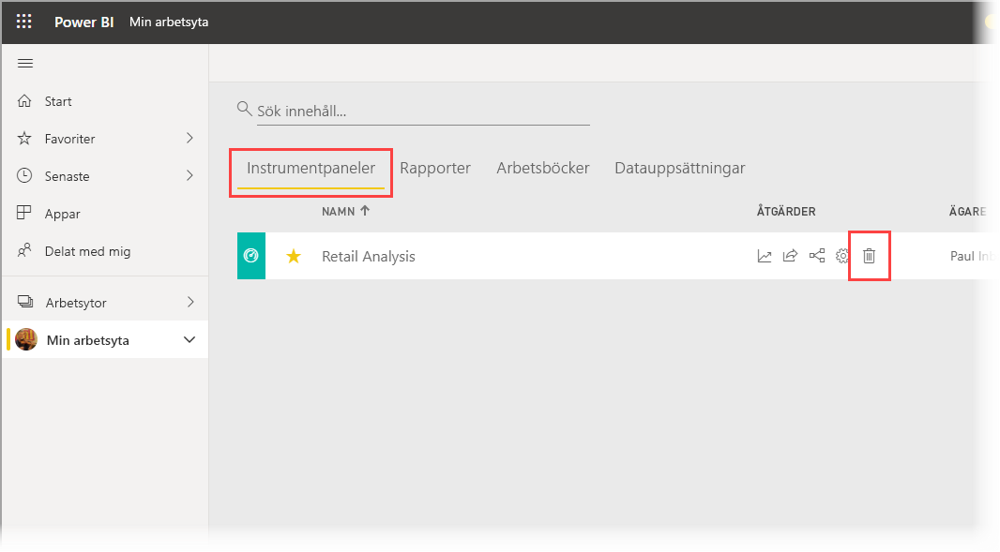
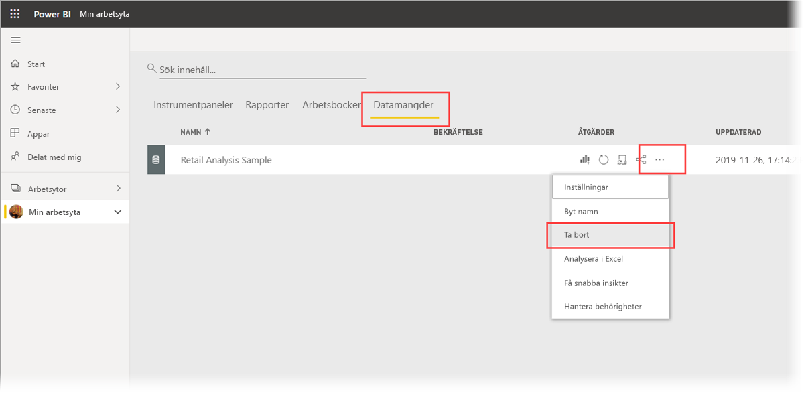

# Snabbstart: Utforska instrumentpaneler och rapporter i Power BI-mobilappar
I den här snabbstarten får du en snabbtur om Power BI-mobilappen och utforskar ett exempel på en instrumentpanel och en rapport. Power BI-appen för iOS visas, men du kan enkelt följa med på andra enheter.

Gäller för:

|  |  |  |  |
|:--- |:--- |:--- |:--- |
| iPhone | iPad | Android | Windows 10 |

>[!NOTE]
>Stöd för Power BI-mobilappen för **telefoner som använder Windows 10 Mobile** kommer att upphöra den 16 mars 2021. [Läs mer](https://go.microsoft.com/fwlink/?linkid=2121400)

En instrumentpanel är en portal till ditt företags livscykel och processer. Det är en enskild plats där du har översikt över verksamheten. Rapporter är interaktiva vyer över dina data med visuell information som representerar olika resultat och insikter från dessa data. 

## Förutsättningar

* **Registrera dig för Power BI**: Om du inte har registrerat dig för Power BI [registrerar du dig för en kostnadsfri utvärderingsversion](https://app.powerbi.com/signupredirect?pbi_source=web) innan du börjar.
* **Installera Power BI-appen för din enhet**: Ladda ned Power BI-mobilappen** från [App Store](https://apps.apple.com/app/microsoft-power-bi/id929738808) (iOS) eller [Google Play](https://play.google.com/store/apps/details?id=com.microsoft.powerbim&amp;amp;clcid=0x409) (Android).
* **Ladda ned Exempel på detaljhandelsanalys**: Det första steget i den här snabbstarten är att ladda ned exemplet på detaljhandelsanalys i Power BI-tjänsten. [Lär dig hur du laddar ned ett exempel](./mobile-apps-download-samples.md) till ditt Power BI-konto för att komma igång. Kom ihåg att välja Exempel på detaljhandelsanalys.

När du har slutfört kraven och laddat ned Exempel på detaljhandelsanalys till ditt Power BI-konto är du redo att påbörja den här snabbturen.

## Visa en instrumentpanel på din mobila enhet
1. På din enhet öppnar du Power BI-appen och loggar in med autentiseringsuppgifterna för ditt Power BI-konto, samma som du använde i Power BI-tjänsten i webbläsaren.
 
1. Tryck nu på **Arbetsytor**-ikonen , välj **Mina arbetsytor** och tryck sedan på Exempel på detaljhandelsanalys för att öppna det.

    
   
    Power BI-instrumentpaneler ser lite annorlunda ut på din mobila enhet än vad de gör i Power BI-tjänsten. Alla paneler visas med samma bredd och de är placerade efter varandra uppifrån och ned.

5. Tryck på stjärnikonen  i verktygsfältet längst ned för att göra den här instrumentpanelen till favorit. När du skapar en favorit i mobilappen blir den en favorit i Power BI-tjänsten och vice versa.

6. Bläddra nedåt och tryck på det ifyllda linjediagrammet Årets försäljning, förra årets försäljning.

    

    Det öppnas i fokusläge.

7. I fokusläge trycker du på **Apr** i diagrammet. Värdena för april visas överst i diagrammet.

    

8. Knacka på rapportikonen  längst ned på skärmen (på Android-enheter kan det vara överst på skärmen). Rapporten relaterad till den här ikonen öppnas i liggande läge.

    

9. Tryck på den gula bubblan 040 – Juniors i bubbeldiagrammet. Observera att relaterade värden markeras i de andra diagrammen. 

    

10. Svep uppåt för att se verktygsfältet längst med botten, och tryck på **Fler alternativ (...)** .

    

11. Bläddra nedåt i listan och välj **Kommentera**.

    

12. I verktygsfältet för kommentering trycker du på smiley-ikonen och sedan på den rapportsida där du vill lägga till några smiley-ansikten.
 
    

13. Tryck nu på **Dela** i det övre högra hörnet.

14. Välj hur du vill dela rapporten.  

    

    Du kan dela den här ögonblicksbilden med personer i eller utanför din organisation. Om de finns i din organisation och har sina egna Power BI-konton kommer de också att kunna öppna rapporten för Exempel på detaljhandelsanalys.

## Rensa resurser

När du har slutfört den här snabbstarten kan du ta bort instrumentpanelen, rapporten och datamängden för Exempel på detaljhandelsanalys om du vill.

1. Öppna Power BI-tjänsten ([Power BI-tjänsten](https://app.powerbi.com)) och logga in.

2. I navigeringsfönstret väljer du **Min arbetsyta**.

3. Välj fliken Instrumentpaneler och klicka sedan på papperskorgen.

    

    Klicka nu på fliken Rapporter och gör samma sak.

4. Välj nu fliken Datamängder, klicka på **Fler alternativ** (...) och välj **Ta bort**. 

    

## Nästa steg

I den här snabbstarten utforskade du ett exempel på en instrumentpanel och en rapport på din mobila enhet. Läs mer om att arbeta i Power BI-tjänsten. 

> [!div class="nextstepaction"]
> [Snabbstart: Navigera i Power BI-tjänsten](../end-user-experience.md)

