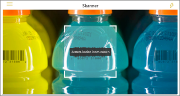
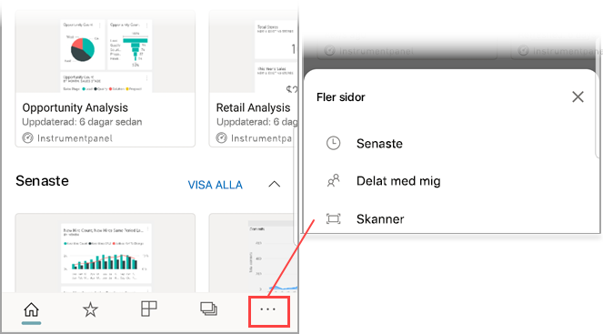

# Skanna en streckkod med din enhet från Power BI-mobilappen
Skanna streckkoder ute i världen och gå direkt till filtrerad BI-information i Power BI-mobilappen.

Gäller för:

|  |  | 
|:--- |:--- |
| iPhone | Android (telefon, surfplatta) | 

Anta att en kollega har [taggat ett streckkodsfält i en rapport i Power BI Desktop](../../desktop-mobile-barcodes.md) och delat rapporten med dig. 

När du då skannar en produktstreckkod med skannern i Power BI-appen på din enhet, ser du rapporten (eller listan med rapporter) med den streckkoden. Du kan öppna rapporten, filtrerat till den streckkoden.

## Skanna en streckkod med Power BI-skannern
1. I navigeringsfältet trycker du på **Fler alternativ** (...) och sedan på **Skanner**.

    

2. Du måste godkänna Power BI-appen för att använda kameran om din kamera inte är aktiverad. Det här är ett engångsgodkännande. 
4. Peka skannern på en streckkod på en produkt. Du får upp en lista över rapporter som är associerade med den streckkoden.
5. Tryck på rapportnamnet för att öppna den på din enhet, automatiskt filtrerad enligt den streckkoden.

## Filtrera efter andra streckkoder i en rapport
När du tittar på en rapport som filtreras efter en streckkod på din enhet kanske du vill filtrera samma rapport efter en annan streckkod.

* Om streckkodsikonen har ett filter , är filtret aktivt och rapporten filtreras redan efter en streckkod. 
* Om ikonen inte har ett filter , är inte filtret aktivt och rapporten filtreras inte efter en streckkod. 

Oavsett vilket, trycker du på ikonen om du vill öppna en liten meny med en flytande skanner.

* Fokusera skannern på det nya objektet för att ändra rapportens filter till ett annat streckkodsvärde. 
* Välj **rensa streckkodsfilter** för att gå tillbaka till den ofiltrerade rapporten.
* Välj **filtrera efter senaste streckkoder** för att ändra rapportfiltret till en av de streckkoder som du har skannat i den aktuella sessionen.

## Problem med att skanna en streckkod
Här följer några meddelanden som kan visas när du skannar en streckkod på en produkt.

### ”Det gick inte att filtrera rapporten...”
Rapporten du valt att filtrera, baseras på en datamodell som inte innehåller det här streckkodsvärdet. Till exempel ingår inte produkten mineralvatten i rapporten.  

### Alla/vissa av visualiseringarna i rapporten innehåller inte något värde
Streckkodsvärdet du skannade finns i din modell men alla/vissa av visualiseringarna i rapporten innehåller inte det här värdet och filtrering returnerar därför ett tomt tillstånd. Testa att titta i andra rapportsidor eller redigera dina rapporter i Power BI Desktop så de innehåller det här värdet 

### ”Det verkar som om du inte har några rapporter som kan filtreras efter streckkoder.”
Det innebär inte att du inte har några streckkodsaktiverade rapporter. Streckkodsskannern kan bara filtrera rapporter som har en kolumn som har markerats som **streckkod**.  

Kontrollera att du eller rapportens ägare har taggat en kolumn som **streckkod** i Power BI Desktop. Läs mer om att [tagga ett streckkodsfält i Power BI Desktop](../../desktop-mobile-barcodes.md)

### ”Det gick inte att filtrera rapporten – det verkar som att den här streckkoden inte finns i rapportdata.”
Rapporten du valt att filtrera, baseras på en datamodell som inte innehåller det här streckkodsvärdet. Till exempel ingår inte produkten mineralvatten i rapporten. Du kan skanna en annan produkt, välja en annan rapport (om det finns fler än en rapport) eller visa rapporten ofiltrerad. 

## Nästa steg
* [Tagga ett streckkodsfält i Power BI Desktop](../../desktop-mobile-barcodes.md)
* [Paneler på instrumentpanelen i Power BI](../end-user-tiles.md)
* [Instrumentpaneler i Power BI](../end-user-dashboards.md)

