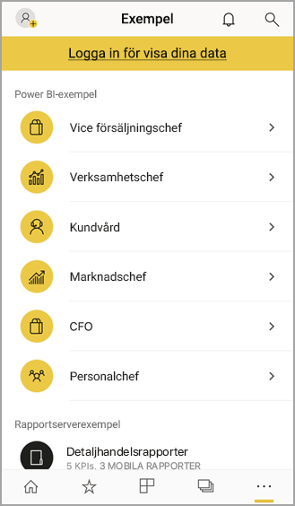
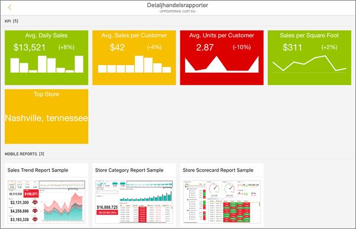
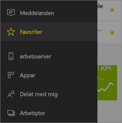
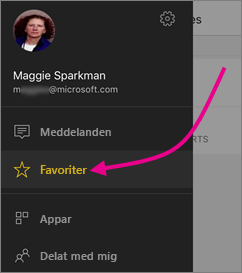
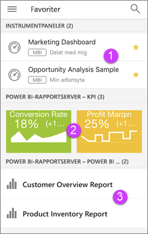

# Kom igång med Power BI-mobilappen på iOS-enheter
Microsofts Power BI för iOS-appen på iPhone, iPad eller iPod Touch ger dig den mobila BI-upplevelsen för Power BI, Power BI-rapportservern och Reporting Services. Visa och interagera med ditt företags instrumentpaneler lokalt och i molnet överallt, med pekaktiverad mobil åtkomst i realtid. Utforska data i instrumentpaneler och dela med dina kollegor via e-post eller sms. Och hålla dig uppdaterad med dina mest aktuella data på din [Apple Watch](mobile-apple-watch.md).  

Du skapar Power BI-rapporter i Power BI Desktop och publicerar dem:

* [Publicera dem i Power BI-tjänsten](../../service-get-started.md) och skapa instrumentpaneler.
* [Publicera dem lokalt på Power BI-rapportservern](../../report-server/quickstart-create-powerbi-report.md).

Sedan interagerar du i Power BI-mobilappen för iOS med dina instrumentpaneler och rapporter, antingen lokalt eller i molnet.

Ta reda på [nyheterna i Power BI-mobilapparna](mobile-whats-new-in-the-mobile-apps.md).

## Hämta appen
[Hämta iOS-appen](http://go.microsoft.com/fwlink/?LinkId=522062 "Hämta iOS-appen") från Apples App Store till din iPhone, iPad eller iPod Touch.

Du kan köra Power BI för iOS-appen på iPhone 5 och senare, med iOS 10 eller senare. Du kan också köra den på en iPad eller iPod Touch med iOS 10 eller senare. 

## Registrera dig för Power BI-tjänsten
Om du inte har registrerat dig än kan du gå till [powerbi.com](https://powerbi.microsoft.com/get-started/), och under **Power BI – Samarbete och delning i molnet** väljer du sedan**Testa kostnadsfritt**.

## Kom igång med Power BI-appen
1. Öppna Power BI-appen på din iOS-enhet.
2. Om du vill visa dina Power BI-instrumentpaneler, trycker du på **Power BI**.  
   Om du vill visa dina mobila rapporter och KPI:er i Reporting Services trycker du på **SQL Server Reporting Services**.
   
   
   
   När du befinner dig i appen, behöver du bara trycka på den globala navigeringsknappen  i det övre vänstra hörnet för att gå mellan de två. 

## Testa Power BI- och Reporting Services-exemplen
Även om du inte registrerar dig, kan du prova dig fram med Power BI- och Reporting Services-exemplen. När du har hämtat appen kan du se exemplen eller sätta igång. Du kan gå tillbaka till exemplen från den globala navigeringen när du vill.

### Power BI-exempel
Du kan visa och interagera med instrumentpanelsexemplen i Power BI, men det finns några saker som du inte kan göra med dem. Du kan inte öppna rapporterna bakom instrumentpanelerna, dela exemplen med andra eller göra dem till dina favoriter.

1. Tryck på den globala navigeringsknappen  i det övre vänstra hörnet.
2. Tryck på  i det övre högra hörnet och sedan på **Power BI-exempel**.
3. Välj en roll och utforska exemplet på instrumentpanel för rollen.  
   
   
   
   > [!NOTE]
   > Alla funktioner är inte tillgängliga i exemplen. Du kan till exempel inte visa exempelrapporterna som ligger bakom instrumentpanelerna. 
   > 
   > 

### Mobila rapportexempel för Reporting Services
1. Tryck på den globala navigeringsknappen  i det övre vänstra hörnet.
2. Tryck på  i det övre högra hörnet och sedan på **Reporting Services-exempel**.
3. Öppna detaljhandelsrapporterna eller mappen för försäljningsrapporter om du vill utforska deras KPI:er och mobila rapporter.
   
   

## Hitta ditt innehåll i Power BI-mobilapparna
Dina instrumentpaneler och rapporter lagras på olika platser i Power BI-mobilapparna beroende på var de kom från. Läs mer om [att hitta ditt innehåll i mobilapparna](mobile-apps-quickstart-view-dashboard-report.md). Dessutom kan du alltid söka efter det du har i Power BI-mobilapparna. 

Läs mer om [att hitta ditt innehåll i mobilapparna](mobile-apps-quickstart-view-dashboard-report.md).

## Visa dina favoritinstrumentpaneler, KPI:er och rapporter
På sidan Favoriter i mobilapparna visas alla dina Power BI-favoritinstrumentpaneler tillsammans med KPI:er och rapporter för Power BI-rapportservern och Reporting Services. När du gör en instrumentpanel till en *favorit* i Power BI-mobilappen, kan du komma åt den från alla dina enheter, inklusive Power BI-tjänsten i din webbläsare. 

* Tryck på **Favoriter**.
  
   
  
   Alla dina favoriter visas tillsammans på den här sidan:
  
   
  
  1. Instrumentpaneler i Power BI-tjänsten
  2. KPI:er i Power BI-rapportservern
  3. Power BI-rapporter på Power BI-rapportservern

Läs mer om [favoriter i Power BI-mobilappar](mobile-apps-favorites.md).

## Företagsstöd för Power BI-mobilapparna
Organisationer kan använda Microsoft Intune för att hantera enheter och program, inklusive Power BI-mobilappar för Android och iOS.

Microsoft Intune låter organisationer kontrollera objekt och kräva en PIN-kod för åtkomst, styra hur data hanteras av programmet och till och med kryptera programdata när appen inte används.

> [!NOTE]
> Om du använder Power BI-mobilappen på din iOS-enhet och din organisation har konfigurerat Microsoft Intune MAM, stängs datauppdatering i bakgrunden av. Nästa gång du använder appen uppdaterar Power BI data från Power BI-tjänsten på webben.
> 

Läs mer om att [konfigurera Power BI-mobilappar med Microsoft Intune](../../service-admin-mobile-intune.md). 

## Nästa steg

* [Vad är Power BI?](../../power-bi-overview.md)
* Har du några frågor? [Fråga Power BI Community](http://community.powerbi.com/)

