# <a name="using-oauth-to-connect-to-power-bi-report-server-and-ssrs"></a>Ansluta till Power BI-rapportservern och SSRS via OAuth
Lär dig hur du konfigurerar din miljö för OAuth-autentisering med Power BI-mobilappen för att ansluta till Power BI-rapportservern och SQL Server Reporting Services 2016 eller senare.

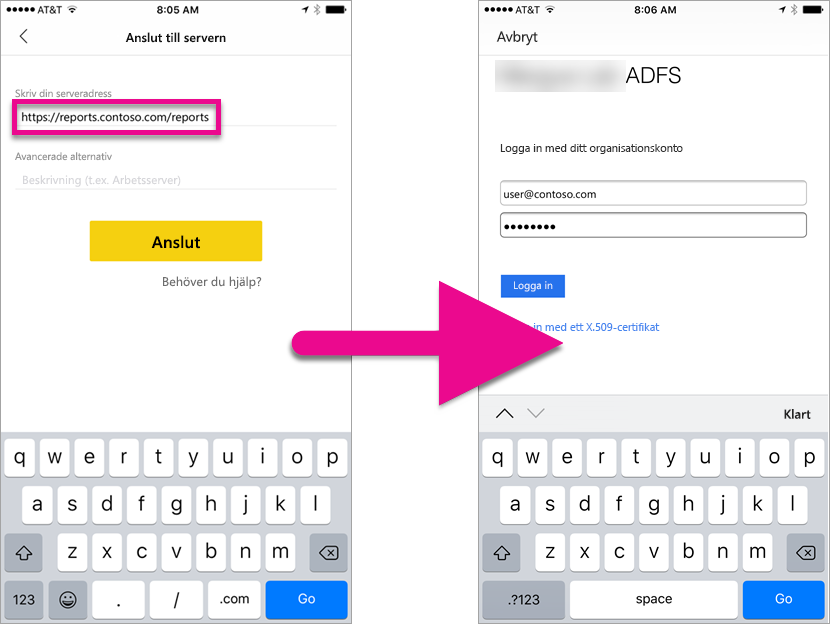

Du kan ansluta till Power BI-rapportservern och Reporting Services via OAuth för att visa mobila rapporter eller KPI:er. Windows Server 2016 innehåller vissa förbättringar av rolltjänsten Web Application Proxy (WAP) för att tillåta den här typen av autentisering. Observera att det för tillfället inte finns officiellt stöd för att visa Power BI-rapporter som finns i Power BI-rapportservern och autentiserar med WAP.

## <a name="requirements"></a>Krav
Windows Server 2016 krävs för Webbprogramproxy (WAP) och Active Directory Federation Services (AD FS)-servrar. Du behöver inte ha en funktionell domännivå för Windows 2016.

## <a name="domain-name-services-dns-configuration"></a>Konfigurationen av Domain Name Services (DNS)
Du måste välja en offentlig URL som den mobila Power BI-appen ska ansluta till. Den bör se ut ungefär så här.

```
https://reports.contoso.com
```

Du måste först rikta din DNS-post för **rapporter** mot den offentliga IP-adressen för Web Application Proxy (WAP)-servern. Du måste också konfigurera en offentlig DNS-post för AD FS-servern. Du kan till exempel ha konfigurerat AD FS-servern med följande URL.

```
https://fs.contoso.com
```

Du måste först rikta din DNS-post för **rapporter** mot den offentliga IP-adressen för Web Application Proxy (WAP)-servern, eftersom den kommer att publiceras som del av WAP-applikationen.

## <a name="certificates"></a>Certifikat
Du måste konfigurera certifikat för både WAP-applikationen och AD FS-servern. Båda dessa certifikat måste vara en del av en giltig certifikatutfärdare som dina mobila enheter kan identifiera.

## <a name="reporting-services-configuration"></a>Konfiguration av Reporting Services
Det krävs inte många konfigurationer av Reporting Services. Vi behöver kontrollera att vi har ett giltigt SPN (tjänstens huvudnamn) för att aktivera rätt Kerberos-autentisering och att Reporting Services-servern har aktiverats för att förhandla autentisering.

### <a name="service-principal-name-spn"></a>Tjänstens huvudnamn (SPN)
SPN-namnet är en unik identifierare för en tjänst som använder Kerberos-autentisering. Du måste kontrollera att du har ett korrekt HTTP-SPN för rapportservern.

Information om hur du konfigurerar SPN (tjänstens huvudnamn) för rapportservern finns i [Registrera tjänstens huvudnamn (SPN) för en rapportserver](https://msdn.microsoft.com/library/cc281382.aspx).

### <a name="enabling-negotiate-authentication"></a>Aktivera förhandling av autentisering
Om du vill låta en rapportserver använda Kerberos-autentisering, behöver du konfigurera autentiseringstypen för rapportservern som RSWindowsNegotiate. Detta görs i rsreportserver.config-filen.

```
<AuthenticationTypes>  
    <RSWindowsNegotiate />  
    <RSWindowsKerberos />  
    <RSWindowsNTLM />  
</AuthenticationTypes>
```

Mer information finns i [Ändra en Reporting Services-konfigurationsfil](https://msdn.microsoft.com/library/bb630448.aspx) och [konfigurera Windows-autentisering på en rapportserver](https://msdn.microsoft.com/library/cc281253.aspx).

## <a name="active-directory-federation-services-adfs-configuration"></a>Konfigurera Active Directory Federation Services (AD FS)
Du måste konfigurera ADFS på en Windows 2016-server i din miljö. Detta kan göras via Serverhanteraren och genom att välja Lägg till roller och funktioner under hantera. För mer information, se [Active Directory Federation Services (AD FS)](https://technet.microsoft.com/windows-server-docs/identity/active-directory-federation-services).

### <a name="create-an-application-group"></a>Skapa en appgrupp
I skärmbilden AD FS-hantering kommer du att vilja skapa en appgrupp för Reporting Services som innehåller information om Power BI Mobile-appar.

Du kan skapa gruppen med följande steg.

1. Högerklicka på **appgrupper** i AD FS-hanteringsappen och välj **Lägg till appgrupp...**
   
   
2. I guiden Lägg till appgrupp, ange ett **namn** för appen och välj **lokalt program för åtkomst till ett webb-API**.
   
   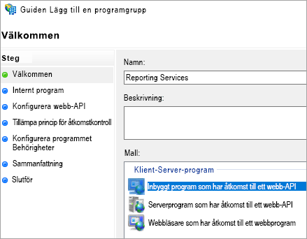
3. Välj **Nästa**.
4. Ange en **namn** för appen som du lägger till. 
5. Medan **klient-ID** automatiskt genereras för ditt program kan du ange *484d54fc-b481-4eee-9505-0258a1913020* för både iOS och Android.
6. Du kommer att vilja lägga till följande **omdirigerings-URL: er**:
   
   **Poster för Power BI Mobile – iOS:**  
   msauth://code/mspbi-adal://com.microsoft.powerbimobile  
   msauth://code/mspbi-adalms://com.microsoft.powerbimobilems  
   mspbi-adal://com.microsoft.powerbimobile  
   mspbi-adalms://com.microsoft.powerbimobilems
   
   **Android-appar behöver endast följande:**  
   urn:ietf:wg:oauth:2.0:oob
   
   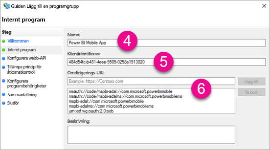
7. Välj **Nästa**.
8. Ange URL:en för din rapportserver. Detta är en extern URL som leder till proxyservern för din webbapp. Den har följande format.
   
   > [!NOTE]
   > Denna URL är skiftlägeskänslig!
   > 
   > 
   
   *https://<url to report server>/reports*
   
   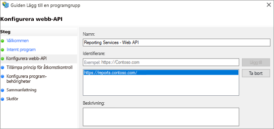
9. Välj **Nästa**.
10. Välj **principer för åtkomstkontroll** som passar organisationens behov.
    
    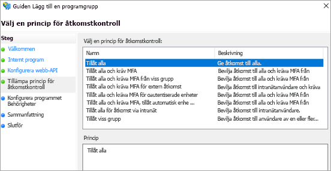
11. Välj **Nästa**.
12. Välj **Nästa**.
13. Välj **Nästa**.
14. Välj **Stäng**.

När du är klar bör egenskaperna för din grupp se ut på följande sätt.

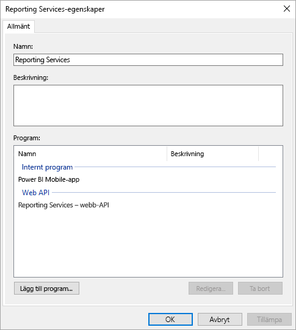

## <a name="web-application-proxy-wap-configuration"></a>Konfiguration av proxy för webbapp (WAP)
Du bör aktivera Windowsrollen proxy för webbapp (roll) på en server i din miljö. Detta måste vara en server med Windows 2016. Mer information finns i [Web Application Proxy i Windows Server 2016](https://technet.microsoft.com/windows-server-docs/identity/web-application-proxy/web-application-proxy-windows-server) och [Publicera appar med AD FS-förautentisering](https://technet.microsoft.com/windows-server-docs/identity/web-application-proxy/publishing-applications-using-ad-fs-preauthentication#a-namebkmk14apublish-an-application-that-uses-oauth2-such-as-a-windows-store-app).

### <a name="constrained-delegation-configuration"></a>Konfiguration av begränsad delegering
Vi behöver använda begränsad delegering med protokollövergång för att kunna övergå från OAuth-autentisering till Windows-autentisering. Detta är en del av Kerberos-konfigurationen. Vi har redan definierat Reporting Services SPN-namnet i Reporting Services-konfigurationen.

Vi måste konfigurera begränsad delegering på WAP-serverkontot inom Active Directory. Du kan behöva arbeta med en domänadministratör om du inte har åtkomstbehörighet till Active Directory.

Gör följande för att konfigurera begränsad delegering.

1. På en dator som har Active Directory-verktygen installerade startar du **Active Directory-användare och -datorer**.
2. Hitta datorkontot för WAP-servern. Som standard är detta i datorcontainern.
3. Högerklicka på servern för WAP och gå till **Egenskaper**.
4. Välj fliken **delegering**.
5. Välj **lita på den här datorn enbart för delegering till angivna tjänster** och därefter **Använd valfritt autentiseringsprotokoll**.
   
   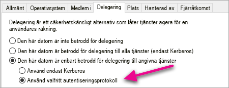
   
   Detta konfigurerar begränsad delegering för det här WAP-serverdatorkontot. Därefter måste vi konfigurera tjänsterna som den här datorn får delegera till.
6. Välj **Lägg till...**  under rutan tjänster.
   
   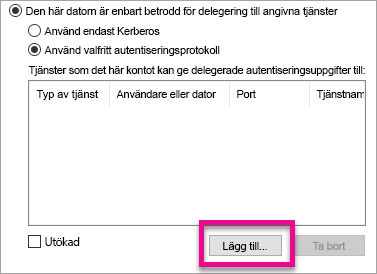
7. Välj **Användare eller datorer...**
8. Ange tjänstkontot som används för Reporting Services. Detta är det konto där du har lagt till SPN-namnet i Reporting Services-konfigurationen.
9. Välj SPN för Reporting Services och välj sedan **OK**.
   
   > [!NOTE]
   > Du kan bara se NetBIOS SPN. Faktum är att både NetBIOS och FQDN väljs om båda finns.
   > 
   > 
   
   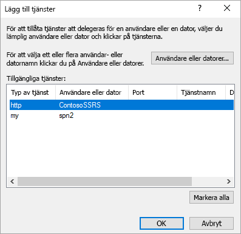
10. Resultatet bör se ut som följande när kryssrutan **Utökad** är markerad.
    
    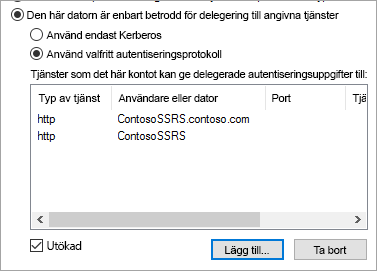
11. Välj **OK**.

### <a name="add-wap-application"></a>Lägg till WAP-app
Medan du kan publicera appar i hanteringskonsolen för rapportåtkomst kommer vi att skapa appen via PowerShell. Här är kommandot för att lägga till appen.

```
Add-WebApplicationProxyApplication -Name "Contoso Reports" -ExternalPreauthentication ADFS -ExternalUrl https://reports.contoso.com/reports/ -ExternalCertificateThumbprint "0ff79c75a725e6f67e3e2db55bdb103efc9acb12" -BackendServerUrl http://ContosoSSRS/reports/ -ADFSRelyingPartyName "Reporting Services - Web API" -BackendServerAuthenticationSPN "http/ContosoSSRS.contoso.com" -UseOAuthAuthentication
```

| Parameter | Kommentarer |
| --- | --- |
| **ADFSRelyingPartyName** |Detta är det Web API-namn som du har skapat som en del av appgruppen i AD FS. |
| **ExternalCertificateThumbprint** |Detta är certifikatet som ska användas för externa användare. Det är viktigt att det här certifikatet är giltigt på mobila enheter och kommer från en betrodd certifikatutfärdare. |
| **BackendServerUrl** |Detta är URL: en till rapportservern från WAP-servern. Om server för WAP finns i en DMZ kan du behöva använda ett fullständigt kvalificerat domännamn. Kontrollera att du kan träffa denna URL från webbläsaren på WAP-servern. |
| **BackendServerAuthenticationSPN** |Det här är SPN-namnet som du har skapat som en del av Reporting Services-konfigurationen. |

### <a name="setting-integrated-authentication-for-the-wap-application"></a>Ställa in integrerad autentisering för WAP-appen
När du lägger till WAP-appen måste du ställa in BackendServerAuthenticationMode på att använda IntegratedWindowsAuthentication. Du behöver ett ID från WAP-appen för att ställa in detta.

```
Get-WebApplicationProxyApplication “Contoso Reports” | fl
```


Kör följande kommando för att ställa in BackendServerAuthenticationMode på att använda ID från WAP-appen.

```
Set-WebApplicationProxyApplication -id 30198C7F-DDE4-0D82-E654-D369A47B1EE5 -BackendServerAuthenticationMode IntegratedWindowsAuthentication
```


## <a name="connecting-with-the-power-bi-mobile-app"></a>Anslut med Power BI-appen
Anslut Reporting Services-instans i Power BI-appen. Ange den **externa URL:en** för WAP-programmet.

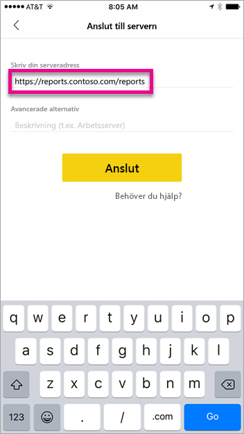

När du väljer **Anslut** omdirigeras du till inloggningssidan för ADFS. Ange giltiga autentiseringsuppgifter för domänen.


När du har valt **Logga in** visas element från Reporting Services-servern.


## <a name="multi-factor-authentication"></a>Multifaktorautentisering
Du kan aktivera multifaktorautentisering att göra din miljö ännu säkrare. Läs mer i [konfigurera AD FS 2016 och Azure MFA](https://technet.microsoft.com/windows-server-docs/identity/ad-fs/operations/configure-ad-fs-2016-and-azure-mfa).

## <a name="troubleshooting"></a>Felsökning

### <a name="you-receive-the-error-failed-to-login-to-ssrs-server-please-verify-server-configuration"></a>Du får felmeddelandet Det gick inte att logga in på SSRS-servern. Kontrollera serverkonfigurationen.

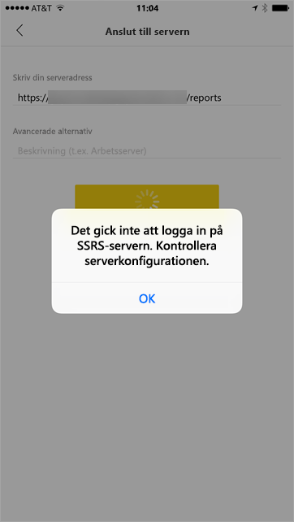

Du kan ställa in [Fiddler](http://www.telerik.com/fiddler) så att den fungerar som proxy för dina mobila enheter för att se var begäran stoppades. Om du vill aktivera Fiddler-proxyn för din telefon måste du installera [CertMaker för iOS och Android](http://www.telerik.com/fiddler/add-ons) på enheten som kör Fiddler. Detta är ett tillägg från Telerik för Fiddler.

Om inloggningen fungerar korrekt när du använder Fiddler kan det finnas ett certifikatproblem antingen med WAP-appen eller ADFS-servern. Du kan använda ett verktyg som [Microsoft Message Analyzer](https://www.microsoft.com/download/details.aspx?id=44226) för att kontrollera att certifikaten är giltiga.

## <a name="next-steps"></a>Nästa steg
[Registrera ett tjänstens huvudnamn (SPN) för en rapportserver](https://msdn.microsoft.com/library/cc281382.aspx)  
[Ändra en konfigurationsfil för Reporting Services](https://msdn.microsoft.com/library/bb630448.aspx)  
[Konfigurera Windows-autentisering på en rapportserver](https://msdn.microsoft.com/library/cc281253.aspx)  
[Konfigurera Active Directory Federation Services (AD FS)](https://technet.microsoft.com/windows-server-docs/identity/active-directory-federation-services)  
[Proxy för webbprogram i Windows Server 2016](https://technet.microsoft.com/windows-server-docs/identity/web-application-proxy/web-application-proxy-windows-server)  
[Publicera program med AD FS-förautentisering](https://technet.microsoft.com/windows-server-docs/identity/web-application-proxy/publishing-applications-using-ad-fs-preauthentication#a-namebkmk14apublish-an-application-that-uses-oauth2-such-as-a-windows-store-app)  
[Konfigurera AD FS 2016 och Azure MFA](https://technet.microsoft.com/windows-server-docs/identity/ad-fs/operations/configure-ad-fs-2016-and-azure-mfa)  
Har du fler frågor? [Prova Power BI Community](http://community.powerbi.com/)

