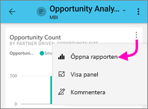
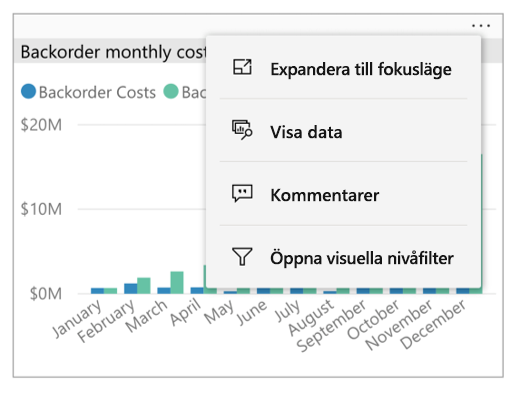
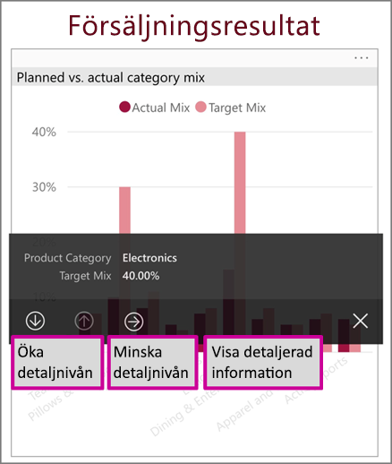

# Utforska rapporter i Power BI-mobilappar
Gäller:

|  |  |  |  |  |
|:--- |:--- |:--- |:--- |:--- |
| iPhone-telefoner |iPad-surfplattor |Android-telefoner |Android-surfplattor |Windows 10-enheter |

En Power BI-rapport är en interaktiv vy över dina data med visuell information som representerar olika resultat och insikter från dessa data. Att visa rapporter i Power BI-mobilappar är det tredje steget i en trestegsprocess.

1. [Skapa rapporter i Power BI Desktop](../../desktop-report-view.md). Du kan även [optimera en rapport för telefoner](mobile-apps-view-phone-report.md) i Power BI Desktop. 
2. Publicera de rapporterna till Power BI-tjänsten [(https://powerbi.com)](https://powerbi.com) eller [Power BI-rapportserver](../../report-server/get-started.md).  
3. Interagera sedan med dessa rapporter i Power BI-mobilappar.

## Öppna en Power BI-rapport i mobilappen
Power BI-rapporter lagras på olika ställen i mobilappen, beroende på var du fick dem från. De kan vara i appar, delade med mig, arbetsytor (inklusive Min arbetsyta) eller på en rapportserver. Du går ibland igenom en relaterad instrumentpanel för att komma till en rapport, och ibland anges de.

I listor och menyer finns en ikon intill ett rapportnamn som visar att det här objektet är en rapport. 

 

Det finns två ikoner för rapporter i Power BI Mobile-appar:

*  anger en rapport som visas i liggande orientering i appen och ser likadan ut som i webbläsaren.

*  visar en rapport som har minst en telefonoptimerad rapportsida som visas i stående orientering. 

> [!NOTE]
> Genom att hålla telefonen i liggande orientering får du alltid liggande layout, även om rapportsidan har en telefonlayout. 

Om du vill gå till en rapport från en instrumentpanel trycker du på ellipsen (...) i det övre högra hörnet på en panel > **Öppna rapporten**.
  
  
  
  Inte alla paneler kan öppnas i en rapport. Paneler som skapats genom att ställa en fråga i frågor och svar-rutan, öppnar inte rapporter när du klickar på dem. 
  
## Interagera med rapporter
När du har öppnat en rapport i appen kan du börja arbeta med den. Det finns många saker du kan göra med rapporten och dess data. I rapportens sidfot finns åtgärder som du kan utföra på rapporten. Genom att trycka och trycka länge på de data som visas i rapporten kan du dela upp och analysera data.

### Använda tryckning och lång tryckning
Tryckning motsvarar ett musklick. Om du vill korsmarkera rapporten baserat på en datapunkt trycker du därmed på den datapunkten.
Om du trycker på ett utsnittsvärde markeras det värdet, och utsnitt görs på resten av rapporten enligt det värdet. Genom att trycka på en länk, en knapp eller ett bokmärke aktiverar du det baserat på den åtgärd som definierats av författaren.

Du märkte förmodligen att en kantlinje visas när du trycker på ett visuellt objekt. I det övre högra hörnet av kantlinjen finns det en ellips (…). Om du trycker på den visas en meny med åtgärder som du kan utföra på det visuella objektet.

### Knappbeskrivning och detaljnivååtgärder

När du trycker länge (trycker och håller ned) på en datapunkt visas en knappbeskrivning med de värden som datapunkten representerar. 

Om rapportens författare konfigurerade rapportsidans knappbeskrivning ersätts standardbeskrivningen med rapportsidans knappbeskrivning.

> [!NOTE]
> Rapportknappbeskrivningar stöds för enheter med en bildpunktsstorlek över 640 och ett visningsområde över 320. Om enheten är mindre använder appen standardmässiga knappbeskrivningar.

Rapportförfattare kan definiera hierarkier i data och relationer mellan rapportsidor. Med hierarkin kan du öka detaljnivån, minska detalj nivån och visa detaljerad information från ett visuellt objekt och ett värde. När du trycker länge på ett värde visas utöver knappbeskrivningen de relevanta alternativen för detaljnivå i sidfoten. 

Med *visning av detaljerad information*, när du trycker på en viss del av en visualisering, växlar Power BI till en annan sida i rapporten som filtreras till det värde som du tryckt på. Rapportförfattare kan definiera ett eller flera alternativ för visning av detaljerad information som växlar till olika sidor. Du kan välja vilken som du vill visa detaljerad information för. Bakåtknappen går tillbaka till föregående rapportsida.

Läs mer om hur du [lägger till visning av detaljerad information i Power BI Desktop](../../desktop-drillthrough.md).
   
   > [!IMPORTANT]
   > I Power BI Mobile-appen aktiveras matrisen för minskad detaljnivå och tabellens visuella objekt endast via ett cellvärde, inte efter kolumn- och radrubriker.
   
   
   
### Använda åtgärderna i rapportsidfoten
Rapportsidfoten innehåller åtgärder som du kan utföra på den aktuella rapportsidan eller hela rapporten. Sidfoten ger snabb åtkomst till de mest användbara åtgärderna, och du kommer åt alla åtgärder via ellipsen (...).

De åtgärder som du kan utföra från sidfoten är:
1) Återställ rapportfiltret och korsmarkera markeringar tillbaka till ursprungligt läge.
2) Öppna konversationsfönstret om du vill visa eller lägga till kommentarer om den här rapporten.
3) Öppna filterfönstret om du vill visa och ändra det filter som för närvarande tillämpas på rapporten.
4) Visar en lista över alla sidor i den här rapporten. Om du trycker på sidnamnet läses den sidan in och visas.
Du kan flytta mellan rapportsidor genom att svepa från kanten av skärmen till mitten.
5) Visa alla rapportåtgärder.

#### Alla rapportåtgärder
Om du trycker på alternativet … i rapportens sidfot visas alla åtgärder som du kan utföra på en rapport. 

Vissa av åtgärderna kan vara inaktiverade eftersom de är beroende av de specifika rapportfunktionerna.
Till exempel:
1) **Filtrera efter aktuell plats** är aktiverat om data i rapporten kategoriserades av författaren med geografiska data. [Lär dig hur du identifierar geografiska data i rapporten](https://docs.microsoft.com/power-bi/desktop-mobile-geofiltering).
2) **Genomsök för att filtrera rapporten efter streckkod** är endast aktiverat om datamängden i rapporten har taggats som streckkod. [Så taggar du streckkoder i Power BI Desktop](https://docs.microsoft.com/power-bi/desktop-mobile-barcodes). 
3) **Bjud in** är endast aktiverat om du har behörighet att dela den här rapporten med andra. Du får bara behörighet om du är ägare av rapporten eller om du har fått behörighet att dela vidare av ägaren.
4) **Anteckna och dela** kan vara inaktiverat om det finns en [Intune-skyddsprincip](https://docs.microsoft.com/intune/app-protection-policies) i din organisation som förbjuder delning från Power BI-mobilappen. 

## Nästa steg
* [Visa och interagera med Power BI-rapporter som är optimerade för din telefon](mobile-apps-view-phone-report.md)
* [Skapa en version av en rapport som är optimerad för telefoner](../../desktop-create-phone-report.md)
* Har du några frågor? [Fråga Power BI Community](http://community.powerbi.com/)

