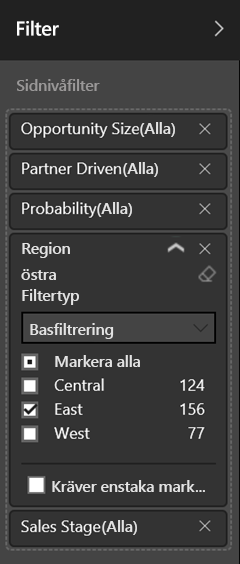
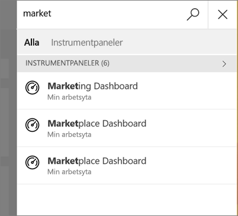
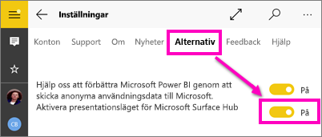

# Visa rapporter i presentationsläge på Surface Hub och i Windows 10 – Power BI
Du kan visa rapporter i presentationsläge på Surface Hub och visa instrumentpaneler, rapporter och paneler i helskärmsläge på Windows 10-enheter. 

Presentation- och helskärmsläge är användbara för att visa Power BI på ett möte eller en konferens eller på en dedikerad projektor i ett kontor, eller bara för att maximera utrymmet på en liten skärm. 

I helskärmsläget i Power BI-mobilappen, tas allt ”krom” som navigering och menyfälten bort, utom sidflikarna och filterfönstret i rapporterna.

När du visar en rapport i Presentationsläge på Surface Hub, kan du rita på sidorna med olika färger och navigera mellan sidorna i rapporten.

Du kan också [visa instrumentpaneler och rapporter i helskärmsläge från Power BI-tjänsten](../end-user-focus.md) på webben.

> [!NOTE]
> Presentationsläget skiljer sig från [fokusläge för paneler](mobile-tiles-in-the-mobile-apps.md).
> 
> 

## Visa instrumentpaneler, rapporter och paneler i helskärmsläge
1. I Power BI-mobilappen på en instrumentpanel, rapport eller panel, trycker du på ikonen **helskärm**  för att gå till helskärmsläge.
2. I presentationsläge, kan du filtrera en rapport eller söka efter andra instrumentpaneler och rapporter.
   
    Expandera filterfönstret för att ställa in eller ta bort filter.
   
    
   
     Tryck på sökikonen  för att söka efter andra instrumentpaneler.
   
    
3. Du avslutar helskärmsläge genom att knacka på ikonen med två inåtriktade pilar  på verktygsfältet, eller svep nedåt från överkanten och tryck de på två inåtriktade pilarna .

## Aktivera presentationsläge för Surface Hub
Presentationsläge är aktiverat som standard i Surface Hub, men om det är avstängt, kan du aktivera det igen.

1. Tryck på inställningsikonen  längst ned i det vänstra navigeringsfältet.
2. Tryck på **Alternativ**, dra sedan **Aktivera Microsoft Surface Hub Presentationsläge** till **På**.
   
    

## Visa och rita på rapporter på Surface Hub
1. I en rapport, trycker du på ikonen **helskärm**  för att gå till presentationsläge för Surface Hub.
   
    Du ser ett komprimerbart åtgärdsfält på båda sidor av skärmen. 
   
   * För att öppna det, sveper eller trycker du på referensen.
   * Svep ut eller tryck på X överst för att stänga det.
2. På enheter som stöder skrivning med penna, kan du börja skriva omedelbart. 
3. Om du vill ändra bläckfärgen, trycker du på pennan i vänster eller höger åtgärdsfält.
   
    
4. Knacka på suddgummit eller ångra-pilen för att ta bort vissa eller alla pennanteckningar.
5. Knacka på den cirkelformade pilen för att uppdatera rapportinnehållet.
6. Tryck på den sidolutade pilen för att gå till andra sidor i rapporten.
   
    
7. Om du vill avsluta helskärmsläge, sveper du nedåt från överkanten och trycker på de två inåtriktade pilarna .

## Nästa steg
* Du kan också [visa instrumentpaneler och rapporter i helskärmsläge från Power BI-tjänsten](../end-user-focus.md)
* Har du några frågor? [Fråga Power BI Community](http://community.powerbi.com/)

