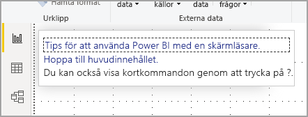
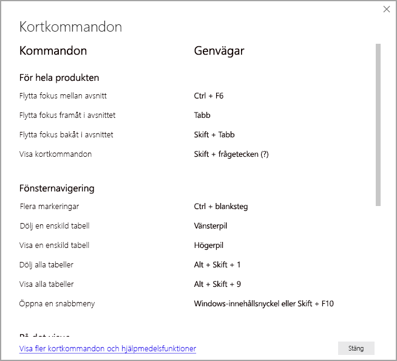
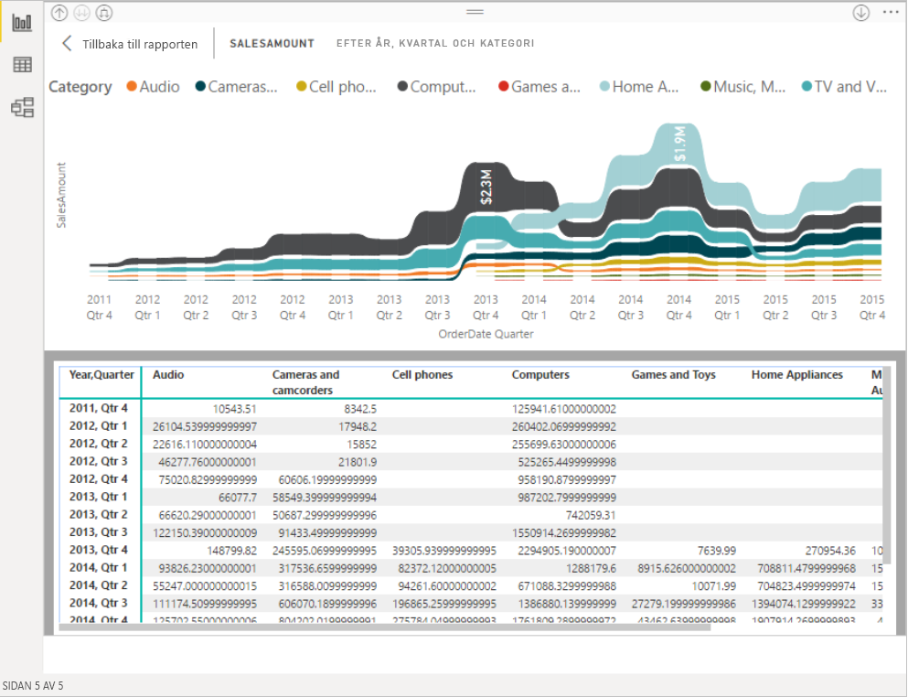

# Använda Power BI-rapporter med hjälpmedel
Power BI har många inbyggda funktioner som hjälper personer med funktionshinder att använda och interagera med Power BI-rapporter. De här verktygen gör att sådana användare kan få samma information från en rapport som de som inte använder hjälpmedelstekniken.

Det finns några termer du bör känna till när du läser den här artikeln:

* **Fokus** är den plats där musen är belägen på sidan. Fokus anges vanligtvis med en blå kantlinje runt objektet.
* **Arbetsytan** är sidområdet i rapporten.

I följande avsnitt beskrivs de hjälpmedelsverktyg som är tillgängliga när du använder Power BI-rapporter.

## Tangentbordsnavigering

När du startar Power BI Desktop eller Power BI-tjänsten ser du en knappbeskrivning uppe till höger så fort du trycker på **Tabb**. Länken **Tips för att använda Power BI med en skärmläsare** leder till den här artikeln med information om hur du använder hjälpmedel i en rapport. Om du klickar på länken **Hoppa till huvudinnehåll** kommer du till rapportarbetsytan.

Om du trycker på **?** öppnar en dialogruta med de vanligaste kortkommandona i Power BI. Om du vill se hela listan med kortkommandon som är tillgängliga i Power BI kan du navigera till länken längst ned i dialogrutan. Då öppnas Power BI-dokumentationen om [kortkommandon](desktop-accessibility-keyboard-shortcuts.md).

Du kan växla fokus mellan flikar på rapportsidor eller objekt på en viss rapportsida med **Ctrl + F6**. När fokus ligger på en inläst rapportsida använder du tangenten **Tabb** för att växla fokus till varje objekt på sidan, vilket omfattar alla textrutor, bilder, former och diagram. 

I allmänhet använder du **Enter** till att välja eller ange och **Esc** till att avsluta i Power BI.

### Tangentbordsnavigering för visuella objekt

Många Power BI-rapporter innehåller stora mängder data. När du navigerar i visuellt objekt kan det vara irriterande att behöva tabba genom alla element i objektet. Tangentbordsnavigeringen för visuella objekt har utformats som en hierarki med tre nivåer. De här tre nivåerna beskrivs i följande stycken.

När du kommer till ett visuellt objekt trycker du på **Ctrl + högerpil** för att öppna objektet och navigera på den första nivån. När du har öppnat det visuella objektet kan du trycka på **Tabb** för att stega igenom det visuella objektets huvudområden. De huvudområden som du kan växla mellan är dataritningsområdet, axelkategorierna (om sådana används i det visuella objektet) och förklaringen (om det finns en i det visuella objektet).

I den här .gif-filen ser du hur en användare stegar genom den första nivån i ett visuellt objekt:

Om du öppnar något av huvudområdena (dataritningsområdet, x-axelns kategorier, förklaringen) för det visuella objektet kommer du till den andra nivån i hierarkin. När du jobbar med en rapport kan du öppna något av huvudområdena och stega igenom datapunkterna eller kategorierna i det aktuella avsnittet i objektet. När du har bestämt vilket område du vill utforska närmare kan du trycka på **Enter** för att stega igenom det aktuella området.

Om du vill välja alla datapunkter i en serie navigerar du till förklaringen och trycker på **Enter**. När du är i förklaringen kan du trycka på **Tabb** för att navigera bland de olika kategorierna i förklaringen. Tryck på **Enter** för att välja en viss serie.

Om du vill välja specifika datapunkter i en serie navigerar du till dataritningsområdet och trycker på **Enter**. I det här området kan du trycka på **Tabb** för att navigera bland datapunkterna. Om det finns flera serier i det visuella objektet kan du trycka på **uppåtpilen** eller **nedåtpilen** för att hoppa till datapunkterna i en annan serie.

Om du vill välja alla datapunkter längs en kategoriaxel navigerar du till axeletiketterna och trycker på **Enter**. I det här området kan du trycka på **Tabb** för att navigera bland etikettnamnen. Tryck på **Enter** för att välja en etikett.

Om du har navigerat till ett lager kan du trycka på **Esc** för att komma ut ur lagret igen. I den här .gif-bilden ser du hur användaren kan öppna och stänga nivåer i ett visuellt objekt och välja datapunkter, x-axelns kategorietiketter, hoppa till en annan serie och markera alla datapunkter i en serie.

Om du inte kan navigera till ett objekt eller visuellt objekt med tangentbordet kan det bero på att rapportförfattaren har valt att dölja objektet i tabbordningen. Det är vanligt att rapportförfattare döljer dekorativa objekt i tabbordningen. Om du märker att du inte kan stega igenom rapporten på ett logiskt sätt bör du kontakta rapportförfattaren. Rapportförfattare kan ställa in tabbordningen för objekt och visualiseringar.

### Tangentbordsnavigering för utsnitt

Utsnitt har också inbyggda hjälpmedelsfunktioner. När du väljer ett utsnitt kan du flytta mellan de olika kontrollerna i utsnittet med **Ctrl + högerpil** och justera utsnittets värden. När du till exempel trycker på **Ctrl + högerpil** första gången ligger fokus på radergummit. Om du sedan trycker på **blanksteg** sker samma sak som om du trycker på radergummit, vilket raderar alla värden i utsnittet.

Du kan flytta mellan kontrollerna i ett utsnitt genom att trycka på **Tabb**. Om du trycker på **Tabb** när du är på radergummit flyttas du till listruteknappen. Om du trycker på tangenten **Tabb** en gång till flyttas du till det första värdet i utsnittet (om det finns flera värden för utsnittet, till exempel ett intervall).

### Växla sidor

När fokus ligger på flikar på rapportsidor använder du **Tabb** eller **piltangenterna** för att flytta fokus från en rapportsida till nästa. Skärmläsaren läser upp rapportsidans rubrik och huruvida den är markerad. Om du vill läsa in den rapportsida som är i fokus använder du tangenten **Retur** eller **blanksteg**.

### Åtkomst till det visuella objektets sidhuvud
När du navigerar mellan visuella objekt kan du trycka på **Alt + Skift + F10** för att flytta fokus till det visuella objektets rubrik. Det visuella objektets rubrik innehåller olika alternativ, till exempel sortering, export av diagrammets underliggande data samt fokusläge. De ikoner du ser i det visuella objektets sidhuvud beror på vilka alternativ rapportförfattaren har valt att visa.

## Skärmläsare

När du visar en rapport är det bäst låta avsökningsläget vara avstängt. Du bör behandla Power BI mer som ett program och mindre som ett dokument. Det har anpassad navigering som gör navigeringen enklare. När du använder en skärmläsare med Power BI Desktop bör du också se till att skärmläsaren är öppen innan du öppnar Power BI Desktop.

När du navigerar bland objekten läser skärmläsaren upp objekttypen och objektets rubrik (om det finns en sådan). Skärmläsaren läser även upp en beskrivning av objektet (alternativtexten) om rapportförfattaren har angett en sådan.

### Visa data
Du kan trycka på **Alt + Skift + F11** för att presentera en version av fönstret **Visa data** som har hjälpmedelsfunktioner. Med det här fönstret kan du utforska de data som används i det visuella objektet med hjälp av en HTML-tabell med hjälp av samma kortkommandon som du vanligtvis använder i skärmläsaren.

Funktionen **Visa data** är en HTML-tabell som bara är tillgänglig för skärmläsare via det här kortkommandot. Om du öppnar **Visa data** från alternativet i det visuella objektets sidhuvud visas en tabell som *inte* är kompatibel med skärmläsaren.  När du använder **Visa data** via kortkommandot ska du aktivera skanningsläget så att du kan använda skärmläsarens alla snabbtangenter.

Om du vill stänga vyn **Visa data** och återgå till rapporten trycker du på **Esc**.

## Högkontrastlägen

Power BI-tjänsten försöker identifiera de inställningar för hög kontrast som är valda i Windows. Effektiviteten och noggrannheten i identifieringen beror på den webbläsare som visar Power BI-tjänsten. Om du vill ange temat manuellt i Power BI-tjänsten kan du välja **Visa > Högkontrastfärger** och sedan välja det tema som du vill använda för rapporten.

## Nästa steg

Här är samlingen med artiklar om hjälpmedel i Power BI:

* [Översikt över hjälpmedel i Power BI](desktop-accessibility-overview.md) 
* [Skapa tillgängliga Power BI-rapporter](desktop-accessibility-creating-reports.md) 
* [Skapa Power BI-rapporter med hjälpmedel](desktop-accessibility-creating-tools.md)
* [Kortkommandon för hjälpmedel i Power BI-rapporter](desktop-accessibility-keyboard-shortcuts.md)
* [Checklista för hjälpmedel i rapporter](desktop-accessibility-creating-reports.md#report-accessibility-checklist)

