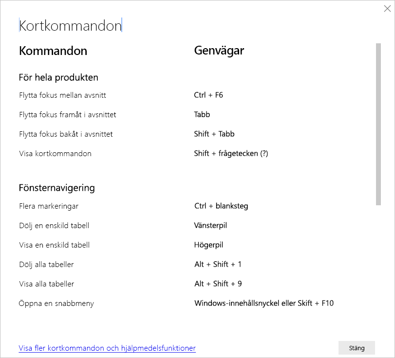

# Kortkommandon i Power BI Desktop

Kortkommandon är till hjälp för att flytta runt i Power BI-rapporter med hjälp ett tangentbord. Tabellerna i den här artikeln innehåller de genvägar som är tillgängliga i Power BI-rapporter. 

När du använder Power BI Desktop kan du trycka på **Skift + ?** för att visa kortkommandon, se följande bild.

Utöver att kortkommandona fungerar i **Power BI Desktop** så fungerar de även i följande upplevelser:

* Dialogrutan för **Frågor och svar-utforskaren**
* Dialogrutan **Komma igång**
* **Arkiv**-menyn och dialogrutan **Om**
* **Varningsfältet**
* Dialogrutan **Filåterställning**
* Dialogrutan för **Frowns**

I vår fortsatta strävan efter att förbättra hjälpmedel så stöder även den tidigare listan med upplevelser även stöd för skärmläsare och högkontrastinställningar.

## Vanliga kortkommandon
| Så här utför du den här åtgärden           | Tryck på                |
| :------------------- | :------------------- |
| Flytta fokus mellan avsnitt  | **Ctrl + F6** |
| Flytta fokus framåt i avsnittet | **Tabb**         |
| Flytta fokus bakåt i avsnittet | **Skift + Tabb** |
| Markera eller avmarkera ett objekt | **Retur** eller **Blanksteg** |
| Flerval av objekt | **Ctrl + Blanksteg** |

## På det visuella objektet
| Så här utför du den här åtgärden           | Tryck på                |
| :------------------- | :------------------- |
| Flytta fokus till menyn för det visuella objektet | **Alt + Skift + F10** |
| Visa data | **Alt + Skift + F11**  |
| Ange ett visuellt objekt | **Ctrl + högerpil** |
| Ange ett lager | **Retur** |
| Avsluta ett lager eller ett visuellt objekt | **Esc** |
| Markera eller avmarkera en datapunkt | **Retur** eller **Blanksteg** |
| Flera markeringar | **Ctrl + Retur** eller **Ctrl + Blanksteg** |
| Högerklicka | <ul><li>Windows-tangentbordet: **Windows-menytangent + F10**. Windows-menytangenten ligger mellan den vänstra Alt-tangenten och Vänsterpil-tangenten</li><li>Andra tangentbord: **Skift + F10**</li></ul> |
| Rensa val | **Ctrl + Skift + C** |
| Visa eller dölja skärmtips | **Ctrl + H** |

## Navigering i tabeller och matriser
| Så här utför du den här åtgärden          | Tryck på                |
| :------------------- | :------------------- |
| Flytta fokus uppåt/nedåt en cell (i alla celler i alla områden)  | **Uppåtpil-tangenten** / **Nedåtpil-tangenten** |
| Flytta fokus vänster/höger en cell (i alla celler i alla områden)  | **Vänster piltangent** / **Höger piltangent** |

## Fönsternavigering
| Så här utför du den här åtgärden           | Tryck på                |
| :------------------- | :------------------- |
| Flera markeringar | **Ctrl + Blanksteg** |
| Dölj en enskild tabell | **Vänster piltangent** |
| Visa en enskild tabell | **Höger piltangent** |
| Dölj alla tabeller | **Alt + Skift + 1** |
| Visa alla tabeller | **Alt + Skift + 9** |
| Öppna en snabbmeny | <ul><li>Windows-tangentbordet: **Windows-menytangent + F10**.  Windows-menytangenten ligger mellan den vänstra Alt-tangenten och Vänsterpil-tangenten</li><li>Andra tangentbord: **Skift + F10**</li></ul> |

## Utsnitt
| Så här utför du den här åtgärden         | Tryck på                |
| :------------------- | :------------------- |
| Interagera med ett utsnitt | **Ctrl + Höger piltangent** |

## Urvalsfönstret
| Så här utför du den här åtgärden           | Tryck på                |
| :------------------- | :------------------- |
| Aktivera markeringsfönstret | **F6** |
| Flytta upp ett objekt i lagringen | **Ctrl + Skift + F** |
| Flytta ned ett objekt i lagringen | **Ctrl + Skift + B** |
| Dölj / visa (växla) ett objekt | **Ctrl + Skift + S** |

## DAX-redigerare
| Så här utför du den här åtgärden          | Tryck på                |
| :------------------- | :------------------- |
| Flytta raden upp / ned | **Alt + Uppåtpil-tangenten** / **Nedåtpil-tangenten** |
| Kopiera rad upp / ned | **Skift + Alt + Uppåtpil-tangenten** / **Nedåtpil-tangenten** |
| Infoga linje nedan | **Ctrl + Retur** |
| Infoga linje ovan | **Ctrl + Skift + Retur** |
| Gå till matchande hakparentes | **Ctrl + Skift +**  \ |
| Dra in rad/Utöka rad till marginalen | **Ctrl + ]**  /  **[** |
| Infoga markören | **Alt + klicka** |
| Välj aktuell rad | **Ctrl + I** |
| Välj alla förekomster av aktuellt val | **Ctrl + Skift + L** |
| Välj alla förekomster av aktuellt ord | **Ctrl + F2** |

## Ange data
| Så här utför du den här åtgärden           | Tryck på                |
| :------------------- | :------------------- |
| Avsluta redigerbart rutnät | **Ctrl + Tabb** |

## Överväganden och begränsningar
Det finns några kända problem och begränsningar hos hjälpmedelsfunktionerna. Beskrivningar av dessa problem och begränsningar finns i följande lista:

* När du använder skärmläsare med **Power BI Desktop** får du bästa möjliga upplevelse om du öppnar skärmläsaren innan du öppnar filer i **Power BI Desktop**.
* Om du använder Skärmläsaren finns vissa begränsningar när du bläddrar i **Visa data** som en HTML-tabell.

## Nästa steg

Här är samlingen med artiklar om hjälpmedel i Power BI:

* [Översikt över hjälpmedel i Power BI](desktop-accessibility-overview.md) 
* [Skapa tillgängliga Power BI-rapporter](desktop-accessibility-creating-reports.md) 
* [Använda rapporter i Power BI med hjälpmedel](desktop-accessibility-consuming-tools.md)
* [Skapa Power BI-rapporter med hjälpmedel](desktop-accessibility-creating-tools.md)
* [Checklista för hjälpmedel i rapporter](desktop-accessibility-creating-reports.md#report-accessibility-checklist)

Du kanske också är intresserad av det här:

* [Använda rapportteman i Power BI Desktop](desktop-report-themes.md)

