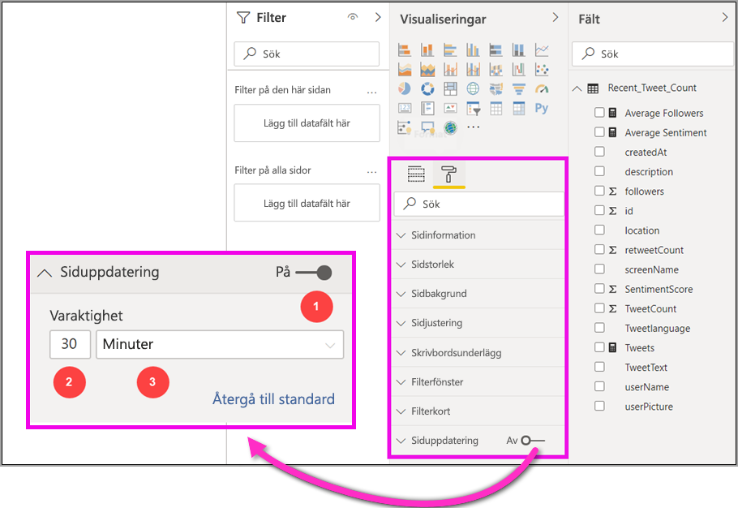
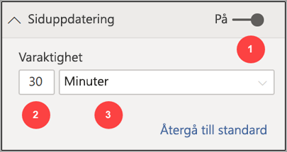
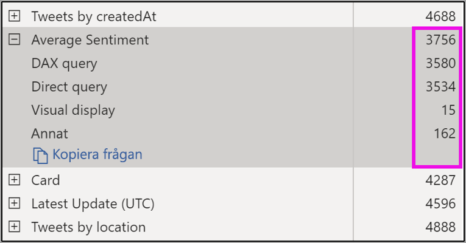

# Automatisk sidouppdatering i Power BI Desktop (förhandsversion)

När du övervakar kritiska händelser är det viktigt att data uppdateras så fort källdata uppdateras. I tillverkningsbranschen är det till exempel viktigt att upptäcka när en maskin slutar fungera eller om fel uppstår.

Med funktionen för automatisk siduppdatering i Power BI kan aktiva rapportsida söka efter nya data i en fördefinierad takt för [DirectQuery-källor](https://docs.microsoft.com/power-bi/desktop-directquery-about).

## Använda automatisk siduppdatering

I den här förhandsversionen måste du aktivera funktionen för automatisk siduppdatering i Power BI Desktop. Gå till **Arkiv > Alternativ och inställningar** > **Alternativ** och välj sedan **Förhandsgranskningsfunktioner** i den vänstra rutan. Aktivera funktionen genom att markera kryssrutan bredvid *Automatisk siduppdatering*. Automatisk siduppdatering är endast tillgängligt för DirectQuery-datakällor.

Om du vill använda automatisk siduppdatering väljer du den rapportsida som du vill aktivera uppdateringen för. I fönstret **Visualiseringar** väljer du ikonen **Formatering** (en målarroller) och **Siduppdatering** längst ned i fönstret. 

Följande bild visar kortet **Siduppdatering**. Beskrivningar av de numrerade elementen finns i följande stycken:

1.    Skjutreglage för automatisk siduppdatering – Aktiverar eller inaktiverar siduppdatering
2.    Värde för siduppdateringsintervall – Värde för uppdateringsintervall
3.    Enhet för siduppdateringsintervall – Intervallenhet för siduppdatering

Här kan du aktivera siduppdatering och välja uppdateringens varaktighet. Standardvärdet är 30 minuter och det minsta uppdateringsintervallet är en sekund. Rapporten kommer att börja uppdateras med det intervall som du har angett. 

## Bestämma siduppdateringsintervallet

När automatisk siduppdatering har aktiverats skickar Power BI Desktop ständigt frågor till DirectQuery-källan. Det kommer att uppstå en fördröjning mellan när frågan skickas och att de data som returneras hämtas, så för korta uppdateringsintervall bör du kontrollera att frågorna returnerar den efterfrågade informationen inom det konfigurerade intervallet. Om det inte returneras några data inom intervallet skapar du situationer där visuella objekt uppdateras mer sällan än vad som har konfigurerats.

Det bästa är om uppdateringsintervallet minst matchar din förväntade nya datahastighet:

* Om nya data tas emot av källan var 20:e minut, kan uppdateringsintervallet inte vara mindre än 20 minuter. 

* Om nya data tas emot varje sekund ska intervallet anges till en sekund. 

För korta uppdateringsintervall som en sekund bör du även överväga vilken typ av DirectQuery-datakälla du ska ha, vilken belastning dina frågor skapar på den, avståndet för dina rapportvisare från kapacitetens datacenter och så vidare. 

Du kan beräkna detta med hjälp av Prestandaanalys i Power BI Desktop, där du kontrollerar om varje visualiseringsfråga har tillräckligt med tid för att kunna komma tillbaka med resultatet från källan och var tiden har använts. Utifrån resultatet från prestandaanalysen kan du justera och göra ändringar i datakällan, eller så kan du experimentera med andra visuella objekt och mått i rapporten.

Följande bild visar resultatet av en DirectQuery i Prestandaanalys:

Vi använder några andra egenskaper för den här datakällan. 

1.    Data tas emot med en hastighet på två sekunder. 
2.    Prestandaanalysen visar maximal fråga + visningstid på ungefär 4,9 sekunder (4 688 millisekunder). 
3.    Datakällan har konfigurerats för att hantera cirka 1 000 samtidiga frågor per sekund. 
4.    Du förväntar dig att cirka 10 användare ska kunna se rapporten samtidigt.

Detta resulterar i följande:

* **5 visuella objekt x 10 användare = cirka 50 frågor**

Den här beräkningen resulterar i mycket mer belastning än vad datakällan har stöd för. Data tas emot med en hastighet på två sekunder, vilket bör vara din uppdateringsfrekvens. Men eftersom frågan tar ungefär fem sekunder att slutföra, ska vi ställa in den på mer än fem sekunder. 

Observera också att det här resultatet kan se annorlunda ut när du publicerar rapporten till tjänsten, eftersom rapporten använder Analysis Services-instansen som finns i molnet. Du kanske vill justera dina uppdateringshastigheter enligt detta. 

För att klara av frågor och uppdateringstider kör Power BI nästa uppdateringsfråga först när alla återstående uppdateringsfrågor har slutförts. Så även om uppdateringsintervallet är kortare än den tid som dina frågor tar att bearbeta, uppdateras Power BI inte förrän återstående frågor har slutförts. 

Härnäst ska vi titta på hur du kan identifiera och diagnostisera prestandaproblem som kapacitetsadministratör. Du kan också läsa avsnittet **Vanliga frågor och svar om automatisk siduppdatering** längre fram i den här artikeln för mer information om prestanda och felsökning.

## Automatisk siduppdatering i Power BI-tjänsten

Du kan också ställa in automatiska siduppdateringsintervall för rapporter som har skapats i Power BI Desktop och publicerats till Power BI-tjänsten. 

Automatisk siduppdatering för rapporter i Power BI-tjänst konfigureras med steg som liknar konfigurationen i Power BI Desktop. Automatisk siduppdatering har även stöd för [inbäddat Power BI](../developer/embedded/embedding.md)-innehåll när det konfigureras i Power BI-tjänsten. Följande bild visar konfigurationen av **siduppdatering** för Power BI-tjänsten:

1.    Skjutreglage för automatisk siduppdatering – Aktiverar eller inaktiverar siduppdatering
2.    Värde för siduppdateringsintervall – Värde för uppdateringsintervall, måste vara ett heltal
3.    Enhet för siduppdateringsintervall – Intervallenhet för siduppdatering

### Siduppdateringsintervall

De siduppdateringsintervall som tillåts i Power BI-tjänsten påverkas av rapportens typ av arbetsyta. Detta gäller för alla följande rapporter:

* Publicera en rapport i en arbetsyta där automatisk siduppdatering är aktiverat
* Redigera ett siduppdateringsintervall som redan finns i en arbetsyta
* Skapa en rapport direkt i tjänsten

Power BI Desktop har ingen begränsning för uppdateringsintervallet, vilket innebär att uppdateringsintervallet kan ske så ofta som varje sekund. Men när rapporter publiceras till Power BI-tjänsten gäller vissa begränsningar och de beskrivs i följande avsnitt.

### Begränsningar för uppdateringsintervall

I Power BI-tjänsten tillämpas begränsningar för automatisk siduppdatering baserat på faktorer som arbetsytan och om Premium-tjänster används.

För att förtydliga hur det fungerar kan vi börja med en bakgrund om kapaciteter och arbetsytor:

**Kapaciteter** är ett kärnbegrepp i Power BI som avser en uppsättning resurser (lagring, processor och minne) som används till att vara värd för och leverera Power BI-innehåll. Kapaciteter är antingen delade eller dedikerade. En **delad kapacitet** är delad med andra Microsoft-kunder, medan en **dedikerade kapaciteten** är helt tillägnad en enda kund. Dedikerade kapaciteter beskrivs i artikeln [Hantera Premium-kapaciteter](../admin/service-premium-capacity-manage.md).

I delad kapacitet körs arbetsbelastningar på dataresurser som delas med andra kunder. När kapaciteten måste dela resurser, införs begränsningar för att säkerställa ett *rättvist genomförande*, till exempel genom att ange maximal modellstorlek (1 GB) och maximal daglig uppdateringsfrekvens (åtta gånger per dag).

Power BI-**arbetsytor** finns i kapaciteter och de består av säkerhets-, samarbets- och distributionscontainrar. Varje Power BI-användare har en personlig arbetsyta som kallas **Min arbetsyta**. Du kan skapa fler arbetsytor för att möjliggöra samarbete och distribution, och de kallas för **arbetsytor**. Som standard skapas arbetsytor, däribland personliga arbetsytor, i den **delade kapaciteten**.

Här visas information om de två scenarierna för arbetsytor:

**Delade arbetsytor** – För vanliga arbetsytor (arbetsytor som inte ingår i en Premium-kapacitet) har den automatiska siduppdateringen ett minsta intervall på 30 minuter (det lägsta tillåtna intervallet).

**Premium-arbetsytor** – Tillgängligheten för automatisk siduppdatering i Premium-arbetsytor beror på arbetsbelastningsinställningarna som din Premium-administratör har konfigurerat för Power BI Premium-kapaciteten. Det finns två variabler som kan påverka din möjlighet att konfigurera automatisk siduppdatering:

 1. *Funktion på/av* : Om din kapacitetsadministratör har valt att inaktivera funktionen kan du inte konfigurera någon typ av siduppdatering i den publicerade rapporten.

 2. *Minsta uppdateringsintervall*: När funktionen aktiveras måste kapacitetsadministratören ange ett lägsta uppdateringsintervall. Om intervallet är lägre än minimivärdet åsidosätter Power BI-tjänsten intervallet och använder det lägsta intervall som angetts av kapacitetsadministratören.

Tabellen nedan innehåller mer information om var den här funktionen är tillgänglig, samt begränsningarna för varje kapacitetstyp och [lagringsläge](../connect-data/service-dataset-modes-understand.md)

| Lagringsläge | Dedikerad kapacitet | Delad kapacitet |
| --- | --- | --- |
| Direct Query | **Stöds** – Ja.  **Minsta uppdateringsintervall** – 1 sekund  **Åsidosättning av kapacitetsadministratör** – Ja. | **Stöds** – Ja.  **Minsta uppdateringsintervall** – 30 minuter  **Åsidosättning av kapacitetsadministratör** – Nej. |
| Importera | **Stöds** – Nej.  **Lägsta uppdateringsintervall** – Ej tillämpligt.  **Åsidosättning av kapacitetsadministratör** – Ej tillämpligt. | **Stöds** – Nej.  **Lägsta uppdateringsintervall** – Ej tillämpligt.  **Åsidosättning av kapacitetsadministratör** – Ej tillämpligt. |
| Blandat läge (DQ + andra) | **Stöds** – Ja.  **Minsta uppdateringsintervall** – 1 sekund  **Åsidosättning av kapacitetsadministratör** – Ja. | **Stöds** – Ja.  **Minsta uppdateringsintervall** – 30 minuter  **Åsidosättning av kapacitetsadministratör** – Nej. |
| Live Connect AS | **Stöds** – Nej.  **Lägsta uppdateringsintervall** – Ej tillämpligt.  **Åsidosättning av kapacitetsadministratör** – Ej tillämpligt. | **Stöds** – Nej.  **Lägsta uppdateringsintervall** – Ej tillämpligt.  **Åsidosättning av kapacitetsadministratör** – Ej tillämpligt. |
| Live Connect PBI | **Stöds** – Nej.  **Lägsta uppdateringsintervall** – Ej tillämpligt.  **Åsidosättning av kapacitetsadministratör** – Ej tillämpligt. | **Stöds** – Nej.  **Lägsta uppdateringsintervall** – Ej tillämpligt.  **Åsidosättning av kapacitetsadministratör** – Ej tillämpligt. |

> [!NOTE]
> När du publicerar den aktiverade rapporten för automatisk siduppdatering från Power BI Desktop till tjänsten, måste du ange autentiseringsuppgifterna för DirectQuery-datakällan i menyn för datamängdsinställningar.

## Överväganden och begränsningar

Det finns några saker att tänka på när du använder automatisk siduppdatering i Power BI Desktop eller i Power BI-tjänsten.

* Lagringslägena Import, LiveConnect och Push stöds inte av automatisk siduppdatering.  
* Sammansatta modeller som har minst en DirectQuery-datakälla stöds.
* Power BI Desktop har ingen begränsning för uppdateringsintervallet, vilket kan ske så ofta som varje sekund. När rapporter publiceras till Power BI-tjänsten gäller vissa begränsningar, vilket beskrevs tidigare i det här dokumentet.

### Prestandadiagnostik

Automatisk siduppdatering är användbart för att övervaka scenarier och utforska data som snabbt kan ändras. Men ibland kan detta medföra onödig belastning på kapaciteten eller datakällan.

Power BI har följande skydd för att förhindra onödig belastning på datakällor:

1. Alla automatiska siduppdateringsfrågor körs med en **lägre** prioritet för att säkerställa att interaktiva frågor (t.ex. sidinläsning och korsfiltrering av visuella objekt) prioriteras.
2. Om din fråga inte har slutförts före nästa uppdateringscykel, kommer Power BI inte att utfärda nya uppdateringsfrågor förrän den föregående frågan har slutförts. Om du till exempel har ett uppdateringsintervall på en sekund och dina frågor i genomsnitt tar fyra sekunder, kommer Power BI bara utfärda en fråga var fjärde sekund.

Det finns två områden där du fortfarande kan stöta på flaskhalsar i prestandan:

1. **Kapaciteten:** Frågan träffar först Premium-kapaciteten som utvärderar DAX-frågan som genereras från rapportvisualiseringarna till källfrågorna.
2. **DirectQuery-datakällan:** De översatta frågorna i föregående steg körs sedan mot källan. Det är dina SQL-servrar, SAP HANA-källor och så vidare.

Med hjälp av [appen för Premium-mått](../admin/service-admin-premium-monitor-capacity.md), som är tillgänglig för administratörer, kan du visualisera hur mycket av kapaciteten som används av frågor med låg prioritet.

Frågor med låg prioritet består av automatiska siduppdateringsfrågor och modelluppdateringsfrågor. Det finns för närvarande inget sätt att skilja mellan belastningen från automatiska uppdateringsfrågor och modelluppdateringsfrågor.

Om du märker att kapaciteten är överbelastad av frågor med låg prioritet finns det några åtgärder som du kan vidta:

1. Begär en större Premium-SKU.
2. Kontakta rapportens ägare och be om en sänkning av uppdateringsintervallet.
3. I kapacitetsadministratörsportalen kan du:
  1. Inaktivera automatisk siduppdatering för den kapaciteten
  2. Höja det lägsta uppdateringsintervallet, vilket påverkar alla rapporter på den kapaciteten.

### Vanliga frågor och svar

Det här avsnittet innehåller vanliga frågor och svar för 

1. Jag är en rapportförfattare. Jag definierade rapportuppdateringsintervallet till 1 sekund i Desktop, men när rapporten har publicerats uppdateras inte tjänsten.

    * Kontrollera att automatisk siduppdatering har aktiverats för sidan. Eftersom den här inställningen är per sida, måste du se till att den är aktiverad för varje sida i rapporten som du vill uppdatera.
    * Kontrollera att du har överfört till en arbetsyta med en ansluten Premium-kapacitet. Annars kommer uppdateringsintervallet att låsas vid 30 minuter.
    * Om rapporten finns på en Premium-arbetsyta, kontrollerar du med din administratör att funktionen är aktiverad för den anslutna kapaciteten. Se dessutom till att det lägsta uppdateringsintervallet för kapaciteten är lägre eller samma som för rapporten.

2. Jag är en kapacitetsadministratör. Jag ändrade inställningarna för automatiskt siduppdateringsintervall, men det fungerar inte. Det innebär att rapporterna fortfarande uppdateras med en felaktig takt, eller inte uppdateras trots att jag har aktiverat det.

    * Inställningen av automatisk siduppdatering som görs i användargränssnittet för kapacitetsadministratörer tar upp till 5 minuter att spridas till rapporterna.
    * Förutom att aktivera automatisk siduppdatering för kapaciteten, måste du också aktivera det för sidorna i rapporten.

3. Min rapport körs i blandat läge (DQ + import). Alla visuella objekt uppdateras inte.

    * Om dina visuella objekt refererar till importtabeller är detta normalt. automatisk siduppdatering stöds inte för import.
    * Se fråga 1 i det här avsnittet.

4. Rapporten uppdaterades i tjänsten, men det slutade plötsligt att fungera.

    * Försök att uppdatera sidan för att se om problemet blir löst.
    * Kontrollera med din kapacitetsadministratör. Funktionen kan ha inaktiverats eller det lägsta uppdateringsintervallet kan ha utlösts (se fråga 2)

5. Jag är en rapportförfattare. Mina visuella objekt uppdateras inte i den takt jag angav. De uppdateras med lägre hastighet.

    * Om dina frågor tar längre tid att köra, kommer uppdateringsintervallet att fördröjas. den automatiska siduppdateringen väntar tills alla frågor har slutförts innan nya påbörjas.
    * Din kapacitetsadministratör kan ha angett ett minsta uppdateringsintervall som är högre än det som du anger för rapporten. Kontakta din kapacitetsadministratör och be att det sänks.

6. Hanteras automatiska siduppdateringsfrågor från cachen?

    * Nej, inga automatiska siduppdateringsfrågor skickas eller överförs via cachelagrade data.

## Nästa steg

Mer information finns i följande artiklar:

* [Använd DirectQuery i Power BI](../connect-data/desktop-directquery-about.md)
* [Använda Prestandaanalys till att undersöka prestanda för rapportelement](desktop-performance-analyzer.md)
* [Distribuera och hantera Power BI Premium-kapaciteter](../guidance/whitepaper-powerbi-premium-deployment.md)
* [Datakällor i Power BI Desktop](../connect-data/desktop-data-sources.md)
* [Forma och kombinera data i Power BI Desktop](../connect-data/desktop-shape-and-combine-data.md)
* [Anslut till Excel-arbetsböcker i Power BI Desktop](../connect-data/desktop-connect-excel.md)   
* [Ange data direkt i Power BI Desktop](../connect-data/desktop-enter-data-directly-into-desktop.md)   
