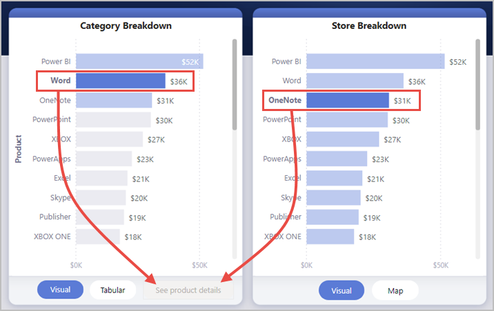

# <a name="create-a-drill-through-button-in-power-bi"></a>Skapa en knapp för detaljgranskning i Power BI

När du skapar en knapp i Power BI kan du välja åtgärden **Detaljvisning**. Den här åtgärdstypen skapar en knapp som leder vidare till en fokuserad sida för att få fram information som är filtrerad till en specifik kontext.

En detaljgranskningsknapp kan vara användbar om du vill öka identifierbarheten för viktiga detaljgranskningsscenarier i dina rapporter.

I det här exemplet aktiveras knappen **Se information** när användaren har valt Word-fältet i diagrammet.


När de väljer knappen **Se information** går de vidare till sidan för varukorgsanalys. Som du kan se på det visuella objektet till vänster filtreras nu sidan med detaljerad information för Word.


## <a name="set-up-a-drill-through-button"></a>Konfigurera en knapp för att gå ner på detaljnivå

Om du vill konfigurera en detaljgranskningsknapp måste du först [konfigurera en giltig sida med detaljerad visning](desktop-drillthrough.md) i rapporten. Sedan måste du skapa en knapp med **Detaljvisning** som åtgärdstyp och välja sidan med detaljvisning som **Mål**.

Eftersom knappen för att öka detaljnivån har två tillstånd (när detaljnivå är aktiverad eller inaktiverad) ser du att det finns två alternativ för knappbeskrivning.


Om du lämnar rutorna för knappbeskrivningar tomma genererar Power BI automatiskt knappbeskrivningar. Dessa knappbeskrivningar baseras på målet och fältet/fälten för detaljnivån.

Här är ett exempel på den automatiskt genererade knappbeskrivningen när knappen är inaktiverad:

”Om du vill gå vidare till varukorgsanalys (målsidan) väljer du en enskild datapunkt från Produkt (fältet för detaljnivå).”


Och här är ett exempel på den automatiskt genererade knappbeskrivningen när knappen är aktiverad:

”Klicka om du vill visa detaljnivån för varukorgsanalys (målsidan).”


Men om du vill ange anpassade knappbeskrivningar kan du alltid ange en statisk sträng. Vi stöder ännu inte villkorsstyrd formatering för knappbeskrivningar.

Du kan använda villkorsstyrd formatering för att ändra knapptexten baserat på det valda värdet för ett fält. Om du vill göra detta måste du skapa ett mått som matar ut den önskade strängen baserat på DAX-funktionen SELECTEDVALUE.

Här är ett exempel på ett mått som matar ut ”Visa produktinformation” om ett enstaka produktvärde INTE har valts, annars visas ”Visa information för [den valda produkten]”:

```
String_for_button = If(SELECTEDVALUE('Product'[Product], 0) == 0), "See product details", "See details for " & SELECTEDVALUE('Product'[Product]))
```

När du har skapat det här måttet väljer du alternativet **Villkorsstyrd formatering** för knapptexten:


Sedan väljer du det mått som du skapade för knapptexten:


När en enstaka produkt väljs blir knapptexten:

Visa information om Word


Om inga produkter är markerade eller om du har valt fler än en produkt är knappen inaktiverad och knapptexten lyder:

Visa produktinformation


## <a name="pass-filter-context"></a>Tillämpa filterkontext

Knappen fungerar som en normal detaljgranskning, så du kan också tillämpa filter på ytterligare fält genom att korsfiltrera de visuella objekt som innehåller fältet för detaljvisning. Om du t.ex. använder **Ctrl** + **klickning** och korsfiltrering kan du tillämpa flera filter från Store till sidan med detaljerad information, eftersom dina val korsfiltrerar det visuella objekt som innehåller Produkt, fältet med detaljnivån:


När du väljer knappen för detaljvisning ser du filter för både Store och Produkt som tillämpas på målsidan:


### <a name="ambiguous-filter-context"></a>Tvetydig filterkontext

Eftersom knappen för detaljnivån inte är kopplad till ett enskilt visuellt objekt, inaktiveras knappen om ditt val är tvetydigt.

I det här exemplet är knappen inaktiverad eftersom de två visuella objekten båda innehåller ett enda val för Produkt. Det är tvetydigt vilken datapunkt från vilket visuellt objekt som ska kopplas till detaljvisningsåtgärden för att:



## <a name="limitations"></a>Begränsningar

- Den här knappen tillåter inte flera mål med en enda knapp.
- Den här knappen stöder bara detaljvisning i samma rapport. Det finns med andra ord inte stöd för detaljvisning i flera rapporter.
- Formateringen för inaktiverat tillstånd för knappen är kopplad till färgklasserna i ditt rapporttema. Lär dig mer om [färgklasser](desktop-report-themes.md#setting-structural-colors).
- Åtgärden för detaljvisning fungerar för alla inbyggda visuella objekt, och fungerar med *vissa* visuella objekt som importeras från AppSource. Men det finns ingen garanti för att den fungerar med *alla* visuella objekt som importeras från AppSource.

## <a name="next-steps"></a>Nästa steg
Mer information om liknande funktioner eller funktioner som interagerar med knappar finns i följande artiklar:

* [Skapa knappar](desktop-buttons.md)
* [Använda detaljvisning i Power BI-rapporter](desktop-drillthrough.md)
* [Använda bokmärken för att dela information och skapa artiklar i Power BI](desktop-bookmarks.md)

