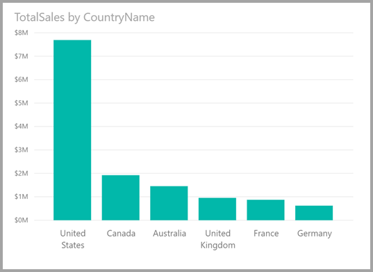
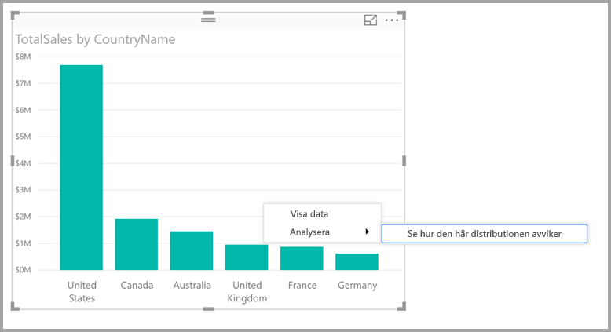

# Använda insikter i Power BI Desktop till att upptäcka var fördelningar varierar (förhandsversion)

I visuella objekt händer det ofta att man ser en datapunkt och vill veta om fördelningen skulle se likadan ut för olika kategorier. Med funktionen för **insikter** i **Power BI Desktop** kan du enkelt ta reda på det med bara några få klick.

Titta på följande visuella objekt, som visar *totalförsäljningen* efter *land*. Som du ser i diagrammet kommer merparten av försäljningen från USA, och uppgår till 57 % av all försäljning, med mindre bidrag från andra länder. I dessa fall är det ofta intressant att utforska om fördelningen ser likadan ut för olika delpopulationer. Ser det exempelvis likadant ut alla år, i alla försäljningskanaler och i alla produktkategorier?  Du kan naturligtvis använda olika filter och jämföra resultaten visuellt, men detta kan vara både tidskrävande och leda till fel. 

Du kan instruera **Power BI Desktop** att visa var en fördelning avviker, och få snabba, automatiserade och insiktsfulla analyser om dina data. Högerklicka bara på en datapunkt och välj **Analysera > Find where the distribution is different** (Visa var fördelningen skiljer sig) och granska sedan resultatet i ett användarvänligt fönster.

I det här exemplet visar den automatiserade analysen snabbt att försäljningsandelen för *Touring Bikes* är lägre i USA och Kanada och högre för de andra länderna.   

> [!NOTE]
> Den här funktionen är en förhandsversion och kan komma att ändras. Funktionen insikter aktiveras som standard (du inte behöver markera kryssrutan Förhandsgranskning för att aktivera den) från och med versionen från September 2017 av **Power BI Desktop**.
> 
> 

## Använda insikter
Om du vill använda insikter för att se var fördelningar som visas i diagram avviker högerklickar du bara på valfri datapunkt (eller på själva visualiseringen) och väljer **Analysera > Find where the distribution is different** (Visa var fördelningen skiljer sig).

**Power BI Desktop** kör sedan en maskininlärningsalgoritm mot dina data och visar ett fönster med ett visuellt objekt och en beskrivning som beskriver vilka kategorier (kolumner) och vilka värden i dessa kolumner som resulterar i den mest signifikant avvikande fördelningen. Insikter visas som ett stapeldiagram, som du ser i följande bild. 

Värdena som det valda filtret tillämpas på visas med den vanliga standardfärgen. Värdena i den ursprungliga visualiseringen visas i grått för enklare jämförelse. Du kan ta med upp till tre olika filter (*Touring Bikes*, *Mountain Bikes*, *Road Bikes* i det här exemplet) och du kan välja olika filter genom att klicka på dem. (Du kan också markera flera samtidigt genom att använda CTRL-tangenten.)

För enkla additiva mått, som *totalförsäljning* i det här exemplet, baseras jämförelsen på de relativa i stället för de absoluta värdena. Även om försäljningen av Touring Bikes är lägre än försäljningen i alla kategorier så används en dubbel axel i visualiseringen för att kunna jämföra försäljningsandelen mellan olika länder, för Touring Bikes jämfört med alla cykelkategorier.  Växlingsknappen nedanför visualiseringen gör att de två värdena kan visas på samma axel, så att de absoluta värdena enkelt kan jämföras (som du ser i följande bild).    

Genom att visa antalet poster som matchar filtret ger den beskrivande texten även en indikation på hur viktigt ett filtervärde är. I det här exemplet kan du se att även om fördelningen av *Touring Bikes* sticker ut, så motsvarar de endast 16,6 % av posterna.

Ikonerna *tummen upp* och *Tummen ned* överst på sidan finns där så att du kan ge feedback om det visuella objektet och funktionen. Genom att göra det kan du lämna feedback. För närvarande innebär detta dock inte att algoritmen tränas så att resultatet påverkas nästa gång du använder funktionen.

Knappen **+** längst upp i det visuella objektet låter dig lägga till det markerade visuella objektet i rapporten, precis som om du hade skapat det visuella objektet manuellt. Sedan kan du formatera eller justera det nya visuella objektet på samma sätt som något annat visuellt objekt i din rapport. Du kan bara lägga till ett visuellt objekt med insikter när du redigerar en rapport i **Power BI Desktop**.

Du kan använda insikter när rapporten är i läs- eller redigeringsläge, vilket gör det flexibelt för dataanalys och för att skapa visuella objekt som du kan lägga till i dina rapporter.

## Information om de returnerade resultaten
Enkelt beskrivet tar algoritmen alla andra kolumner i modellen, använder värdena i kolumnerna som filter i det ursprungliga visuella objektet och ser sedan vilka av dessa filtervärden som ger det mest *avvikande* resultatet jämfört med den ursprungliga visualiseringen.

Förmodligen undrar du vad *avvikande* innebär. Anta till exempel att den övergripande uppdelningen av försäljningen mellan USA och Kanada såg ut så här:

|Land  |Försäljning (miljoner USD)|
|---------|----------|
|USA      |15        |
|Kanada   |5         |

Och för en viss produktkategori (*Road Bike*) såg försäljningsuppdelningen ut så här:

|Land  |Försäljning (miljoner USD)|
|---------|----------|
|USA      |3        |
|Kanada   |1         |

Även om siffrorna skiljer sig i var och en av dessa tabeller, är de relativa värdena mellan USA och Kanada identiska (75 % och 25  % generellt, och för Road Bikes). Därför betraktas inte dessa som olika eller avvikande. För enkla additiva mått som detta letar algoritmen därför efter skillnader i det *relativa* värdet.  

Om vi däremot tar ett exempel med marginaler, som beräknas som vinst/kostnad, och antar att de övergripande marginalerna för USA och Kanada ser ur så här:

|Land  |Marginal (%)|
|---------|----------|
|USA      |15        |
|Kanada   |5         |

Och för en viss produktkategori (*Road Bike*) såg försäljningsuppdelningen ut så här:

|Land  |Marginal (%)|
|---------|----------|
|USA      |3        |
|Kanada   |1         |

Med tanke på hur den här typen av mått fungerar betraktas detta som signifikant *avvikande*. För icke-additiva mått som i det här exempel på marginaler letar algoritmen efter skillnader i det absoluta värdet.

De visuella objekten som visas är alltså avsedda att tydliggöra skillnaderna mellan den övergripande fördelningen (i den ursprungliga visualiseringen) och värdet då det specifika filtret tillämpas.  

För additiva mått, som *försäljningen* i föregående exempel, används ett stapel- och linjediagram, med en dubbel axel i lämplig skala som gör det enkelt att jämföra de relativa värdena. Staplarna visar värdet då filtret tillämpas, och linjen visar det övergripande värdet (med kolumnaxeln till vänster och radaxeln till höger som vanligt). Raden visas med ett *stegvist* format, med en streckad linje som är fylld med grått. För det föregående exemplet gäller att om kolumnaxelns högsta värde är 4, och radaxelns högsta värde är 20, så skulle det vara enkelt att jämföra de relativa värdena mellan USA och Kanada för filtrerade och övergripande värden. 

För icke-additiva mått, som *marginalerna* i föregående exempel, används också ett stapel- och linjediagram, där en enda axel gör det enkelt att jämföra de absoluta värdena. Även här visar linjen (i grått) det övergripande värdet. När faktiska eller relativa tal jämförs beräknas storleksskillnaden mellan två fördelningar inte bara som skillnaden i värdena. Exempel:

* Storleken på populationen tas med i beaktande eftersom en skillnad är mindre viktig statistiskt sett om den gäller för en mindre del av hela populationen. Exempelvis kanske skillnaden i försäljningsfördelningen mellan länder är mycket stor för en viss produkt. Detta skulle dock inte vara intressant om det fanns flera tusen produkter, och den specifika produkten endast utgjorde en liten procentandel av den övergripande försäljningen.

* Skillnader mellan dessa kategorier där de ursprungliga värdena är väldigt höga eller väldigt nära noll viktas högre än andra. Om ett land till exempel endast bidrar med 1 % av den övergripande försäljningen, men för en viss typ av produkt bidrar med 6 %, så är det mer signifikant statistiskt sett, och anses därför vara mer intressant, än ett land vars bidrag förändras från 50 % till 55 %. 

* Olika heuristiker används för att välja det mest meningsfulla resultatet, till exempel genom att överväga andra relationer mellan data.
     
När de olika kolumnerna, och värdena för var och en av dessa kolumner, har analyserats väljs den uppsättning värden ut som uppvisar störst skillnader. För att göra det enklare att förstå sambanden grupperas värdena efter kolumn, där den kolumn vars värden uppvisar störst skillnad visas först. Upp till tre värden visas per kolumn, men färre kan visas om det finns färre än tre värden som har stor påverkan eller om vissa värden har mycket större påverkan än andra. 

Eftersom inte alla kolumner i modellen alltid kan analyseras inom den tillgängliga tiden, kan det hända att de kolumner och värden med störst påverkan inte visas. Dock används olika heuristiker för att se till att de kolumner som anses vara mest sannolika analyseras först. Anta till exempel att alla kolumner har analyserats och att följande kolumner/värden anses ha störst påverkan på fördelningen, från störst till minst påverkan:

    Subcategory = Touring Bikes
    Channel = Direct
    Subcategory = Mountain Bikes
    Subcategory = Road Bikes
    Subcategory = Kids Bikes
    Channel = Store

Dessa skulle visas i kolumnordning på följande sätt:

    Subcategory: Touring Bikes, Mountain Bikes, Road Bikes (only three listed, with the text including “...amongst others” to indicate that more than three have a significant impact) 

    Channel = Direct (only Direct listed, if it’s level of impact was much greater than Store)

## Överväganden och begränsningar
Följande lista innehåller en samling scenarier som för närvarande inte fungerar med **insikter**:

* TopN-filter
* Måttfilter
* Icke-numeriska mått
* Användning av ”Visa värde som”
* Filtrerade mått – Filtrerade mått är beräkningar på visuell nivå med ett specifikt filter (till exempel *totalförsäljningen för Frankrike*), och används i vissa visuella objekt som skapas av funktionen Insikter

Dessutom stöds följande modelltyper och datakällor inte för närvarande med insikter:

* DirectQuery
* Live Connect
* Lokal Reporting Services
* Bädda in

## Nästa steg
För mer information om **Power BI Desktop**, och hur du kommer igång, ta en titt i följande artiklar.

* [Vad är Power BI Desktop?](../fundamentals/desktop-what-is-desktop.md)
* [Frågeöversikt med Power BI Desktop](../transform-model/desktop-query-overview.md)
* [Datakällor i Power BI Desktop](../connect-data/desktop-data-sources.md)
* [Anslut till data i Power BI Desktop](../connect-data/desktop-connect-to-data.md)
* [Forma och kombinera data i Power BI Desktop](../connect-data/desktop-shape-and-combine-data.md)
* [Vanliga frågeuppgifter i Power BI Desktop](../transform-model/desktop-common-query-tasks.md)   
