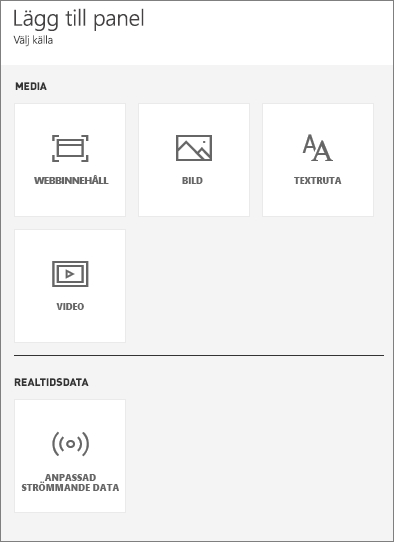
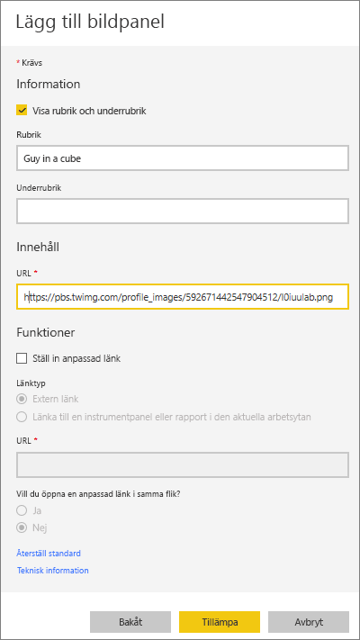
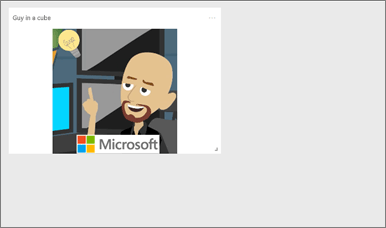
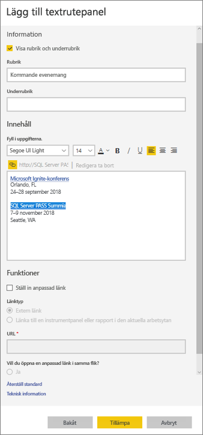
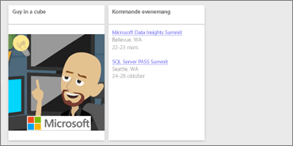
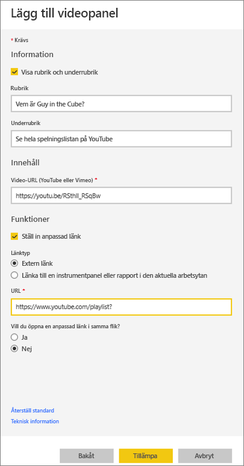
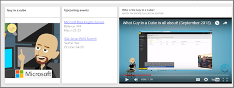
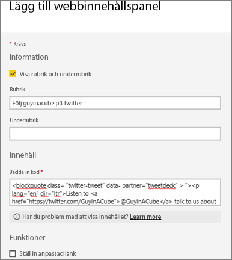
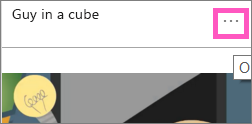
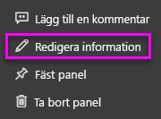

# <a name="add-images-videos-and-more-to-your-dashboard"></a>Lägga till bilder, videor med mera på din instrumentpanel

Genom att lägga till en panel på din instrumentpanel kan du placera en bild, textruta, video, strömmande data eller webbkod på instrumentpanelen. 

Se hur Amanda lägger till paneler på en instrumentpanel.

   
<iframe width="560" height="315" src="https://www.youtube.com/embed/e2PD8m1Q0vU" frameborder="0" allowfullscreen></iframe>


## <a name="add-an-image-video-or-other-tile"></a>Lägga till en bild, video eller en annan panel
Du kan lägga till en bild, textruta, video, strömmande data eller webbkod direkt på din instrumentpanel.

1. Välj **Lägg till panel** från den översta menyraden på instrumentpanelen. Beroende på utrymmesbegränsningarna kanske du bara ser plustecknet .
   
    
2. Välj vilken typ av panel du vill lägga till: 

    **[Webbinnehåll](#add-web-content)**

    **[Bild](#add-an-image)**

    **[Textruta](#add-a-text-box-or-dashboard-heading)**

    **[Video](#add-a-video)**

    **[Anpassade strömmande data](#add-streaming-data)**
   
    

## <a name="add-an-image"></a>Lägg till en bild
Om du vill lägga till företagets logotyp eller någon annan bild till din instrumentpanel sparar du bildfilen online och länkar till den. Kontrollera att det inte behövs autentiseringsuppgifter för att komma åt bildfilen. OneDrive och SharePoint kräver till exempel autentisering, så bilder som lagras där går inte att lägga till på en instrumentpanel på det här sättet.  

1. I fönstret **Lägg till panel** väljer du **Bild** > **Nästa**.

2. Lägg till bildinformation i fönstret **Lägg till bildpanel**:   
   
   a. Om du vill visa en rubrik ovanför bilden väljer du **Visa rubrik och underrubrik** och anger en **Rubrik** och **Underrubrik** om du vill det.

   b. Ange bildens **URL**.

   c. Om du vill göra panelen till en hyperlänk väljer du **Ställ in anpassad länk** och anger **URL**:en. 

      När kollegor klickar på den här bilden eller rubriken, vidarebefordras de till denna URL.

   d. Välj **Använd**. 

      

3. På instrumentpanelen, ändrar du storlek på och flyttar bilden efter behov.
     
     

## <a name="add-a-text-box-or-dashboard-heading"></a>Lägg till en rubrik för en textruta eller instrumentpanel

Om du vill lägga till en rubrik för en instrumentpanel, skriver du in rubriken i textrutan och ökar teckensnittet.

1. I fönstret **Lägg till panel** väljer du **Textruta** > **Nästa**.

2. Formatera textrutan:
   
   a. Om du vill visa en rubrik ovanför textrutan väljer du **Visa rubrik och underrubrik** och anger en **Rubrik** och **Underrubrik** om du vill det.

   b. Ange och formatera **Innehåll** i textrutan.  

   c. Du kan också ange en anpassad länk för rubriken. En anpassad länk kan gå till en extern webbplats eller en instrumentpanel eller rapport på arbetsytan. Men i det här exemplet har vi lagt till hyperlänkar i själva textrutan så vi lämnar **Ställ in anpassad länk** avmarkerad.

   d. Välj **Använd**. 

     
   
3. På instrumentpanelen, ändrar du storlek på och flyttar textrutan efter behov.
   
   

## <a name="add-a-video"></a>Lägg till en video
När du lägger till en YouTube eller Vimeo-videopanel på instrumentpanelen, spelar videon direkt på din instrumentpanel.

1. I fönstret **Lägg till panel** väljer du **Video** > **Nästa**.
2. Lägg till videoinformation i fönstret **Lägg till videopanel**:   
   
   a. Om du vill visa en rubrik och underrubrik ovanför videopanelen, väljer du **Visa rubrik och underrubrik** och anger en **Rubrik** och en **Underrubrik** om du vill det. I det här exemplet ska vi lägga till en **Underrubrik** och sedan omvandla den till en hyperlänk till hela spellistan på YouTube.

   b. Ange **Video-URL**.

   c. Lägg till en hyperlänk för **Rubrik** och **Underrubrik** så att dina kollegor kan se hela spellistan på YouTube när de har tittat på den inbäddade videon. Det gör du genom att under **Funktioner** välja **Ställ in anpassad länk** och sedan ange **URL**:en för spellistan.

   d. Välj **Använd**.  

   

3. På instrumentpanelen, ändrar du storlek på och flyttar videopanelen efter behov.
     
   
4. Välj videopanelen för att spela videon.
5. Välj underrubriken för att gå till spellistan på YouTube.

## <a name="add-streaming-data"></a>Lägg till strömmande data
Du kan använda PubNub för att lägga till strömmande data, till exempel Twitter-flöden eller sensordata, på en panel på instrumentpanelen. Power BI har skapat en integration för att hämta data från PubNub. Här förklarar Will hur det fungerar.
   

<iframe width="560" height="315" src="https://www.youtube.com/embed/kOuINwgkEkQ" frameborder="0" allowfullscreen></iframe>

1. Från fönstret **Lägg till panel** väljer du **Anpassade strömmande data** > **Nästa**.
2. Välj **Lägg till strömmande datauppsättning**.
3. Skapa en **Ny strömmande datauppsättning** med hjälp av Power BI-API eller PubNub.
4. Fyll i fälten för **Namn på datauppsättning**, **Prenumerationsnyckel** och **Kanalnamn**. Om det är en säker anslutning har den också en autentiseringsnyckel. Du kan använda exempelvärdena från PubNub för att testa det.
5. Välj **Nästa**.
    Du ser de fält som är tillgängliga i datauppsättningen, med deras datatyper och JSON-format.
6. Välj **Anslut**.
    Du har skapat en strömmande datauppsättning.
7. Gå tillbaka till instrumentpanelen och välj **Lägg till panel** > **Anpassade strömmande data** > **Nästa**.
8. Välj den sensordatauppsättning du skapade > **Nästa**.
9. Välj den visuella typ som du vill använda. Ett linjediagram fungerar ofta bra för dessa data.
10. Välj **Axel**, **Förklaring** och **Värden**.
11. Ange hur lång tid som ska visas, antingen i sekunder, minuter eller timmar.
12. Välj **Nästa**.
13. Ge den en **Rubrik** och **Underrubrik**, om du vill.
14. Fäst den på din instrumentpanel.


1. Från fönstret **Lägg till panel** väljer du **Anpassade strömmande data** > **Nästa**.

2. Välj **Lägg till strömmande datauppsättning**.

3. Skapa en **Ny strömmande datauppsättning** med hjälp av Power BI-API eller PubNub.

4. Fyll i fälten för **Namn på datauppsättning**, **Prenumerationsnyckel** och **Kanalnamn**. Om det är en säker anslutning har den också en autentiseringsnyckel. Du kan använda exempelvärdena från PubNub för att testa det.

5. Välj **Nästa**.

   Du ser de fält som är tillgängliga i datauppsättningen, med deras datatyper och JSON-format.

6. Välj **Anslut**.

   Du har skapat en strömmande datauppsättning.

7. Gå tillbaka till instrumentpanelen och välj **Lägg till panel** > **Anpassade strömmande data** > **Nästa**.

8. Välj den sensordatauppsättning du skapade > **Nästa**.

9. Välj den visuella typ som du vill använda. Ett linjediagram fungerar ofta bra för dessa data.

10. Välj **Axel**, **Förklaring** och **Värden**.

11. Ange hur lång tid som ska visas, antingen i sekunder, minuter eller timmar.

12. Välj **Nästa**.

13. Om du vill kan du ge den en **Rubrik** och **Underrubrik**.

14. Fäst den på din instrumentpanel.

## <a name="add-web-content"></a>Lägg till webbinnehåll
Du kan klistra in eller skriva in HTML-innehåll som en panel i rapporten eller på instrumentpanelen. Ange inbäddningskoden manuellt eller kopiera och klistra in från webbplatser som Twitter, YouTube, embed.ly med flera.

1. I fönstret **Lägg till panel** väljer du **Webbinnehåll** > **Nästa**.

2. Lägg till information i fönstret **Lägg till webbinnehållspanel**:
   
   a. Om du vill visa en rubrik ovanför panelen väljer du **Visa rubrik och underrubrik** och anger en **Rubrik** och **Underrubrik** om du vill det.

   b. Ange inbäddningskoden. I det här exemplet kopierar vi och klistrar in ett Twitter-flöde.

   c. Välj **Använd**.

   
   

3. På instrumentpanelen, ändrar du storlek på och flyttar webbinnehållspanelen efter behov.
     
   

### <a name="tips-for-embedding-web-content"></a>Tips för inbäddning av webbinnehåll
* Använd en säker källa för iframes. Om du anger din iframe-inbäddningskod och får en tom panel bör du kontrollera att du inte använder *http* för iframe-källan. Ändra i så fall till *https*.
  
  ```html
  <iframe src="https://xyz.com">
  ```
* Redigera bredd- och höjdinformation. Den här inbäddningskoden bäddar in en video och ställer in videospelaren till 560 x 315 bildpunkter. Den här storleken ändras inte när du ändrar storlek på panelen.
  
  ```html
  <iframe width="560" height="315"
  src="https://www.youtube.com/embed/Cle_rKBpZ28" frameborder="0"
   allowfullscreen></iframe>
  ```
  
  Om du vill att spelaren ändrar storlek för att passa panelen, anger du bredd och höjd till 100%.
  
  ```html
  <iframe width="100%" height="100%"
  src="https://www.youtube.com/embed/Cle_rKBpZ28" frameborder="0"
   allowfullscreen></iframe>
  ```
* Den här koden bäddar in en tweet och bevarar länkar till AFK-podcasten, \@GuyInACubes Twittersida, följ, #analytics, svara, retweeta och gilla som separata länkar på instrumentpanelen.  Om du väljer själva panelen så går du till podcasten på Twitter.
  
  ```html
  <blockquote class="twitter-tweet" data-partner="tweetdeck">
  <p lang="en" dir="ltr">Listen to
  <a href="https://twitter.com/GuyInACube">@GuyInACube</a> talk to
  us about making videos about Microsoft Business Intelligence
  platform
  <a href="https://t.co/TmRgalz7tv">https://t.co/TmRgalz7tv </a>
  <a href="https://twitter.com/hashtag/analytics?src=hash">
  #analytics</a></p>&mdash; AFTK Podcast (@aftkpodcast) <a
  href="https://twitter.com/aftkpodcast/status/693465456531771392">
  January 30, 2016</a></blockquote> <script async src="//platform.twitter.com/widgets.js" charset="utf-8"></script>
  ```

## <a name="edit-a-tile"></a>Redigera en panel
Så här gör du ändringar i en befintlig panel:

1. Hovra över panelens övre högra hörn och välj **Fler alternativ** (…).
   
    
2. Välj **Redigera information** för att visa fönstret **Panelinformation** och göra ändringar.
   
    

## <a name="considerations-and-troubleshooting"></a>Överväganden och felsökning
* Om du vill göra det lättare att flytta panelen på din instrumentpanel, kan du lägga till en rubrik och en underrubrik om du vill det.
* Om du vill bädda in innehåll från en webbplats, men inte får någon inbäddningskod från webbplatsen att kopiera och klistra in, kan du kolla embed.ly för hjälp med att skapa inbäddningskoden.

## <a name="next-steps"></a>Nästa steg
[Introduktion till paneler på instrumentpanelen för Power BI-designers](service-dashboard-tiles.md)

Fler frågor? [Testa Power BI Community](https://community.powerbi.com/).

