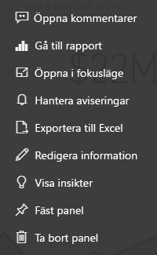

# Introduktion till paneler på instrumentpanelen för Power BI-designers

En panel är en ögonblicksbild av dina data, fäst på instrumentpanelen. En panel kan skapas från en rapport, datamängd, instrumentpanel, Frågor och svar-rutan, Excel samt SQL Server Reporting Services-rapporter (SSRS) med mera.  Den här skärmbilden visar många olika paneler fästa på en instrumentpanel.

Instrumentpaneler och paneler på instrumentpanelen är en funktion i Power BI-tjänsten, inte Power BI Desktop. Du kan inte skapa instrumentpaneler på mobila enheter, men du kan [view and share]../consumer/mobile/mobile-apps-view-dashboard.md) dem där.

Utöver att fästa paneler kan du även skapa fristående paneler direkt på instrumentpanelen med hjälp av kontrollen [Lägg till panel](service-dashboard-add-widget.md). Fristående paneler innehåller: textrutor, bilder, videor, strömmande data och webbinnehåll.

Behöver du hjälp med att förstå de olika byggstenarna som utgör Power BI? Se [Grundläggande begrepp för designers i Power BI-tjänsten](../fundamentals/service-basic-concepts.md).

> [!NOTE]
> Om den ursprungliga visualiseringen som användes för att skapa panelen ändras, ändras inte panelen.  Om du till exempel har fäst ett linjediagram från en rapport och sedan ändrar linjediagrammet till ett stapeldiagram, fortsätter panelen på instrumentpanelen att visa ett linjediagram. Data uppdateras, men visualiseringstypen gör det inte.
> 
> 

## Fästa en panel
Det finns många olika sätt att lägga till (fästa) en panel till en instrumentpanel. Du kan fästa paneler från:

* [Power BI frågor och svar](service-dashboard-pin-tile-from-q-and-a.md)
* [En rapport](service-dashboard-pin-tile-from-report.md)
* [En annan instrumentpanel](service-pin-tile-to-another-dashboard.md)
* [Excel-arbetsbok på OneDrive för företag](service-dashboard-pin-tile-from-excel.md)
* [Quick Insights](service-insights.md)
* [En lokal sidnumrerad rapport i Power BI-rapportserver eller SQL Server Reporting Services](https://docs.microsoft.com/sql/reporting-services/pin-reporting-services-items-to-power-bi-dashboards)

Du skapar fristående paneler för bilder, textrutor, videor, strömmande data och webbinnehåll direkt på instrumentpanelen med hjälp av kontrollen [Lägg till panel](service-dashboard-add-widget.md).

  

## Interagera med paneler på en instrumentpanel
När du har lagt till en panel på en instrumentpanel kan du flytta och ändra storlek på den eller ändra dess utseende och beteende.

### Flytta och ändra storlek på en panel
Hämta en panel och [flytta runt den på instrumentpanelen](service-dashboard-edit-tile.md). Hovra och välj handtaget  för att ändra storlek på panelen.

### Hovra över en panel för att ändra utseendet och beteendet
1. Hovra över panelen för att visa ellipsen.
   
    
2. Välj ellipsen för att öppna menyn för panelåtgärder.
   
    
   
    Här kan göra du följande:
   
     * [Lägga till kommentarer på instrumentpanelen](../consumer/end-user-comment.md).
     * [Öppna den rapport som användes för att skapa den här panelen](../consumer/end-user-reports.md).  
     * [Visa i fokusläge](../consumer/end-user-focus.md).   
     * [Exportera de data som används i panelen](../visuals/power-bi-visualization-export-data.md).
     * [Redigera rubriken och lägga till en hyperlänk](service-dashboard-edit-tile.md). 
     * [Köra insikter](service-insights.md). 
     * [Fästa panelen till en annan instrumentpanel](service-pin-tile-to-another-dashboard.md).
     * [Ta bort panelen](service-dashboard-edit-tile.md).

3. Om du vill stänga åtgärdsmenyn väljer du ett tomt område på instrumentpanelen.

### Välja en panel
När du väljer en panel beror händelseförloppet på hur du skapade panelen. I annat fall kommer du, om du väljer panelen, till rapporten, arbetsboken i Excel Online, den lokala Reporting Services-rapporten eller frågor och svar som användes för att skapa panelen. Eller om den har en [anpassad länk](service-dashboard-edit-tile.md) kommer du till den länken om du väljer panelen.

> [!NOTE]
> Ett undantag för detta är videopaneler som skapats direkt på instrumentpanelen med hjälp av **Lägg till panel**. Om en videopanel (som skapades på det här sättet) väljs så spelas videon upp direkt på instrumentpanelen.   
> 
> 

## Överväganden och felsökning

* Om den rapport som användes för att skapa visualiseringen inte sparades kommer inget att hända om panelen väljs.
* Om panelen skapades från en arbetsbok i Excel Online behöver du minst läsbehörighet för arbetsboken. I annat fall öppnas inte arbetsboken i Excel Online när du väljer panelen.
* Anta att du skapar en panel direkt på instrumentpanelen med hjälp av **Lägg till panel** och anger en anpassad hyperlänk för den. I så fall öppnas den webbadressen när du väljer rubriken, underrubriken eller panelen. I annat fall händer som standard ingenting om du väljer en panel som skapats direkt på instrumentpanelen för en bild, webbkod eller textruta.
* Paneler kan skapas från lokala sidnumrerade rapporter i Power BI-rapportserver eller SQL Server Reporting Services. Om du väljer panelen och inte har behörighet att komma åt den lokala rapporten kommer du till en sida där det står att du inte har åtkomst (rsAccessDenied).
* Anta att du väljer en panel som skapats från en lokal sidnumrerad rapport i Power BI-rapportserver eller SQL Server Reporting Services. Om du inte har åtkomst till det nätverk där rapportservern finns kommer val av en panel som skapats från den sidnumrerade rapporten att dirigera dig till en sida som anger att den inte kan hitta servern (HTTP 404). Enheten måste ha nätverksåtkomst till rapportservern för att visa rapporten.
* Om den ursprungliga visualiseringen som användes för att skapa panelen ändras så ändras inte panelen. Om du till exempel fäster ett linjediagram från en rapport och sedan ändrar linjediagrammet till ett stapeldiagram, fortsätter panelen på instrumentpanelen att visa ett linjediagram. Data uppdateras, men visualiseringstypen gör det inte.

## Nästa steg
- [Skapa ett kort (stor sifferpanel) för din instrumentpanel](../visuals/power-bi-visualization-card.md)
- [Introduktion till instrumentpaneler för Power BI-designers](service-dashboards.md)  
- [Datauppdatering i Power BI](../connect-data/refresh-data.md)
- [Grundläggande begrepp för designers i Power BI-tjänsten](../fundamentals/service-basic-concepts.md)
- [Integrera Power BI-paneler i Office-dokument](https://powerbi.microsoft.com/blog/integrating-power-bi-tiles-into-office-documents/)
- [Fästa Reporting Services-objekt till Power BI-instrumentpaneler](https://msdn.microsoft.com/library/mt604784.aspx)

Har du fler frågor? [Testa Power BI Community](https://community.powerbi.com/).
