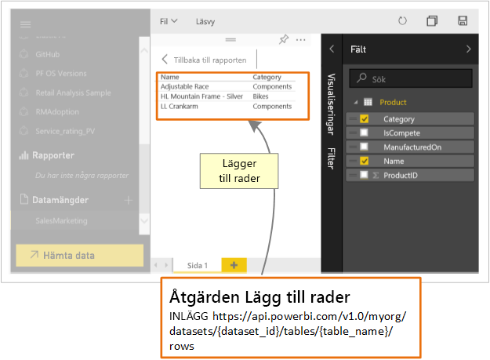

# Vad kan utvecklare göra med Power BI-API?

Med Power BI REST API kan du skapa appar som integreras med Power BI-rapporter, -instrumentpaneler och -paneler.

Med Power BI REST API är det möjligt att utföra hanteringsuppgifter på Power BI-objekt som rapporter, datauppsättningar och arbetsytor.

Här följer några av de saker som du kan göra med Power BI-API:er.

| **Läs mer** | **Använd följande information** |
|----------------------------------------------------------------------------------|------------------------------------------------------------------------------------|
| Bädda in rapporter, instrumentpaneler och paneler för Power BI-användare och icke-Power BI-användare. | [Så här bäddar du in dina instrumentpaneler, rapporter och paneler i Power BI ](../embedded/embed-sample-for-customers.md) |
| Utföra hanteringsuppgifter på Power BI-objekt. | [Power BI REST API-referens](https://docs.microsoft.com/rest/api/power-bi/) |
| Utöka ett befintligt business-arbetsflöde för att skicka viktiga data till en Power BI-instrumentpanel. | [Skicka data till en instrumentpanel ](walkthrough-push-data.md) |
| Autentisera till Power BI. | [Autentisera till Power BI ](../embedded/get-azuread-access-token.md) |

> [!NOTE]
> I API:erna för Power BI kallas arbetsytor fortfarande för grupper. Referenser till grupper innebär att du arbetar med arbetsytor.

## API-utvecklarverktyg

| Verktyg | Beskrivning |  |  |
|-------------------------|---------------------------------------------------------------------------------------------------------------------------------------------------|---|---|
| [Testplatsverktyg](https://microsoft.github.io/PowerBI-JavaScript/demo) | Se ett fullständigt exempel på hur du använder Power BI JavaScript-API:erna. Det här verktyget är också ett snabbt sätt att leka med olika typer av Power BI Embedded-exempel. |  |  |
| [Power BI JavaScript-wiki](https://github.com/Microsoft/powerbi-javascript/wiki) | Mer information om Power BI JavaScript-API:erna. |  |  |
| [Postman](https://www.getpostman.com/) | Köra begäranden, testa, felsöka, övervaka, köra automatiska tester och mycket mer. |

## Skicka data till Power BI

Du kan använda Power BI-API:et för att [skicka data till en datauppsättning](walkthrough-push-data.md). Den här funktionen låter dig lägga till en rad i en tabell i en datauppsättning. Den nya informationen återspeglas sedan i panelerna på en instrumentpanel och i visuella objekt i rapporten.

## GitHub-databaser

* [Power BI Developer-exempel](https://github.com/Microsoft/PowerBI-Developer-Samples)
* [.NET SDK](https://github.com/Microsoft/PowerBI-CSharp)
* [JavaScript API](https://github.com/Microsoft/PowerBI-JavaScript)

## Nästa steg

* [Skicka data till en datauppsättning](walkthrough-push-data.md)
* [Utveckla ett visuellt Power BI-objekt](../visuals/custom-visual-develop-tutorial.md)
* [Power BI REST API-referens](rest-api-reference.md)
* [REST API:er för Power BI](https://docs.microsoft.com/rest/api/power-bi/)

Har du fler frågor? [Fråga Power BI Community](https://community.powerbi.com/)
