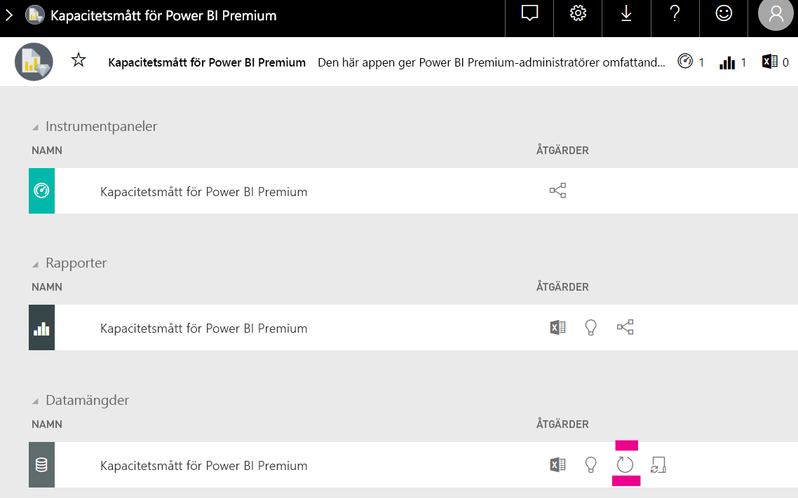

# Kapacitetsplanering i inbäddad Power BI-analys

Det kan vara komplicerat att beräkna vilken typ av kapacitet som krävs för en distribution av Power BI Embedded-analys. Detta beror på att beräkningen baseras på flera parametrar, men att några av dem är svåra att förutsäga.

Några saker att tänka på när du planerar din kapacitet är:

* De datamodeller du använder
* Antal obligatoriska frågor och deras komplexitet
* Timfördelningen av användningen av ditt program
* Datauppdateringavgifter
* Ytterligare användningsmönster som är svåra att förutsäga.

Den här artikeln är utformad för att underlätta kapacitetsplaneringen för inbäddad Power BI-analys genom att introducera [utvärderingsverktyget för dedikerad Power BI-kapacitetsinläsning](https://github.com/microsoft/PowerBI-Tools-For-Capacities/tree/master/LoadTestingPowerShellTool/), som skapats för automatisering av belastningstestning för inbäddade Power BI-analyskapaciteter (*A*, *EM* eller *P* SKU:er).

## Planeringsverktyg

 [Utvärderingsverktyget för dedikerad Power BI-kapacitetsinläsning](https://github.com/microsoft/PowerBI-Tools-For-Capacities/tree/master/LoadTestingPowerShellTool/) kan hjälpa dig att förstå hur stor användarbelastning din kapacitet kan hantera. Det använder PowerShell för att skapa automatiserade belastningstest mot dina kapaciteter, och låter dig välja vilka rapporter som ska testas och hur många samtidiga användare som ska simuleras.

Verktyget genererar belastningen på en kapacitet genom att kontinuerligt återge varje rapport med nya filtervärden (för att förhindra orealistiskt goda prestanda pga cachelagring av rapport) tills den token som krävs för att autentisera verktyget mot tjänsten upphör att gälla.

### Använda planeringsverktyget

När du kör verktyget så var uppmärksam på den befintliga belastningen på dina kapaciteter och se till att inte köra belastningstester de tider då användningen är som högst.

Här följer några exempel på hur du kan använda planeringsverktyget.

* Kapacitetsadministratörer kan få en bättre förståelse för hur många användare deras kapacitet kan hantera under en bestämd tidsperiod.
* Rapportförfattare kan förstå användarbelastningseffekten, så som den mäts med Power BI-datorernas [prestandaanalys](https://docs.microsoft.com/power-bi/desktop-performance-analyzer).
* Du kan se vad som händer i realtid i webbläsaren.
* Med hjälp av SQL Server Profiler kan du [ansluta till XMLA-slutpunkterna](https://powerbi.microsoft.com/blog/power-bi-open-platform-connectivity-with-xmla-endpoints-public-preview/) för de kapaciteter som mäts, så at du kan se de frågor som körs.
* Belastningstestseffekterna visas på sidan Datamängder i appen för premiumkapacitetsmått. Kapacitetsadministratörer kan använda det här verktyget för att generera belastning och se hur belastningen visas.

### Granska testresultaten

Följ anvisningarna nedan om du vill se effekten av det genomförda belastningstestet i måttappen. Räkna med en fördröjning på 15 minuter från den tidpunkt då testet börjar generera belastning till dess att belastningen visas i måtten.

1. Expandera fliken **Datamängder** på [måttappens](../../service-admin-premium-monitor-capacity.md) landningssida.
2. Starta en uppdatering på begäran genom att klicka på **Uppdatera nu**. Administratörer bör.

    

## Power BI-kapacitetsverktyg GitHub-lagringsplats

[Power BI-kapacitetsverktyg GitHub-lagringsplats](https://github.com/microsoft/PowerBI-Tools-For-Capacities) skapades för att vara värd för kapacitetsplaneringsverktyget och andra framtida verktyg och hjälpmedel.

Lagringsplatsen basera på öppen källkod och användare uppmuntras att bidra och lägga till ytterligare verktyg som rör Power BI Premium-kapaciteter och inbäddade kapaciteter samt förbättra befintliga.

## Nästa steg

> [!div class="nextstepaction"]
>[Kapacitet och SKU:er i inbäddad Power BI-analys](embedded-capacity.md)

> [!div class="nextstepaction"]
>[Metodtips för Power BI Embedded-prestanda](embedded-performance-best-practices.md)