# <a name="tutorial-developing-a-power-bi-visual"></a>Självstudie: Utveckla ett visuellt Power BI-objekt

Vi ger utvecklare möjlighet att enkelt lägga till visuella Power BI-objekt som kan användas på instrumentpanelen och i rapporterna. Som en hjälp för dig att komma igång har vi publicerat koden för alla våra visualiseringar på GitHub.

Tillsammans med visualiseringsramverket tillhandahåller vi vår testsvit och våra verktyg så att communityn kan skapa högkvalitativa visuella Power BI-objekt.

Den här självstudien visar hur du utvecklar ett anpassat visuellt Power BI-objekt med namnet Circle Card för att visa ett formaterat måttvärde inuti en cirkel. Det visuella objektet Circle Card stöder anpassning av fyllningsfärg och konturtjocklek.

I Power BI Desktop-rapporten ändrats korten så att de blir cirkelkort.

  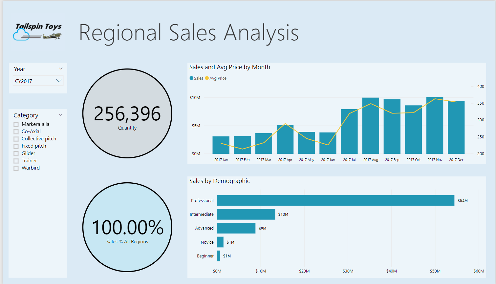

I de här självstudierna får du lära dig att
> [!div class="checklist"]
> * Skapa ett anpassat visuellt objekt i Power BI.
> * Utveckla det anpassade visuella objektet med visuella D3-element.
> * Konfigurera databindning med de visuella elementen.
> * Formatera datavärden.

## <a name="prerequisites"></a>Förutsättningar

* Om du inte har registrerat dig för **Power BI Pro**, [registrerar du dig för en kostnadsfri utvärderingsversion](https://powerbi.microsoft.com/pricing/) innan du börjar.
* Du måste ha [Visual Studio Code](https://www.visualstudio.com/) installerat.
* Du behöver [Windows PowerShell](https://docs.microsoft.com/powershell/scripting/setup/installing-windows-powershell?view=powershell-6) version 4 eller senare för Windows-användare ELLER [Terminal](https://macpaw.com/how-to/use-terminal-on-mac) för OSX-användare.

## <a name="setting-up-the-developer-environment"></a>Konfigurera utvecklarmiljön

Förutom förhandskraven finns det ytterligare några verktyg som du behöver installera.

### <a name="installing-nodejs"></a>Installera node.js

1. Om du vill installera Node.js, i en webbläsare går du till [Node.js](https://nodejs.org).

2. Ladda ned det senaste MSI-installationsprogrammet.

3. Kör installationsprogrammet och följ sedan installationsstegen. Acceptera villkoren i licensavtalet och alla standardvärden.

   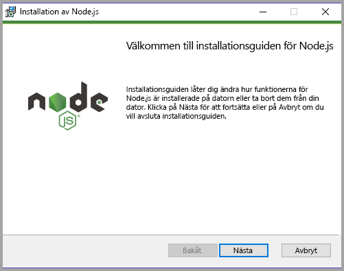

4. Starta om datorn.

### <a name="installing-packages"></a>Installera paket

Nu måste du installera **pbiviz**-paketet.

1. Öppna Windows PowerShell när datorn har startats om.

2. Installera pbiviz genom att ange följande kommando.

    ```powershell
    npm i -g powerbi-visuals-tools
    ```

### <a name="creating-and-installing-a-certificate"></a>Skapa och installera ett certifikat

#### <a name="windows"></a>Windows

1. Ange följande kommando för att skapa och installera ett certifikat.

    ```powershell
    pbiviz --install-cert
    ```

    Det returnerar ett resultat som producerar en *lösenfras*. I det här fallet är *lösenfrasen* **_15105661266553327_** . Det startar också guiden Importera certifikat.

    

2. I guiden Importera certifikat kontrollerar du att lagringsplatsen har angetts till aktuell användare. Välj sedan *Nästa*.

      

3. Välj *Nästa* i steget **Fil att importera**.

4. Klistra in den lösenfras som du fick när du skapade certifikatet i rutan Lösenfras under steget **skydd av privat nyckel**.  I det här fallet är den också **_15105661266553327_** .

      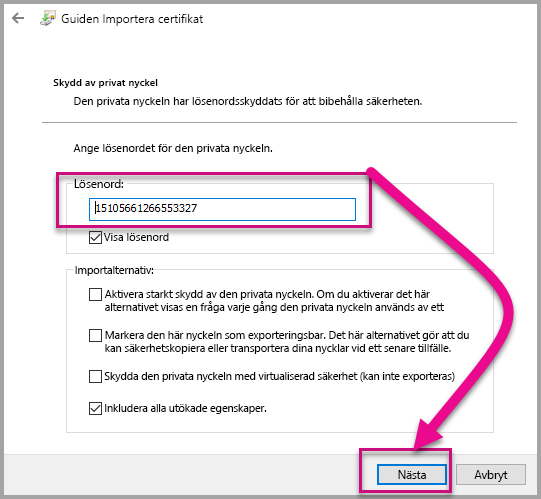

5. Välj alternativet **Placera alla certifikat i följande arkiv** i steget **Certifikatarkiv**. Välj sedan *Bläddra*.

      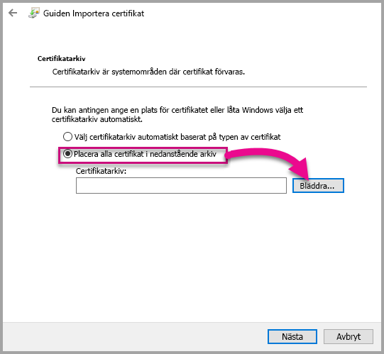

6. Välj **Betrodda rotcertifikatutfärdare** i fönstret **Välj certifikatarkiv** och välj sedan *OK*. Välj sedan *Nästa* på skärmen **Certifikatarkiv**.

      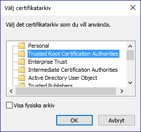

7. Välj **Slutför** om du vill slutföra importen.

8. Välj **Ja** om du får en säkerhetsvarning.

    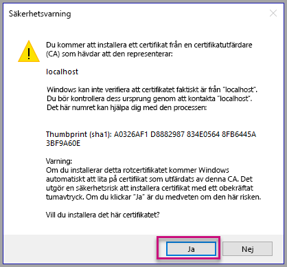

9. Välj **OK** när får ett meddelande om att importen lyckades.

    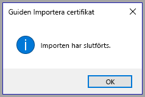

> [!Important]
> Stäng inte Windows PowerShell-sessionen.

#### <a name="osx"></a>OSX

1. Om låset i det övre vänstra hörnet är låst markerar du det för att låsa upp det. Sök efter *localhost* och dubbelklicka på certifikatet.

    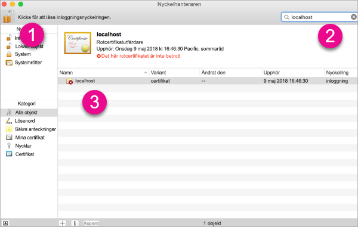

2. Välj **Lita alltid på** och stäng fönstret.

    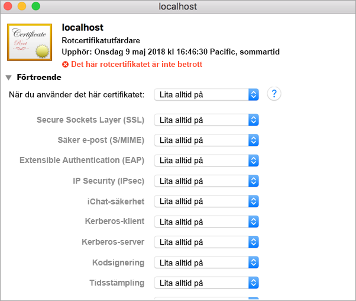

3. Ange ditt användarnamn och lösenord. Välj **Uppdatera inställningar**.

    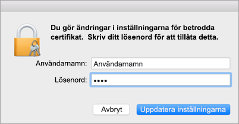

4. Stäng alla webbläsare som du har öppnat.

> [!NOTE]
> Om certifikatet inte har identifierats kan du behöva starta om datorn.

## <a name="creating-a-custom-visual"></a>Skapa ett anpassat visuellt objekt

Nu när du har konfigurerat din miljö är det dags att skapa ditt anpassade visuella objekt.

Du kan [hämta](https://github.com/Microsoft/PowerBI-visuals-circlecard) den fullständiga källkoden för den här självstudiekursen.

1. Kontrollera att paketet med visuella verktyg för Power BI har installerats.

    ```powershell
    pbiviz
    ```
    Du bör se utdata för hjälp.

    <pre><code>
        +syyso+/
    oms/+osyhdhyso/
    ym/       /+oshddhys+/
    ym/              /+oyhddhyo+/
    ym/                     /osyhdho
    ym/                           sm+
    ym/               yddy        om+
    ym/         shho /mmmm/       om+
        /    oys/ +mmmm /mmmm/       om+
    oso  ommmh +mmmm /mmmm/       om+
    ymmmy smmmh +mmmm /mmmm/       om+
    ymmmy smmmh +mmmm /mmmm/       om+
    ymmmy smmmh +mmmm /mmmm/       om+
    +dmd+ smmmh +mmmm /mmmm/       om+
            /hmdo +mmmm /mmmm/ /so+//ym/
                /dmmh /mmmm/ /osyhhy/
                    //   dmmd
                        ++

        PowerBI Custom Visual Tool

    Usage: pbiviz [options] [command]

    Commands:

    new [name]        Create a new visual
    info              Display info about the current visual
    start             Start the current visual
    package           Package the current visual into a pbiviz file
    update [version]  Updates the api definitions and schemas in the current visual. Changes the version if specified
    help [cmd]        display help for [cmd]

    Options:

    -h, --help      output usage information
    -V, --version   output the version number
    --install-cert  Install localhost certificate
    </code></pre>

    <a name="ssl-setup"></a>

2. Granska utdata, inklusive listan över kommandon som stöds.

    

3. Skapa ett anpassat visualiseringsprojekt genom att ange följande kommando. **CircleCard** är projektets namn.

    ```PowerShell
    pbiviz new CircleCard
    ```
    

    > [!Note]
    > Du skapar det nya projektet på den aktuella platsen för prompten.

4. Navigera till projektmappen.

    ```powershell
    cd CircleCard
    ```
5. Starta det anpassade visuella objektet. Ditt visuella CircleCard-objekt körs nu samtidigt som det finns på datorn.

    ```powershell
    pbiviz start
    ```

    

> [!Important]
> Stäng inte Windows PowerShell-sessionen.

### <a name="testing-the-custom-visual"></a>Testa det anpassade visuella objektet

I det här avsnittet ska vi testa det anpassade visuella CircleCard-objektet genom att skicka en Power BI Desktop-rapport och sedan redigera rapporten för att visa det anpassade visuella objektet.

1. Logga in på [PowerBI.com](https://powerbi.microsoft.com/) > gå till **kugghjulsikonen** > välj sedan **Inställningar**.

      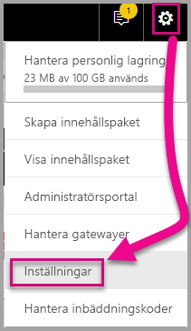

2. Välj **Utvecklare** och markera sedan kryssrutan **Aktivera visuellt objekt för utvecklare för test**.

    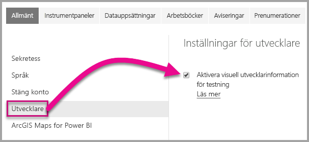

3. Ladda upp en Power BI Desktop-rapport.  

    Hämta Data > Filer > Lokal fil.

    Du kan [hämta](https://microsoft.github.io/PowerBI-visuals/docs/step-by-step-lab/images/US_Sales_Analysis.pbix) en Power BI Desktop-exempelrapport om du inte har en som redan har skapats.

    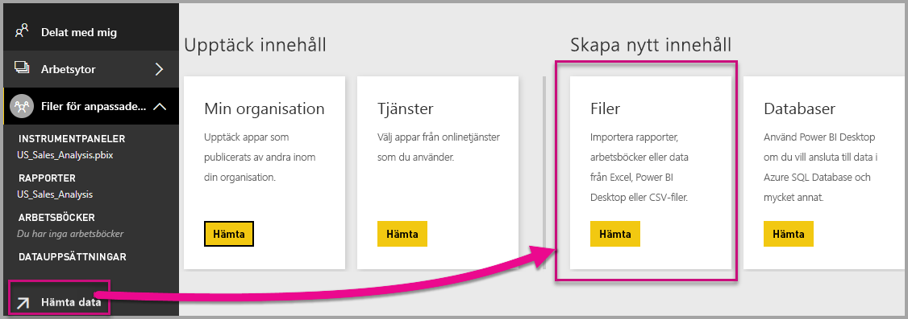 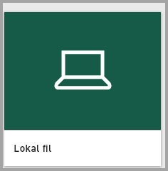

    Om du vill se rapporten väljer du **US_Sales_Analysis** från avsnittet **Rapport** i navigeringsfönstret till vänster.

    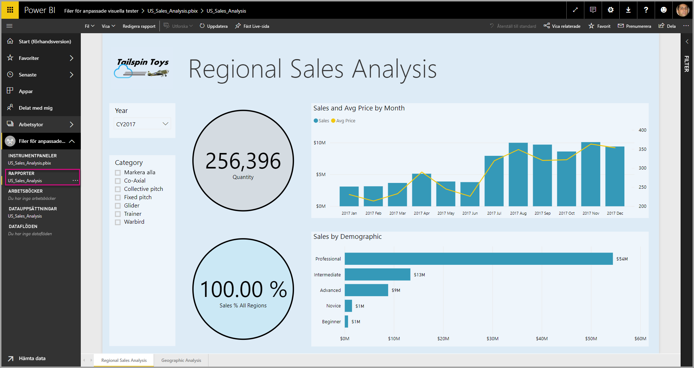

4. Nu måste du redigera rapporten i Power BI-tjänsten.

    Gå till **Redigera rapport**.

    

5. Välj **Visuellt objekt för utvecklare** i fönstret **Visualisering**.

    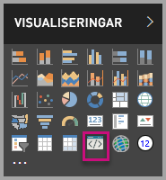

    > [!Note]
    > Den här visualiseringen representerar det anpassade visuella objektet som du startade på datorn. Det är bara tillgängligt när inställningar för utvecklare har aktiverats.

6. Observera att en visualisering har lagts till på rapportarbetsytan.

    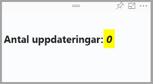

    > [!Note]
    > Det här är ett mycket enkelt visuellt objekt som visar hur många gånger uppdateringsmetoden har anropats. I det här skedet hämtar det visuella objektet ännu inte några data.

7. När du väljer det nya visuella objektet i rapporten går du till fönstret Fält > expanderar Försäljning > väljer Kvantitet.

    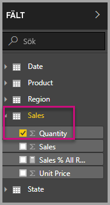

8. Testa sedan det nya visuella objektet genom att ändra storlek på det visuella objektet och observera ökningarna i uppdateringsvärdet.

    

Ange Ctrl + C om du vill stoppa det anpassade visuella objekt som körs i PowerShell. Ange Y när du uppmanas att avbryta batchjobbet och tryck sedan på Retur.

## <a name="adding-visual-elements"></a>Lägga till visuella element

Nu måste du installera **D3 JavaScript-biblioteket**. D3 är ett JavaScript-bibliotek som används för att producera dynamiska interaktiva datavisualiseringar i webbläsare. Det använder de brett implementerade standarderna SVG HTML5 och CSS.

Nu kan du utveckla det anpassade visuella objektet så att det visar en cirkel med text.

> [!Note]
> Du kan kopiera många poster i den här självstudien [här](https://github.com/Microsoft/powerbi-visuals-circlecard).

1. Installera **D3-biblioteket** i PowerShell genom att ange kommandot nedan.

    ```powershell
    npm i d3@^5.0.0 --save
    ```

    ```powershell
    PS C:\circlecard>npm i d3@^5.0.0 --save
    + d3@5.11.0
    added 179 packages from 169 contributors and audited 306 packages in 33.25s
    found 0 vulnerabilities

    PS C:\circlecard>
    ```

2. Om du vill installera typdefinitioner för **D3 biblioteket** anger du kommandot nedan.

    ```powershell
    npm i @types/d3@^5.0.0 --save
    ```

    ```powershell
    PS C:\circlecard>npm i @types/d3@^5.0.0 --save
    + @types/d3@5.7.2
    updated 1 package and audited 306 packages in 2.217s
    found 0 vulnerabilities

    PS C:\circlecard>
    ```

    Det här kommandot installerar TypeScript-definitioner baserade på JavaScript-filer, så att du kan utveckla det visuella objektet i TypeScript (vilket är en supermängd till JavaScript). Visual Studio Code är en perfekt IDE för att utveckla TypeScript-program.

3. Installera **core-js** i PowerShell genom att ange kommandot nedan.

    ```powershell
    npm i core-js@3.2.1 --save
    ```

    ```powershell
    PS C:\circlecard> npm i core-js@3.2.1 --save

    > core-js@3.2.1 postinstall F:\circlecard\node_modules\core-js
    > node scripts/postinstall || echo "ignore"

    Thank you for using core-js ( https://github.com/zloirock/core-js ) for polyfilling JavaScript standard library!

    The project needs your help! Please consider supporting of core-js on Open Collective or Patreon:
    > https://opencollective.com/core-js
    > https://www.patreon.com/zloirock

    + core-js@3.2.1
    updated 1 package and audited 306 packages in 6.051s
    found 0 vulnerabilities

    PS C:\circlecard>
    ```

    Det här kommandot installerar ett modulärt standardbibliotek för JavaScript. Det innehåller polyfiller för ECMAScript fram till 2019. Läs mer om [`core-js`](https://www.npmjs.com/package/core-js)

4. Installera **powerbi-visual-api** i PowerShell genom att ange kommandot nedan.

    ```powershell
    npm i powerbi-visuals-api --save-dev
    ```

    ```powershell
    PS C:\circlecard>npm i powerbi-visuals-api --save-dev

    + powerbi-visuals-api@2.6.1
    updated 1 package and audited 306 packages in 2.139s
    found 0 vulnerabilities

    PS C:\circlecard>
    ```

    Det här kommandot installerar definitioner för visuella API-objekt i Power BI.

5. Starta [Visual Studio Code](https://code.visualstudio.com/).

    Du kan starta **Visual Studio Code** från PowerShell med hjälp av följande kommando.

    ```powershell
    code .
    ```

6. Expandera mappen **node_modules** i **Explorer-fönstret** om du vill verifiera att **D3-biblioteket** har installerats.

    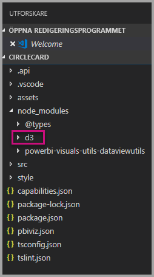

7. Du kan kontrollera att filen **index.d.ts** lades till genom att expandera node_modules > @types > d3 i **Explorer-fönstret**.

    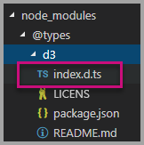

### <a name="developing-the-visual-elements"></a>Utveckla de visuella elementen

Nu kan vi utforska hur du kan utveckla det anpassade visuella objektet om du vill visa en cirkel och en exempeltext.

1. Utvidga mappen **src** i **Explorer-fönstret** och välj sedan **visual.ts**.

    > [!Note]
    > Lägg märke till kommentarerna överst i filen **visual.ts**. Behörighet att använda de anpassade visuella paketen i Power BI beviljas kostnadsfritt i enlighet med villkoren för MIT-licensen. Som en del av avtalet, måste du lämna kommentarer överst i filen.

2. Ta bort följande anpassade visuella standardlogik från klassen Visual.
    * De fyra privata variabeldeklarationerna på klassnivå.
    * Alla rader med kod från konstruktorn.
    * Alla rader med kod från uppdateringsmetoden.
    * Alla återstående rader i modulen, inklusive metoderna parseSettings och enumerateObjectInstances.

    Kontrollera att modulkoden ser ut så här.

    ```typescript
    "use strict";
    import "core-js/stable";
    import "../style/visual.less";
    import powerbi from "powerbi-visuals-api";
    import IVisual = powerbi.extensibility.IVisual;
    import VisualConstructorOptions = powerbi.extensibility.visual.VisualConstructorOptions;
    import VisualUpdateOptions = powerbi.extensibility.visual.VisualUpdateOptions;

    import * as d3 from "d3";
    type Selection<T extends d3.BaseType> = d3.Selection<T, any,any, any>;

    export class Visual implements IVisual {

        constructor(options: VisualConstructorOptions) {

        }

        public update(options: VisualUpdateOptions) {

        }
    }
    ```

3. Under klassdeklarationen *Visual* infogar du följande klassnivåegenskaper.

    ```typescript
    export class Visual implements IVisual {
        // ...
        private host: IVisualHost;
        private svg: Selection<SVGElement>;
        private container: Selection<SVGElement>;
        private circle: Selection<SVGElement>;
        private textValue: Selection<SVGElement>;
        private textLabel: Selection<SVGElement>;
        // ...
    }
    ```

    

4. Lägg till följande kod till *konstruktorn*.

    ```typescript
    this.svg = d3.select(options.element)
        .append('svg')
        .classed('circleCard', true);
    this.container = this.svg.append("g")
        .classed('container', true);
    this.circle = this.container.append("circle")
        .classed('circle', true);
    this.textValue = this.container.append("text")
        .classed("textValue", true);
    this.textLabel = this.container.append("text")
        .classed("textLabel", true);
    ```

    Den här koden lägger till en SVG-grupp i det visuella objektet och lägger sedan till tre former: en cirkel och två textelement.

    Om du vill formatera koden i dokumentet högerklickar du varsomhelst i **Visual Studio Code-dokumentet** och väljer sedan **Formatera dokument**.

      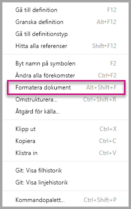

    Om du vill förbättra läsbarheten rekommenderar vi att du formaterar dokumentet varje gång som du klistrar in kodfragment.

5. Lägg till följande kod till *uppdateringsmetoden*.

    ```typescript
    let width: number = options.viewport.width;
    let height: number = options.viewport.height;
    this.svg.attr("width", width);
    this.svg.attr("height", height);
    let radius: number = Math.min(width, height) / 2.2;
    this.circle
        .style("fill", "white")
        .style("fill-opacity", 0.5)
        .style("stroke", "black")
        .style("stroke-width", 2)
        .attr("r", radius)
        .attr("cx", width / 2)
        .attr("cy", height / 2);
    let fontSizeValue: number = Math.min(width, height) / 5;
    this.textValue
        .text("Value")
        .attr("x", "50%")
        .attr("y", "50%")
        .attr("dy", "0.35em")
        .attr("text-anchor", "middle")
        .style("font-size", fontSizeValue + "px");
    let fontSizeLabel: number = fontSizeValue / 4;
    this.textLabel
        .text("Label")
        .attr("x", "50%")
        .attr("y", height / 2)
        .attr("dy", fontSizeValue / 1.2)
        .attr("text-anchor", "middle")
        .style("font-size", fontSizeLabel + "px");
    ```

    *Den här koden anger bredden och höjden på det visuella objektet och initierar sedan attribut och format för de visuella elementen.*

6. Spara filen **visual.ts**.

7. Spara filen **capabilities.json**.

    Ta bort hela objektelementet (raderna 14–60) på rad 14.

8. Spara filen **capabilities.json**.

9. Starta det anpassade visuella objektet i PowerShell.

    ```powershell
    pbiviz start
    ```

### <a name="toggle-auto-reload"></a>Växla automatisk återinläsning

1. Gå tillbaka till Power BI-rapporten.
2. Välj **Växla automatisk återinläsning** i verktygsfältet ovanför det visuella objektet för utvecklare.

    

    Det här alternativet innebär att det visuella objektet läses in igen varje gång du sparar ändringarna i projektet.

3. Dra fältet **Kvantitet** från **Fält**-fönstet till det visuella objektet för utvecklare.

4. Verifiera att det visuella objektet ser ut så här.

    

5. Ändra storlek på det visuella objektet.

    Observera att cirkeln och textvärdet skalas för att de anpassas till det visuella objektets tillgängliga utrymme.

    Uppdateringsmetoden anropas kontinuerligt med att ändra storlek på det visuella objektet, och det resulterar i den flytande omskalningen av de visuella elementen.

    Du har nu utvecklat de visuella elementen.

6. Fortsätt att köra det visuella objektet.

## <a name="process-data-in-the-visual-code"></a>Bearbeta data i den visuella koden

Definiera datarollerna och datavymappningarna och ändra sedan den anpassade visuella logiken för att visa ett måtts värde och visningsnamn.

### <a name="configuring-the-capabilities"></a>Konfigurera funktionerna

Definiera datarollen och datavymappningarna genom att ändra filen **capabilities.json**.

1. Ta bort allt innehåll (raderna 3-12) i Visual Studio-kod från matrisen **dataRoles** i filen **capabilities.json**.

2. Infoga följande kod i matrisen **dataRoles**.

    ```json
    {
        "displayName": "Measure",
        "name": "measure",
        "kind": "Measure"
    }
    ```

    Matrisen **dataRoles** definierar nu en enskild dataroll av typen **mått**, med namnet **mått** och som visas som **Mått**. Den här datarollen gör det möjligt att skicka ett måttfält eller ett fält som har sammanfattats.

3. Ta bort allt innehåll (raderna 10-31) från matrisen **dataViewMappings**.

4. Infoga följande innehåll i matrisen **dataViewMappings**.

    ```json
    {
        "conditions": [
            { "measure": { "max": 1 } }
        ],
        "single": {
            "role": "measure"
        }
    }
    ```

    Matrisen **dataViewMappings** definierar nu ett fält som kan skickas till datarollen med namnet **mått**.

5. Spara filen **capabilities.json**.

6. Lägg märke till att det visuella objektet nu kan konfigureras med **Mått** i Power BI.

    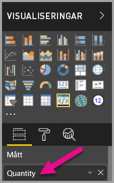

    > [!Note]
    > Det visuella projektet inkluderar ännu inte databindningslogik.

### <a name="exploring-the-dataview"></a>Utforska datavyn

1. Välj **Visa datavy** i det flytande verktygsfältet ovanför det visuella objektet.

    

2. Expandera ned till **Enkel** och notera värdet.

    

3. Expandera ned till **metadata**, och sedan till matrisen **kolumner** och lägg särskilt märke till värdena **format** och **displayName**.

    

4. Välj **Visa datavy** i det flytande verktygsfältet ovanför det visuella objektet om du vill växla tillbaka till det visuella objektet.

    

### <a name="consume-data-in-the-visual-code"></a>Använda data i den visuella koden

1. Gå till **Visual Studio Code** i **visual.ts**-filen,

    importera `DataView`-gränssnittet från `powerbi`-modulen

    ```typescript
    import DataView = powerbi.DataView;
    ```

    och lägg till följande instruktion som den första instruktionen i uppdateringsmetoden.

    ```typescript
    let dataView: DataView = options.dataViews[0];
    ```

    

    Den här instruktionen tilldelar *dataView* till en variabel för enkel åtkomst, och deklarerar variabeln så att den refererar till objektet *dataView*.

2. Ersätt **.text("värde")** med nedanstående för **uppdateringsmetoden**.

    ```typescript
    .text(<string>dataView.single.value)
    ```

    

3. Ersätt **.text(”etikett”)** med nedanstående för **uppdateringsmetoden**.

    ```typescript
    .text(dataView.metadata.columns[0].displayName)
    ```

    

4. Spara filen **visual.ts**.

5. Granska objektet, som nu visar värdet och visningsnamnet, i **Power BI**.

Du har nu konfigurerat datarollerna och bundit det visuella objektet till datavyn.

I nästa självstudie lär du dig hur du lägger till formateringsalternativ till det anpassade visuella objektet.

## <a name="debugging"></a>Felsökning

Tips om hur du felsöker ditt anpassade visuella objekt finns i [felsökningsguiden](https://microsoft.github.io/PowerBI-visuals/docs/how-to-guide/how-to-debug/).

## <a name="next-steps"></a>Nästa steg

> [!div class="nextstepaction"]
> [Lägga till formateringsalternativ](custom-visual-develop-tutorial-format-options.md)
