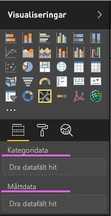
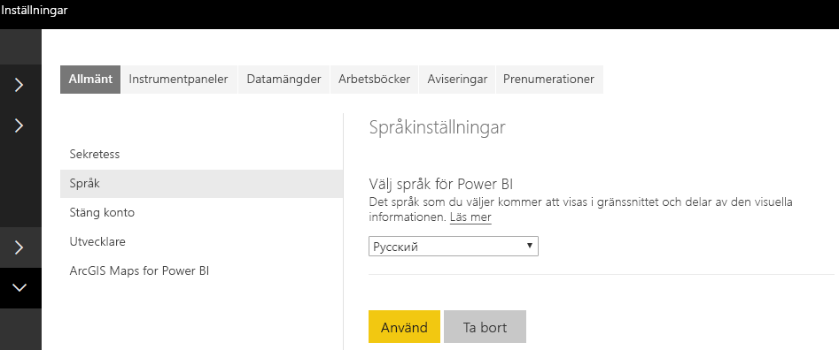

# <a name="add-the-locale-in-power-bi-for-power-bi-visuals"></a>Lägg till nationella inställningar i Power BI för visuella Power BI-objekt

Visuella objekt kan hämta nationella inställningar från Power BI för att lokalisera innehållet till relevant språk.

Läs mer om vilka [språk och länder/regioner som stöds i Power BI](./../../supported-languages-countries-regions.md)

Exempel: hämta nationella inställningar för ett stapeldiagram.


De här stapeldiagrammen skapades på olika språk (engelska, baskiska och hindi) vilket visas i knappbeskrivningen.

> [!NOTE]
> Lokaliseringshanteraren i koden för det visuella objektet stöds från och med API-version 1.10.0.

## <a name="get-the-locale"></a>Hämta nationella inställningar

`locale` skickas som en sträng när det visuella objektet initieras. Om språket ändras i Power BI genereras det visuella objektet igen med det nya språket. Du hittar den hela exempelkoden i SampleBarChart med nationella inställningar

BarChart-konstruktorn har nu en locale-medlem som instantieras i konstruktorn med värdens språkinställning.

```typescript
private locale: string;
...
this.locale = options.host.locale;
```

Språk som stöds:

Språksträng | Språk
--------------|----------------------
ar-SA | العربية (arabiska)
bg-BG | български (bulgariska)
ca-ES | català (katalanska)
cs-CZ | čeština (tjeckiska)
da-DK | dansk (danska)
de-DE | Deutsche (tyska)
el-GR | ελληνικά (grekiska)
sv-SE | English (engelska)
es-ES | español service (spanska)
et-EE | eesti (estniska)
eU-ES | Euskal (baskiska)
fi-FI | suomi (finska)
fr-FR | français (franska)
gl-ES | galego (galiciska)
he-IL | עברית (hebreiska)
hi-IN | हिन्दी (hindi)
hr-HR | hrvatski (kroatiska)
hu-HU | magyar (ungerska)
id-ID | Bahasa Indonesia (indonesiska)
it-IT | italiano (italienska)
ja-JP | 日本の (japanska)
kk-KZ | Қазақ (kazakiska)
ko-KR | 한국의 (koreanska)
lt-LT | Lietuvos (litauiska)
lv-LV | Latvijas (lettiska)
ms-MY | Bahasa Melayu (malajiska)
nb-NO | norsk (norska)
nl-NL | Nederlands (nederländska)
pl-PL | polski (polska)
pt-BR | português (portugisiska)
pt-PT | português (portugisiska)
ro-RO | românesc (rumänska)
ru-RU | русский (ryska)
sk-SK | slovenský (slovakiska)
sl-SI | slovenski (slovenska)
sr-Cyrl-RS | српски (serbiska)
sr-Latn-RS | srpski (serbiska)
sv-SE | svenska (svenska)
th-TH | ไทย (thailändska)
tr-TR | Türk (turkiska)
uk-UA | український (ukrainska)
vi-VN | tiếng Việt (vietnamesiska)
zh-CN | 中国 (förenklad kinesiska)
zh-TW | 中國 (traditionell kinesiska)

> [!NOTE]
> I PowerBI Desktop innehåller egenskapen locale språket för det PowerBI Desktop som är installerat.

## <a name="localizing-the-property-pane-for-power-bi-visuals"></a>Lokalisering av egenskapsrutan för visuella Power BI-objekt

Fält i egenskapsrutan kan lokaliseras för att ge en mer integrerad och enhetlig upplevelse. Det gör att ditt anpassade visuella objekt fungerar precis som standardobjekten i Power BI.

Ett anpassat visuellt objekt utan översättning som skapats med kommandot `pbiviz new` har till exempel nu följande fält i egenskapsfönstret:



både Category Data och Measure Data är definierade i filen capabilities.json som `displayName`.

## <a name="how-to-localize-capabilities"></a>Så här lokaliserar du funktioner

Lägg först till en visningsnamnsnyckel för alla visningsnamn du vill lokalisera i dina funktioner. I det här exemplet:

```json
{
    "dataRoles": [
        {
            "displayName": "Category Data",
            "displayNameKey": "VisualCategoryDataNameKey1",
            "name": "category",
            "kind": "Grouping"
        },
        {
            "displayName": "Measure Data",
            "displayNameKey": "VisualMeasureDataNameKey2",
            "name": "measure",
            "kind": "Measure"
        }
    ]
}
```

Lägg sedan till en katalog med namnet stringResources. Katalogen innehåller alla dina olika strängresursfiler baserat på de språk du vill att det visuella objektet ska ha stöd för. Under den här katalogen måste du lägga till en JSON-fil för varje språk som du vill stödja. De här filerna innehåller information om språket och de lokaliserade strängvärdena för varje displayNameKey du vill ersätta.

I vårt exempel kan vi anta att vi vill ha stöd för arabiska och hebreiska. Då måste vi lägga till två JSON-filer så här:


Varje JSON-fil definierar ett enda språk (den här filen måste vara ett av språken i listan ovan) med strängvärden för önskade visningsnamnsnycklar. I vårt exempel ser strängresursfilen för hebreiska ut så här:

```json
{
    "locale": "he-IL",
    "values": {
        "VisualCategoryDataNameKey1": "קטגוריה",
        "VisualMeasureDataNameKey2": "יחידות מידה"
    }
}
```

Nedan beskrivs alla nödvändiga steg för att använda lokaliseringshanteraren.

> [!NOTE]
> Lokalisering stöds för närvarande inte vid felsökning av det visuella objektet dev

## <a name="setup-environment"></a>Konfigurera miljön

### <a name="desktop"></a>Skrivbord

För skrivbordsanvändning laddar du ned den lokaliserade versionen av Power BI Desktop från https://powerbi.microsoft.com.

### <a name="web-service"></a>Webbtjänst

Om du använder webbklienten (webbläsare) i tjänsten ändrar du språket i inställningarna:



## <a name="resource-file"></a>Resursfil

Lägg till filen resources.resjson i en mapp med samma namn som språket du vill använda i mappen stringResources. I vårt exempel är det en-US och ru-RU.


Lägg sedan till alla lokaliserade strängar du vill använda i filen resources.resjson, som du lade till i föregående steg.

```json
{
    ...
    "Role_Legend": "Обозначения",
    "Role_task": "Задача",
    "Role_StartDate": "Дата начала",
    "Role_Duration": "Длительность"
    ...
}
```

Här är ett exempel på en-US-versionen av filen resources.resjson:

```json
{
    ...
    "Role_Legend": "Legend",
    "Role_task": "Task",
    "Role_StartDate": "Start date",
    "Role_Duration": "Duration"
    ...
}
```

Ny instans av localizationManager Skapa en instans av localizationManager i koden för det visuella objektet så här

```typescript
private localizationManager: ILocalizationManager;

constructor(options: VisualConstructorOptions) {
    this.localizationManager = options.host.createLocalizationManager();
}
```

## <a name="localizationmanager-usage-sample"></a>exempel på användning av localizationManager

Nu kan du anropa funktionen getDisplayName i lokaliseringshanteraren med strängnyckelargumentet du definierade i resources.resjson, och få fram önskad sträng vart som helst i koden:

```typescript
let legend: string = this.localization.getDisplayName("Role_Legend");
```

Den returnerar ”Legend” för en-US och ”Обозначения” för ru-RU

## <a name="next-steps"></a>Nästa steg

* [Läs om att använda formateringsverktyg för att tillhandahålla lokaliserade format](utils-formatting.md)
