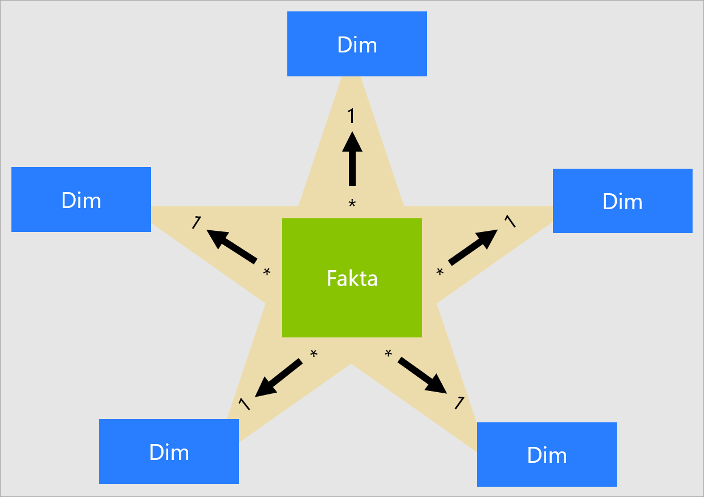
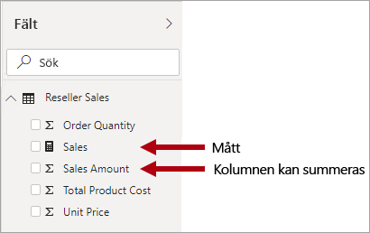
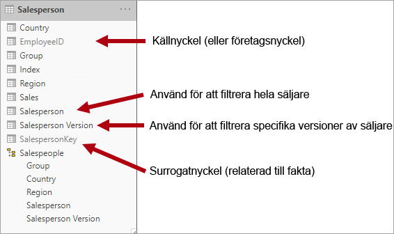
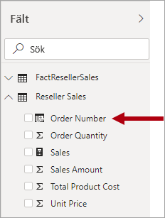

# Förstå star-schemat och dess betydelse för Power BI

Den här artikeln vänder sig till Power BI Desktop-datamodellerare. I den beskrivs star-schemadesignen och dess relevans för utveckling av Power BI-datamodeller som är optimerade för prestanda och användbarhet.

Den här artikeln är inte avsedd att ge en fullständig genomgång av star-schemadesignen. Mer information finns i publicerat innehåll såsom **The Data Warehouse Toolkit: The Definitive Guide to Dimensional Modeling** (tredje utgåvan, 2013) av Ralph Kimball et al.

## Översikt av star-schema

**Star-schema** är en mogen modelleringsmetod som är vedertagen hos informationslager med relationsdata. Den kräver att modellerare klassificerar sina modelltabeller som antingen _dimension_ eller _fakta_.

**Dimensionstabeller** beskriver affärsentiteter – de _saker_ som du modellerar. Entiteter kan omfatta produkter, personer, platser och begrepp såsom tiden själv. Den mest konsekventa tabell som finns i ett star-schema är en datumdimensionstabell. En dimensionstabell innehåller en nyckelkolumn (eller kolumner) som fungerar som en unik identifierare samt beskrivande kolumner.

**Faktatabeller** lagrar observationer eller händelser och kan vara försäljningsorder, aktiekurser, valutakurser, temperaturer osv. En faktatabell innehåller dimensionsnyckelkolumner som relaterar till dimensionstabeller samt kolumner med numeriska mått. Dimensionsnyckelkolumnerna bestämmer _dimensionaliteten_ för en faktatabell, medan dimensionsnyckelvärdena bestämmer faktatabellens _kornighet_. Ta som exempel en faktatabell som utformats för att lagra försäljningsmål som har två dimensionsnyckelkolumner, **Datum** och **Produktnyckel**. Det är enkelt att förstå att tabellen har två dimensioner. Kornigheten kan dock inte avgöras utan att man tar hänsyn till dimensionsnyckelvärdena. I det här exemplet är de värden som lagras i kolumnen **Datum** den första dagen i varje månad. I det här fallet är kornigheten på månads-produkt-nivå.

I allmänhet innehåller dimensionstabeller ett relativt litet antal rader. Faktatabeller kan å andra sidan innehålla ett mycket stort antal rader och fortsätta att växa över tid.

## Relevansen för star-schema för Power BI-modeller

Star-schemadesignen och många relaterade begrepp som introduceras i den här artikeln är mycket relevanta för utveckling av Power BI-modeller som är optimerade för prestanda och användbarhet.

Tänk på att varje visuellt objekt i en Power BI-rapport genererar en fråga som skickas till Power BI-modellen (som Power BI-tjänsten kallar datamängd). Dessa frågor används för att filtrera, gruppera och sammanfatta modelldata. En väl utformad modell är alltså en som tillhandahåller tabeller för filtrering och gruppering samt tabeller för sammanfattning. Den här designen passar bra med star-schemaprinciper:

- Dimensionstabeller stöder _filtrering_ och _gruppering_
- Faktatabeller stöder _sammanfattning_

Det finns ingen tabellegenskap som modellerare har angett för att konfigurera tabelltypen som dimension eller faktum. Det beror i själva verket på modellrelationerna. En modellrelation upprättar en filterspridningsväg mellan två tabeller, och det är egenskapen **Kardinalitet** för den relationen som avgör tabelltypen. En vanlig relationskardinalitet är _en-till-många_ eller inversen _många-till-en_. ”En”-sidan är alltid en tabell av dimensionstyp medan ”många”-sidan alltid är en tabell av faktatyp. Mer information om många relationer finns i [Modellrelationer i Power BI Desktop](../desktop-relationships-understand.md).

En välstrukturerad modelldesign bör omfatta tabeller som är tabeller av antingen dimensionstyp eller faktatyp. Undvik att blanda de två typerna för en enskild tabell. Vi rekommenderar även att försöker leverera rätt antal tabeller med rätt relationer på plats. Det är dessutom viktigt att tabeller av faktatyp alltid läser in data med en konsekvent kornighet.

Slutligen är det viktigt att förstå att optimal modelldesign handlar om både vetenskap och konst. Ibland kan du frångå god vägledning när så behövs.

Det finns många ytterligare begrepp relaterade till star-schemadesign som kan tillämpas på en Power BI-modell. Dessa begrepp omfattar:

- [Mått](#measures)
- [Surrogatnycklar](#surrogate-keys)
- [Snowflake-dimensioner](#snowflake-dimensions)
- [Rollspelsdimensioner](#role-playing-dimensions)
- [Långsamt föränderliga dimensioner](#slowly-changing-dimensions)
- [Skräpdimensioner](#junk-dimensions)
- [Degenererade dimensioner](#degenerate-dimensions)
- [Faktalösa faktatabeller](#factless-fact-tables)

## Mått

I en star-schemadesign är ett **mått** en faktatabellkolumn som lagrar värden som ska sammanfattas.

I en Power BI-modell har ett **mått** en annan, men liknande, definition. Det är en formel som skrivs i [DAX (Data Analysis Expressions)](https://docs.microsoft.com/dax/data-analysis-expressions-dax-reference) och som skapar sammanfattning. Måttuttryck utnyttjar ofta DAX-sammanställningsfunktioner som SUM, MIN, MAX, AVERAGE osv. för att producera ett skalärvärderesultat vid frågetiden (värden lagras aldrig i modellen). Måttuttryck kan vara såväl enkla kolumnsammanställningar som mer avancerade formler som åsidosätter filterkontext och/eller relationsspridning. Mer information finns i artikeln [DAX-grunder i Power BI Desktop](https://docs.microsoft.com/power-bi/desktop-quickstart-learn-dax-basics).

Det är viktigt att förstå att Power BI-modeller har stöd för en andra metod för att skapa sammanfattning. Vilka kolumner som helst – vanligtvis numeriska kolumner – kan sammanfattas av ett visuellt objekt i en rapport eller Frågor och svar. Dessa kolumner kallas _implicita mått_. Det här är praktisk för dig som modellutvecklare, eftersom du i många fall inte behöver skapa mått. Till exempel kan kolumnen **Försäljningsbelopp** för Adventure Works-återförsäljares försäljning sammanfattas på många olika sätt (summa, antal, genomsnitt, median, min, max osv.) utan att ett mått behöver skapas för alla tänkbara sammansättningstyper.

Det finns dock tre bra skäl till att skapa mått även för enkla sammanfattningar på kolumnnivå:

- När du vet att rapportförfattarna kommer att köra frågor mot modellen med hjälp av [flerdimensionella uttryck (MDX)](https://docs.microsoft.com/sql/analysis-services/multidimensional-models/mdx/mdx-query-the-basic-query?view=sql-server-2017) måste modellen innehålla _explicita mått_. Explicita mått definieras med DAX. Den här designmetoden är mycket relevant när du hämtar data från en Power BI-datauppsättning med hjälp av MDX, eftersom MDX inte kan summera kolumnvärden. MDX används framför allt tillsammans med [Analysera i Excel](https://docs.microsoft.com/power-bi/service-analyze-in-excel) eftersom pivottabeller skickar MDX-frågor.
- När du vet att rapportförfattarna kommer att skapa sidnumrerade Power BI-rapporter i MDX-frågedesignern måste modellen innehålla explicita mått. Det är bara MDX-frågedesignern som har stöd för [serveraggregeringar](/sql/reporting-services/report-design/report-builder-functions-aggregate-function). Så om rapportförfattarna behöver låta Power BI utvärdera mått (i stället för den sidnumrerade rapportens motor) måste de använda MDX-frågedesignern.
- Det kan gälla om du behöver säkerställa att rapportförfattare endast kan sammanfatta kolumner på specifika sätt. Till exempel kan kolumnen **Enhetspris** (som representerar ett pris per enhet) för återförsäljares försäljning sammanfattas, men endast med hjälp av specifika sammansättningsfunktioner. Den bör aldrig sammanfattas, men det är lämpligt att sammanfatta den med hjälp av andra sammansättningsfunktioner (till exempel min, max, genomsnitt osv.). I det här fallet kan modelleraren dölja kolumnen **Enhetspris** och skapa mått för alla lämpliga sammansättningsfunktioner.

Den här designmetoden fungerar bra för rapporter som skapats i Power BI-tjänsten och för Frågor och svar. Power BI Desktop-live-anslutningar tillåter dock att rapportförfattare visar dolda fält i fönstret **Fält**, vilket kan leda till att den här designmetoden kringgås.

## Surrogatnycklar

En **surrogatnyckel** är en unik identifierare som du lägger till i en tabell för att stödja star-schemamodellering. Per definition definieras den inte och lagras inte i källdata. Ofta läggs surrogatnycklar till i dimensionstabellerna i informationslagret med relationsdata för att ge en unik identifierare för varje dimensionstabellrad.

Power BI-modellrelationer baseras på en enskild unik kolumn i en tabell, som sprider filter till en enskild kolumn i en annan tabell. När en tabell av dimensionstyp i din modell inte innehåller en enda unik kolumn måste du lägga till en unik identifierare som blir ”en”-sidan i en relation. I Power BI Desktop kan du enkelt uppnå detta krav genom att skapa en [Power Query-indexkolumn](https://docs.microsoft.com/powerquery-m/table-addindexcolumn).

Du måste sammanslå den här frågan med frågan på ”många”-sidan så att du även kan lägga till indexkolumnen i den. När du läser in dessa frågor till modellen kan du skapa en en-till-många-relation mellan modelltabellerna.

## Snowflake-dimensioner

En **snowflake-dimension** är en uppsättning normaliserade tabeller för en enda affärsenhet. Till exempel klassificerar Adventure Works produkter efter kategori och underkategori. Kategorier tilldelas till underkategorier, och produkter tilldelas i sin tur till underkategorier. I Adventure Works informationslager med relationsdata normaliseras och lagras produktdimensionen i tre relaterade tabeller: **DimProductCategory**, **DimProductSubcategory** och **DimProduct**.

Tänk dig att de normaliserade tabellerna placeras utåt från faktatabellen och bildar en snowflake-design.

I Power BI Desktop kan du välja att efterlikna en snowflake-dimensionsdesign (kanske eftersom dina källdata gör det) eller integrera (avnormalisera) källtabellerna till en enda modelltabell. I allmänhet väger fördelarna med en enda modelltabell tyngre än fördelarna med flera modelltabeller. Det optimala beslutet kan bero på volymerna av data och modellens krav på användbarhet.

När du väljer att efterlikna en snowflake-dimensionsdesign gäller följande:

- Power BI läser in fler tabeller, vilket är mindre effektivt utifrån ett lagrings- och prestandaperspektiv. Dessa tabeller måste innehålla kolumner för att stödja modellrelationer, och detta kan resultera i en större modellstorlek.
- Längre spridningskedjor för relationsfilter måste traverseras, vilket sannolikt blir mindre effektivt än filter som tillämpas på en enskild tabell.
- Fönstret **Fält** visar fler modelltabeller för rapportförfattare, vilket kan resultera i en mindre intuitiv upplevelse, särskilt när snowflake-dimensionstabeller endast innehåller en eller två kolumner.
- Det går inte att skapa en hierarki som omfattar tabellerna.

När du väljer att integrera till en enda modelltabell kan du även definiera en hierarki som omfattar dimensionens lägsta och högsta kornighet. Lagringen av redundanta avnormaliserade data kan eventuellt resultera i ökad modellagringsstorlek, särskilt för mycket stora dimensionstabeller.

## Långsamt föränderliga dimensioner

En **långsamt föränderlig dimension** (SCD, Slowly Changing Dimension) är en dimension som på lämpligt sätt hanterar ändring av dimensionsmedlemmar över tid. Det gäller när affärsenhetsvärden ändras med tiden på ett ad hoc-sätt. Ett bra exempel på en _långsamt_ föränderlig dimension är en kunddimension, specifikt dess kolumner med kontaktuppgifter, till exempel e-postadress och telefonnummer. Vissa dimensioner anses däremot vara _snabbt_ föränderliga när ett dimensionsattribut ändras ofta, till exempel en marknadspriset för en aktie. Den vanligaste designmetoden i dessa fall är att lagra snabbt föränderliga attributvärden i ett faktatabellmått.

Teorin bakom star-schemadesign refererar till två vanliga SCD-typer: Typ 1 och typ 2. En tabell av dimensionstyp kan vara av typ 1 eller typ 2, eller stödja båda typerna samtidigt för olika kolumner.

### SCD av typ 1

En **typ 1**-**SCD** återspeglar alltid de senaste värdena, och när ändringar i källdata identifieras skrivs dimensionstabelldata över. Den här designmetoden är vanlig för kolumner som lagrar tilläggsvärden, till exempel en kunds e-postadress eller telefonnummer. När en kunds e-postadress eller telefonnummer ändras uppdaterar dimensionstabellen kundraden med de nya värdena. Det blir som om kunden alltid hade haft dessa kontaktuppgifter.

En icke-inkrementell uppdatering av en tabell av dimensionstyp för en Power BI-modell uppnår resultatet av en typ 1-SCD. Den uppdaterar tabelldata för att se till att de senaste värdena läses in.

### SCD av typ 2

En **typ 2**-**SCD** har stöd för versionshantering av dimensionsmedlemmarna. Om källsystemet inte lagrar versioner är det vanligtvis informationslagrets inläsningsprocess som identifierar ändringar och hanterar ändringen i en dimensionstabell. I det här fallet måste dimensionstabellen använda en surrogatnyckel för att tillhandahålla en unik referens till en _version_ av dimensionsmedlemmen. Den innehåller även kolumner som definierar datumintervallets giltighet för versionen (till exempel **StartDate** och **EndDate**) samt eventuellt en flaggkolumn (till exempel **IsCurrent**) för enkel filtrering efter aktuella dimensionsmedlemmar.

Till exempel tilldelar Adventure Works säljare till en försäljningsregion. När en säljare byter region måste en ny version av säljaren skapas för att säkerställa att historiska uppgifter fortfarande är kopplade till den tidigare regionen. För att stödja korrekt historisk analys av försäljning per säljare måste dimensionstabellen lagra versioner av säljare och deras associerade region(er). Tabellen bör även innehålla start- och slutdatumvärden för att definiera tidens giltighet. Aktuella versioner kan definiera ett tomt slutdatum (eller 12/31/9999), vilket betyder att raden är den aktuella versionen. Tabellen måste även definiera en surrogatnyckel eftersom affärsnyckeln (i det här fallet medarbetar-ID) inte är unik.

Observera att när källdata inte lagrar versioner så måste du använda ett mellanliggande system (till exempel ett informationslager) för att identifiera och lagra ändringar. Tabellinläsningsprocessen måste bevara befintliga data och identifiera ändringar. När en ändring identifieras måste tabellinläsningsprocessen göra så att den aktuella versionen förfaller. Den registrerar dessa ändringar genom att uppdatera **EndDate**-värdet och lägga till en ny version med **StartDate**-värdet som börjar från föregående **EndDate**-värde. Dessutom måste relaterade fakta använda en tidsbaserad sökning för att hämta det dimensionsnyckelvärde som är relevant för faktadatumet. En Power BI-modell som använder Power Query kan inte producera det här resultatet. Den kan dock läsa in data från en i förväg inläst dimensionstabell för typ 2-SCD.

Power BI-modellen bör stödja körning av frågor mot historiska data för en medlem, oavsett ändring och för en version av medlemmen som representerar ett visst tillstånd för medlemmen i tid. I samband med Adventure Works gör den här designen att du kan köra frågor mot säljaren oberoende av tilldelad säljregion eller för en viss version av säljaren.

För att uppnå detta måste tabellen av dimensionstyp för en Power BI-modell innehålla en kolumn för filtrering efter säljaren och en annan kolumn för filtrering efter en särskild version av säljaren. Det är viktigt att kolumnversionen innehåller en icke-tvetydig beskrivning, till exempel ”Michael Blythe (12/15/2008–06/26/2019)” eller ”Michael Blythe (aktuell)”. Det är även viktigt att utbilda rapportförfattare och konsumenter i grunderna för typ 2-SCD och hur korrekt rapportdesign kan uppnås via användning av korrekta filter.

Det är även en bra designidé att inkludera en hierarki som gör det möjligt för visuella objekt att öka detaljnivån till versionsnivå.

## Rollspelsdimensioner

En **rollspelsdimension** är en dimension som kan filtrera relaterade fakta på olika sätt. Hos Adventure Works har till exempel datumdimensionstabellen tre relationer till återförsäljares försäljning. Samma dimensionstabell kan användas för att filtrera fakta efter orderdatum, transportdatum eller leveransdatum.

I ett informationslager är den accepterade designmetoden att definiera en dimensionstabell med ett enda datum. Vid frågekörningstiden bestäms datumdimensionens ”roll” av vilken faktakolumn du använder för att sammankoppla tabellerna. När du till exempel analyserar försäljning per orderdatum relaterar tabellkopplingen till orderdatumkolumnen för återförsäljares försäljning.

I en Power BI-modell kan den här designen imiteras genom att flera relationer skapas mellan två tabeller. I exemplet med Adventure Works skulle tabellerna för datum och återförsäljares försäljning ha tre relationer. Observera att även om den här designen är möjlig, så kan det endast finnas en aktiv relation mellan två Power BI-modelltabeller. Alla återstående relationer måste anges till inaktiva. Att ha en enda aktiv relation innebär att det finns en standardmässig filterspridning från datum till återförsäljares försäljning. I den här fallet anges den aktiva relationen till det vanligaste filtret som används av rapporter, vilket för Adventure Works är relationen för orderdatum.

Det enda sättet att använda en inaktiv relation är att definiera ett DAX-uttryck som använder [funktionen USERELATIONSHIP](https://docs.microsoft.com/dax/userelationship-function-dax) (använd relation). I vårt exempel måste modellutvecklaren skapa mått för att möjliggöra analys av återförsäljares försäljning efter transportdatum och leveransdatum. Detta kan vara omständligt, särskilt när återförsäljartabellen definierar många mått. Det leder även till oreda i fönstret **Fält** på grund av överdrivet många mått. Det finns även andra begränsningar:

- När rapportförfattare förlitar sig på sammanfattning av kolumner i stället för att definiera mått kan de inte uppnå sammanfattning för de inaktiva relationerna utan att skriva ett mått på rapportnivå. Mått på rapportnivå kan endast definieras vid skapande av rapporter i Power BI Desktop.
- Om det endast finns en aktiv relationsväg mellan datum och återförsäljares försäljning går det inte att samtidigt filtrera återförsäljares försäljning efter olika typer av data. Du kan till exempel inte skapa ett visuellt objekt som ritar orderdatumförsäljning efter levererad försäljning.

En vanlig Power BI-modelleringsteknik för att undvika dessa begränsningar är att skapa en tabell av dimensionstyp för varje rollspelsinstans. Vanligtvis skapar du ytterligare dimensionstabeller som [beräknade tabeller](https://docs.microsoft.com/dax/calculatetable-function-dax) med hjälp av DAX. Med hjälp av beräknade tabeller kan modellen innehålla en tabell för **Datum**, en för **Transportdatum** och en för **Leveransdatum** som var och en har en aktiv relation till sina respektive tabellkolumner för återförsäljares försäljning.

Den här designmetoden kräver inte att du definierar flera mått för olika datumroller, och den tillåter samtidig filtrering efter olika datumroller. En mindre nackdel med den här designmetoden är dock att det sker duplicering av datumdimensionstabellen, vilket leder till en högre storlek på modellagringen. Eftersom tabeller av dimensionstyp oftast lagrar färre rader jämfört med tabeller av faktatyp utgör detta sällan något problem.

Följ dessa metoder för god design när du skapar modell tabeller av dimensionstyp för varje roll:

- Se till att kolumnnamnen är självbeskrivande. Även om det är möjligt att ha en kolumn för **År** i alla datumtabeller (kolumnnamn är unika i sina tabeller) är den inte självbeskrivande med standardrubriker för visuella objekt. Överväg att byta namn på kolumner i varje dimensionsrolltabell så att tabellen **Transportdatum** har en årskolumn med namnet **Transportår** osv.
- När det är relevant ser du till att tabellbeskrivningarna ger feedback till rapportförfattare (via knappbeskrivningar i fönstret **Fält**) om hur filterspridning har konfigurerats. Den här klarheten är viktig när modellen innehåller en generiskt namngiven tabell såsom **Datum**, som används för att filtrera många tabeller av faktatyp. Om den här tabellen exempelvis har en aktiv relation till orderdatumkolumnen för återförsäljares försäljning bör du överväga att ange en tabellbeskrivning i stil med ”Filtrerar återförsäljares försäljning efter orderdatum”.

Mer information finns i [Vägledning för aktiva kontra inaktiva relationer](relationships-active-inactive.md).

## Skräpdimensioner

En **skräpdimension** är användbar när det finns många dimensioner, särskilt sådana som består av få attribut (kanske bara ett) och när dessa attribut har få värden. Bra kandidater är kolumner med orderstatus eller kunduppgifter (kön, åldersgrupp osv.).

Designmålet med en skräpdimension är att konsolidera många ”små” dimensioner till en enda dimension för att minska både modellagringens storlek och oredan i fönstret **Fält** genom att visa färre modelltabeller.

En skräpdimensionstabell är vanligtvis den kartesiska produkten av alla dimensionsattributmedlemmar med en surrogatnyckelkolumn. Surrogatnyckeln ger en unik referens till varje rad i tabellen. Du kan skapa dimensionen i ett informationslager eller genom att använda Power Query för att skapa en fråga som utför [fullständiga yttre frågekopplingar](https://docs.microsoft.com/powerquery-m/table-join) och sedan lägger till en surrogatnyckel (indexkolumn).

Du läser in den här frågan till modellen som en tabell av dimensionstyp. Du behöver även sammanslå den här frågan med faktafrågan så att indexkolumnen läses in i modellen för att stödja skapandet av en ”en-till-många”-modellrelation.

## Degenererade dimensioner

En **degenererad dimension** refererar till ett attribut i faktatabellen som krävs för filtrering. Hos Adventure Works är ordernumret för återförsäljares försäljning ett bra exempel. I det här fallet är det inte god modelldesign att skapa en oberoende tabell som består av endast den här enstaka kolumnen, eftersom det skulle öka modellagringens storlek och skapa oreda i fönstret **Fält**.

I Power BI-modellen kan det vara lämpligt att lägga till kolumnen för försäljningsordernummer i tabellen av faktatyp för att möjliggöra filtrering eller gruppering efter försäljningsordernummer. Detta är ett undantag till den tidigare introducerade regeln om att du inte bör blanda tabelltyper (modelltabeller vanligtvis ska vara av antingen dimensionstyp eller faktatyp).

Men om Adventure Works tabell för återförsäljares försäljning innehåller kolumner för ordernummer _och_ orderradnummer, och dessa krävs för filtrering, skulle en tabell med degenererad dimension vara ett bra designval. Mer information finns i [vägledning för en-till-en-relation (degenererade dimensioner)](relationships-one-to-one.md#degenerate-dimensions).

## Faktalösa faktatabeller

En **faktalös faktatabell** innehåller inte några måttkolumner. Den innehåller endast dimensionsnycklar.

En faktalös faktatabell kan lagra observationer som definieras av dimensionsnycklar. Det kan till exempel vara att en viss kund loggade in på din webbplats vid ett visst datum och en viss tid. Du skulle kunna definiera ett mått för att räkna antalet rader i den faktalösa faktatabellen för att utföra analys av när och hur många kunder som har loggat in.

En mer övertygande användning av en faktalös faktatabell är att lagra relationer mellan dimensioner, och det är den Power BI-modelldesign som vi rekommenderar för att definiera många-till-många-dimensionsrelationer. I en [många-till-många-dimensionsrelationsdesign](relationships-many-to-many.md#relate-many-to-many-dimensions) kallas den faktalösa faktatabellen för _bryggningstabell_.

Anta till exempel att säljare kan tilldelas till en _eller flera_ försäljningsregioner. Bryggningstabellen skulle då utformas som en faktalös faktatabell bestående av två kolumner: säljarnyckel och regionsnyckel. Dubblettvärden kan lagras i båda kolumnerna.

Den här många-till-många-designmetoden är väl dokumenterad och kan uppnås utan en bryggningstabell. Metoden med bryggningstabell betraktas dock som bästa praxis vid relationsskapande mellan två dimensioner. Mer information finns i [vägledning för många-till-många-samband (relatera tabelltyper av tvådimensionstyp)](relationships-many-to-many.md#relate-many-to-many-dimensions).

## Nästa steg

Mer information om star-schemadesign eller Power BI-modelldesign finns i följande artiklar:

- [Wikipedia-artikel om dimensionsmodellering](https://go.microsoft.com/fwlink/p/?linkid=246459)
- [Skapa och hantera relationer i Power BI Desktop](../desktop-create-and-manage-relationships.md)
- [Vägledning för en-till-en-relation](relationships-one-to-one.md)
- [Vägledning för att lägga till en många-till-många-relationer](relationships-many-to-many.md)
- [Vägledning för dubbelriktad relation](relationships-bidirectional-filtering.md)
- [Vägledning för aktiva kontra inaktiva relationer](relationships-active-inactive.md)
- Har du några frågor? [Fråga Power BI Community](https://community.powerbi.com/)
- Har du förslag? [Bidra till att förbättra Power BI](https://ideas.powerbi.com/)
